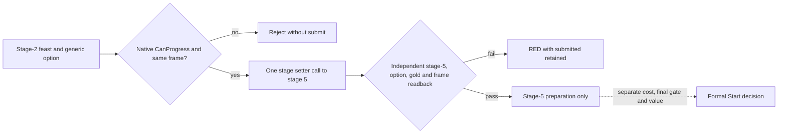

# Bounded feast stage-2 Confirm core (CK3 1.19.0.6)

This private implementation targets `ck3.exe` SHA-256
`2D00FF3101EF70B566F2FCBAE292F09263199C80E9DC8F139B82D7D96F83DB86`.
It was built from master `3e249604a7805acc72f5e583cae416997bbf0a2b`.
The original stage-2 branch and row gate are recorded in
`activity-stage2-feast-gate-1.19.0.6.md`. No CK3 process was launched here;
there is no paused stage-2 result or activity Start claim.

The default-OFF `XAR_CK3_ENABLE_G2_ACTIVITY_STAGE2_CONFIRM_PRIVATE_V1`
core reuses the private stage-2 selected-option reader. It requires a fresh
paused actor/date/revision, visible stage-2 feast planner, retained
`feast_type_generic`, exact setter and stage-2 gate instruction bytes,
the original `0x10B0DA0(planner, nullptr)` CanProgress result, normal
`planner+0x1AD0=0`, and unchanged gold. It re-resolves the planner and
selected option immediately before submitting one callback that may call
only `0x10B1BD0(planner, 5)`. It never calls the full
`ProgressPlanningStage` wrapper or the stage-5 Start routine `0x10B1910`.

After submission, a separate diagnostic requires the same visible planner
at stage 5; the native selected-option getter and row must retain the feast
and option; actor/date/revision and raw gold must match the frozen pre-action
frame. `submitted=true` remains set when the native callback fails or any
postcondition fails. Such a result requires fresh observation before any
retry. The stage-5 visible planner plus absence of a Start call in this core
is the bounded no-Start evidence; a later formal consumer must separately
read the real activity state and cost before claiming a feast was started.

The isolated source/test package adds no bridge mailbox, public query,
operator entry or formal strategy consumer. MSVC `/W4 /WX` Debug and Release
focused tests pass for positive transition, stage-2 gate rejection, non-generic
option, abnormal planner route, failed native callback, lost option, changed
gold/date, and the compile-time default-OFF build. These tests are not a
replacement for a paired paused game action, next turn, or cold restore.
