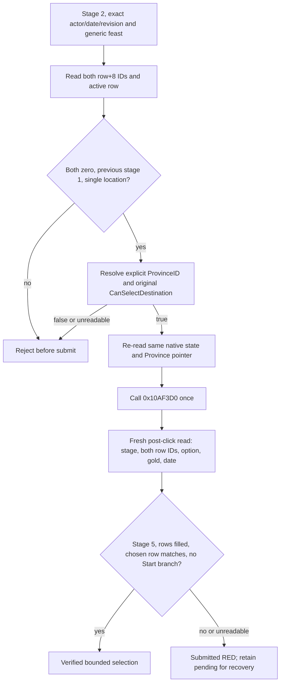

# Feast stage-2 destination select: private bounded action (CK3 1.19.0.6)

This contract applies only to the frozen `ck3.exe` SHA-256
`2D00FF3101EF70B566F2FCBAE292F09263199C80E9DC8F139B82D7D96F83DB86`.
It extends the [row construction](activity-stage2-location-row-construction-1.19.0.6.md)
and [final legality](activity-stage2-location-final-legality-1.19.0.6.md)
trees. R0363 established one positive paused observation: Robert actor 29829,
raw date 53219928, revision 3, `activity_feast` / `feast_type_generic`, stage
2, active row 0, two empty province rows, single-location flag true, previous
stage 1, and original `CanSelectDestination=true` for ProvinceIDs 2619 and
2629. Its formal report SHA-256 is
`FC03139BBED6B784F6E0220A323678BE04C49EC3D0678771491E9EBA45DC5ED0`.
The read-only observation made no game change. A new process must reopen the
planner and reproduce these conditions; its pointers and UI state cannot be
reused from R0363.

## Original branch and action boundary

The original map pin updater calls `0x10AF6A0(planner, Province*, nullptr)`
and caches the boolean at pin `+0xB2`. Its OnClick callback invokes
`0x10AF3D0(planner, Province*)` only when that boolean is true. The selector
writes `Province+0x10` into the active `0x38` row's `+8` at `0x10AF407..40A`,
calls `0x219A500` to propagate/recompute rows, then `0x10AE4A0` to refresh
configuration. With `activity+0x3C75 != 0` and previous stage
`planner+0x1AB4 == 1`, it clears the active row and enters stage 5 through
`0x10B1BD0(planner, 5)` at `0x10AF48C..4A1`. That bounded branch has no
`0x10B1910` Start call. The OnClick wrapper return value is not an action
postcondition.

The default-OFF step is `select-activity-feast-stage2-destination-v1-private`.
Its caller supplies an explicit positive signed 32-bit `province_id` and the
current revision, actor, date, activity and selected option. It does not
hardcode ProvinceID 2619. On H3928, 2619 is the capital and a stable
tie-break between the two observed legal provinces; current travel time,
building score and complete feast cost remain unknown. No cost or travel
advantage is inferred from the capital label.

`SelectActivityStage2DestinationV1` in
`activity_stage2_destination_select_v1.cpp` verifies exact selector code
bytes, reads the complete paused native state, resolves the Province object,
calls the original final predicate, re-reads identity immediately before the
single selector call, then calls the transport's `ReadState` a **third time
after the click**. That fresh read follows root RVA `0x570F7B8` through the
current UI owner to planner `handler+0x3C0`; it reads stage at
`planner+0x1AB0`, row vector/count at `+0x1578/+0x1584`, both row `+8`
ProvinceIDs, selected option through getter `0x10AEAE0`, and current actor
gold/date through the game snapshot. It compares the poststate to the
prestate; the selector's void return proves nothing. An attached stage-5
planner and the exact qualified branch provide the bounded no-Start result.
There is no separate persistent activity-instance census in this private
receipt; a future Start action requires its own game postcondition.

The structured receipt includes the two row ID arrays, stages, gold values,
`submitted`, `needs_recovery`, and each postcondition flag. After the call
starts, any read failure or mismatch remains `submitted=true` and
`needs_recovery=true`; neither a retry nor a bare ACK may erase it.

R0364 now proves this exact-build private action in one paused run. The
receipt does not establish ordinary autoplay consumption, a next turn, or
cold restore after selection. The public capability remains OFF.

## R0364 bounded live selection

The frozen H3928 candidate used source and latest master
`58d6bf8ec8d8ca8055aed06657fea6275ca8988e` (official push CI
#36544818252 SUCCESS), Release DLL SHA-256
`4E8EE05B9FCE4AFE168111261F384C5EBC0FB7813526AF0C7CAD1D26CC3565D0`,
and [candidate index](Z:/m6-activity-h3928-stage2-destination-candidate-20260929/CANDIDATE-INDEX.json)
SHA-256 `A194B6629B8B24CAC7D179D77E9187F9AEABC81D6EA5ADE3D51F8186F9928ED1`.
Official rebind/no-launch returned `ready`. The source H3928 save SHA-256
`A92073407D1CB2800EEF9C0C3EFEB9846D48398F679DC3163B71EF86C40CEC2C`
was paired with its driver and sidecars. New CK3 PID 7924 was minimized after
window verification; the [owner window receipt](Z:/m6-activity-h3928-stage2-destination-candidate-20260929/OWNER-WINDOW-RECEIPT.json)
has SHA-256 `74784088197976BE5703A1160D2991B12C991ECEB87E1D6D3D55BD608DD1B83F`.

On the same paused `native:3` frame (native revision 3, actor 29829, date
raw53219928), the private runner reopened the feast planner and submitted the
Stage 1 generic Confirm. It re-read Stage 2 with both province IDs zero, active
row 0, the single-location flag, previous stage 1, and original
`CanSelectDestination(2619)=true`. It then submitted exactly one typed
`select-activity-feast-stage2-destination-v1-private` call with explicit
ProvinceID 2619. The action receipt says `submitted=true`,
`needs_recovery=false`, `status=verified_stage_five`,
`planning_stage_before=2`, `planning_stage_after=5`, and independent post-read
row IDs `[2619,2619]` after `[0,0]`. The selected generic option remained
bound. Gold raw `120644281` and date raw53219928 were unchanged. The two
filled rows match the original `0x10AF407` active-row `+8` write and
`0x219A500` single-location propagation under this exact branch. This is a
material configuration change, not merely an ACK.

The [formal report](Z:/m6-activity-h3928-stage2-destination-candidate-20260929/operator-runs/feast-stage2-destination-2619-1/formal-report.txt)
SHA-256 `679E860EC1F4FBBA852CD9BA7BD27A45D1389CF08538485B4DF0B0CC973FA54E`
records `private_activity_feast_stage2_destination_selected/`
`planning_stage_advanced/ok=true`; the [operator receipt](Z:/m6-activity-h3928-stage2-destination-candidate-20260929/operator-runs/feast-stage2-destination-2619-1/operator-receipt.json)
SHA-256 `450AD1AE8F842A5FCD5B0C746614DA55F1E67B1B80913762165B9C8E69CB658C`
records completion/exit 0. Normal `auto_run` attempted, successful, and visible
gameplay turns are all zero. Checkpoint save SHA remained the original value;
`cleanup.tree_gone=true`. The receipt's `no_activity_started=true` is bounded
by the verified Stage 5 planner state and the exact static no-Start route; it
is **not** an independent hosted-activity census. No Stage 5 cost, final
CanStart, Start, payment, reward, next-turn consumption, or post-selection cold
restore was observed. The next branch is named Stage 5 resource/cost and
CanStart readback, followed by a separately verified Start and recovery.
