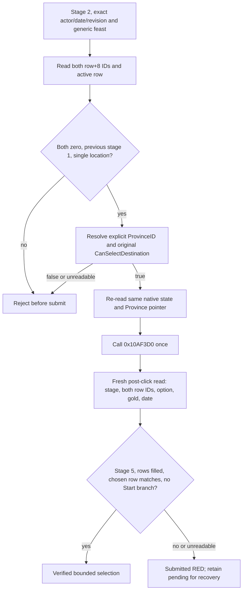

# Feast stage-2 destination select: private bounded action (CK3 1.19.0.6)

This contract applies only to the frozen `ck3.exe` SHA-256
`2D00FF3101EF70B566F2FCBAE292F09263199C80E9DC8F139B82D7D96F83DB86`.
It extends the [row construction](activity-stage2-location-row-construction-1.19.0.6.md)
and [final legality](activity-stage2-location-final-legality-1.19.0.6.md)
trees. R0363 established one positive paused observation: Robert actor 29829,
raw date 53219928, revision 3, `activity_feast` / `feast_type_generic`, stage
2, active row 0, two empty province rows, single-location flag true, previous
stage 1, and original `CanSelectDestination=true` for ProvinceIDs 2619 and
2629. Its formal report SHA-256 is
`FC03139BBED6B784F6E0220A323678BE04C49EC3D0678771491E9EBA45DC5ED0`.
The read-only observation made no game change. A new process must reopen the
planner and reproduce these conditions; its pointers and UI state cannot be
reused from R0363.

## Original branch and action boundary

The original map pin updater calls `0x10AF6A0(planner, Province*, nullptr)`
and caches the boolean at pin `+0xB2`. Its OnClick callback invokes
`0x10AF3D0(planner, Province*)` only when that boolean is true. The selector
writes `Province+0x10` into the active `0x38` row's `+8` at `0x10AF407..40A`,
calls `0x219A500` to propagate/recompute rows, then `0x10AE4A0` to refresh
configuration. With `activity+0x3C75 != 0` and previous stage
`planner+0x1AB4 == 1`, it clears the active row and enters stage 5 through
`0x10B1BD0(planner, 5)` at `0x10AF48C..4A1`. That bounded branch has no
`0x10B1910` Start call. The OnClick wrapper return value is not an action
postcondition.

The default-OFF step is `select-activity-feast-stage2-destination-v1-private`.
Its caller supplies an explicit positive signed 32-bit `province_id` and the
current revision, actor, date, activity and selected option. It does not
hardcode ProvinceID 2619. On H3928, 2619 is the capital and a stable
tie-break between the two observed legal provinces; current travel time,
building score and complete feast cost remain unknown. No cost or travel
advantage is inferred from the capital label.

`SelectActivityStage2DestinationV1` in
`activity_stage2_destination_select_v1.cpp` verifies exact selector code
bytes, reads the complete paused native state, resolves the Province object,
calls the original final predicate, re-reads identity immediately before the
single selector call, then calls the transport's `ReadState` a **third time
after the click**. That fresh read follows root RVA `0x570F7B8` through the
current UI owner to planner `handler+0x3C0`; it reads stage at
`planner+0x1AB0`, row vector/count at `+0x1578/+0x1584`, both row `+8`
ProvinceIDs, selected option through getter `0x10AEAE0`, and current actor
gold/date through the game snapshot. It compares the poststate to the
prestate; the selector's void return proves nothing. An attached stage-5
planner and the exact qualified branch provide the bounded no-Start result.
There is no separate persistent activity-instance census in this private
receipt; a future Start action requires its own game postcondition.

The structured receipt includes the two row ID arrays, stages, gold values,
`submitted`, `needs_recovery`, and each postcondition flag. After the call
starts, any read failure or mismatch remains `submitted=true` and
`needs_recovery=true`; neither a retry nor a bare ACK may erase it. This is
static-ready registration only. A matched frozen candidate and real paused
run must prove the action and later recovery before production-live status.
