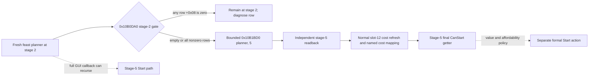

# Feast planner stage 2 gate and bounded next action (CK3 1.19.0.6)

This source trace is against `ck3.exe` SHA-256
`2D00FF3101EF70B566F2FCBAE292F09263199C80E9DC8F139B82D7D96F83DB86`,
rehash-confirmed on 2026-09-29. It uses master
`d36e97a40b0f999f87a49396c756d8b39989d78a` and the original
`game/gui/window_activity_planner.gui`. No CK3 process or activity action was
used for this trace. The R0356 paused capture established the selected
`activity_feast` / `feast_type_generic` stage-1 option, shown and valid with
stage-1 CanProgress true; see
`activity-planning-stage1-option-identity-1.19.0.6.md`. The separate stage-1
Confirm implementation is described in
`activity-stage1-bounded-confirm-1.19.0.6.md`; it has no live stage-2 result
in this source trace.

## Native decision tree

`CanProgressPlanningStage` at `0x10B0DA0` reads the current stage from
`planner+0x1AB0`. Its stage-2 branch at `0x10B0E0F` walks the row vector at
`planner+0x1578`, count at `+0x1584`, with `0x38` bytes per row. It returns
false if any row's dword at `row+0x08` equals zero; an empty vector or all
nonzero dwords returns true. The original routine accepts an optional failure
text object, but this trace does not establish the row's stable identity or
the text's semantics. A true return is permission to advance planning, **not**
final permission to start an activity. The stage-5 branch is the latter and
builds a temporary start command for validation.

The original GUI's stage button calls `ActivityPlanner.ProgressPlanningStage`
(`window_activity_planner.gui:1762-1767,1987-1991`). At native `0x10B1330`,
the stage-2 branch `0x10B13B3` tail-jumps to `0x10B1BD0(planner, 5)`. The
stage setter changes `+0x1AB0` to 5, records previous stage at `+0x1AB4`,
and calls the planner's vtable slot 25 when entering or leaving stage 2. It
does not itself call the start path. The full GUI operation is unsafe as a
bounded stage-2 action: the stage-1 branch calls `0x10B1C90`, whose
`0x10B1E0F` branch invokes `0x10B1330` again after evaluating later stages;
the stage-5 branch then reaches `0x10B1910` and can start the activity.

`0x10AD856..0x10AD861` copies the `0x38`-stride vector from the initial
activity configuration to `planner+0x1578`. The same vector participates in
normal cost recomputation (`0x10B2B30`). Those facts do not identify each
row's game-facing option or prove the H3928 default configuration passes the
gate. The script default and stage-1 option legality cannot substitute for a
stage-2 paused read.

## Smallest next implementation

1. After the separate stage-1 Confirm, query the fresh stage-2 planner on a
   paused frame: same actor, date, native revision, owner/widget, selected
   `activity_feast` and retained `feast_type_generic`. Copy the row count,
   zero-dword row indices, and original `0x10B0DA0(planner, nullptr)` boolean
   in one read. Do not infer a missing row is a zero-cost or valid location.
2. If the native gate is true and identity is still fresh, a private default-OFF
   typed `advance-feast-stage2-to-stage5` may invoke only
   `0x10B1BD0(planner, 5)` once. Its independent postcondition must read stage
   5, retained feast and option, same actor/date, no started activity, and no
   resource deduction. A submitted action with failed postcondition remains
   RED; observe actual state before retrying.
3. If the gate is false, first identify the affected `0x38` row and its
   original GUI selection method, then supply the corresponding legal typed
   input. The current source trace does not justify guessing a location or
   option. At stage 5, independently obtain the normal slot-12 refreshed cost,
   bind its resource name through `CostBreakdown.GetCost`, and query the
   stage-5 final validator before a separate Start decision.

Reproduce the bounded source spans using
`native_bridge/research/disasm_ck3.py` at `0x10B0DA0` (size `0x70`),
`0x10B1330` (size `0xB0`), `0x10B1BD0` (size `0xB2`), `0x10B1C90`
(size `0x1B0`), and `0x10AD7C0` (size `0xB0`) against the frozen executable.
