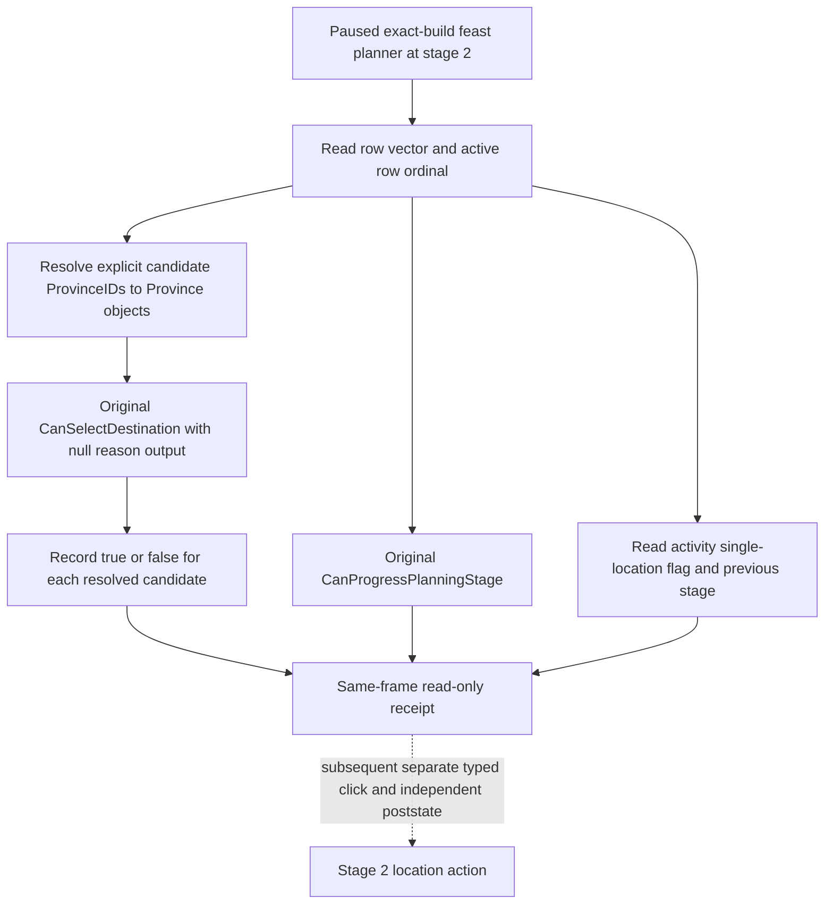

# Feast stage-2 location legality (CK3 1.19.0.6)

Source is the frozen `ck3.exe` with SHA-256
`2D00FF3101EF70B566F2FCBAE292F09263199C80E9DC8F139B82D7D96F83DB86`.
All addresses below are module-relative RVAs. This is an exact-build native
trace plus the earlier R0362 paused read; this work has not launched CK3.
R0362 observed Robert actor 29829, raw date 53219928, revision 3,
`activity_feast` / `feast_type_generic`, stage 2, two rows with zero
province IDs, and `CanProgressPlanningStage=false` (formal report SHA-256
`F19F6BE7248EE9C5B84F32D5B4CBDD73478D1D3F01121E4B727D508481F2A09B`).

## Original decision tree

The planner's configuration vector is at `+0x1578`, count `+0x1584`, row
stride `0x38`. Each row has a phase pointer at `+0`, province ID at `+8`.
The current row pointer is `planner+0x1AC0`; its ordinal must be established
by comparing it to the vector's actual bounds and stride. The phase kind is
`phase+0x12D0`; its active marker is `phase+0x70C`.
`0x10ADFA0` selects the first row whose phase is null, kind is zero, or
active marker is zero, without consulting row+8. Stage-1 auto progress stores
the selected row at `+0x1AC0` and clears that row's province ID. The distinct
`0x10ADFF0` searches an unfinished kind-zero row and does read row+8. Two
zero row IDs therefore do not identify the current row.

On a map pin, original `0xE790EF` calls
`0x10AF6A0(planner, Province*, nullptr)` and caches its boolean at pin+0xB2.
That final predicate requires stage 1 or 2, checks the planner actor,
province ID, planner candidate IDs at `+0x1A48/+0x1A54`, configuration rows,
and script legality. The GUI `GetProvinceTooltip` wrapper is not a province
identity reader. The project already has an exact-build province resolver:
game state `+0xA0` to game data, game data `+0x140/+0x14C` to the province
pointer array/count, and `province+0x10` round-trip ID verification.

The original stage-2 `0x10B0DA0` checks every row+8 ID and returns false if
any is zero. `0x10AF3D0` is the distinct pin click operation; it writes the
chosen province ID into the active row and may change stage. Its single
location branch depends on `activity+0x3C75` and previous planner stage
`planner+0x1AB4`. A reader must expose these flags before a policy uses that
click path. The reader never calls it.

The read-only bridge must bind the same paused revision, actor, date, selected
feast and option; fail if the row, current phase, province object, or native
predicate cannot be read. It returns stable IDs, row ordinals, and booleans,
not raw addresses. A false final predicate is a known illegal candidate; a
failed resolver or native invocation is an observation RED, not false.
The original predicate's full call-side-effect audit and the live candidate
readback are pending; until closed, this diagram describes the intended
query and does not qualify a live capability or authorize an action.
