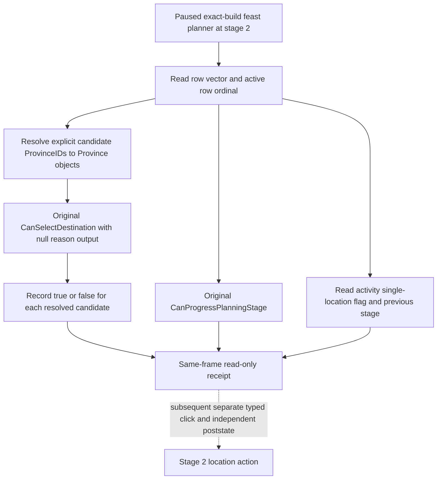

# Feast stage-2 location legality (CK3 1.19.0.6)

Source is the frozen `ck3.exe` with SHA-256
`2D00FF3101EF70B566F2FCBAE292F09263199C80E9DC8F139B82D7D96F83DB86`.
All addresses below are module-relative RVAs. This combines an exact-build
native trace, the earlier R0362 paused read, and R0363 live readback below.
R0362 observed Robert actor 29829, raw date 53219928, revision 3,
`activity_feast` / `feast_type_generic`, stage 2, two rows with zero
province IDs, and `CanProgressPlanningStage=false` (formal report SHA-256
`F19F6BE7248EE9C5B84F32D5B4CBDD73478D1D3F01121E4B727D508481F2A09B`).

## Original decision tree

The planner's configuration vector is at `+0x1578`, count `+0x1584`, row
stride `0x38`. Each row has a phase pointer at `+0`, province ID at `+8`.
The current row pointer is `planner+0x1AC0`; its ordinal must be established
by comparing it to the vector's actual bounds and stride. The phase kind is
`phase+0x12D0`; its active marker is `phase+0x70C`.
`0x10ADFA0` selects the first row whose phase is null, kind is zero, or
active marker is zero, without consulting row+8. Stage-1 auto progress stores
the selected row at `+0x1AC0` and clears that row's province ID. The distinct
`0x10ADFF0` searches an unfinished kind-zero row and does read row+8. Two
zero row IDs therefore do not identify the current row.

On a map pin, original `0xE790EF` calls
`0x10AF6A0(planner, Province*, nullptr)` and caches its boolean at pin+0xB2.
That final predicate requires stage 1 or 2, checks the planner actor,
province ID, planner candidate IDs at `+0x1A48/+0x1A54`, configuration rows,
and script legality. The GUI `GetProvinceTooltip` wrapper is not a province
identity reader. The project already has an exact-build province resolver:
game state `+0xA0` to game data, game data `+0x140/+0x14C` to the province
pointer array/count, and `province+0x10` round-trip ID verification.

The original stage-2 `0x10B0DA0` checks every row+8 ID and returns false if
any is zero. `0x10AF3D0` is the distinct pin click operation; it writes the
chosen province ID into the active row and may change stage. Its single
location branch depends on `activity+0x3C75` and previous planner stage
`planner+0x1AB4`. A reader must expose these flags before a policy uses that
click path. The reader never calls it.

The read-only bridge must bind the same paused revision, actor, date, selected
feast and option; fail if the row, current phase, province object, or native
predicate cannot be read. It returns stable IDs, row ordinals, and booleans,
not raw addresses. A false final predicate is a known illegal candidate; a
failed resolver or native invocation is an observation RED, not false.
The original predicate's full call-side-effect audit remains outside this
read-only qualification. The R0363 live readback below qualifies the private
query at this exact build; it does not authorize the location click.

## R0363 paused live readback

R0363 used a separately prepared H3928/raw53219928 pair and source master
`cadb7d45d29409b7242d20889069be7a8a0fbab6` (official push CI
#36540504262 SUCCESS). The [frozen candidate index](Z:/m6-activity-h3928-stage2-location-candidate-20260929/CANDIDATE-INDEX.json)
has SHA-256 `1AC118D61058B9A24C61E9B257AB4287A41818D67C8F87CA29CA281C0CE0CC75`;
the Release DLL has SHA-256
`A38D1005D943AA5B0D20137A12D1B7B809E3BA8384CD6DFE4F0BAE6DF8A4D7B0`.
Official rebind and no-launch passed. The private flags enabled the bounded
stage-1 Confirm and stage-2 option, gate, and location readers. The operator
used CK3 PID 73344; its [owned-window record](Z:/m6-activity-h3928-stage2-location-candidate-20260929/OWNER-WINDOW-R0363.json)
SHA-256 `FACBF601A442C3CEF6061B398070792A97AB2E6BD8AA468D31C40BC9BA3E2C7A`
shows a failed verification while loading, then a successful `minimize` on the
owned window (`after_minimized=true`).

On the same paused `native:3` frame (source revision 4/native revision 3,
actor 29829, raw date 53219928), typed stage-1 Confirm was
`accepted/submitted=true`, `stage_two_verified`, with stage 2 visible and
`feast_type_generic` retained. An independent stage-2 option query read that
selected option. The independent location query then returned
`same_frame=true`, `stage_two_location_observed`, `read_only=true`:

| Row | Raw phase kind | Province ID | Active |
| --- | ---: | ---: | --- |
| 0 | 0 | 0 | true |
| 1 | 0 | 0 | false |

`active_row_index=0`, `activity_single_location_flag=true`, and
`previous_planning_stage=1`. Original `CanSelectDestination` returned true
for both explicit ProvinceIDs **2619** and **2629**; original stage-2 progress
remained false. `phase_kind=0` is the observed raw value, not a named meal,
toast, or other phase. Both row province IDs remain zero, so neither
candidate was selected. A legal candidate is an input to a later policy
choice; this read does not establish current travel, construction, event
benefit, configured cost, or final `CanStart`.

The [formal report](Z:/m6-activity-h3928-stage2-location-candidate-20260929/operator-runs/feast-stage2-location-read-1/formal-report.txt)
SHA-256 `FC03139BBED6B784F6E0220A323678BE04C49EC3D0678771491E9EBA45DC5ED0`
and [operator receipt](Z:/m6-activity-h3928-stage2-location-candidate-20260929/operator-runs/feast-stage2-location-read-1/operator-receipt.json)
SHA-256 `20A19395AD9D840B91A9A733CBA6B71A7800C5E902C62696E6DEA686A1C80C97`
show `completed/exit0`, zero ordinary gameplay turns and no date advance.
Gold stayed raw `120644281`; the checkpoint save SHA-256 stayed
`A92073407D1CB2800EEF9C0C3EFEB9846D48398F679DC3163B71EF86C40CEC2C`.
`cleanup.ok/shutdown_ok/tree_gone/driver_closed/cleanup_proven=true`, and a
post-run process check found no CK3 or injector. This is a private exact-build
read-only location qualification after a real stage-1 action, not a stage-2
location selection, stage-2 advancement, Start, next turn, or cold restore.
