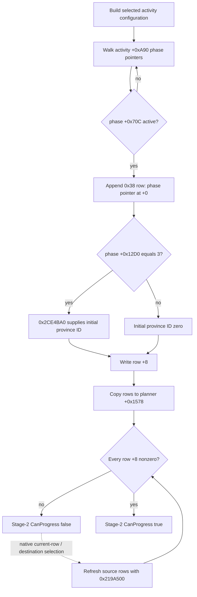

# Feast stage-2 location row construction (CK3 1.19.0.6)

Source baseline: `origin/master` `a1d72d8f460f252f3b43506106e7a6e222439803`, original `ck3.exe` SHA-256 `2D00FF3101EF70B566F2FCBAE292F09263199C80E9DC8F139B82D7D96F83DB86`. The RVAs below are from that executable. This is source research only; no game process or new action was used.

## Original row tree

At `0x10AD7C0..0x10AD861`, the planner builds an initial activity configuration through `0x2199FF0` and copies its `source+0x48` row vector into `planner+0x1578`. The count is `planner+0x1584`, and each row is `0x38` bytes. At `0x219A0B0..0x219A12A`, the source builder walks the activity's `+0xA90` vector of phase pointers. It skips a phase when its `+0x70C` byte is zero. For the others, `0x18C7C50` appends one row and writes its phase pointer at `row+0` (`0x18C7CD6..0x18C7CDB`) and an initial dword at `row+8` (`0x18C7CDB`).

The builder initializes that dword to zero. Only when `phase+0x12D0 == 3` does it call `0x2CE4BA0(phase, context)` to obtain an initial ID (`0x219A0DC..0x219A10B`). `0x2CE4BA0` looks up a province typed value from the phase's `+0x12D8` data and returns its ID or the game's invalid/default ID. `0x219BA30` then derives row state from the activity's `+0xF18` entries. These calls do not prove a final selectable province.

The row's `+8` dword is a **province ID**, not a food/courses option ID. `0x219BAD0` resolves it through the game's province table; the original map icon updater `0xE78F60` compares `province+0x10` against all `row+8` values to compute `IsSelectedDestination`. The stage-2 `CanProgressPlanningStage` branch at `0x10B0E0F` requires every row's `+8` to be nonzero. Thus the two zero rows in R0362 mean two unfilled province slots, not two unchosen catering options. The GUI places food/courses under the later `options` stage (`game/gui/window_activity_planner.gui:1598-1601,1644`), while the current location guide is at `:1776-1779`.

`0x219A500` refreshes the source configuration after a location selection. It evaluates `phase+0x12D0`: type 1 copies one source row's province ID, type 2 copies another source row's province ID, and type 3 with a zero row calls `0x2CE4BA0` for an initial ID (`0x219A5D4..0x219A74F`). The exact meaning of the numeric phase types and which type each H3928 row has must be read from the current native phase object; the script's two named phases alone do not establish their live row ordering.

`0x10ADFA0` returns the first row whose phase pointer is null, phase type is zero, or phase `+0x70C` byte is zero; it **does not** inspect `row+8`. The stage-1 advance path uses this routine to set `planner+0x1AC0` to a current row and clears that row's `+8` before entering stage 2 (`0x10B1330..0x10B138B`). `0x10ADFF0` is distinct: it returns the first null-phase row or a phase-type-zero row whose province ID is zero; otherwise it returns null. Neither the two R0362 zero values nor a script phase order establishes which row is currently at `planner+0x1AC0`.

## R0362 and smallest reader

R0362's immutable `formal-report.txt` (SHA-256 `F19F6BE7248EE9C5B84F32D5B4CBDD73478D1D3F01121E4B727D508481F2A09B`) recorded actor 29829, `activity_feast`, `feast_type_generic`, stage 2, two `row+8 == 0` values and `can_progress_stage2=false` on one paused frame. The report did not record either row's phase pointer/type or any destination's native permission. The original `feast.txt:4163-4169,4381-4384` declares meal and toast phases, but row count alone is not an identity readback. Actor capital province 2619 and another held county's province 2629 are possible query inputs only; they are not legal selections by themselves.

The next read-only private query should bind actor, date, native revision, planner identity, `activity_feast` and `feast_type_generic` to one frame. It should return each row's index, phase identity and `+0x12D0` type, `+8` province ID, the active row at `planner+0x1AC0`, and the original stage-2 `CanProgress` result. In that frame it should resolve candidate province 2619 (and 2629 if useful) to a native province pointer and call the same final `0x10AF6A0(planner, province*, nullptr)` predicate used by `ActivityPlannerMapIcon.CanSelectDestination`; report an unreadable predicate as unknown, not false. A separate final-legality trace covers the getter, selected pin and OnClick control flow. Only after a positive legal candidate and current-row identity should a typed selection action be designed, with independent row and gate readback. Do not call the full OnClick wrapper as a bounded location setter before its subsequent stage transitions are qualified for the observed native branch.

Reproduce with `ck3_autonomous_player/native_bridge/research/disasm_ck3.py` at RVAs `0x10AD7C0` (size `0x180`), `0x2199FF0` (size `0x260`), `0x18C7C50` (size `0x1A0`), `0x2CE4BA0` (size `0xE0`), `0x219A500` (size `0x280`), and `0x10ADFF0` (size `0x50`) against the frozen EXE.
