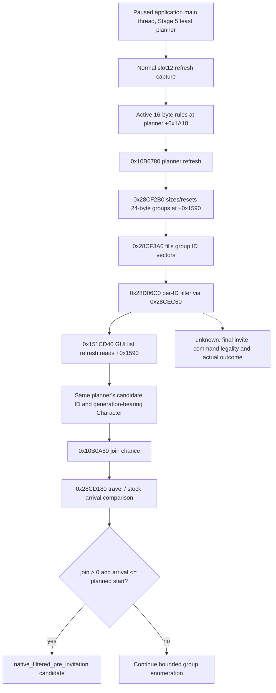

# Stage 5 feast ordinary guest candidate: exact-build native read path

Status: **typed private transport and fixture tested; R0371 paused live RED at the exact-build gate; RVA repair pending fresh live read**. This is a read-only pre-invitation input. It neither selects a guest nor proves final invitation legality, attendance, acceptance, or the start action.

## Build and stock sources

- CK3 `1.19.0.6-steam23530548`; `binaries/ck3.exe` SHA-256 `2D00FF3101EF70B566F2FCBAE292F09263199C80E9DC8F139B82D7D96F83DB86`.
- Original `game/gui/window_activity_guest_list.gui`: `ActivityGuestListWindow.AccessList` creates the context; `CharacterSelectionList.GetList` supplies item rows; `CharacterListItem.GetCharacter` gives each row's character. The ordinary row displays `GetJoinChance(item)>0` and `MayNotArriveInTime(item)`. Its per-row Select control is scoped to `IsSelectingSpecialGuest`; ordinary invitations use the category rules.
- Original `game/common/activities/activity_types/feast.txt` supplies the feast invite rules and `can_be_activity_guest` conditions. Its defaults do not establish which rules or guests are active in a particular paused planner.
- Existing exact-build inputs: `activity-stage5-feast-guest-join` for `0x10B0A80` signed Q100000 join prediction and `0x28CD180` travel days; slot12 normal-return capture for current planner identity and refresh sequence.

## Native tree

Exact EXE disassembly establishes the links: `0x10B0796` loads destination group vector `planner+0x1590`, `0x10B07A3` supplies active rules `planner+0x1A18` to `0x28CF2B0`; `0x10B0A5C` calls `0x28CF3A0` to populate groups. In that routine `0x28CF72E` supplies a 4-byte CharacterID vector to `0x28D06C0`. At `0x28D07A1` the filter calls `0x28CEC60` for each ID; the latter uses `0x28AF3B0` and a script predicate at type `+0xD58`. GUI refresh first loads the HostView at `0x151CD6E` (`48 8B 81 00 01 00 00`), then reads its `+0x1590` group vector at `0x151CD75` (`48 8B 90 90 15 00 00`); each row is 24 bytes with an ID pointer at `+0` and count at `+0xC`. The GUI copies those IDs into its character selection list. This establishes **current native-filtered candidates**, not a final legal invitation result.

The separate stock category-toggle path changes active rules and refreshes both planner and GUI. Its exact ABI is recorded by the corresponding rule-toggle work package. `planner+0x1678/+0x1684` holds **already selected** rows; a zero selected count cannot imply a zero candidate count.

## Typed core contract

`ReadActivityFeastGuestCandidateV1` is compiled with the existing private Stage 5 feast start build option; the transport additionally requires default-OFF `XAR_CK3_ENABLE_G2_ACTIVITY_FEAST_GUEST_CANDIDATE_PRIVATE_V1`. It checks the admitted EXE SHA and instruction bytes, the paused application main-thread frame, attached visible Stage 5 feast planner, matching played actor/host, and current normal slot12 capture. It reads bounded active-rule rows, selected rows, and **every** group ID before evaluating candidates. It validates each full-generation CharacterID against the resolved character, skips the host and selected guests, then calls the existing original join and travel evaluators for the **same** identity. It returns the first positive, timely candidate.

The core reads the rule rows, selected rows and external group ID data twice, with a content fingerprint and matching planner/frame/capture. Existing slot12 fingerprint covers the `+0x1590` pointer and count but not external group ID bytes; the second read covers that missing binding. This demonstrates a stable observed planner group during the read. It does **not** prove when the last rule change generated that group. The caller must treat any subsequent rule toggle, date advancement or other planner mutation as invalidating this result.

`observed` reports `native_filtered=true`, CharacterID, signed Q100000 join result, travel days, predicted arrival and planned start. `no_qualified_candidate` is returned only after complete bounded enumeration and successful evaluation of every relevant ID. Invalid IDs, unreadable vectors, unresolved characters, native evaluator failure and arrival read failure remain distinct typed unavailable statuses; they do not become an empty shortlist. Failure statuses do not publish a partial candidate. The label `native_filtered_pre_invitation` deliberately stops before final legal/action and outcome claims.

The native step is `query-activity-feast-guest-candidate-v1`. It accepts the same `expected_revision`, `expected_date_raw`, `expected_actor_character_id`, `expected_planning_stage=5` and `expected_activity_key=activity_feast` binding as the existing Stage 5 query. The default-OFF private command-result envelope carries `activity_feast_guest_candidate` with schema `activity-feast-guest-candidate-private-read-v1`. `status` is one of `observed`, `no_qualified_candidate`, `exact_build_rejected`, `frame_changed`, `planner_unavailable`, `no_normal_refresh`, `candidate_source_unavailable`, `native_evaluation_failed`, `arrival_unavailable`, `configuration_changed`. Only the first two have a nonnull normal refresh sequence and 16-digit hexadecimal source fingerprint; only `observed` has a nonnull candidate object and `native_filtered_pre_invitation=true`. All unavailable statuses have nullable evidence fields and a null candidate. The top-level `status` is `available` only for the first two; the query is never advertised as a general public activity ability.

## Verification and remaining delivery

### R0371 exact-build rejection and repair boundary

R0371 used the H3928 paired save, source `3ed73d6d3681cbec25ec350f78788454c6b0c17d`, and Release DLL SHA-256 `2E45D9E10735B0F25E861661966B8DCE209E0BC53BF0D0719DD8D1B2D38B19BD`. The operator completed and Stage 1/2 reached a paused Stage 5 frame, but the private guest result was `candidate_status=exact_build_rejected`. That is neither a candidate nor a complete empty set. The [formal report](Z:/m6-activity-h3928-stage5-ordinary-guest-prep-20260929/operator-runs/feast-stage5-ordinary-guest-candidate-read-1/formal-report.txt) SHA-256 `30BBADD71B34C0A76B0DE8B8EE70DDEED40EEAA12D749E0D39F9288CA5FCFF79` and operator receipt SHA-256 `37C237E44E2F1A0469D7839E4C6FD708660217D70E711E99E2197AE17E473AA4` preserve the RED; the CK3 process was recovered without a gameplay date turn.

Read-only inspection confirmed the loaded candidate DLL and frozen EXE matched their manifest SHA-256 values and the guest CMake option was ON. Three of the four `VerifyAbi` instruction comparisons match the exact EXE. The fourth expected `48 8B 90 90 15 00 00` at RVA `0x151CD6E`, where the EXE actually has the preceding `48 8B 81 00 01 00 00`; the expected seven bytes occur at `0x151CD75`. The old fixture placed the vector-read bytes at the wrong address, so it passed while the live build deterministically rejected the query. The narrow repair changes that RVA and makes the fixture reproduce both consecutive instructions, including a rejection when the vector-read bytes change. It remains source and fixture evidence until an independently paired new DLL returns a non-rejected paused result.

- The original CMake focused target passed Debug and Release under MSVC `/W4 /WX`, but its ABI fixture held the wrong GUI instruction RVA; R0371 exposed that gap. The corrected fixture now models the two adjacent instructions. On the repair branch based on master `593c72bdd14ae97d8ef4030c1e1f531a80e66bd5`, the full bridge DLL built in Release and Debug and `xar_ck3_native_bridge_activity_feast_guest_candidate_v1` passed 1/1 in both configurations. These are source/fixture checks, not a new paused result.
- R0371 did not observe a candidate ID, complete empty set, invitation, acceptance, attendance or Start. A fresh paired paused query is required to close this RED. If it returns a positive native-filtered candidate, final invitation legality, selected/pending state and later outcome still need independent evidence.
