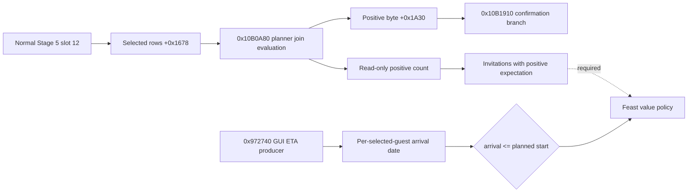
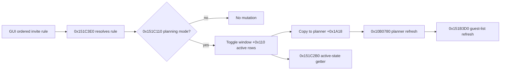
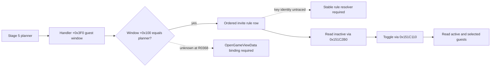

# Feast Stage 5 selected-guest expectation (CK3 1.19.0.6)

This is an exact-build, read-only source trace. The inspected `ck3.exe`
SHA-256 is `2D00FF3101EF70B566F2FCBAE292F09263199C80E9DC8F139B82D7D96F83DB86`.
The stock `game/gui/window_activity_guest_list.gui` binds
`CharacterSelectionList.GetList` at line 332, `CharacterListItem.GetCharacter`
at line 429, `ActivityGuestListWindow.GetJoinChance(item) > 0` at line 568,
and `ActivityGuestListWindow.MayNotArriveInTime(item)` at line 580. No CK3
instance was started for this trace. Neither a selected invitation nor a
positive expectation proves invitation acceptance or attendance.

## Original planner route

The normal Stage 5 planner slot 12, `0x10AE180`, first returns from its
existing cost/configuration refresh at `0x10AE1AF`. It then traverses the
selected guest vector at planner `+0x1678` with signed count `+0x1684` and
16-byte rows. A row's full signed CharacterID is at `+8`; `-1` is empty.
The host ID is planner `+0x1538`. A host row is assigned positive byte 1.
For another character, `0x10AE245..0x10AE29B` resolves the current
generation-bearing `CCharacter*`, calls `0x10B0A80(out, planner, character)`,
and stores whether the returned signed 64-bit fixed-point value is **greater
than zero** in the byte array at planner `+0x1A30[index]`.

Stage 5 Progress at `0x10B1910` revisits these same 16-byte rows and bytes.
Only a retained row whose byte is zero is copied into the confirmation list
at `0x10B19D0..0x10B1AC0`; with no such rows, `0x10B1AD9` enters the Start
commit branch. This supports a narrow interpretation of the byte as the
planner's positive-join expectation for **selected invitations**. It does
not prove an individual guest has accepted. In particular, the cost hook at
`0x10AE1AF` captures before the join-byte writes: a recorded normal-refresh
sequence alone cannot validate the later byte. The read core therefore
re-evaluates each current selected non-host character through the exact
`0x10B0A80` call and compares its sign to the stable cached byte on one
paused main-thread frame. It publishes copied CharacterIDs and signed
values, never native pointers.

## Separate GUI travel signal

The GUI `GetJoinChance` callback `0x151C980` takes the
`ActivityGuestListWindow*` in RCX and obtains a `CharacterListItem` row index
via the item's virtual slot `+0x28` and row `+0x0C`. It returns the signed
fixed-point qword at `window+0x2E8 + index*0x28 + 0x10`, with count at
`window+0x2F4`. The GUI `MayNotArriveInTime` callback `0x151CA60` uses the
same row index; in planning mode (`window+0xF8 == -1`), it compares the
cached dword at row `+4` with planned date `planner+0x1550` and returns
`arrival_date > planned_date`. The `GetTravelTimeEstimation` callback
`0x151CB50` reads the separate row `+0x1C` value.

The GUI cache has a separate freshness condition. `0x151BB70` binds the
planner to GUI context `+0x100`, marks planning mode at `+0xF8=-1`, and only
calls the internal guest-list refresh `0x151B3D0` when the context visibility
check `0x1F30970(context)` succeeds (`0x151BE0F..0x151BE22`). Thus a
background Stage 5 read cannot assume this GUI cache is current. The producer
is now traced through `0x151ADE0 -> 0x151D820 -> 0x151DBA0 -> 0x972740`.
The embedded list begins at window `+0x130`; its cache pointer/count at list
`+0x1B8/+0x1C4` are window `+0x2E8/+0x2F4`. The generic list item at
`item+8` carries the full CharacterID and `item+0x0C` is its cache row index.
Thus the window cache has a legitimate GUI identity mapping, but it remains
separate from the planner's selected invitation vector.

The read core copies only the **arrival** half of producer `0x972740` on the
paused planner frame. The original function writes the full CharacterID to
output row `+0`; with refresh flag zero it obtains route estimates and then
sets the arrival days (`+0x1C`) through this exact branch:

1. Get the planner activity at `0x10CDA10(planner)`. Search its `+0x10`
   pointer / `+0x1C` count, 0x20-byte rows at row `+0` for this CharacterID.
2. When absent, call `0x28CD180(character, destination)` for travel days.
   Destination is the first selected planner location at `+0x1578`, resolved
   through world `+0xA0` and its `+0x140/+0x14C` province table. The world
   pointer is at RVA `0x570E068`.
3. When present, check activity record index `+0x83C` against record count
   `+0x36C`. Invalid index gives zero days. Valid index uses the **first**
   record at `activity+0x360` pointer, offset `+0x38`: days equal
   `(record_date_raw - 0x29C55C0) / 24 - world.current_day`. Although the
   original briefly calculates `index*0x48`, it reads the first record date
   at `0x9727EC`.
4. `0x97282F..0x9728CA` computes arrival raw as `world+8` current date plus
   `24*days`. The GUI `MayNotArriveInTime` compares that result with planner
   `+0x1550`; the core uses the same strict `>` comparison. A travel sentinel
   or unreadable source remains unavailable, not zero.

The original GUI producer also calculates a route estimate at row `+0x18`
and a script join value at row `+0x10`. This core does not need those GUI
fields: Start itself consumes the planner `0x10B0A80` sign. Both routes call
the original `0x337B210` evaluator, but their scope construction differs, so
the two numeric join values are not asserted identical.

At initial source publication, `activity_stage5_feast_guest_join_v1` was
an unregistered native core. The later aggregate Stage 5 Start-input route
calls it, but the R0367 live result below could not read a guest value. Its
focused fixture covers a positive timely non-host row, a negative row, an
existing activity row with zero-day and later recorded-date branches, an
empty row, cache disagreement, missing refresh, native evaluation failure,
changed frame, and exact-build rejection. A paired, default-off paused-frame query must read a qualified positive
guest route before policy may use `timely_positive_join_count`. That value
would be a prediction, not proof of accepted guests or completion rewards.

## R0367 paired paused read: guest route unavailable

The first paired private Start-input query used the H3928 original save
and new CK3 PID 181244 on actual live run **R0367**. The frozen
[A candidate](Z:/m6-activity-h3928-stage5-fixed-r0366-candidate-20260929/CANDIDATE-INDEX.json)
SHA-256 `BFE32888F306DF5B402EF334E384A341644283D71C82C0EF7FC5BBE6EA5E19CB`
used Python source `e6b61b825dd5ca6ae09fdeabf51a37dad27dc7c3` and
the exact native DLL SHA-256
`771A2A20176B5B6647E9BE005317854BEFC2DD663D8CACBC085BC2CAE91849E6`.
Stage 1 and the typed Stage 2 location selection reached Stage 5,
and the same-frame four-cost read succeeded, but the guest collector
reported `guest_join_status=planner_unavailable`. The selected
non-host, positive-join and timely-positive counts are all **null**;
`arrival_time_observed=false` and
`native_guest_route_qualified=false`. This result is a real paused
failure to observe the selected-guest route, **not** a zero-guest
observation. The separately read native final CanStart was false and
the policy held; this run does not prove that missing guests caused
that false result.

The [formal report](Z:/m6-activity-h3928-stage5-fixed-r0366-candidate-20260929/operator-runs/feast-stage5-fixed-cost-input-read-1/formal-report.txt)
SHA-256 `35C04DD2B42619442D98D3A6EA5AD48DAD5868CE7DA71E9D55A68F79903CE486`
and [operator receipt](Z:/m6-activity-h3928-stage5-fixed-r0366-candidate-20260929/operator-runs/feast-stage5-fixed-cost-input-read-1/operator-receipt.json)
SHA-256 `0EE3BF274E3103EFD2226C562AC49EF988057DAD86B7C08D62F8236A3A29A223`
show a completed bounded query, zero normal gameplay/date turns,
unchanged H3928 save and proven process cleanup. No Start, invitation
acceptance, arrival, activity creation or reward was observed. The
next source/live step is to locate the collector's
`planner_unavailable` precondition on the actual Stage 5 frame and
then read one selected non-host's expectation and arrival when legal;
do not substitute the GUI cache or a zero count.

At the R0367 source, `ReadActivityFeastGuestJoinV1` emits the same
`planner_unavailable` at lines 337-346 for any of these prerequisites:
planner diagnostic observed, planner present, stage 5, widget attached,
widget visible, HostView activity key known, and HostView key equal to
`activity_feast`. It returns before the slot-12 capture in this branch.
The R0367 report does not expose each prerequisite independently, so it
cannot establish which one failed. In particular, an unknown HostView key
is a source-level possibility, not a proven R0367 value. A focused status
split and paired readback are needed to localize the live gate.

## Post-R0367 guest guard split: source and fixture only

Source master `61d4549490103cef74ff1d2bc292007bccacfdd0` (#640), paired
with Python status parsing at `bc6bd47f5fc06ccd3b6cc37613c4054af03a0545`
(#639), replaces the combined pre-capture `planner_unavailable` branch with
six distinct status keys: `planner_diagnostic_unavailable`, `planner_absent`,
`not_stage_five`, `widget_detached`, `widget_hidden`, and
`host_view_type_mismatch`. The Python Start-input parser accepts these exact
keys. A known HostView key other than `activity_feast` still fails. When
that key is unknown, the core proceeds only if a **normal slot-12 capture**
validates the current planner `+0x1530` as the exact feast activity type,
planning stage 5, actor and date. It still requires the same normal refresh,
matching before/after planner diagnostics, sequence, planner identity and
configuration fingerprint; an unavailable capture is not a guest count.

The focused native Debug/Release guest tests and Release DLL build passed;
these are source/fixture checks. No paused run using this changed DLL and
parser has yet localized the R0367 guard or read a selected guest. R0367's
`planner_unavailable` and null guest counts remain its recorded live result.
Neither the source change nor an empty hosted-activity list proves zero
guests, a positive timely join, or permission to Start. The next paired
paused read must report the new exact status and, when observed, the
selected non-host expectation and arrival on that frame.

## R0368 paired paused read: empty selected-guest route observed

The frozen [R0368 candidate](Z:/m6-activity-h3928-stage5-gap-candidate-20260929/CANDIDATE-INDEX.json)
SHA-256 `E7A3B2AACBA9DD26ECD2018E561164D9F6789047D68FE10AD1BF629968FDA039`
used source master `dee29e5c588e81da532d5085a65413aaf8a7640a` and Release
DLL SHA-256 `6242EA7A7B15DF65888E7512696BE6232E7434FA02DF62936ACF792B91A198F2`.
On actual live run **R0368**, CK3 PID 152300, actor 29829, paused `native:3`
and date raw53219928, the Stage 1/2 configuration again reached Stage 5.
The paired guest collector returned `guest_join_status=observed`,
`selected_nonhost_count=0`, `positive_join_count=0`,
`timely_positive_join_count=0`, and `arrival_time_observed=true`.
These are **observed zero selected rows** on this configuration, unlike the
null counts from R0367. They do not count every eligible invitee, prove a
guest accepted or arrived, or provide a per-guest ETA from a selected row.
`native_guest_route_qualified=false` because no positive timely non-host
was selected; the final native CanStart was also false. Neither result
alone establishes the cause of the other.

The [formal report](Z:/m6-activity-h3928-stage5-gap-candidate-20260929/operator-runs/feast-stage5-guest-failure-read-1/formal-report.txt)
SHA-256 `883CC43B513CE7F01A18A61DB27ACCA923F2F3D781F5836306AC0B7FCEE39EB6`
and [operator receipt](Z:/m6-activity-h3928-stage5-gap-candidate-20260929/operator-runs/feast-stage5-guest-failure-read-1/operator-receipt.json)
SHA-256 `114FBD23FC3B66084074D5E9650DC88E6A13938AEC12454B475DB1AA28A04A7B`
record a completed bounded read, zero normal gameplay/date turns, unchanged
original H3928 save, and process-tree cleanup. No invitation, Start, guest
arrival, activity creation, reward, next-turn consumption or post-selection
cold restore was tested. A future positive-guest valuation needs a
native-legal selected non-host and an expectation/arrival read; final
CanStart must be re-read separately on the decision frame.

## Normal guest-rule toggle ABI: source only (R0368 follow-up)

The original `game/gui/window_activity_guest_list.gui:100-115` binds each
`OrderedActivityInviteRule` row to
`ActivityGuestListWindow.ToggleInviteFromRules(OrderedActivityInviteRule.Self)`
and its down state to `IsInviteRuleActive`. The ordinary guest list at line
332 is `CharacterSelectionList.GetList`. The `select_special_guest` button at
lines 547-552 is visible only while selecting a **special** guest; it is not
the ordinary invite operation. The original `feast.txt:798-835` supplies
default invite categories, including close family, vassals, courtiers and
spouses, while `can_be_activity_guest` at lines 834-839 checks adult,
healthy and diplomatic range. These script entries do not establish which
H3928 character is finally legal or likely to arrive.

The following offsets are from the frozen 1.19.0.6 executable with SHA-256
`2D00FF3101EF70B566F2FCBAE292F09263199C80E9DC8F139B82D7D96F83DB86`.
They are **static disassembly**, not a paused action or accepted invitation:

1. GUI registration at RVA `0x25B0B3` copies the exact
   `ToggleInviteFromRules` string from `.rdata` RVA `0x41670D0`.
   `0x25B135` passes callback RVA `0x151C3E0` to registration helper
   `0x151E220`. The sibling registration at `0x25B243` copies
   `IsInviteRuleActive` from `0x4167110`; `0x25B2C8` binds callback
   `0x151C480` through `0x151E6F0`.
2. Toggle callback `0x151C3E0` receives the ordered-rule list item in `R8`,
   resolves its rule through the item's virtual `+0x28` call, and at
   `0x151C44C` calls `0x151C110(window, rule)`; a failed item resolution
   returns false. The active-state callback `0x151C480` uses the same item
   resolution and calls `0x151C2B0` at `0x151C4F4`.
3. `0x151C110` requires `window+0xF8 == -1` (planning mode). Otherwise it
   exits without changing a rule. In planning mode it searches the sorted
   16-byte rows at `window+0x110` for the supplied native rule identity:
   an existing row is erased at `0x151C23D`, and an absent one is inserted
   at `0x151C219`. It then copies the updated rules to
   `planner+0x1A18` through `0x100F940` (`0x151C246..0x151C257`), calls
   planner configuration refresh `0x10B0780` (`0x151C25F`), and refreshes
   the guest-list view through `0x151B3D0` (`0x151C283`).
   The planner refresh begins at `0x10B0796..0x10B07AA`: it passes the
   active rule vector at `planner+0x1A18` as input to `0x28CF2B0` and the
   separate 24-byte-row collection at `planner+0x1590` as output. It then
   traverses the already selected guest rows at `+0x1678/+0x1684`.
   Therefore `+0x1590` is a refreshed collection, not itself the toggle's
   active-rule vector or proof that a candidate will join.
   `0x151C2B0` checks membership in the same sorted rule rows; it is the
   independent active-state read for an inactive-to-active typed action.

This closes the **GUI-to-native toggle route**, not a final-legal candidate
reader. The R0368 paused Stage 5 guest result was `observed` with
`selected_nonhost_count=0`, `positive_join_count=0` and
`timely_positive_join_count=0`. That reader traverses only the planner's
already selected rows at `+0x1678/+0x1684`, so the zeros do not rule out
unselected legal candidates. No current private bridge command or MCP method
invokes the toggle. A bounded typed action must bind a fresh ordered-rule
identity to the same actor/planner, read `IsInviteRuleActive=false`, toggle
once, then independently read active=true and the refreshed selected guest
rows. If no eligible row appears, record that outcome instead of inventing a
guest. The current R0368 final `CanStart=false` military-role display is a
separate gate; rule selection alone does not permit Start.

To reproduce the address trace on the exact executable, disassemble RVAs
`0x25B040` (size `0x300`), `0x151C110` (`0x1A0`), `0x151C2B0`
(`0x90`), `0x151C3E0` (`0xA0`) and `0x151C480` (`0xB0`).

## Guest window binding before a typed rule action: source only

The exact GUI opens the ordinary list with
`OpenGameViewData('activity_guest_list', ActivityPlanner.AccessSelf)` in
`game/gui/window_activity_planner.gui:1575,1753`. The handler constructor at
RVA `0xA90C49` installs the guest-window vtable `0x41676E8`, and at
`0xA90CBD` stores that object at handler `+0x3F0`. Construction explicitly
sets `window+0x100=0` (`0xA90C68`). The native view binder `0x151BB70`
accepts a tagged GUI payload, resolves the planner at `0x151BBAE..0x151BBC7`,
then writes `window+0x100=planner` and `window+0xF8=-1`. Its list refresh at
`0x151BE1B..0x151BE22` is conditional on the window visibility check. Thus
`handler+0x3F0` identifies an allocated window, but does not establish that
the R0368 Stage 5 frame has a bound or current guest list.

The existing bridge resolves handler `+0x3C0` to the planner but has no
`OpenGameViewData` payload route for this guest window and no stable
`OrderedActivityInviteRule` key-to-native-row resolver. The GUI callback
`0x151C3E0` requires a live ordered-rule item, from which it obtains the
16-byte native rule identity; passing a script key or a guessed pointer to
`0x151C110` would not be an equivalent typed action. On a future paused
frame, a read-only binding probe must first show the exact window vtable,
`window+0x100 == handler+0x3C0`, planning mode, and a rule row with a stable
key. Only then can `0x151C2B0` confirm inactive before a single toggle and
active afterward. A window-open route is separately needed if the list was
never opened. Neither binding nor rule identity was read in R0368; no action
or positive guest is claimed here.

