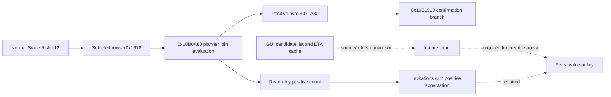

# Feast Stage 5 selected-guest expectation (CK3 1.19.0.6)

This is an exact-build, read-only source trace. The inspected `ck3.exe`
SHA-256 is `2D00FF3101EF70B566F2FCBAE292F09263199C80E9DC8F139B82D7D96F83DB86`.
The stock `game/gui/window_activity_guest_list.gui` binds
`CharacterSelectionList.GetList` at line 332, `CharacterListItem.GetCharacter`
at line 429, `ActivityGuestListWindow.GetJoinChance(item) > 0` at line 568,
and `ActivityGuestListWindow.MayNotArriveInTime(item)` at line 580. No CK3
instance was started for this trace. Neither a selected invitation nor a
positive expectation proves invitation acceptance or attendance.

## Original planner route

The normal Stage 5 planner slot 12, `0x10AE180`, first returns from its
existing cost/configuration refresh at `0x10AE1AF`. It then traverses the
selected guest vector at planner `+0x1678` with signed count `+0x1684` and
16-byte rows. A row's full signed CharacterID is at `+8`; `-1` is empty.
The host ID is planner `+0x1538`. A host row is assigned positive byte 1.
For another character, `0x10AE245..0x10AE29B` resolves the current
generation-bearing `CCharacter*`, calls `0x10B0A80(out, planner, character)`,
and stores whether the returned signed 64-bit fixed-point value is **greater
than zero** in the byte array at planner `+0x1A30[index]`.

Stage 5 Progress at `0x10B1910` revisits these same 16-byte rows and bytes.
Only a retained row whose byte is zero is copied into the confirmation list
at `0x10B19D0..0x10B1AC0`; with no such rows, `0x10B1AD9` enters the Start
commit branch. This supports a narrow interpretation of the byte as the
planner's positive-join expectation for **selected invitations**. It does
not prove an individual guest has accepted. In particular, the cost hook at
`0x10AE1AF` captures before the join-byte writes: a recorded normal-refresh
sequence alone cannot validate the later byte. The read core therefore
re-evaluates each current selected non-host character through the exact
`0x10B0A80` call and compares its sign to the stable cached byte on one
paused main-thread frame. It publishes copied CharacterIDs and signed
values, never native pointers.

## Separate GUI travel signal

The GUI `GetJoinChance` callback `0x151C980` takes the
`ActivityGuestListWindow*` in RCX and obtains a `CharacterListItem` row index
via the item's virtual slot `+0x28` and row `+0x0C`. It returns the signed
fixed-point qword at `window+0x2E8 + index*0x28 + 0x10`, with count at
`window+0x2F4`. The GUI `MayNotArriveInTime` callback `0x151CA60` uses the
same row index; in planning mode (`window+0xF8 == -1`), it compares the
cached dword at row `+4` with planned date `planner+0x1550` and returns
`arrival_date > planned_date`. The `GetTravelTimeEstimation` callback
`0x151CB50` reads the separate row `+0x1C` value.

The GUI cache has a separate freshness condition. `0x151BB70` binds the
planner to GUI context `+0x100`, marks planning mode at `+0xF8=-1`, and only
calls the internal guest-list refresh `0x151B3D0` when the context visibility
check `0x1F30970(context)` succeeds (`0x151BE0F..0x151BE22`). Thus a
background Stage 5 read cannot assume this GUI cache is current. Its row
identity mapping to planner's selected rows also remains unclosed. The
planner's positive byte cannot be substituted for an in-time result. The
current read core deliberately reports `arrival_time_observed=false`; the
value policy must continue to hold if it needs a timely guest. The next
bounded ABI task is to trace the original travel/arrival evaluator feeding
`0x151B3D0`, including how row `+0` identifies a character, then expose only
its per-selected-guest read from a paused planner frame.

`activity_stage5_feast_guest_join_v1` is an unregistered native core: no
bridge command, MCP query, Python consumer, or live result is claimed. Its
focused fixture covers a positive non-host row, a negative row, empty row,
cache disagreement, missing refresh, native evaluation failure, changed
frame, and exact-build rejection. The native direct evaluator still needs a
paired, default-off paused-frame query and real readback before policy may
use its count.
