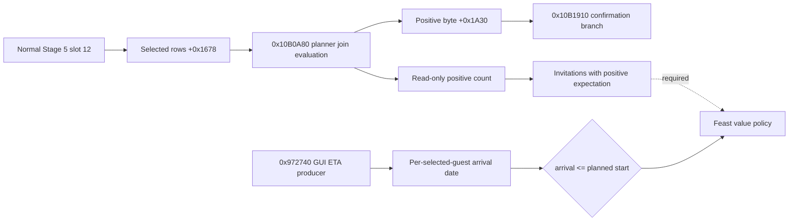

# Feast Stage 5 selected-guest expectation (CK3 1.19.0.6)

This is an exact-build, read-only source trace. The inspected `ck3.exe`
SHA-256 is `2D00FF3101EF70B566F2FCBAE292F09263199C80E9DC8F139B82D7D96F83DB86`.
The stock `game/gui/window_activity_guest_list.gui` binds
`CharacterSelectionList.GetList` at line 332, `CharacterListItem.GetCharacter`
at line 429, `ActivityGuestListWindow.GetJoinChance(item) > 0` at line 568,
and `ActivityGuestListWindow.MayNotArriveInTime(item)` at line 580. No CK3
instance was started for this trace. Neither a selected invitation nor a
positive expectation proves invitation acceptance or attendance.

## Original planner route

The normal Stage 5 planner slot 12, `0x10AE180`, first returns from its
existing cost/configuration refresh at `0x10AE1AF`. It then traverses the
selected guest vector at planner `+0x1678` with signed count `+0x1684` and
16-byte rows. A row's full signed CharacterID is at `+8`; `-1` is empty.
The host ID is planner `+0x1538`. A host row is assigned positive byte 1.
For another character, `0x10AE245..0x10AE29B` resolves the current
generation-bearing `CCharacter*`, calls `0x10B0A80(out, planner, character)`,
and stores whether the returned signed 64-bit fixed-point value is **greater
than zero** in the byte array at planner `+0x1A30[index]`.

Stage 5 Progress at `0x10B1910` revisits these same 16-byte rows and bytes.
Only a retained row whose byte is zero is copied into the confirmation list
at `0x10B19D0..0x10B1AC0`; with no such rows, `0x10B1AD9` enters the Start
commit branch. This supports a narrow interpretation of the byte as the
planner's positive-join expectation for **selected invitations**. It does
not prove an individual guest has accepted. In particular, the cost hook at
`0x10AE1AF` captures before the join-byte writes: a recorded normal-refresh
sequence alone cannot validate the later byte. The read core therefore
re-evaluates each current selected non-host character through the exact
`0x10B0A80` call and compares its sign to the stable cached byte on one
paused main-thread frame. It publishes copied CharacterIDs and signed
values, never native pointers.

## Separate GUI travel signal

The GUI `GetJoinChance` callback `0x151C980` takes the
`ActivityGuestListWindow*` in RCX and obtains a `CharacterListItem` row index
via the item's virtual slot `+0x28` and row `+0x0C`. It returns the signed
fixed-point qword at `window+0x2E8 + index*0x28 + 0x10`, with count at
`window+0x2F4`. The GUI `MayNotArriveInTime` callback `0x151CA60` uses the
same row index; in planning mode (`window+0xF8 == -1`), it compares the
cached dword at row `+4` with planned date `planner+0x1550` and returns
`arrival_date > planned_date`. The `GetTravelTimeEstimation` callback
`0x151CB50` reads the separate row `+0x1C` value.

The GUI cache has a separate freshness condition. `0x151BB70` binds the
planner to GUI context `+0x100`, marks planning mode at `+0xF8=-1`, and only
calls the internal guest-list refresh `0x151B3D0` when the context visibility
check `0x1F30970(context)` succeeds (`0x151BE0F..0x151BE22`). Thus a
background Stage 5 read cannot assume this GUI cache is current. The producer
is now traced through `0x151ADE0 -> 0x151D820 -> 0x151DBA0 -> 0x972740`.
The embedded list begins at window `+0x130`; its cache pointer/count at list
`+0x1B8/+0x1C4` are window `+0x2E8/+0x2F4`. The generic list item at
`item+8` carries the full CharacterID and `item+0x0C` is its cache row index.
Thus the window cache has a legitimate GUI identity mapping, but it remains
separate from the planner's selected invitation vector.

The read core copies only the **arrival** half of producer `0x972740` on the
paused planner frame. The original function writes the full CharacterID to
output row `+0`; with refresh flag zero it obtains route estimates and then
sets the arrival days (`+0x1C`) through this exact branch:

1. Get the planner activity at `0x10CDA10(planner)`. Search its `+0x10`
   pointer / `+0x1C` count, 0x20-byte rows at row `+0` for this CharacterID.
2. When absent, call `0x28CD180(character, destination)` for travel days.
   Destination is the first selected planner location at `+0x1578`, resolved
   through world `+0xA0` and its `+0x140/+0x14C` province table. The world
   pointer is at RVA `0x570E068`.
3. When present, check activity record index `+0x83C` against record count
   `+0x36C`. Invalid index gives zero days. Valid index uses the **first**
   record at `activity+0x360` pointer, offset `+0x38`: days equal
   `(record_date_raw - 0x29C55C0) / 24 - world.current_day`. Although the
   original briefly calculates `index*0x48`, it reads the first record date
   at `0x9727EC`.
4. `0x97282F..0x9728CA` computes arrival raw as `world+8` current date plus
   `24*days`. The GUI `MayNotArriveInTime` compares that result with planner
   `+0x1550`; the core uses the same strict `>` comparison. A travel sentinel
   or unreadable source remains unavailable, not zero.

The original GUI producer also calculates a route estimate at row `+0x18`
and a script join value at row `+0x10`. This core does not need those GUI
fields: Start itself consumes the planner `0x10B0A80` sign. Both routes call
the original `0x337B210` evaluator, but their scope construction differs, so
the two numeric join values are not asserted identical.

`activity_stage5_feast_guest_join_v1` is an unregistered native core: no
bridge command, MCP query, Python consumer, or live result is claimed. Its
focused fixture covers a positive timely non-host row, a negative row, an
existing activity row with zero-day and later recorded-date branches, an
empty row, cache disagreement, missing refresh, native evaluation failure,
changed frame, and exact-build rejection. The native direct evaluators still
need a paired, default-off paused-frame query and real readback before policy
may use `timely_positive_join_count`. It is a prediction, not proof of
accepted guests or completion rewards.
