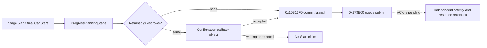

# Feast stage-5 Start command and first material readback (CK3 1.19.0.6)

This is a read-only exact-build trace from source master
`41d94d5759e264a4e88ccb5ebfd68b4f0f29978d`. The inspected
`ck3.exe` SHA-256 is
`2D00FF3101EF70B566F2FCBAE292F09263199C80E9DC8F139B82D7D96F83DB86`;
stock `game/common/activities/activity_types/feast.txt` SHA-256 is
`CE9B72F84B534CE5B8E0764FBFE0552CDBE889ABDEC370747643014B2668FB7C`.
No CK3 instance was launched for this trace. Stage-2 transition, configured
stage-5 cost, final CanStart, Start, next turn, and cold restore are not
qualified by these source facts.

## Original player route

The planner GUI binds its final button to
`ActivityPlanner.ProgressPlanningStage` and its enabled state to
`CanProgressPlanningStage` (`game/gui/window_activity_planner.gui`, lines
1987-1991). The first binding calls `0x10B4CE0 -> 0x10B1330`; its stage-5
jump reaches `0x10B1910`. The second binding's stage-5 branch calls the
temporary `CStartActivityCommand` validator through `0x10B0DA0`, as recorded
in `activity-planning-semantic-seam-1.19.0.6.md`. A true stage-2 gate is not
this final result.

`0x10B1910` filters the planner's guest rows at `+0x1678/+0x1684` against
its selection bytes at `+0x1A30`. With no retained rows it calls
`0x10B13F0` directly (`0x10B1AD9`). Otherwise it constructs a confirmation
callback object through `0x10B14E0`; that object's accept callback
`0x10B18C0` jumps to `0x10B13F0`. Its enabled callback `0x10B18D0`
checks planner widget visibility and calls the stage-5 final evaluator
`0x10B0DA0`. The GUI confirmation interpretation follows from these callback
roles; a paused live confirmation state has not been captured. Therefore
calling stage-5 Progress can either reach a command submit or leave a
confirmation pending. Merely advancing the planner or showing that callback
object does not prove an activity was started.

`0x10B13F0` is the common commit branch. It prepares planner choices at
`0x10B0780`, copies the configured planner payload at `+0x1530` via
`0x10B10E0`, copies it into a stack `CStartActivityCommand` via
`0x18E1160`, and submits the command at `0x10B14A9 -> 0x973E00` with
manager RVA `0x57621F0` and player flags `0x0E`. The stack command uses
primary/secondary vtables `0x432E690/0x432E438`. The code does not inspect
the submit return before resetting the planner and closing its view. A
closed planner is thus not a success postcondition. Calling `0x10B13F0`
directly would select the original accept branch, so a future typed action
must first make the approval decision and repeat the exact stage-5 final
legality and cost checks at its submit frame; it must submit once.

## Command apply and readback source

The command's primary validator is slot 6 `0x26C8070 -> 0x219A8B0`.
Its secondary dispatch `0x26C8050` resolves the activity manager from
`*(module+0x570E068)`, then `+0xA0/+0x1DEC0`, and calls `0x2700340`
with the command payload. `0x2700340` allocates a `0x5F0`-byte activity
slot, writes a generation-bearing activity ID at object `+0x08`, and
registers the new object in the manager's chunk/index tables. The
`0x2704A60` allocator shows 1024 slots per chunk. At `0x2700469`,
`0x218EDB0` copies the command payload's type and host into the activity at
`+0x3A0` and `+0x3A8`; `0x2700873` subsequently dereferences `+0x3A0` as
the activity type. These addresses identify a bounded read-only collector
source for **new activity ID + feast type key + exact host ID**. A collector
still needs its own exact vtable, generation, enumeration, and paused-frame
fixture before its result can become a postcondition API.

The same apply routine computes the full configured resource breakdown at
`0x270071C -> 0x28D0820`, which reaches `0x2CDB7B0`, then applies the
resource vector at `0x270072F -> 0x2CDBEA0`. This is a material mutation
path. The stock feast `cost` block (around line 971) can select Gold,
treasury, piety, or barter goods according to character state. The separate
stage-5 named Gold getter proves only the Gold component; a zero Gold
component does not prove a free feast. Actual resource deltas and the new
activity identity need independent reads after the queued command is
consumed. `on_start` writes effects and a log, but its script side effects
alone are not a unique activity identity.

The smallest **complete feast cost** read extends the existing same-frame
stage-5 `CostBreakdown.GetCost('gold')` observer to the three other literal
keys in this script's `cost` block: `treasury`, `piety`, and `barter_goods`.
The original getter `0x2CD96C0` resolves each name through `0x3B5A9A0`,
searches the ten resource IDs at `0x440C338..0x440C35F`, and reads the
matching top-level signed Q100000 qword. It falls back to index **10** for
an unrecognized name (`0x2CD9789`), so the observer must independently
prove every requested key maps to an index below 10 before publishing a
value. The four values must come from one normal slot-12 refresh, unchanged
planner configuration, actor, date and revision. A missing key or refresh
is `unavailable`, not zero. The original stage-5
`0x10B0DA0`/`CStartActivityCommand` validator is the separate final native
legality result; the named cost vector and resource reserve remain policy
inputs. Other activity types need their own script cost-key set.

## Smallest typed Start contract after stage 2 is unblocked

1. On one paused owner frame, read stage 5, retained `activity_feast` and
   `feast_type_generic`, normal slot-12 cost freshness, the four named
   configured feast resources and current relevant balances, final
   `0x10B0DA0` result, and the current
   hosted activity IDs. Policy chooses a budget and any confirmation answer.
2. Submit once through the original commit branch or an equivalently
   constructed `CStartActivityCommand` that runs the original validator and
   queue. Record whether the command was submitted; a confirmation state
   without submission has a distinct pending state. No second Start follows
   an unresolved submit.
3. In a later independent paused read, find one **new** activity ID with the
   same host and `activity_feast` type, and compare actual resource balances
   against the pre-submit values. Record creation, debit, current phase, next
   turn, and cold restore separately. A queue ACK or planner closure cannot
   substitute for creation or debit. If the activity cannot yet be read,
   retain submitted/pending and the pre-submit checkpoint rather than retry.

Checkpoint state must carry the high-level feast target, actor, source
save/driver/profile, stage-5 configuration and named resource commitment,
the branch chosen (direct or confirmation), the command receipt if any,
and the activity ID once independently observed. Cold restore must inspect
the activity ID/type/host and balances before offering another Start.

The private Python consumer now reads the four-cost Stage 5 Start inputs on
the same paused frame after destination selection and records a value-policy
hold when guest arrival or resource commitments are unavailable. Its durable
intent is written before any Start call; a timed-out or pending submission is
reconciled through a separate hosted-identity/resource read, never resent.
That reconciliation requires exactly one new hosted feast ID with the actor
as host and the same-date configured resource debit. This is no-launch
consumer wiring, not a live Start result. The same-frame guest join/arrival
counts are copied when observed, but the native guest route remains
unqualified until that source is proven in a paused fixture; the current
bounded route therefore only observes and holds. A Start ACK would remain
pending until material poststate is read.

The next native read-only implementation point is the activity manager
reached by `0x26C8050`, with the `0x2700340` allocation path as its exact
layout fixture. The new collector should publish copied IDs and stable keys,
not activity pointers. Phase and terminal getters remain a separate
follow-up after creation; this trace does not assign a stable phase field.

Reproduce the bounded disassembly using
`ck3_autonomous_player/native_bridge/research/disasm_ck3.py` against the
hashed executable at RVAs `0x10B1910` (size `0x2C0`), `0x10B13F0`
(`0xF0`), `0x10B14E0` (`0x430`), `0x10B18C0` (`0x50`), `0x26C8050`
(`0x30`), `0x2700340` (`0x600`), `0x2704A60` (`0x180`), and
`0x28D0820` (`0x180`).

## R0365 Stage-5 full-cost read RED

The four-resource native getter and final CanStart contract above remains the
authority for this private read. The frozen R0365 H3928 candidate used source
`305c0f9c579a872f2ba7cad439be341c67e5af9b` (official push CI
#36546655245 SUCCESS), Release DLL SHA-256
`E37E28298E8912EF28529177F051B4ABD03513588926DD1B5D7D937C72361FD1`,
and [candidate index](Z:/m6-activity-h3928-stage5-fourcost-candidate-20260929/CANDIDATE-INDEX.json)
SHA-256 `94B765F73379712EA5FC1B8F9A5681A3500A84BC9E5E2B0D76E7AA98DA71D6EA`.
The official rebind/no-launch result was `ready`. Latest master at freeze
`b4a167f76b54ed78538edd7287dc1e83a30e0f2b` added separate feast
value-policy files and was not loaded into this frozen DLL. New CK3 PID 57596
was minimized after its window became verifiable; the first owned-window
attempt during loading had no verified result. The
[owner receipt](Z:/m6-activity-h3928-stage5-fourcost-candidate-20260929/OWNER-WINDOW-RECEIPT.json)
SHA-256 is `4219606EB64C11CFC9C0A9B2D7245D7348BAD029F3E44A76DEDAA5C927BEFD6C`.

On the same paused `native:3` frame, actor 29829/date raw53219928,
Stage 1 generic Confirm and the typed Stage 2 ProvinceID 2619 selection
again reached a verified Stage 5 planner. The destination receipt kept the
option and recorded row IDs `[0,0]` to `[2619,2619]`, unchanged Gold raw
`120644281`, and no date change. The following private
`query-activity-stage5-feast-full-cost-v1-private` returned **RED**:
`native_activity_stage5_full_cost_red:gold_gate_red:exact_build_rejected`.
Its observation is null. The outer selected-step receipt records
`status=red, submitted=true, pending=true` to preserve the already
submitted destination and failed read; it is **not** a Start submission or
a configured price. No Gold/treasury/piety/barter-goods cost or final
CanStart result was obtained. A missing value must not become zero.

The [formal report](Z:/m6-activity-h3928-stage5-fourcost-candidate-20260929/operator-runs/feast-stage5-fourcost-read-1/formal-report.txt)
SHA-256 `E2466AFEF3573AB843C4C71243D146EA914CA8CB5B009337ED969C5D468CCC5A`
has `outcome=failed/ok=false`, one attempted and zero successful or visible
ordinary gameplay turns. The [operator receipt](Z:/m6-activity-h3928-stage5-fourcost-candidate-20260929/operator-runs/feast-stage5-fourcost-read-1/operator-receipt.json)
SHA-256 `BC456F8D9D6E4CADAED4F6D94457CEC4DBDF0DC16AA081FB426168FB7AB4096F`
has `formal_run_failed/exit1`. The H3928 original save SHA-256
`A92073407D1CB2800EEF9C0C3EFEB9846D48398F679DC3163B71EF86C40CEC2C`
and date were unchanged; cleanup proved the process tree gone. This
run is recoverable from the original checkpoint, but post-selection cold
restore and next-turn consumption were not tested.

The failure is localized to the private transport's Gold subenvironment,
not to an observed game ABI change. In
`activity_stage5_feast_full_cost_private_transport_v1.cpp:164-167`, the
transport sets `cost_environment.enabled=true` and supplies
`cost_environment.gold.diagnostic` plus `.passive_cost`, but omits
`cost_environment.gold.enabled=true`. The called Gold core in
`activity_stage5_gold_cost_v1.cpp:152-158` returns its initial
`exact_build_rejected` status when `environment.enabled` is false.
The full-cost core maps that result to `gold_gate_red` before querying
the other resources or final CanStart. The Gold transport owner is
repairing this narrow wiring defect; a new exact candidate and paired
paused run must read the four actual values and CanStart. R0365 does not
authorize Start, payment, or a feast benefit claim.

## R0366-B four named costs and final CanStart: paused live read

The narrow transport fix following R0365 was frozen at source master
`b5dc6da32beca9e0ce4f7747e9f1583807a8925d`, official CI
#36549860545 SUCCESS. The
[R0366-B candidate index](Z:/m6-activity-h3928-stage5-fixed-r0366-candidate-20260929/CANDIDATE-B-INDEX.json)
SHA-256 is `DB52EBE6A1511B3378BC538EA84ED97B00A26DCEE47549151CBEC5FBEA0DD9B7`;
Release DLL SHA-256 is
`771A2A20176B5B6647E9BE005317854BEFC2DD663D8CACBC085BC2CAE91849E6`.
The official pair/rebind/no-launch status was `ready`. Both runtime
Start query and Start action opt-ins stayed OFF. On new CK3 PID 186916,
the instance owner verified and minimized its window; the
[window receipt](Z:/m6-activity-h3928-stage5-fixed-r0366-candidate-20260929/OWNER-WINDOW-RECEIPT-B.json)
SHA-256 is `F4C25CB6DCA0337E552C6F853106304ACD71055FAB109A2AB18AE7C08279C173`.

On the same paused `native:3` frame, actor 29829/date raw53219928,
the private runner repeated Stage 1 generic Confirm and one typed Stage 2
ProvinceID 2619 destination selection; the destination receipt verified
Stage 5 and row IDs `[0,0]` to `[2619,2619]`. The **read-only** Stage 5
full-cost result then returned `stage_five_full_cost_observed`,
`same_frame=true`, `normal_refresh_sequence=757`, scale 100000,
actor Gold raw `120644281`, and these original named costs:

| Resource | Exact index | Configured cost raw | At scale 100000 |
| --- | ---: | ---: | ---: |
| Gold | 0 | 10000000 | 100 |
| treasury | 6 | 0 | 0 |
| piety | 2 | 0 | 0 |
| barter_goods | 9 | 0 | 0 |

All four indices are inside the ten named slots. The same result reads
`final_can_start=false`. This is the original final native verdict
for this configured feast, not a policy approval; its false reason was
not established here. Gold is numerically above the configured Gold
charge, but this alone does not establish a viable guest, war cash
reservation, or permission to spend. The source tree's Start route
was not invoked. No guest/arrival read was part of R0366-B.

The [formal report](Z:/m6-activity-h3928-stage5-fixed-r0366-candidate-20260929/operator-runs/feast-stage5-fixed-cost-only-1/formal-report.txt)
SHA-256 `7E9885E0F0F17ED0695F5AAC4FC159B602B1B0CD2C42A87B2BDE109A0D48579E`
has `private_activity_feast_stage5_full_cost_observed/planning_stage_advanced/ok=true`;
the [operator receipt](Z:/m6-activity-h3928-stage5-fixed-r0366-candidate-20260929/operator-runs/feast-stage5-fixed-cost-only-1/operator-receipt.json)
SHA-256 `572049A81515FF3B2ABB6B7E2CAECF24C953957FAD65C01C09B1E4BFA92E8223`
has completed/exit 0. Normal `auto_run` attempted/successful/visible
gameplay turns are zero. Gold raw, date raw53219928 and original H3928
save SHA-256
`A92073407D1CB2800EEF9C0C3EFEB9846D48398F679DC3163B71EF86C40CEC2C`
are unchanged; cleanup proved the CK3 tree gone. This is a real paused
four-cost and final-gate read, not a Start, payment, benefit, next-turn
consumption, or post-selection cold restore. The next action is to
diagnose the false final gate and evaluate guest/resource commitments
without overriding it.

## R0367 same-frame Start inputs: hold on native false

A separate cold H3928 run used Python source master
`e6b61b825dd5ca6ae09fdeabf51a37dad27dc7c3` (official CI
#36550764624 SUCCESS) and the same native tree/DLL as R0366-B,
source `b5dc6da32beca9e0ce4f7747e9f1583807a8925d`.
The [A candidate index](Z:/m6-activity-h3928-stage5-fixed-r0366-candidate-20260929/CANDIDATE-INDEX.json)
SHA-256 is `BFE32888F306DF5B402EF334E384A341644283D71C82C0EF7FC5BBE6EA5E19CB`.
The Stage 5 input query opt-in was ON, while the Start action opt-in
remained OFF. The actual run identity was **R0367** with CK3 PID 181244;
the [owner window receipt](Z:/m6-activity-h3928-stage5-fixed-r0366-candidate-20260929/OWNER-WINDOW-RECEIPT-A.json)
SHA-256 `D7DAADD32B76FC37ED8AC2A5A22EFA66F3E0B6792AC3DF1869DBFC12B60C9C5C`
records a verified minimize after the loading window became available.

Stage 1 Confirm and the typed ProvinceID 2619 destination selection
again reached the paused Stage 5 planner. The same-frame read repeated
the four named costs (Gold 100 at scale 100000, treasury/piety/barter
goods zero) and `final_can_start=false`. A separate Start-input
read recorded `hosted_activities=[]` and
`guest_join_status=planner_unavailable`; its
`selected_nonhost_count`, `positive_join_count`, and
`timely_positive_join_count` are **null**, with
`arrival_time_observed=false` and
`native_guest_route_qualified=false`. The empty hosted list supports
no already hosted feast in this read. It does **not** turn the three
unread guest counts into zero or identify why final CanStart is false.
The formal decision was `hold/not_actionable` with reason
`native_final_start_unavailable`. No Start action was submitted.

The [formal report](Z:/m6-activity-h3928-stage5-fixed-r0366-candidate-20260929/operator-runs/feast-stage5-fixed-cost-input-read-1/formal-report.txt)
SHA-256 `35C04DD2B42619442D98D3A6EA5AD48DAD5868CE7DA71E9D55A68F79903CE486`
has `private_activity_feast_stage5_start_assessed/planning_stage_advanced/ok=true`;
the [operator receipt](Z:/m6-activity-h3928-stage5-fixed-r0366-candidate-20260929/operator-runs/feast-stage5-fixed-cost-input-read-1/operator-receipt.json)
SHA-256 `0EE3BF274E3103EFD2226C562AC49EF988057DAD86B7C08D62F8236A3A29A223`
has completed/exit 0. Normal `auto_run` gameplay turns are zero,
date raw53219928 and the original save SHA-256
`A92073407D1CB2800EEF9C0C3EFEB9846D48398F679DC3163B71EF86C40CEC2C`
are unchanged, and cleanup proved the process tree gone. This is a
read-only hold decision, not Start, a fee debit, activity creation,
attendance, next-turn consumption, or post-selection cold restore.
The next native investigation is the actual final-gate failure branch
and the unavailable planner guest route; neither may be guessed from
an empty hosted list.

## Post-R0367 final CanStart failure display: source and fixture only

Source master `dee29e5c588e81da532d5085a65413aaf8a7640a` (#641) adds
`final_can_start_failure_display` to the private full-cost read. Exact-build
`0x10B0DA0(planner, native_string*)` writes an optional native display
message into a caller-initialized 32-byte MSVC string (size 0, capacity
15). The bridge copies its UTF-8 bytes during the **same** final CanStart
evaluation and calls the original game string destructor at `0x7E97D0`
before publishing the value. The full-cost read retains its paused frame,
planner identity and before/after configuration checks. This message is
display text, not a stable reason key.

| Final CanStart | Native display | Typed field |
| --- | --- | --- |
| `false` | nonempty | `{state: "known", value: "<display text>", unknown_reason: null}` |
| `false` | empty | `{state: "unknown", value: null, unknown_reason: "native_failure_display_empty"}` |
| `true` | not needed | `{state: "not_applicable", value: null, unknown_reason: null}` |

The native helper and Python parser have focused tests, and Debug/Release
DLL builds passed. This is not a new paused CK3 observation: R0367 used the
earlier transport, passed `nullptr` to the evaluator, and read only
`final_can_start=false`. Its exact failure display and cause remain unknown.
There has been no post-change Start, resource debit, new activity identity,
next turn or cold restore. The formal Start action remains OFF while the
same-frame native gate is false and the guest route is unqualified; a new
frozen candidate and paired paused read must observe the display and guest
status before policy can reconsider Start.
