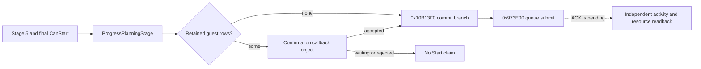

# Feast stage-5 Start command and first material readback (CK3 1.19.0.6)

This is a read-only exact-build trace from source master
`41d94d5759e264a4e88ccb5ebfd68b4f0f29978d`. The inspected
`ck3.exe` SHA-256 is
`2D00FF3101EF70B566F2FCBAE292F09263199C80E9DC8F139B82D7D96F83DB86`;
stock `game/common/activities/activity_types/feast.txt` SHA-256 is
`CE9B72F84B534CE5B8E0764FBFE0552CDBE889ABDEC370747643014B2668FB7C`.
No CK3 instance was launched for this trace. Stage-2 transition, configured
stage-5 cost, final CanStart, Start, next turn, and cold restore are not
qualified by these source facts.

## Original player route

The planner GUI binds its final button to
`ActivityPlanner.ProgressPlanningStage` and its enabled state to
`CanProgressPlanningStage` (`game/gui/window_activity_planner.gui`, lines
1987-1991). The first binding calls `0x10B4CE0 -> 0x10B1330`; its stage-5
jump reaches `0x10B1910`. The second binding's stage-5 branch calls the
temporary `CStartActivityCommand` validator through `0x10B0DA0`, as recorded
in `activity-planning-semantic-seam-1.19.0.6.md`. A true stage-2 gate is not
this final result.

`0x10B1910` filters the planner's guest rows at `+0x1678/+0x1684` against
its selection bytes at `+0x1A30`. With no retained rows it calls
`0x10B13F0` directly (`0x10B1AD9`). Otherwise it constructs a confirmation
callback object through `0x10B14E0`; that object's accept callback
`0x10B18C0` jumps to `0x10B13F0`. Its enabled callback `0x10B18D0`
checks planner widget visibility and calls the stage-5 final evaluator
`0x10B0DA0`. The GUI confirmation interpretation follows from these callback
roles; a paused live confirmation state has not been captured. Therefore
calling stage-5 Progress can either reach a command submit or leave a
confirmation pending. Merely advancing the planner or showing that callback
object does not prove an activity was started.

`0x10B13F0` is the common commit branch. It prepares planner choices at
`0x10B0780`, copies the configured planner payload at `+0x1530` via
`0x10B10E0`, copies it into a stack `CStartActivityCommand` via
`0x18E1160`, and submits the command at `0x10B14A9 -> 0x973E00` with
manager RVA `0x57621F0` and player flags `0x0E`. The stack command uses
primary/secondary vtables `0x432E690/0x432E438`. The code does not inspect
the submit return before resetting the planner and closing its view. A
closed planner is thus not a success postcondition. Calling `0x10B13F0`
directly would select the original accept branch, so a future typed action
must first make the approval decision and repeat the exact stage-5 final
legality and cost checks at its submit frame; it must submit once.

## Command apply and readback source

The command's primary validator is slot 6 `0x26C8070 -> 0x219A8B0`.
Its secondary dispatch `0x26C8050` resolves the activity manager from
`*(module+0x570E068)`, then `+0xA0/+0x1DEC0`, and calls `0x2700340`
with the command payload. `0x2700340` allocates a `0x5F0`-byte activity
slot, writes a generation-bearing activity ID at object `+0x08`, and
registers the new object in the manager's chunk/index tables. The
`0x2704A60` allocator shows 1024 slots per chunk. At `0x2700469`,
`0x218EDB0` copies the command payload's type and host into the activity at
`+0x3A0` and `+0x3A8`; `0x2700873` subsequently dereferences `+0x3A0` as
the activity type. These addresses identify a bounded read-only collector
source for **new activity ID + feast type key + exact host ID**. A collector
still needs its own exact vtable, generation, enumeration, and paused-frame
fixture before its result can become a postcondition API.

The same apply routine computes the full configured resource breakdown at
`0x270071C -> 0x28D0820`, which reaches `0x2CDB7B0`, then applies the
resource vector at `0x270072F -> 0x2CDBEA0`. This is a material mutation
path. The stock feast `cost` block (around line 971) can select Gold,
treasury, piety, or barter goods according to character state. The separate
stage-5 named Gold getter proves only the Gold component; a zero Gold
component does not prove a free feast. Actual resource deltas and the new
activity identity need independent reads after the queued command is
consumed. `on_start` writes effects and a log, but its script side effects
alone are not a unique activity identity.

The smallest **complete feast cost** read extends the existing same-frame
stage-5 `CostBreakdown.GetCost('gold')` observer to the three other literal
keys in this script's `cost` block: `treasury`, `piety`, and `barter_goods`.
The original getter `0x2CD96C0` resolves each name through `0x3B5A9A0`,
searches the ten resource IDs at `0x440C338..0x440C35F`, and reads the
matching top-level signed Q100000 qword. It falls back to index **10** for
an unrecognized name (`0x2CD9789`), so the observer must independently
prove every requested key maps to an index below 10 before publishing a
value. The four values must come from one normal slot-12 refresh, unchanged
planner configuration, actor, date and revision. A missing key or refresh
is `unavailable`, not zero. The original stage-5
`0x10B0DA0`/`CStartActivityCommand` validator is the separate final native
legality result; the named cost vector and resource reserve remain policy
inputs. Other activity types need their own script cost-key set.

## Smallest typed Start contract after stage 2 is unblocked

1. On one paused owner frame, read stage 5, retained `activity_feast` and
   `feast_type_generic`, normal slot-12 cost freshness, the four named
   configured feast resources and current relevant balances, final
   `0x10B0DA0` result, and the current
   hosted activity IDs. Policy chooses a budget and any confirmation answer.
2. Submit once through the original commit branch or an equivalently
   constructed `CStartActivityCommand` that runs the original validator and
   queue. Record whether the command was submitted; a confirmation state
   without submission has a distinct pending state. No second Start follows
   an unresolved submit.
3. In a later independent paused read, find one **new** activity ID with the
   same host and `activity_feast` type, and compare actual resource balances
   against the pre-submit values. Record creation, debit, current phase, next
   turn, and cold restore separately. A queue ACK or planner closure cannot
   substitute for creation or debit. If the activity cannot yet be read,
   retain submitted/pending and the pre-submit checkpoint rather than retry.

Checkpoint state must carry the high-level feast target, actor, source
save/driver/profile, stage-5 configuration and named resource commitment,
the branch chosen (direct or confirmation), the command receipt if any,
and the activity ID once independently observed. Cold restore must inspect
the activity ID/type/host and balances before offering another Start.

The private Python consumer now reads the four-cost Stage 5 Start inputs on
the same paused frame after destination selection and records a value-policy
hold when guest arrival or resource commitments are unavailable. Its durable
intent is written before any Start call; a timed-out or pending submission is
reconciled through a separate hosted-identity/resource read, never resent.
That reconciliation requires exactly one new hosted feast ID with the actor
as host and the same-date configured resource debit. This is no-launch
consumer wiring, not a live Start result. The native guest route remains
unqualified until the exact-build arrival/join read is connected and proven
in a paused fixture; the current bounded route therefore only observes and
holds. A Start ACK would remain pending until material poststate is read.

The next native read-only implementation point is the activity manager
reached by `0x26C8050`, with the `0x2700340` allocation path as its exact
layout fixture. The new collector should publish copied IDs and stable keys,
not activity pointers. Phase and terminal getters remain a separate
follow-up after creation; this trace does not assign a stable phase field.

Reproduce the bounded disassembly using
`ck3_autonomous_player/native_bridge/research/disasm_ck3.py` against the
hashed executable at RVAs `0x10B1910` (size `0x2C0`), `0x10B13F0`
(`0xF0`), `0x10B14E0` (`0x430`), `0x10B18C0` (`0x50`), `0x26C8050`
(`0x30`), `0x2700340` (`0x600`), `0x2704A60` (`0x180`), and
`0x28D0820` (`0x180`).
