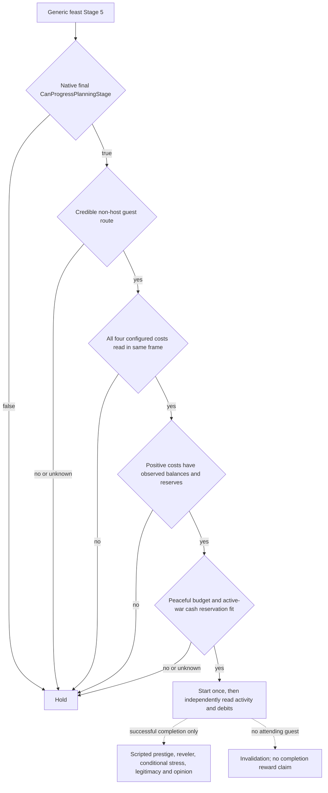

# Feast Stage 5 value and resource policy (CK3 1.19.0.6)

Status: **exact-build source research and static policy only**. No Stage 5
paused readback, Start action, resource debit, or completed feast is claimed.
This policy is for `activity_feast` with `feast_type_generic`; other activities
need their own rewards and resource terms.

The game executable SHA-256 is
`2D00FF3101EF70B566F2FCBAE292F09263199C80E9DC8F139B82D7D96F83DB86`.
The stock `game/common/activities/activity_types/feast.txt` SHA-256 is
`CE9B72F84B534CE5B8E0764FBFE0552CDBE889ABDEC370747643014B2668FB7C`.
The inspected `00_activity_effects.txt`, `00_feast_scripted_effects.txt`, and
`06_dlc_ce1_legitimacy_effects.txt` hashes are respectively
`A50D9038D63B25DACF65E9C7F48258AE7CCBB1443C941653E261864E522D90DA`,
`BACB8111AF4327884FA9314AF73131B65AD0863121BEC72828316426C920A123`, and
`DEE9D48221B49EF41490D04451ACD6DBFD4994A50EAD9D006F831F41A6247A83`.

## Original decision and effect tree

`feast.txt:60-72` requires at least one attending guest in the active phase;
`feast.txt:4163-4172` permits up to five months for guest arrival and gives the
single meal phase one month after activation. This is calendar occupancy, not
an asserted total completion date or guaranteed guest acceptance. The Stage 5
final native gate and Start branch are traced in
[`activity-stage5-feast-start-command-1.19.0.6.md`](activity-stage5-feast-start-command-1.19.0.6.md).

On successful completion, `feast.txt:4793-4815` calls
`disburse_feast_activity_rewards`. Its `00_activity_effects.txt:3280-3440`
food branches set **base** host prestige to 225/115/35 for
`feast_food_good`/`feast_food_normal`/other food, before court and other
modifiers. They are not a live predicted amount or a minimum final delta.
The same effect at lines 3674-3769 invokes hosted-successful and reveler
effects and offers stress relief except for shy or reclusive hosts; the greedy
impact can also change its sign. At lines 4086-4163, a completed feast gives
existing Revelers 5-15 trait XP depending on food/courses, or advances the
pre-trait progress by at least one before random bonuses. The hosted effect in
`00_feast_scripted_effects.txt:107-175` adds a five-year local feast modifier;
its other effects depend on culture, faith, court or spouse. The legitimacy
effect at `06_dlc_ce1_legitimacy_effects.txt:26-39` applies only if the host
passes the original `is_valid_for_legitimacy_change` check. Vassal/guest
opinion in `00_activity_effects.txt:3052-3225` requires actual attendance and
depends on chosen courses; it is not a guaranteed alliance or immediate gain.

`feast.txt:971-1055` has four configured resource terms: Gold, treasury,
piety, and barter goods. The latter three cannot be inferred from Gold or
treated as zero when their named getter is absent. The existing Stage 5 native
reader work exposes all four Q100000 configured costs and the Gold balance.
Gold, piety, treasury and barter goods balances for any **positive** charge
must be supplied by an independent same-frame getter. A zero charge needs no
invented balance. `ui_predicted_cost` is only a rough preview and does not
authorize spending. See the Stage 5 Start tree for the native cost getter and
separate material postcondition.

## Minimal policy

`activity_feast_stage5_value_policy.assess_feast_stage5_start` accepts a
bounded Stage 5 request only when the original final native gate is true,
the selected type is the normal feast, a non-host guest route is credibly
observed, all four configured charges are known, and every positive charge
fits its current balance after existing reservations. Gold also needs an
explicit peaceful reserve; if a war is active, its cash reservation must be
known or the feast cannot claim that cash. This prevents unknown future war
cash from becoming a zero cost while allowing a free feast or a peaceful
budget with sufficient headroom. The result carries the exact four-resource
commitment, an explicit conditional benefit reason, and a `start`/`hold`
decision for the typed Start consumer. A separate `status=missing_input`
preserves positive value when cost, native legality, guests or a necessary
reservation is unobserved; it is not a negative-value judgment. It does not
assert universal ROI,
actual guest acceptance, or reward certainty.

The caller's `reserved_raw` must be taken from the current resource-commitment
ledger, such as M5's existing `commitments.gold_raw`, and counted once. The
peaceful `gold_floor_raw` is an explicit policy budget selected from the
same-frame cash and current independent plans; this package supplies no
unobserved H3928 number. `active_war_count` comes from the same-frame native
war list. For positive Gold cost during an active war,
`war_cash_reserve_raw` must come from a current war cash assessment/commitment,
not a default zero. H3928's future war cash requirement is currently unknown,
so such a Stage 5 feast returns `missing_input / war_cash_reserve_unobserved`.
A zero-Gold feast or independent non-Gold charge with a known balance can
proceed without inventing a war cash number; an actual no-war frame needs no
war cash reservation. The policy returns `submit_reserve_raw` for the native
Start core: existing reservations plus the peaceful floor and, when applicable,
the war cash reserve. The separate `resource_commitment_raw` is only this
feast's four charges to add to the ledger after submit; it must not replace
the preexisting reservation vector.

H3928 Stage 2 R0363 read two native-selectable locations but never selected
one. Until the later Stage 5 frame supplies the real cost, final gate, guest
route and cash allocation, the value decision remains **hold / missing input**.
