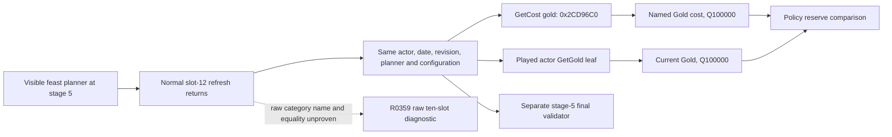

# Feast planner stage-5 named Gold cost: exact-build source boundary

CK3 1.19.0.6 Steam 23530548, `ck3.exe` SHA-256
`2D00FF3101EF70B566F2FCBAE292F09263199C80E9DC8F139B82D7D96F83DB86`.
Source baseline `3e249604a7805acc72f5e583cae416997bbf0a2b`.
This trace and the new private native core are source and fixture evidence;
this package did not launch CK3 or read a stage-5 live price.

## Original GUI and native getter

`game/gui/shared/value_breakdown.gui` uses
`CostBreakdown.GetCost('gold')`. The binding registration at
`0x7DDA15..0x7DDAAA` registers the `GetCost` callback `0x3DDBBE0`.
Its call at `0x3DDBC59` reaches `0x2CD96C0` with the Windows x64 arguments
`(int64_t* output, CCostBreakdown* object, NativeString* resource_name)`.
For a short name, the native string has inline bytes at `+0`, length at
`+0x10`, and capacity at `+0x18`; `gold` uses length 4 and capacity 15.

`0x2CD96C0` resolves the name through the original identifier registry
(`0x3B5A9A0`) and the ten-entry resource ID array at `0x440C338`. At
`0x2CD9795`, it returns the signed 64-bit value at
`CCostBreakdown + resource_index*8`. The unknown-name fallback is index 10,
outside the ten named slots; callers must use the literal original `gold`
key. This is the minimal native named-cost reader and does not invoke the
planner's write/recompute routine.

The first ten qwords are computed by `0x2CDB7B0`: the loop at
`0x2CDB8E0..0x2CDB8F8` accumulates each resource index, and
`0x2CDB93E..0x2CDB99B` conditionally rounds it to the game's Q100000
scale. The existing passive slot-12 observer copies a *different field* at
`CCostBreakdown + 0x50 + index*0x90 + 0x78`, populated by `0x21C7B60`.
Both arrays have ten indices, but this source trace does not bind the R0359
raw aggregate's first index to `gold`, nor establish that its amount equals
the GUI's configured price.

The played character's current Gold is a signed Q100000 value: the stock
`CCharacter.GetGold` callback `0xBDC460` reads
`CCharacter+0x1A8` extension and its `+0x100` value at `0xBDC496`.
The original getter returns zero for a null extension. A private query can
use the existing full-generation actor lookup, then read this field in the
same paused frame as the named cost. Affordability and reserve choice remain
policy decisions; a positive query result is not permission to start an
activity. The separate stage-5 final validator is `0x10B0DA0`.

## R0359 and current implementation boundary

R0359's [formal report](Z:/m6actcostrawh3928v2_20260929/operator-runs/slot12-raw-read-1/formal-report.txt)
has SHA-256 `30EC3B42D88B51C1007EA9C32E9E4AD200EE267A28D9ECFD918EBA8D9C928E44`.
At H3928/date raw53219928 and stage 1, it observed ten raw aggregates
`[10000000, 0 x 9]` with `resource_mapping=null` and
`configured_cost=null`. It did not confirm a category, reach stage 5,
start a feast, spend Gold, or advance the date. The first raw value remains
unnamed.

`activity_stage5_gold_cost_v1` is a default-off, independent private native
core. It requires a same-frame stage-5 passive slot-12 capture, exact
executable bytes, a visible feast planner, unchanged configuration and actor,
then calls the original named getter for `gold` and reads actor Gold. It
rechecks frame, configuration and actor Gold after the call. It does not
submit `ProgressPlanningStage` or an activity command. Its focused MSVC
Release fixture distinguishes the named amount from a raw aggregate and
checks no-refresh, wrong stage, changed configuration/revision, native read
failure and exact-build rejection. No paired stage-5 CK3 readback exists.

## Default-off private native transport

The follow-up bridge wiring, based on master `85a7755`, adds the private
`query-activity-stage5-gold-cost-v1-private` step. Its dedicated mailbox
executor slot is 61, separate from the stage-1 option reader's slot 59 and
the final CanStart reader's slot 60. The CMake flag
`XAR_CK3_ENABLE_G2_ACTIVITY_STAGE5_GOLD_COST_PRIVATE_V1` defaults to OFF and
requires the existing passive slot-12 capture flag. It is not a public MCP
capability or an operator auto-play decision.

The request binds the current snapshot revision, date, played actor,
`expected_activity_key=activity_feast`, and `expected_planning_stage=5`.
The application-main callback then requires the normal slot-12 return for
that planner configuration and copies two independent Q100000 values:
`configured_cost={resource:gold,raw,scale}` from native named `GetCost`, and
`resource_value={resource:gold,raw,scale}` from the played actor's stock Gold
field. The result records `normal_refresh_sequence`; `final_can_start` and
`raw_slot12_resource_mapping` remain null. No refresh, named getter failure,
changed frame or configuration produces a RED rather than a zero price.
The callback has no activity-start or date-advance path. Bridge compilation
and fixture tests do not qualify a configured live cost.

Next live step: after a separately validated stage-1 Confirm and stage-2
transition, observe a normal slot-12 refresh in an actual paused stage-5
feast configuration. Read named Gold cost, actor Gold and final validator in
that same frame. Compare against the original GUI result and preserve
independent postcondition, next-turn and cold-restore gates before any
formal activity action or broader capability claim.
