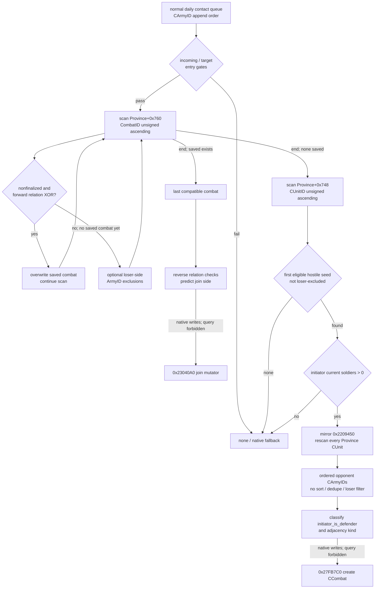
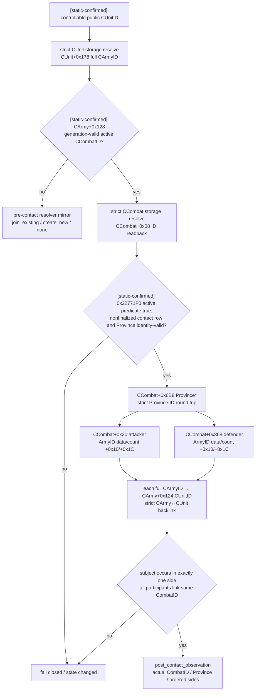

# CK3 1.19.0.6 同日实际接敌 scope

本文冻结 CK3 `1.19.0.6` exact build 的正常 daily movement → contact →
`CCombat` 链，回答四个直接影响自动玩家的问题：

1. 同一天多个单位到达时，谁先成为 contact initiator；
2. 已有战斗与新建战斗分别怎样选择；
3. 新战斗的 opponent 顺序及 attacker/defender 极性怎样确定；
4. mutation 完成后，怎样从已接战 CArmy 回读真实 CombatID、Province 与两侧有序 CUnitID，和接战前预测逐项对账。

静态逆向与 production query 都只读；任何观测路径都不得调用
`0x2208320`、`0x23040A0`、`0x2209450` 或 `0x27FB7C0` 等 contact mutation。

配套机器可读契约：

- `ck3_autonomous_player/native_bridge/research/actual_contact_scope_v1_abi.json`
- `ck3_autonomous_player/native_bridge/research/fixtures/actual_contact_scope_v1_source_contract.json`
- `ck3_autonomous_player/native_bridge/research/test_actual_contact_scope_v1_contract.py`

## 冻结边界

| 项 | 冻结值 |
|---|---|
| game version | `1.19.0.6` |
| `ck3.exe` SHA-256 | `2D00FF3101EF70B566F2FCBAE292F09263199C80E9DC8F139B82D7D96F83DB86` |
| CUnitManager primary/secondary vtable | `0x4340468` / `0x43404A0` |
| daily movement slot | `0x27F9B50` |
| local contact resolver | `0x2208320(CProvince*,CUnit*)` |
| stored-order opponent builder | `0x2209450(CProvince*,CArmy*,seed_owner_id)` |
| 禁止调用的 combat constructor | `0x27FB7C0` |

复现命令均为 bounded、只读：

```powershell
Get-FileHash -Algorithm SHA256 "Crusader Kings III/binaries/ck3.exe"
& "tools/.venv/Scripts/python.exe" "ck3_autonomous_player/native_bridge/research/disasm_ck3.py" 0x27F9B50 --size 0xA0
& "tools/.venv/Scripts/python.exe" "ck3_autonomous_player/native_bridge/research/disasm_ck3.py" 0x2208320 --size 0x5D0
& "tools/.venv/Scripts/python.exe" "ck3_autonomous_player/native_bridge/research/disasm_ck3.py" 0x2209450 --size 0x8D0
& "tools/.venv/Scripts/python.exe" "ck3_autonomous_player/native_bridge/research/disasm_ck3.py" 0x2303CF0 --size 0x270
& "tools/.venv/Scripts/python.exe" "ck3_autonomous_player/native_bridge/research/find_xrefs.py" 0x2208320
```

完整范围清单在 ABI 的 `reproduction.required_ranges`。所有地址都是 RVA，不含 image base。

## 结论摘要

[static-confirmed] 正常 daily 同日顺序不是一个统一的“army order”，而是三个有先后关系、但排序来源不同的序列：

| 阶段 | 原生顺序 | 后果 |
|---|---|---|
| movement tick | `CUnitManager+0x20/+0x2C` 的 full CUnitID stored order | 每个 CUnit 完整执行完 movement，才处理下一个 CUnit |
| contact queue | movement commit 产生的 full CArmyID tail-append order | 正常到达 initiator tie 严格继承上一步；不排序、不去重 |
| Province unit scan | 所有 movement 完成后的 `CProvince+0x748/+0x754` | normal movement 使用 full CUnitID **无符号升序**插入；seed 与 opponents 都扫这个顺序 |
| Province combat scan | `CProvince+0x760/+0x76C` | 新 CombatID 同样按 full ID 无符号升序插入；resolver 最终保留升序扫描中**最后一个** relation-XOR-compatible combat |

因此，同日两个友军和敌军一起进入目标省份时：

- 谁先触发 resolver，由 `CUnitManager` stored traversal → queue append 决定；
- resolver 第一次执行时，已经能看到这一天全部 movement 更新后的省内单位；
- 新战斗 opponents 的顺序不继承 arrival queue，而是目标省份的 full CUnitID 无符号升序；
- 第一次创建写回的 CombatID 会立刻进入有序 active-combat array，之后同队列条目可以加入它，而不会独立创建一个看不见前项的新战斗。

## 稳定布局

所有 component ID 都是 generation-bearing full ID。只允许用低 24 bit 取 slot，随后必须回读完整 ID；不得只验证 index。

| 类型 | 字段 |
|---|---|
| CUnit storage | `module+0x570CC80`；slots `+0x20`、capacity `+0x2C`、stride `0x10`、object `+0x08` |
| CArmy storage | `module+0x570C730`；禁止 fallback `module+0x570C720` |
| CCombat storage | `module+0x570C758` |
| Character storage | `module+0x570C130` |
| CRegiment storage | `module+0x57BF4C8` |
| CUnit | ID `+0x10`；raw state `+0x18`；current/target Province `+0x20/+0x30`；retreat `+0x170`；owner CharacterID `+0x174`；internal CArmyID `+0x178` |
| CArmy | ID `+0x10`；regiment IDs `+0x38/count +0x44`；gathering count `+0x5C`；backing CUnitID `+0x124`；CCombatID `+0x128` |
| CRegiment | ID `+0x10`；current soldiers `+0x38` |
| CProvince | ID `+0x10`；units `+0x748/count +0x754`；combats `+0x760/count +0x76C`；fort level `+0x858` |
| CCombat | ID `+0x08`；attacker side `+0x20`；defender side `+0x368`；Province `+0x6B8`；winner `+0x6E0`；finalized byte `+0x704`；BattleResultID `+0x708` |
| CCombatSide | relative ArmyID data/count `+0x10/+0x1C`；primary participant CharacterID `+0x70` |

所以两侧 primary participant 的绝对偏移分别是：

- attacker：`CCombat+0x90`；
- defender：`CCombat+0x3D8`。

这些 primary CharacterID 是 resolver 的 relation-XOR 输入，不能用 side 第一项 ArmyID 的 owner 临时替代。

side `+0x10/+0x1C` 保存的是 internal full CArmyID，不是公开 CUnitID。稳定映射必须逐项：

```text
side CArmyID
  -> exact CArmy storage / CArmy+0x10 readback
  -> CArmy+0x124 full CUnitID
  -> exact CUnit storage / CUnit+0x10 readback
```

并要求 CUnit+0x178 backlink 回到同一 CArmy。只有这条链闭合后，才把 CUnitID 发布为 public `army_id`。

## 正常 daily movement 到接敌队列

### 1. `0x27F9B50` 串行推进 CUnit

[static-confirmed] `0x27F9B50`：

1. 读取 `CUnitManager+0x20` data 与 `+0x2C` signed count；
2. 在入口冻结 end；
3. 按 stored order generation-resolve 每个 full CUnitID；
4. 对每个 identity-valid CUnit 调 `0x2247C50(CUnit*)`；
5. 所有 movement tick 返回后，tail-call `0x27C0E90` 消费 contact queue。

外层循环没有并行分派。因此较早 CUnit 的所有同步 movement commit 都先于较晚 CUnit 的 commit。

### 2. normal movement commit 怎样入队

[static-confirmed] 正常 daily caller 在：

- `0x2247ED9` 把 flags byte0 写成 `0`；
- `0x2247F19` 调 `0x224B1B0` movement commit；
- `0x224B456` 再读取同一个 flags byte0；
- `0x224B460` 调 `0x220BAA0(new_province,full_cunit_id,flags_byte0)`。

byte0 的业务名没有完全闭合。静态只证明：它非零时抑制后面的 contact enqueue。因此本文只称它
`normal_movement_enqueue_suppressed_raw`，不扩张成传送、撤退或其它未经证明的名称。

### 3. `0x220BAA0` 同时维护 Province order 与 queue order

[static-confirmed] `0x220BAA0` 做两件顺序不同的事。

第一件是加入 `CProvince+0x748`：

- `0x220BAF0..0x220BB2D` 先排除相同 full CUnitID；
- `0x220BB2D..0x220BB7A` 用 unsigned compare 找插入点；
- `0x1118F20` 在该位置插入 ID。

由于重复项已经排除，这段 upper-bound 形态与 lower-bound 结果等价。normal movement 后的数组是 full CUnitID 无符号升序，而不是 arrival append order。

第二件是产生 contact queue：

- flags byte0 必须为零；
- `CUnit+0x18` 必须为零；
- `CUnit+0x178` 必须精确解析为 CArmy；
- `0x220BBD1..0x220BBEF` 把 `CArmy+0x10` full ID 交给 `0xA886F0`。

manager root 是 `*(module+0x570E068) → +0xA0 game-data pointer → +0x25580 embedded manager`；queue 位于该 manager 的 `+0x98/+0xA0/+0xA4`。`0xA886F0..0xA887DC` 是普通 4-byte vector tail append：扩容时原样复制旧数组，再在末尾写新 ID；有容量时直接写 `[data+count*4]` 后递增 count。这里没有排序和去重。

如果一个 CUnit 在一次 `0x2247C50` 中产生多次合格 commit，它们保持该 CUnit 内的执行顺序，而且全部位于下一 CUnit 的 append 之前。静态证据不需要假定正常游戏一定每天跨过多个 Province。

### 4. `0x27C0E90` 在 movement 全部完成后消费

[static-confirmed] `0x27C0E90` 按 `manager+0x98/+0xA4` 的 append order：

1. generation-resolve full CArmyID；
2. 若 `CArmy+0x128` 已解析为 identity-valid CCombat，则跳过；
3. 沿 `CArmy+0x124 → CUnit+0x20` 取得该 Army movement 完成后的 current Province；
4. 调 `0x2208320(current_province,cunit)`；
5. 成功时再调后处理 `0x2208910`，失败时走 `0x2208AA0` fallback；
6. 整个队列完成后把 `manager+0xA4` 清零。

队列 buffer 可以保留，但 count 被清空。生产 query 不应把上一日遗留内存当成有效 queue。

## `0x2208320` 决策树



### 入口 gates

[static-confirmed] resolver 在扫描前要求：

- `CProvince+0x20` 指针指向对象的 raw byte `+0x1B != 0`；业务名未闭合；
- `(*(module+0x576CC68)+0x1C0)+0x28 == 0`；业务名未闭合；
- `0x290CFF0(incoming,true)` 为真；
- incoming `CUnit+0x174` owner CharacterID 精确解析且 identity-valid。

`0x290CFF0(CUnit*,true)` 的 bounded body 已闭合，可直接 inline mirror，不必从 query 调它：

- `CUnit+0x18 == 0`；
- `CUnit+0x170 <= 0`；
- linked CArmy 不满足 `0x2277290`；
- linked CArmy 不满足 `0x22771F0`。

`0x2277290(CArmy*)` 只有在以下两项同时成立时返回 true：

- generation-valid regiments 的 `CRegiment+0x38 current_soldiers` 总和 `<= 0`；
- `CArmy+0x5C gathering_count == 0`。

`0x22771F0(CArmy*)` 则精确解析 `CArmy+0x128`，并返回 CCombat identity predicate。

## 已有战斗：保留最后一个 relation-XOR-compatible

[static-confirmed] `0x220842F..0x22085F4` 按 `CProvince+0x760/+0x76C` 扫描。这个数组由创建路径
`0x22099AD..0x2209A0D` 以 full CCombatID 无符号升序插入。

对每个 `CCombat+0x704 == 0` 的 row，resolver 依次计算：

```text
rel_attacker = 0x2900470(incoming_owner, combat.attacker.primary, 0)
rel_defender = 0x2900470(incoming_owner, combat.defender.primary, 0)
compatible   = rel_attacker XOR rel_defender
```

若 compatible，`0x2208549` 覆盖 saved CCombat，然后继续扫描。后续 compatible row 仍会再次覆盖。因此结果是：

> full CCombatID 升序数组中最后一个 forward-direction relation-XOR-compatible combat。

“第一个 compatible”是错误实现。

### loser exclusion 的精确影响边界

[static-confirmed] 当当前 combat 不兼容，并且此前还没有保存 compatible combat 时，`0x2208551..0x22085DC` 可以收集 loser exclusion：

- `CCombat+0x708` BattleResultID 必须精确解析并 identity-valid；
- `BattleResult+0x28 != 0`；
- `CCombat+0x6E0 winner != -1`；
- winner `0` 时复制 defender side `+0x368` 的 ArmyIDs；winner 非零时复制 attacker side `+0x20` 的 ArmyIDs。

复制保留 side stored order。它的影响仅限随后“第一 hostile seed”扫描：

- 不改变 compatible combat 的选择；
- 一旦已有 saved combat，之后不兼容 row 不再新增 exclusions；
- exclusions 不传给 `0x2209450`，所以不会直接过滤最终 opponent vector。

合成 fixture 刻意让一个 loser-excluded army 不能成为 seed、但仍能进入 builder opponent vector，以冻结这个看似反直觉但与原生一致的边界。

### 预测 join side 必须镜像第二组反向调用

native 在 `0x2208641` 调 `0x23040A0(CCombat*,CArmy*)`。生产 query 绝不能调用它，因为它会加入 side 并写
`CArmy+0x128`。

只读算法需另外镜像 `0x2304172..0x230422A`：

```text
if 0x2900470(attacker_primary, incoming_owner, 0):
    predicted_side = defender
else if 0x2900470(defender_primary, incoming_owner, 0):
    predicted_side = attacker
else:
    unavailable
```

注意这里的参数方向与 candidate scan 相反。即使当前游戏关系通常表现为对称，query 也不能靠这个假设省掉第二组调用。严格发布要求 reverse direction 也恰有一个 true；否则返回 unavailable，不能猜 side。

[static-confirmed] 选中 side 后，`0x23043F0` 或 `0x23044F0` 都会进入 `0x23C9100`。后者先查 side 当前 ArmyID array，再以 first-seen tail-append 加入 incoming CArmyID。因此只读 query 可以精确发布 mutation 前两侧 arrays，以及“选中 side 在末尾追加 incoming”后的 predicted arrays；它仍不得调用 mutator。

## 新战斗 seed 与 opponent builder

### seed：第一个合格敌对单位

[static-confirmed] 没有 saved combat 时，`0x2208651..0x22087C5` 按 Province full CUnitID 无符号升序找第一个满足全部条件的 row：

- owner 不等于 incoming owner；
- `CUnit+0x18 == 0`；
- retreat `+0x170 <= 0`；
- `CUnit+0x178` 精确解析 CArmy；
- `0x2277290(CArmy*) == false`；
- `0x22771F0(CArmy*) == false`；
- CArmyID 不在 loser-exclusion vector；
- `0x2900470(incoming_owner,candidate_owner,0) == true`。

第一个通过者的 owner CharacterID 成为 `defender_seed_owner_id`。随后 `0x2208817..0x220888A` 还要求 initiating CArmy 的 generation-valid regiment soldiers 总和为正。

### `0x2209450`：完整重扫，不是“同 owner army 列表”

[static-confirmed] 调用 ABI 是：

```cpp
void build_and_create_contact(
    CProvince* target,
    CArmy* initiating,
    int32_t defender_seed_owner_id);
```

它按同一个 `CProvince+0x748/+0x754` 顺序完整重扫。每项仍要求 raw state zero、not retreating、linked CArmy identity-valid、not empty-without-gathering、not already in combat。owner admission 是：

```text
candidate_owner == defender_seed_owner_id
    OR 0x2900470(candidate_owner, initiating_owner, 0)
```

因此：

- seed owner 的全部合格 armies 都直接进入；
- 其它合格敌对 owner 也可以进入；
- relation 参数方向是 candidate → initiator；
- append 保留 Province CUnitID order；
- builder 不排序、不去重，也不检查 loser exclusion。

`0x2209450` 自身不是可调用的只读 helper：扫描结束后它会继续走 combat creation。

这里的“不去重”只描述临时 `Vector<CArmy*> opponents`。最终 side 插入还经过 `0x23C9100`：它先搜索 side
`+0x10/+0x1C` 的 existing full CArmyID，缺失时才用 `0xA886F0` tail-append。因此最终 CCombatSide 保留 raw opponent vector 中每个 full CArmyID 的 first-seen occurrence，顺序仍不变。正常 strict CArmy↔CUnit graph 本应天然唯一；query 仍应镜像 first-seen 语义，而不是把这项当成前提。

## side polarity 纠正

[static-confirmed] 传给 `0x27FB7C0` 的 `R9B` 必须命名为：

```text
initiator_is_defender
```

或等价的 `initiator_on_side1`。它不是 `initiator_is_attacker`。

直接证据在 `0x2303CF0` constructor 的 `0x2303E82..0x2303F50` dispatch：

| boolean | initiating CArmy | opponents |
|---|---|---|
| `true` | `0x23044F0` → defender `CCombat+0x368` | `0x23043F0` → attacker `CCombat+0x20` |
| `false` | `0x23043F0` → attacker `CCombat+0x20` | `0x23044F0` → defender `CCombat+0x368` |

`0x2303CF0` 总是先插 initiating CArmy，再按 opponent vector 顺序插其它项；结合 `0x23C9100` 的 first-seen tail-append，预测 side arrays 是：

| boolean | predicted attacker ArmyIDs | predicted defender ArmyIDs |
|---|---|---|
| `true` | `first_seen(opponents)` | `[initiating]` |
| `false` | `[initiating]` | `first_seen(opponents)` |

classifier 在 target fort level `> 0` 时先从 `CProvince+0x744` holder CharacterID，或 `+0x740` landed-title fallback，调用
`0x2900710(initiating_owner,holder)`。未分类时调用 `0x290CD60(initiating_owner,target)`。任一返回 true，initiator 都是 defender。

这也意味着“opponents 总是 defender”是错误结论：当 initiating army 属于 holding defender 时，整个 ordered opponents vector 会成为 attacker side。

### adjacency kind

[static-confirmed] `0x2209C48..0x2209D0F` 沿：

```text
initiating CArmy+0x124
  -> CUnit+0x20 origin Province
  -> CUnit+0x30 movement-target Province
  -> origin map-node +0x50/+0x5C adjacency rows
```

扫描 stride `0x30` row，`+0x04` 是 target ProvinceID，`+0x00` 是传给 constructor 的 raw adjacency kind。没有验证到 edge 时原路径保留 raw `0`。

## 原生 mutation visibility

这些写路径是理解同队列后续行为的证据，不是 query 可调用接口。

### `0x27FB7C0`

[static-confirmed] `0x27FB7C0..0x27FBA13`：

- 从 CCombat storage 分配并构造 `0x718` bytes CCombat；
- 调 `0x2303CF0` 填两侧；
- 把新 full CombatID 写入 initiating 与所有 opponent `CArmy+0x128`；
- 返回已注册 CCombat。

本项目的只读 query 永远不得调用它。

### 同队列后项立刻看见新 combat

[static-confirmed] `0x22099AD..0x2209A0D` 将新 full CombatID 以 unsigned lower-bound 插入 target `CProvince+0x760`。因此 `0x27C0E90` 的下一 queue row 会：

- 若该 CArmy 已被 constructor 纳入，先因 `CArmy+0x128` valid 而跳过；
- 否则在 `0x2208320` 的 active-combat scan 中看到刚创建的 combat，并可能加入。

### mutation 后的真实 Combat/side 决策树

接战前 mirror 只能回答 native **将要**怎样组 side；完成 contact 后必须重新读取原生图，不能把命令 ACK、
旧 prediction 或 ArmySnapshot 的 `in_combat=true` 冒充真实结果。



[static-confirmed] 这条回读链的 exact evidence 已由原生 contact/constructor 写路径和现有 combat reader 共同闭合：

- `0x22771F0(CArmy*)` generation-resolve `CArmy+0x128` 并消费 CCombat active predicate；
- `0x27FB7C0..0x27FBA13` 与 `0x23040A0` 都把 full CCombatID 写回参与者 `CArmy+0x128`；
- CCombat identity、Province 与 side layouts 分别是 `+0x08`、`+0x6B8`、attacker `+0x20`、defender `+0x368`；
- 两侧 `+0x10/+0x1C` 保存 full CArmyID 的原生插入顺序；只读 projection 必须逐项经
  `CArmy+0x124` 映射为 public CUnitID，并验证 `CUnit+0x178` backlink；不得排序；
- `CCombat+0x704 != 0` 的 finalized row 不再是 resolver 可加入的 contact candidate；`0x22771F0` 的 active
  判定仍以 CCombat virtual predicate 为准，两者不能互相冒充。本 query 的“刚完成接敌”验收分支同时要求 active
  predicate 为真且 finalized byte 为零。paused 双 sample 之间任一 ID、指针、数组、Province 或 outer snapshot
  变化，都必须返回 `state_changed`。

因此 post-contact 对账的强条件是：pre-contact 的 predicted attacker/defender CUnitID 数组，分别与同一接敌结果的
post-contact actual arrays **按值、按序完全相等**，且 actual CombatID 是非 `-1` 的 signed full ID、subject 只位于一侧、actual Province
等于预期 target。仅比较集合会漏掉原生 side insertion order 漂移。

### combat end 后的同省重扫

[static-confirmed] `0x230AE6B..0x230AE86`：

1. 从 `CProvince+0x760` 移除 ended CombatID；
2. 调 `0x2208C10` 更新 Province；
3. 调 `0x220D2A0(CProvince*)` 重扫同省 units。

`0x220D2A0` 在入口冻结 `Province+0x754` count，按 index 递增并每轮重载 `+0x748` data；对 raw state zero、not retreating、not already in combat 的 unit 再调 `0x2208320`。这条链解释了结束战斗后同省 residual armies 为什么可在同一原生流程中重新接敌。

## 最小只读 production query

production 使用单一同步接口：

```text
query_actual_contact_scope_v1(public_cunit_id, expected_target_province_id)
```

若 subject 尚未接战，它预测“如果当前 post-movement snapshot 以该 CUnit 进入 `0x2208320`，原生会选什么”；
若 `CArmy+0x128` 已链接 active combat，它返回 `in_combat` observation 与真实两侧。两条分支都不创建或加入战斗。

### 输入与执行边界

- 输入使用公开 full CUnitID；返回时另带 internal full CArmyID，不能混用；
- 只在 paused application-main mailbox 执行；
- 每次完整读取两遍，所有字段、数组、relations 与结果完全一致才发布；
- in-combat 分支以 Combat 的 Province 为 actual target，并要求它与 request、subject current Province 三者相同；
- relation helpers 保持 exact call direction；若 production 现有只读调用边界不能复用，则 capability unavailable，不用 owner/war ID 猜关系。

### 输出最小字段

```text
status: available | unavailable | invalid
scope_kind: pre_contact_prediction | post_contact_observation
target_province_id
incoming: { public_cunit_id, native_carmy_id, owner_character_id }
scheduler_provenance?: { cunit_manager_stored_index, projected_queue_index }
transition_kind: join_existing | create_new | none | in_combat

in_combat?: {
  combat_id,
  combat_array_index,
  actual_attacker_armies,
  actual_defender_armies
}

join_existing?: {
  combat_id,
  combat_array_index,
  predicted_side,
  current_attacker_armies,
  current_defender_armies,
  predicted_attacker_armies,
  predicted_defender_armies,
  forward_relation_attacker,
  forward_relation_defender,
  reverse_relation_attacker,
  reverse_relation_defender
}

create_new?: {
  defender_seed_character_id,
  defender_seed_public_cunit_id,
  loser_exclusion_native_carmy_ids,
  ordered_opponents: [
    { public_cunit_id, native_carmy_id, owner_character_id }
  ],
  predicted_attacker_armies,
  predicted_defender_armies,
  initiator_is_defender,
  initiator_side,
  opponent_side,
  raw_adjacency_kind
}
```

保留 public CUnitID 与 internal CArmyID 两列，是为了让上层既能复用当前 ArmySnapshot identity，又能验证 exact constructor participant graph。

### 算法摘要

```text
strict-resolve incoming CUnit -> CArmy -> owner -> current Province
if CArmy+0x128 generation-resolves an active CCombat:
    strict-resolve Combat Province and require request/current/actual identity
    read Province unit/combat tables and locate this CombatID
    map attacker/defender side CArmyID arrays to ordered public CUnitIDs
    require every participant backlink to this CombatID and subject in one side
    return in_combat                     # actual observation, no relation guess

mirror raw entry gates and 0x290CFF0 fields

saved_combat = none
loser_exclusions = []
for combat in Province.combats_unsigned_id_order:
    if !combat.finalized:
        a = relation(incoming_owner, attacker_primary)
        d = relation(incoming_owner, defender_primary)
        if a XOR d:
            saved_combat = combat       # overwrite; last wins
            continue
    if saved_combat is none and result_ready(combat):
        loser_exclusions += loser_side_armies(combat)

if saved_combat:
    mirror reverse relation checks
    strict-map both current side CArmyID arrays to public CUnitIDs
    tail-append incoming to predicted side with 0x23C9100 first-seen semantics
    return join_existing                # never call 0x23040A0

seed = first eligible hostile Province unit not in loser_exclusions
if no seed or initiating soldier sum <= 0:
    return none

opponents = []
for unit in Province.units_unsigned_id_order:
    if builder_eligible(unit)
       and (unit.owner == seed.owner or relation(unit.owner,incoming_owner)):
        opponents.append(unit.army)     # exclusion list intentionally unused

mirror initiator_is_defender and adjacency kind
project final sides as [initiating] vs first_seen(opponents)
return create_new                       # never call 0x2209450 / 0x27FB7C0
```

### bounds 与 fail-closed

ABI 冻结的首版硬上限是 Province units `4096`、Province combats `1024`、side armies `4096`、regiments per army `4096`、queue `16384`、adjacency rows `4096`。

以下任一情况整项 unavailable：

- signed count 为负或越界；
- full ID generation/readback 或 CArmy↔CUnit backlink 不匹配；
- relation helper 调用边界不可用；
- reverse join relation 不是恰一真；
- soldiers 求和溢出；
- 两次完整 sample 不一致。

## 证据状态与下一项验收

| readiness | 当前值 | 含义 |
|---|---:|---|
| `same_day_scheduler_static_ready` | `true` | normal daily manager → movement → queue → consumer 顺序闭合 |
| `province_candidate_order_static_ready` | `true` | normal movement 的 Province CUnitID 无符号有序插入闭合 |
| `existing_combat_selection_static_ready` | `true` | last-XOR-compatible 与 loser exclusion 边界闭合 |
| `new_combat_opponent_order_static_ready` | `true` | seed 与完整 opponent builder 闭合 |
| `constructor_side_polarity_static_ready` | `true` | `initiator_is_defender` 极性闭合 |
| `actual_contact_scope_static_ready` | `true` | exact-build 静态 ABI 可施工 |
| `post_contact_observation_static_ready` | `true` | CArmy combat link → Combat Province/side → public CUnitID 回读链闭合 |
| `production_query_ready` | `true` | typed application-main query 已同时实现 prediction 与 in-combat actual observation |
| `capability_advertised` | `true` | paused controllable army（包括 in-combat、排除 retreating）可枚举具体 query step |
| `actual_contact_scope_live_ready` | `true` | 当前持续 checkpoint 已完成 prediction → actual → combat checkpoint → cold restore 对照 |
| `actual_contact_scope_ready` | `true` | 当前 exact build 的 paused production query 可向策略发布；剩余分支矩阵不冒充已完成 |

production query 已实现 typed C++ contract、application-main mailbox、JSON serializer、Python strict normalizer、service/MCP facade
及 synthetic prediction→actual order fixture。

### 2026-08-26 production prediction → actual → cold restore

[live-confirmed] 起点仍是日期 `53177976`、SHA-256
`12FD30A079982E3B01FAD6442574D7938E795A84A59B4EBDD53023135B04F37D` 的持续战争 checkpoint。玩家军队
`83886341` 从 Province `2585` 改派至敌军当前位置 `2579`；exact route 为 `[2581, 2586, 2579]`。route/contact
query 在 mutation 前给出玩家到 `2586` 的 ETA `53178264`，两支敌军 `357`、`33554657` 已在 `53178120`
到达该 Province。逐日托管推进后的第一个 `in_combat=true` paused snapshot 正好也是 `53178264`，不是命令 ACK。

同一帧 `query-actual-contact-scope-v1` 返回：

- `scope_kind=post_contact_observation`、`transition_kind=in_combat`；
- full `CombatID=335544325`，actual Province `2586`；
- attacker public ArmyIDs `[83886341]`；
- defender public ArmyIDs 按 `CCombatSide` stored order 为 `[357, 33554657]`。

把这组 actual sides 直接交给 production combat-v3 后仍为 `available`，phase inputs 为 `available/ready`，包含
27 个 Character、3 个 Army、15 个 constructor source。随后在暂停帧保存战中 checkpoint，SHA-256 为
`40D4E73D2B45BEF7F8F94F9FC8007A5A039031840C24D72758E5D6452E1A2C6C`；managed cold start 后再次查询，
CombatID、Province、两侧顺序、scope/transition 六项逐项相等，combat-v3 仍为 `available`。首接触 artifact SHA-256
是 `265D4FFCC644DCEFCFE192A273880DB6D37901B89AF733C12FA304B530597B5C`，cold-restore artifact SHA-256 是
`0CFFD7BDC211F8723A2E0826617450F0808BA14AA757F6B884F217BA24DD3F2C`。两轮均由 managed stop 完成且 CK3 进程清零；
验收后原 checkpoint 与 v2 driver-state 已分别恢复为 `12FD30A...B04F37D` 和
`3C3BBFECDC6941B17B1CC946CEDA1011ABF3DD673AD511B1BFB764FC20E955A9`。

这组实证打开当前 production query 的 live readiness，但不把整个 P0/P1 矩阵冒充完成。下一步继续制造两类真实 transition：

1. 同日多到达，首个 queue initiator 创建 combat，后项加入；
2. Province 已有多个兼容 combats，验证 native 最终选择与 mirror 的“last compatible”一致。

每类仍必须保存 mutation 前 snapshot、route/contact prediction，以及 native transition 后同一 query 的非 `-1` signed full CombatID、
actual Province 与 side CUnitID order。它们用于闭合 `join_existing` 与 multiple-compatible 分支矩阵；当前单场 create-new
实机已经足以证明已发布的 post-contact observation 有独立可玩价值。

本文没有闭合非 daily/脚本强制移动等所有 `0x224B1B0` caller 的 flags 业务语义；这不影响已冻结的 normal daily same-day contact 链，但生产 DTO 必须把 provenance 明确标成 `normal_daily_movement`。
