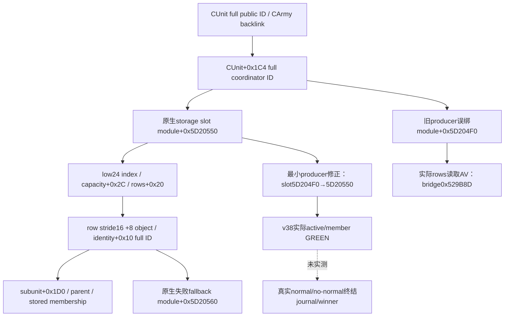

# .3 AI coordinator storage：terminal 实际 AV 的根因

## 2026-10-03T19:50 外国正常终结实际资格

随后 **一次实际terminal查询 GREEN**、正常SDK关闭：journal **event18/latest20** 捕获外国Combat1577058305 **normal_result / terminal_date53238096 / phase3 / winner0**，attacker70766、defender30097、Result1493172226、wipe=false，ordered sides真实保持。当前query日期是raw53238336，终结事件日期另为53238096；prior与result对象已absent、province不含该combat，subject@2640 noactive/backlink，coordinator50331823的successor assignment_reopened，已观察真实正常终结分支，晋级有限 **production-live primitive**。journal内finalized_before=false是当时捕获的旧字段，不据此把当前写成仍active。battle_warscore为not_recorded_by_native/allnull、hard_loss_inputs=null，Robert不在双方，不授伤亡、玩家战分/胜利或完整战斗loop。一次dispatch后mailbox failure0/readytrue、exception0，无save/retry/rearm，增加0日；旧v37真实AV和v38 active/member实际资格保留。[独立真正terminal实际](Z:/ck3_mod_rewrite_process_assets/g2-resume-20261003/runtime-preparation/v39/actual-terminal-after-pursuit-v39-01/result.json)；[单次健康mailbox消费](Z:/ck3_mod_rewrite_process_assets/g2-resume-20261003/v39-terminal-after-pursuit/faultstate/ROOT-DELIVERY.json)

以下旧故障、static fixture、active/member证据保持原阶段事实。

## 2026-10-03T18:02 当前实际资格：v38 active lifecycle 与 foreign AI membership

有限 `production-live primitive` 已在v38/PID107772/source `0ad923525ef899b836a823dfe983db49030789f2` 实机验收：一次terminal查询返回ready/available，Combat1577058305@2640为main/day4、`active_not_terminal`、winner−1/finalizedfalse、journal0/not_observed；subject251658381的真实CArmy167772260 及coordinator50331823、stack/subunit0/0、blockedbyactivecombattrue均实读。相邻快照date53236800保持，query后mailbox failure0/readytrue、exceptioncode0/image none/RVA null，SDK正常关闭，无save/retry/rearm。当前active phase_day与真实foreign helper路径已通过，正常/no-normal终结journal的date/day、winner、人物结果及完整终战loop仍未实测。[完整语义与pins](Z:/ck3_mod_rewrite_process_assets/g2-resume-20261003/v38-terminal-fixed/semantics/ROOT-DELIVERY.json)；[post-query执行器状态](Z:/ck3_mod_rewrite_process_assets/g2-resume-20261003/v38-terminal-fixed/faultstate/ROOT-DELIVERY.json)

修复前封存阶段状态：`static-ready`；当时实际根因已定位，最小producer修复与生产路径回归GREEN，后续v38有限实际资格见顶部。
冻结 CK3 1.20.0.3 / Steam25652598 / EXE SHA
`94B55397ABB687A3DCD436805A5D885E6BE90FA6C693FEB44A9E3BBEEADE02A6`。
旧v37故障部署 source `f42522f7f176ad67b000d66341a17a02a3f82ae7` / `Z:/g39`，DLL SHA
`e6c114d82d31900d0a07bf6c43eb89a26f3fd55e2ffb3a3c9a1b5385af7c4585`。

## 实际生产故障与精确定位

Root唯一terminal-last query保存在
`runtime-preparation/v37/actual-terminal-last-v37-01/result.json`：subject251658381、prior1577058305，
actor29829/same episode/date53236800 paused，SDK normalclose=true，无save/retry/rearm。
initial mailbox failure0/seq16；query后failure512/seq17/readyfalse，异常
`code3221225477=0xC0000005`、`image=bridge`、`rva5413773=0x529B8D`。
这不是 game getter fault；没有返回 phase_day/date/journal，也没有战斗胜利或Robert参战证据。

冻结DLL的.pdata函数范围与同构建COFF object非relocation字节匹配，唯一定位为
`ReinforcementSample` entry0x529880 +0x30D，fault bytes `4C 8B 50 20`：
`mov r10,qword ptr [rax+0x20]`。它是 `Resolve(b.ai_war_coordinator_storage_slot,
CUnit+0x1C4,0x10)` 内 storage rows 直读（battle.cpp19–20/442–444）；已通过public CUnit、
CArmy/backlink，尚未读取subunit+0x1D0或进入route/EXE callback。
无PDB/map，不声称debug行号；source映射由实际指令和COFF函数唯一匹配闭合。
实际RAX、访问地址、coordinator ID值未发布，不伪造这些RAM值。

## 对应原生输入与决策树

既有 exact .3 `war-native-target-ai/slice-01a070f0.asm.txt` SHA
`b3d360e6b15f92afabc2852b8935b840dcda82d1610a8efc510acb415e06c0b5`，378–394行：
`0x1A07730/0x1A07741` 读取真实 coordinator storage slot `module+0x5D20550`；
`0x1A0773A` 读取 CUnit+0x1C4 full ID；low24 index与storage+0x2C capacity比较，
storage+0x20 rows、16-byte row+8对象、coordinator+0x10 full ID校验。lookup失败走
`0x1A0776E` 的 `module+0x5D20560` fallback；fallback不能当真实membership。

生产binder907–908误绑 `0x5D204F0`，旧 `research/ck3_1_20_0_2_battle.json` 的globals也记录该错误值。
generic Resolve布局、CUnit coordinator字段与membership链均与原生一致，修复只纠正slot；
不删AI membership、不跳过foreign subject、不捕获后忽略错误、不新增gate或自动rearm。
`.2→.3 unchanged`证明ABI字节复用，不能证明旧研究对global的语义归属正确。
旧冻结证据和v35/v36/v37 RED原样保留；当前研究账本的global应按已冻结getter改正。

下一步以真实BindBattleImage选择slot的foreign AI-bound fixture复现同一rows读取AV，再验证同布局
修正后真实reader→serializer→既有Python normalizer；生产live仍由Root唯一SDK采集。
外部 `v37-terminal-last/native-rva-map/ACTUAL-RVA-LOOKUP.json`、`actual-01/ACTUAL-TERMINAL-EXTRACT.json`
及source-review提供精确输入；本worker不操作SDK、游戏、窗口、state或Git。

## 最小修复与一次新生产路径回归

唯一生产改动是 `BindBattleImage` coordinator slot `0x5D204F0→0x5D20550`；研究账本同步更正global。
外部 regression `focused-attempt-01/RESULT.json` 首次GREEN：6 TU 并行、/O2 /DNDEBUG /W4 /WX，
Require检查始终有效。新case真正调用 `BindBattleImage`，保留它选择的唯一待测coordinator slot，
其余bindings使用原有byte fixture；reserve原生RVA地址范围，两个slot页放置wrong synthetic storage
与真实fixture coordinator DB。synthetic未commit指针用于重现同一rows读取AV，不声称它是实机RAM值。

baseline选择旧slot，真实production reader于rows+0x20产生AV0xC0000005；修后同一布局选择正确slot，
foreign AI membership=`observed`，coordinator16777223，parent/subunit indices0，真实reader→未改
serializer→现有Python normalizer GREEN。case为空route/helpflags0，无关EXE callbacks未调用；
没有跳过helper或让foreign subject假装player。旧两条phase/date cases不重跑，未整DLL/SDK/窗口/Git。

修复仍为static-ready，不能将fixture active terminal称作本场实际胜利或已获得phase/day/journal结果。
Root保留latest normal h4747/date53236800/count3853 checkpoint并正常stop，下一统一DLL继续真实主线；
fresh paused terminal再验收correct-root foreign membership与actual active/observed结果，始终区别
正常结束journal、仅CombatID消失和人物死亡/捕获。本修复不增加门禁、自动rearm或战争限制。

统一外部回执 `v37-terminal-last/ROOT-COORDINATOR-FIX-DELIVERY.json` 包含UTF-8 LF标准patch、冻结前像、
projected/postimage SHA、真实single terminal-last RED、exactRVA map、nativegetter证据、一次回归与日/周字段。
Root负责共享整合与commit/push；所有旧RED和错误global的冻结历史产物保留。

## 2026-10-03T17:46 v38 修复后真实暂停验收

状态增量：active foreign battle terminal 查询及 AI membership 读回已达 `production-live primitive`。
已实际返回 ready/available 的 active baseline；正常终结 journal 的日期/day、normal/no-normal 分支仍待真实终结，
不因这次成功查询将完整伤亡、人物结果或完整战争 OODA 标为完成。旧 v35/v36/v37 RED 原样保留。

Root唯一 SDK 的 `runtime-preparation/v38/actual-terminal-fixed-v38-01/result.json` 于
2026-10-03T09:46:03.099475–09:46:16.722215 UTC 完成 GREEN：一次 terminal、无 save/retry/rearm、正常关闭 SDK。
冻结 source `0ad923525ef899b836a823dfe983db49030789f2` / `Z:/g40`；DLL SHA
`943ce8ac4cb12a83e9036b313cfd101bd3cfd66afc1c967154d8848da6537fa9`；PID `107772`。
exact-build 由本次 diagnostics hello 的 .3/build-match/SHA 闭合；query source 的 game_version/SHA 为 null，
不能只依赖 query source 的占位字段，完整证据 pins 见下方 sidecar。

001/003相邻快照均 Robert `29829` alive、episode `native-29829-2bc2d599f7f9`、date `53236800` paused。
002查询绑定 fresh public revision `2`、native revision `10`，subject `251658381` / prior `1577058305`；
不是在本次冷进程中默认旧 ID 永远稳定：当前 payload 的 strict resolve、省份战斗列表和 subject 双 backlink
重新证明该 full CombatID 此刻真实存在。

| 字段 | 本次实际结果 | 语义 |
|---|---|---|
| prior phase/day/winner/finalized | `1 / 4 / -1 / false` | 主阶段第4天，赢家未定、尚未终结 |
| terminal kind/date | `active_not_terminal / null` | null terminal date 在当前 active 分支合法；不能将其说成已终结 |
| journal cursor/event | oldest/latest `0/0`、event null、`not_observed` | 当前 journal 未记录此战终结；后续 cursor0传null |
| attacker participants/CUnits | `70766 / [251658381,473,474]` | 实际 attacker stored order |
| defender participants/CUnits | `30097 / [50331920,83886484]` | 实际 defender stored order |
| prior/province/result resolve | true/true/true；省份包含prior true | CCombat仍在@2640，result ID `1493172226`已分配，不能当结束证据 |
| result relevant player count | `0` | 原生结果相关玩家计数；结合两侧数组确认Robert军未参战 |
| subject | exists、CArmy `167772260`、combat backlink/active均`1577058305` | 这是叛军owner70766的CUnit，不是Robert军 |
| subject route/state | 空route、target null、movement raw0、blocked true | 该subject当前被active combat阻挡，raw enum照实保留 |
| AI membership | observed、coordinator `50331823`、stack0/subunit0 | 已穿过真实coordinator full-ID、parent及stored-membership链 |
| successor | `unavailable`、选中ID null | active分支不寻找战后继承战斗；不能写no_successor |
| battle war-score/hard-loss/wipe | unavailable/null/null | 不推算本战归属、永久损失或歼灭 |

两个实际side都是Robert敌军；快照将owner70766列入war50331736 enemy，owner30097/35357列入war16777231 enemy。
Robert军`83886367`不在两侧数组，仍在2610向2604移动，stored route `[2605,2604]`、in_combat=false。
战斗attacker/defender不是Robert的war attacker/defender；本次battle_warscore没有WarID或delta，不能按省份
或快照中的独立战争总分（-38、0）归因该战。

本次真实可用结果关闭了已出现的 active phase_day 漏投影路径，以及 foreign AI coordinator storage
误绑导致的本条真实AV路径。冻结生产source `ck3_12002_battle.cpp:907–908` 绑定`0x5D20550`；
ReinforcementSample425–520验证full-ID、CArmy backlink、coordinator/subunit/parent和stored membership，
TerminalSample803–810仅在该真实helper成功时发布AI membership=observed；不是跳过foreign helper得到成功。
query后的mailbox ready=true/failure0、异常code0/image none/RVA null。v37 live AV RVA5413773/0x529B8D与
诊断fixture RVA23941是不同证据，旧RED不被覆盖。这次没有新动作、日期推进、伤亡结果或胜利信用。

后续沿Root主线以新paused snapshot决定军事动作；此战真正终结后，再用真实latest cursor和当前subject
读取captured terminal event，核对winner、normal/no-normal、removal、WarID/score与subject/successor。
optional hard_loss_inputs为已知未交付观测，不得用null冒充零损失。完整人物死亡/捕获继续依赖真实人物或羁押证据。

纯文件consumer产物位于
`Z:/ck3_mod_rewrite_process_assets/g2-resume-20261003/v38-terminal-fixed/semantics/`：
`ACTUAL-TERMINAL-SEMANTICS.json`、`ACTUAL-INPUT-PINS.json`、`SOURCE-PINS.json`、`ROOT-DELIVERY.json`。
此consumer没有SDK、重新验收、共享source/Git/state或窗口操作；Root负责topic整合和commit/push。

## 2026-10-03T19:43 v39：真实正常终结 journal 与战后状态

本场外国战斗的正常终结查询已达 `production-live primitive`：Root唯一一次terminal请求返回
ready/available，真实journal event18/normal_result、captured date/day、旧Combat删除及战后foreign AI
membership均可读。相较v38 active baseline，这是自然终结后的真实增量；未验收no_normal_result分支，
没有Robert参战、玩家胜利、数值伤亡或完整玩家战斗OODA信用。v35/v36/v37失败记录继续保留。

实际目录：`Z:/ck3_mod_rewrite_process_assets/g2-resume-20261003/runtime-preparation/v39/actual-terminal-after-pursuit-v39-01/`。
result于2026-10-03T11:42:49.343645–11:43:04.603146 UTC完成GREEN，terminal_query_count1，
无save/retry/rearm，normal_sdk_close=true。001/003相邻snapshot均native166/public2、date53238336 paused、
Robert29829 alive/same episode；002绑定fresh revision2。diagnostics PID112516、exact .3/build-match/SHA匹配，
after mailbox ready=true/failure0/exception none、published/completed126。读查询让history total5021→5022，
日期与军事状态不变；这不是新玩家军事动作。

完整逐字段值、ordered sides、subject身份和原始pins保留在本包 [ACTUAL-TERMINAL-SEMANTICS.json](Z:/ck3_mod_rewrite_process_assets/g2-resume-20261003/v39-terminal-after-pursuit/semantics/ACTUAL-TERMINAL-SEMANTICS.json)。subject251658381@2640/CArmy167772260无active/backlink、blocked=false；native AI membership仍observed、coordinator50331823、stack0/subunit0，successor=subject_assignment_reopened、matching[]/selected null，没有继承战斗提交动作。

phase3或敌军撤退本身不能证明正常终结；本次有observed journal与normal_result、captured winner/date，
同时独立读取旧Combat移除、subject backlink清空，因而可确认已经结束。journal的finalized_before=false
是捕获时的字段，不能反向覆盖这个真实终结证据。prior.result对象当前已经删除，也不妨碍被动journal
保留当时ResultID1493172226及双方成员；不能把非空ResultID本身当胜利证据。

攻击方70766的CUnits获本场外国战斗胜利。双方在Robert快照中都属于enemy：owner70766为war50331736
enemy，owner30097/35357为war16777231 enemy；Robert军83886367不在捕获的两侧成员中，仍在2604
sieging、in_combat=false。当前defender军50331920/83886484在2634退向2631/8754；这些是相邻快照的
真实战后状态，不是本consumer执行的动作。subject251658381与473在2640 sieging；474在当前快照未列出，
仅凭遗漏不能认定删除、伤亡或人物死亡。

hard_loss_inputs与snapshot soldiers均null；wipe=false只记录非wipe，不能写零损失。
battle_warscore状态not_recorded_by_native且WarID、row、delta及所有原生值均null；Robert独立战争总分
（-35/0/0）不能冒充此战的战分变化。没有死亡、被俘、骑士或指挥官结果证据。本次真实闭合的是
正常终结date/day投影、历史身份与removal、战后subject/foreign membership查询；其余能力保持既有边界。

consumer交付：`Z:/ck3_mod_rewrite_process_assets/g2-resume-20261003/v39-terminal-after-pursuit/semantics/ROOT-DELIVERY.json`，
附ACTUAL-INPUT-PINS、完整语义及日/周字段。仅消费Root已经完成的五份actual文件，没有SDK、重复测试、
共享source/state/Git或窗口操作。Root继续既定军事主线，中央文档负责人统一topic与报告并记录commit/push。
