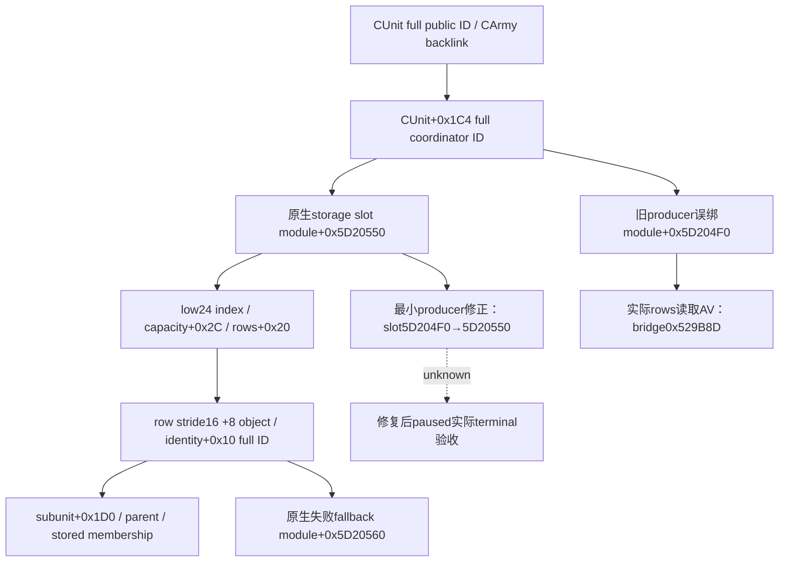

# .3 AI coordinator storage：terminal 实际 AV 的根因

状态：`static-ready`；实际根因已定位，最小 producer 修复与新生产路径回归首次 GREEN，等待新 DLL paused live 验收。
冻结 CK3 1.20.0.3 / Steam25652598 / EXE SHA
`94B55397ABB687A3DCD436805A5D885E6BE90FA6C693FEB44A9E3BBEEADE02A6`。
部署 source `f42522f7f176ad67b000d66341a17a02a3f82ae7` / `Z:/g39`，DLL SHA
`e6c114d82d31900d0a07bf6c43eb89a26f3fd55e2ffb3a3c9a1b5385af7c4585`。

## 实际生产故障与精确定位

Root唯一terminal-last query保存在
`runtime-preparation/v37/actual-terminal-last-v37-01/result.json`：subject251658381、prior1577058305，
actor29829/same episode/date53236800 paused，SDK normalclose=true，无save/retry/rearm。
initial mailbox failure0/seq16；query后failure512/seq17/readyfalse，异常
`code3221225477=0xC0000005`、`image=bridge`、`rva5413773=0x529B8D`。
这不是 game getter fault；没有返回 phase_day/date/journal，也没有战斗胜利或Robert参战证据。

冻结DLL的.pdata函数范围与同构建COFF object非relocation字节匹配，唯一定位为
`ReinforcementSample` entry0x529880 +0x30D，fault bytes `4C 8B 50 20`：
`mov r10,qword ptr [rax+0x20]`。它是 `Resolve(b.ai_war_coordinator_storage_slot,
CUnit+0x1C4,0x10)` 内 storage rows 直读（battle.cpp19–20/442–444）；已通过public CUnit、
CArmy/backlink，尚未读取subunit+0x1D0或进入route/EXE callback。
无PDB/map，不声称debug行号；source映射由实际指令和COFF函数唯一匹配闭合。
实际RAX、访问地址、coordinator ID值未发布，不伪造这些RAM值。

## 对应原生输入与决策树

既有 exact .3 `war-native-target-ai/slice-01a070f0.asm.txt` SHA
`b3d360e6b15f92afabc2852b8935b840dcda82d1610a8efc510acb415e06c0b5`，378–394行：
`0x1A07730/0x1A07741` 读取真实 coordinator storage slot `module+0x5D20550`；
`0x1A0773A` 读取 CUnit+0x1C4 full ID；low24 index与storage+0x2C capacity比较，
storage+0x20 rows、16-byte row+8对象、coordinator+0x10 full ID校验。lookup失败走
`0x1A0776E` 的 `module+0x5D20560` fallback；fallback不能当真实membership。

生产binder907–908误绑 `0x5D204F0`，旧 `research/ck3_1_20_0_2_battle.json` 的globals也记录该错误值。
generic Resolve布局、CUnit coordinator字段与membership链均与原生一致，修复只纠正slot；
不删AI membership、不跳过foreign subject、不捕获后忽略错误、不新增gate或自动rearm。
`.2→.3 unchanged`证明ABI字节复用，不能证明旧研究对global的语义归属正确。
旧冻结证据和v35/v36/v37 RED原样保留；当前研究账本的global应按已冻结getter改正。

下一步以真实BindBattleImage选择slot的foreign AI-bound fixture复现同一rows读取AV，再验证同布局
修正后真实reader→serializer→既有Python normalizer；生产live仍由Root唯一SDK采集。
外部 `v37-terminal-last/native-rva-map/ACTUAL-RVA-LOOKUP.json`、`actual-01/ACTUAL-TERMINAL-EXTRACT.json`
及source-review提供精确输入；本worker不操作SDK、游戏、窗口、state或Git。

## 最小修复与一次新生产路径回归

唯一生产改动是 `BindBattleImage` coordinator slot `0x5D204F0→0x5D20550`；研究账本同步更正global。
外部 regression `focused-attempt-01/RESULT.json` 首次GREEN：6 TU 并行、/O2 /DNDEBUG /W4 /WX，
Require检查始终有效。新case真正调用 `BindBattleImage`，保留它选择的唯一待测coordinator slot，
其余bindings使用原有byte fixture；reserve原生RVA地址范围，两个slot页放置wrong synthetic storage
与真实fixture coordinator DB。synthetic未commit指针用于重现同一rows读取AV，不声称它是实机RAM值。

baseline选择旧slot，真实production reader于rows+0x20产生AV0xC0000005；修后同一布局选择正确slot，
foreign AI membership=`observed`，coordinator16777223，parent/subunit indices0，真实reader→未改
serializer→现有Python normalizer GREEN。case为空route/helpflags0，无关EXE callbacks未调用；
没有跳过helper或让foreign subject假装player。旧两条phase/date cases不重跑，未整DLL/SDK/窗口/Git。

修复仍为static-ready，不能将fixture active terminal称作本场实际胜利或已获得phase/day/journal结果。
Root保留latest normal h4747/date53236800/count3853 checkpoint并正常stop，下一统一DLL继续真实主线；
fresh paused terminal再验收correct-root foreign membership与actual active/observed结果，始终区别
正常结束journal、仅CombatID消失和人物死亡/捕获。本修复不增加门禁、自动rearm或战争限制。

统一外部回执 `v37-terminal-last/ROOT-COORDINATOR-FIX-DELIVERY.json` 包含UTF-8 LF标准patch、冻结前像、
projected/postimage SHA、真实single terminal-last RED、exactRVA map、nativegetter证据、一次回归与日/周字段。
Root负责共享整合与commit/push；所有旧RED和错误global的冻结历史产物保留。
