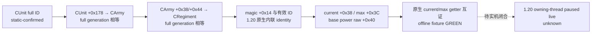
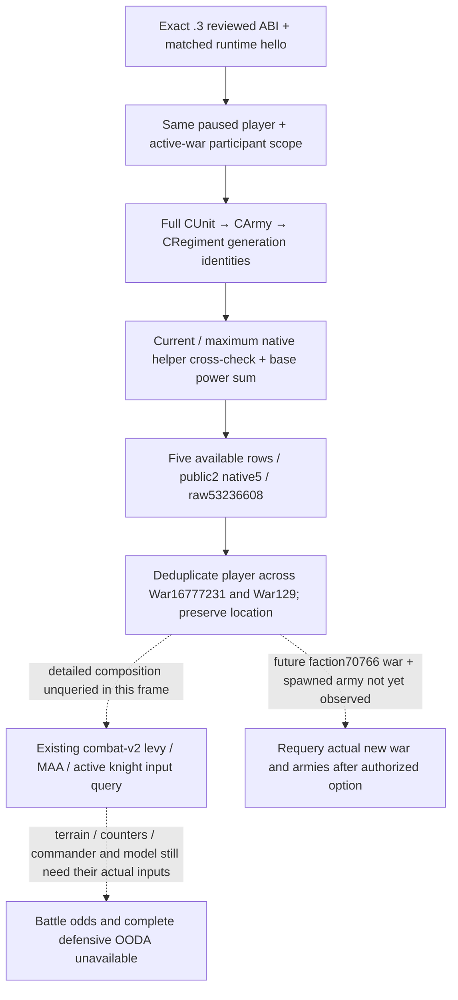

# CK3 1.20.0.2：军队与兵力读取迁移

2026-10-01 后台静态施工。冻结 EXE SHA-256 为 `AE1BA6FF060BA603842F6F4A2DED0AF4B7D3666B3DD271F75FB01B0DA8E81B2D`，Steam build `25588574`。本包只读取磁盘 EXE、构建新版本原生读取器和运行合成对象 fixture；没有读取用户游戏进程，也没有操作、关闭或重启游戏。

状态为 `static-ready`，尚无该版本 paused live artifact。实现位于 `native_bridge/include/xar_bridge/ck3_12002_army.hpp` 与 `src/ck3_12002_army.cpp`；旧 `ck3_11906.cpp` 保持原样。完整 ABI 账本为 `research/ck3_1_20_0_2_army.json`。

| 语义 | 1.20.0.2 精确构建 | 静态证据 |
| --- | --- | --- |
| public CUnit storage | RVA `0x5D1E380`，fallback `0x5D1E378` | `0x296B6E0` 分半军队的源 Unit 解析，从 CArmy `+0x124` 取 full UnitID 并比较 CUnit `+0x10` |
| internal CArmy storage | RVA `0x5D1DE48`，fallback `0x5D1DE50` | Unit state getter `0xD19140` 从 CUnit `+0x178` 解析 CArmy |
| CRegiment storage | RVA `0x5D1F340`，fallback `0x5D1F338` | 当前兵力 `0x2A95740`、最大兵力 `0x24E0450` 与 AI power aggregate `0x2C3E850` |
| storage 布局 | slots `+0x20`，capacity `+0x2C`，slot stride `0x10`，对象指针 `+0x08` | 上述三个原生解析链均包含 low 24-bit 索引和 full ID 相等检查 |
| public ArmySnapshot | ID `+0x10`，省份指针 `+0x20`，owner `+0x174`，internal ArmyID `+0x178` | CUnit 构造器 `0x24AA540`、序列化 `0x24AE160`、源 Unit 解析 |
| 路径和撤退 | route pointers `+0x38`，capacity `+0x40`，count `+0x44`，ProvinceInfo ID `+0x00`；retreat `+0x170` | 原生路径应用 `0x24ABDB0` 和 Unit state getter 的撤退/移动分支 |
| Province 解析 | GameState game data `+0xA0`，province array `+0x140`，count `+0x14C`，Province ID `+0x10` | `0x296B750–0x296B77B`；读取器要求路径省份属于同一原生数组 |
| 兵团列表和数值 | CArmy IDs `+0x38/+0x40/+0x44`；Regiment current `+0x38`，maximum `+0x3C`，AI base power raw `+0x40` | `0x2A957DC`、`0x24E04B4`、`0x2C3E952` |

## 必须实际迁移的变化

1.19.0.6 的兵团 identity 通过 `CRegiment+0x08` 子对象的第二虚函数判断 alive。1.20.0.2 该 vtable 只保留删除析构入口，第二个地址已不再是 predicate；直接保留旧调用会跳向非函数数据。

新版本原生当前兵力与 AI power 读取链把 identity 检查内联为 `CRegiment+0x14 == 0x41725267` 且 `+0x10 != -1`。新读取器照此检查，并在 full-generation 三段解析完成后，将逐兵团 checked sum 与原生当前/最大兵力 getter 比较。调用 flags 为 `0`，因此不触发 troop-type 或特殊分类筛选。原始 AI power 保留 `100000` scale，仍然不是战斗胜率。

Unit state getter 新入口为 `0xD19140`，可以保持原有 1–9 的公开状态语义；CArmy 中 raiding/bartering 的输入已位移到 `+0x1E8/+0x1F8`。本包调用该原生最终 getter，不复制这些内部规则。宗教系统未在本包展开。

## 已实现与验证

`ReadArmiesForCharacters` 的空 owner 列表枚举全部 public Unit；显式 owner 列表筛选。`controlled_owner` 必须由调用者明确传入，避免把第一项盟友当成玩家可控制单位。缺失 storage 返回 unavailable，合法空 storage 返回成功且空数组。

集成补充公开 `ResolveArmyUnit` 与 `ResolveInternalArmy`，复用同一 full-generation 解析实现，供军事命令和 phase controller 使用。`ReadArmyGathering` 调用已验证的原生 Unit state getter，将 code `5` 投影为 gathering；代差或无效状态返回 unavailable。补充 fixture 已覆盖同 slot 不同 generation 的拒绝、正常移动非 gathering，以及 code `5` 的 gathering 判定。

`ReadArmyStrengths` 使用同一 paused snapshot 中玩家及战争双方军队建立去重 scope，保留所有 war ID，并按 player、ally、enemy 的顺序确定重叠角色；逐行读失败返回 `partial` 与具体原因。存在 full ID 代差、非法 Regiment identity、无效数组、负兵力、求和溢出或原生 getter 不一致时，数值仍不可解释。

独立 MSVC 19.51 离线 fixture 已通过：全部 Unit/owner 筛选、public slot identity、完整路线、非法路径省份、current/max/base power 合计、Regiment 代差、1.20 内联 identity、负兵力、求和溢出、原生 getter mismatch、paused 与玩家前置条件、scope 去重及 war membership、合法空 storage 与缺失 storage 的区分、精确 SHA 绑定。artifact 位于 `artifacts/migrations/2026-09-30/post-update-1.20.0.2/build-army-native/out/armyfixture.exe`。

剩余验证必须在 owning-thread mailbox 接好后做该构建的真实 paused snapshot，确认 public Unit、内部 Army、Regiment 与 MCP 序列化一致。离线 GREEN 不提升为 `fixture-live` 或 production live。

## 2026-10-03：1.20.0.3 Robert 当前军力 production-live primitive

此增量只绑定 Steam1.20.0.3/build25652598、EXE `94B55397ABB687A3DCD436805A5D885E6BE90FA6C693FEB44A9E3BBEEADE02A6`。[`ck3_1_20_0_3_abi_reuse.json`](../../ck3_autonomous_player/native_bridge/research/ck3_1_20_0_3_abi_reuse.json)已冻结army/combat调用和布局的精确复用；实际.3 adapter继承现成base-strength与combat-v2 capabilities，`ck3_12002_semantic_adapter.cpp`把两条查询交给application-main。上文.2离线及历史未验收事实保留，不能被改名为.3实机。

ROOT于2026-10-03执行的一次现成`ck3_query_army_strengths`已读到全部五行available：PID119724，public2/native5、`native:5`、raw53236608、Robert29829、episode`native-29829-2bc2d599f7f9`、query_sequence1。前后event23不变，日期增量0，无新日数、选择、战斗或完整OODA信用。原生与Python的读入口已存在，本工作包没有额外旗标或源码修复。

| 现帧范围 | public CUnit | native CArmy | current / maximum | AI base power raw（scale100000） |
|---|---:|---:|---:|---:|
| 玩家，两个战争共用 | 83886367 | 50331794 | 2334 / 2461 | 7588100000 |
| War16777231敌军，当前2640 | 50331920 | 33554713 | 1362 / 1899 | 4663700000 |
| War16777231敌军，当前2640 | 83886484 | 150995083 | 302 / 311 | 1391200000 |
| War16777231敌军，当前3078移动中 | 67109295 | 67109272 | 101 / 101 | 600000000 |
| War129敌军，当前4573集结中 | 16777683 | 457 | 2305 / 2305 | 5986000000 |

当前2640两军合计1664/2210，base60549；War16777231全部已见敌軍1765/2311，base66549；两战全部唯一已见敌军4070/4616，base126409。玩家同一2334人军队不因出现在两条allied数组而翻倍，当前没有独立外部友军。人数/基础power的优势不代表原生contextual预测、胜率、未来援军到达或完整可战能力。maximum也不是额外未集结储备。

详细levy/MAA/knight读取应复用现成combat-v2，不以团数40或basic-power反推组成。当前v3未公告。Hypothetical query要求双方有共同WarID且正确的最终相邻entry；必须先用实际公告的`ck3_execute_step`预览literal取得路线，不能把不存在的`ck3_preview_move_army`当作已注册工具，亦不能混入仅属于War129的军队16777683。Actual-contact query的stored sides仍是实际接战真值；自选数组只表示假设。

真实`strength.source.game_version`和SHA仍null，保留原值；构建身份来自同帧hello的`expected_ck3_version`/`expected_ck3_sha256`及match=true，不伪填DTO。全batch的两次strategic war-entry RED另由专门修复lane保全，当前五军strength GREEN不冒充那些输入已可读。

实读来源及最小consumer：[ACTUAL.json](Z:/ck3_mod_rewrite_process_assets/g2-resume-20261003/war-army-forces/ACTUAL.json)、[ACTUAL.md](Z:/ck3_mod_rewrite_process_assets/g2-resume-20261003/war-army-forces/ACTUAL.md)。consumer绑定原before013、query014、after015三文件SHA，0 SDK/pipe/game/Git操作；独占工作包只写外置projection，ROOT收口进日报/周报及真实commit/push。
