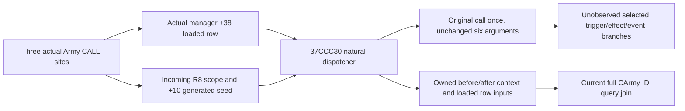

# Army late event dispatcher: actual incoming scope and return observation

This package binds CK3 1.20.0.4, Steam build 25734779, EXE SHA-256
`98702F88A547CDE2EAF29A85F93B85F68EE4CF8148336A4F7AFAEB75319DD518`.
The new journal follows one native dispatcher implementation at `0x37CCC30`
for three actual Army source callers. It never executes an event from a query.

| Source | Actual CALL / return | Actual receiver row |
|---|---|---|
| Positive Army `+1E0` | `2639CF1 /2639CF6` | incoming manager `+38` table, slot `+168` |
| Flag21, positive Army `+1F0` | `2C448F0 /2C448F5` | incoming manager `+38` table, slot `+640` |
| Flag30 late child | `24DD7A0 /24DD7A5` | incoming manager `+38` table, slot `+170` |

The actual manager getter `C58700` reads singleton `5D1F6C8`. Each caller passes
that receiver in RCX, its loaded row in RDX, its already constructed stack
scope in R8, the actual extra parameter in R9, and distinct effect/event
callbacks as stack arguments five and six. Source evidence is the retained
41 `LATE-CALLEE-SOURCE-PROOF.json` and its three exact root source packets.
No scripted stock event name or global definition scan supplies these rows.

The complete dispatcher is 1297 bytes. It returns immediately for null RDX,
calls its row/context gate `37CB450`, and then handles `row+300`, event lists,
`row+310`, and recursive `row+308`. The gate's complete 567-byte source uses
optional `row+2F8` trigger and existing native predicate `372DF10`; its false
return skips the dispatcher body. The complete event children `37CDA20`
(2139 bytes) and `37CD150` (2253 bytes) consume loaded row vectors, callbacks,
and native event/on-action selection machinery. These children are genuine
effect paths. A dispatcher return does not reveal their selected branches,
all script effects, future events, or complete Army transition effects.

`393EE20` is not a definition lookup. Its complete 96-byte wrapper reaches
`39404F0` (131 bytes), which increments the held counter at inner header `+8`,
mixes the counter/header using the actual constants, clears result bit31 and
returns that generated DWORD after the native virtual trace callback. Each
Army caller writes this returned seed at scope `+10`. The observer copies the
actual value; it does not generate another seed. Root construction `889F60`
and named save `373A0F0` are existing qualified inputs, never called here.

The production hook patches `37CCC39`, after the original null branch. Its
14-byte source anchor is `488BC44889581848894808555657`: six complete
instructions without relative or RIP operands. The trampoline executes these
instructions and returns at `37CCC47`. Installation requires the exact build,
the existing primary-thread suspension proof, and the exact source bytes.
Only the three source return addresses create journal records; other calls
and recursive dispatches forward to the original once without being relabeled.
The six genuine arguments, including both stack callbacks, remain unchanged.

Before and after that original call, the observer copies the genuine incoming
scope with the bounded helper from continuation62: root token, DWORD seed,
the 16-byte named-vector header at `+18`, at most 32 physical rows of stride24,
and a second exact header check. Partial copies, truncation and unavailable
values remain visible. Flag21 source-compatible role labels use only the three
actual loaded key slots `5D4C27C /5D4BE20 /5D4BE1C`; they cannot prove the
context builder was called. No second scope is constructed.

The journal records loaded-table equality and raw `row+2C`, trigger, primary
effect, recursive row and alternate-effect pointers. It joins retained entries
to a query's complete native CArmy ID. Queries and serialization read only
owned journal data. The journal has 256 slots and reports overwrites and
unattributed capture failures. Existing before/after data is retained if
another field is unavailable. Capturing a return reports only that return;
trigger results, selected effects, parent predicates and invocation date remain
unobserved. Zero rows do not prove no event fired before installation, through
an uninstrumented caller, through a null definition, or outside retained history.

The new synthetic fixture checks unchanged six-argument forwarding, all three
callers, partial scope handling, query isolation and installer rollback using
owned local memory. Central continuation10 owns its single compile/run. It
does not call CK3, SDK, existing FIRST qualification or existing game fixtures.
Runtime installation and natural observations still require Root's actual
bridge adoption and a separately evidenced runtime. Full daily/monthly
readiness is not granted by this package.
