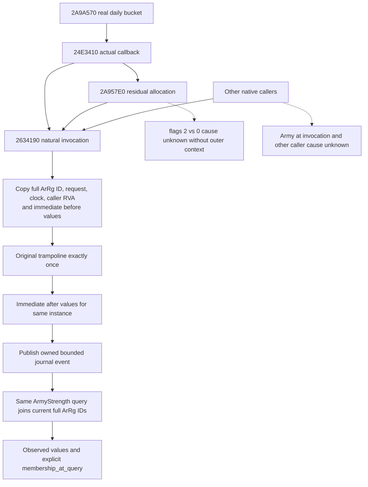

# Actual army loss-writer observations, CK3 1.20.0.4

This work starts from Root source `0b15b77ca03df8405242c15fcf8c42d52e866145`. The exact game is Steam build 25734779, EXE SHA-256 `98702f88a547cde2eaf29a85f93b85f68ee4cf8148336a4f7afaeb75319dd518`, reused from the frozen migration evidence. No game, SDK, process inspection, new EXE read, hash, build or test is performed here.

## Native tree before implementation

The complete actual4 loss writer `[2634190,263448F)` and its selector/store/refresh callees are already closed in [the soldier-effects topic](army-current-callback-soldier-effects-12004.md). That topic's qualified conditional calculation still explicitly reports `actual_loss=false`; it does not record a native invocation. Current ArmyStrength has current counts and loss inputs, but no historical before/after writer observation.

The production path is daily dispatcher `2A9A570`, call site `2A9AB46` → current callback `24E3410` → writer `2634190`. Direct writer return sites `24E35FF` and `24E377C` distinguish the caller's supply-preferred and combined siege/raid-preferred requests. Residual allocator `2A957E0` returns from its writer at `2A958E8`; this return address does **not** distinguish flags 2 from flags 0. Other callers remain `other_writer_caller`; no old county RVA is assumed to be actual4.

The writer ABI is `void(ArRg*, int64 request_raw_Q100000)`: RCX is the actual raised regiment and RDX is the signed raw request. It checks magic `ArRg+14 == 41725267`, full ID `+10 != FFFFFFFF`, and native skip predicate `2634860`. A skipped invocation returns without refresh. An admitted invocation selects DATA rows through `260DB50`, stores raw physical currents through `2657E80`, and refreshes cached raised current/max through `2633320`. There is one common native return at `263448E`.

The first 15 instruction bytes are `4053 4157 4883EC38 81791467527241`: two pushes, a stack adjustment and the magic comparison. They contain no RIP-relative operand or branch. A dedicated absolute-entry detour can displace those whole instructions; it must not patch individual native returns. The existing terminal journal's natural-entry → original exactly once → immediate-return capture is the implementation precedent, not a generic already-registered callback API.

## Smallest useful observation

The owned event records the actual full regiment ID, native invocation date, signed request, caller return RVA and immediate cached current/max before and after. A genuine zero change is an observed result. A skipped, zero-budget or cache-refresh-only invocation must not be converted into a guessed physical loss. No pair of independent paused snapshots is used to invent attribution.

The same wrapper copies the writer's actual DATA-selected physical slots before and immediately after its one original call. It retains signed raw current/max/state and DATA aliases, counts each physical slot once, and exposes incomplete reads separately. `actual_physical_soldier_debit` is the signed sum of each unique physical slot's before-current minus after-current, populated only for complete, stable captures. A genuine zero is present as `0`; a read failure is not zero. Cached raised-count movement and physical current movement remain separate. No extra setter or outer-callback hook is required by this package.

The query joins retained events to **the current query's full regiment IDs**. `membership_basis=membership_at_query` explicitly says this is not an observed CArmy owner at the invocation. The residual stage remains undivided. The clock leaf reuses the existing journal's `game_state_slot → GameState+08` signed int32 read. No read-only query calls the loss writer, runs a forecast, writes real soldiers or changes any existing projection output.

## Source and acceptance boundary

Source evidence is the existing actual4 writer text/JSON and current caller map under `Z:/ck3_mod_rewrite_process_assets/g2-parallel-20261008/attrition-next-stage/` and `Z:/ck3_mod_rewrite_process_assets/g2-parallel-20261007/attrition-supply/current-callback-root-retry02/`. The external implementation packet is `Z:/ck3_mod_rewrite_process_assets/g2-background-20261009/actual-loss-writer-frontier-12004/`.

Root authorized the dedicated owned journal, actual4 binding, same-MCP connection and one new whole-producer → registered-consumer qualification. Root alone builds and runs it. The new fixture must invoke the production wrapper against a deterministic native-shaped source, prove original count one, produce a real before/after decrease and an observed zero, and prove query membership uses whole IDs. Qualification is pending; no previous supply, queue or conditional-loss FIRST is replayed. This source plan claims neither actual live loss nor complete daily/monthly/arrival lifecycle coverage.

## Implemented source candidate; qualification not run

The dedicated `ck3_12004_actual_loss_writer_journal.cpp` binds only the admitted actual4 image and installs the one writer entry detour during the existing suspended-thread `PrepareStartup` path. The typed wrapper forwards the natural original once outside capture fault boundaries, then publishes owned data. The fixed ring retains 512 invocations; overwrite count and oldest/latest retained sequence are published. Each event captures up to 64 DATA records, with actual pointer aliases deduplicated internally and only owned alias indexes crossing the boundary. Truncation, changed DATA or failed reads preserve available samples and leave the complete physical debit absent.

`army_strength_v1_serializer.hpp` reads that owned journal using the row's already-owned `regiment_strengths` full IDs. This avoids modifying the broad `game_contract.hpp`, ArmyBindings, native Army collector or existing calculation outputs. The actual registered tool is **`ck3_query_army_strengths`**: its existing native-driver → strict `war_contract` → Service route preserves the optional `actual_loss_writer_observations_v1` family. The new dedicated Python contract retains signed values, legal zero and partial observations. Old producers omit the family. A configured journal with no matching events returns `events=[]`; this means no retained matching invocation was seen, not a proved zero total loss.

The sole new native producer emits one whole query packet from the production wrapper and production ArmyStrength serializer. Its deterministic typed callback models three consecutive invocations: a seven-soldier physical debit with two DATA aliases to one physical slot, a genuine zero change, and a cached-only increase of five with physical debit zero. A second current row has the same low index but a different full generation ID and receives no events. The sole registered MCP compound consumes that preserved whole packet without rerunning the producer. The fixture callback is not the game EXE and does not prove a live detour fired; actual4 installation and gameplay history remain Root's later live qualification.

Build and execution arguments, exact file ownership and dependency hints are frozen in external `SOLE-FIXTURE-CONSUMER-RECIPE.json`. All new tests, imports, compilation, native fixture execution and consumer execution are **NOTRUN** in this work package. Source/fixture authorship is ready for Root's Native54 qualification; `production-live`, whole daily/monthly loss, unretained history and historical CArmy ownership are not claimed.

## Native55 first qualification, 2026-10-09

The authorship paragraph above records the original NOTRUN handoff. Root subsequently qualified the loss package in **Native55**, using immutable source `1e6d5fa4f6e1696218a730db1dbea8700c81944f` at `Z:/gbs-runtime55-title-loss-root-source`. The actual result is `Z:/g2-native55-build01/attempt01/ROOT-NATIVE55-RESULT.json`; Root sealed the mixed object lineage in `Z:/ck3_mod_rewrite_process_assets/g2-background-20261007/upstream-build-migration/entry-live-fix55/`.

The initial ten-file candidate `e08f2a8b9aa0a00339ea4279aac543b9710b7669` omitted formal CMake registration. Root found that the existing `src/ck3_12002*.cpp` glob did not include the new journal TU; the external incremental recipe did not fix normal production builds. The necessary two-file correction `3e73eded1abf38897b125105799a0c417e836c7f` adds the included `cmake/actual_loss_writer_observations_12004.cmake`: it appends the journal to `xar_ck3_12002_runtime`, registers the new whole executable, and registers the sole MCP consumer with a producer fixture dependency. The whole executable links the same Runtime journal object rather than compiling a second copy. The missing registration and its correction are part of the delivery history, not a loss capability failure hidden by the external build.

Root's **first and only new loss native producer** emitted one whole packet with three writer events in **0.121989 s**, exit 0. It ran at **22:28:34.620705–22:28:34.742689 Asia/Shanghai**. The **sole preserved-packet registered consumer** then passed in **23.252040 s**, exit 0, completing at **22:28:57.995143**. Receipts are `attempt01/logs/loss-native-FIRST.json`, `attempt01/logs/loss-consumer-FIRST.json` and `attempt01/first/loss-registered-consumer/compound/COMPOUND-RECEIPT.json` beneath the build directory. The preserved native packet is `attempt01/first/loss/NATIVE-WHOLE.json`.

The compound receipt records **one** actual `ck3_query_army_strengths` registered call, one Service call, one driver execution and one transport execute-step. It records four row-normalizer entries within that single route, not four tool calls. The native receipt proves three wrapper calls forwarded to three typed local original calls. Physical debits `[7,0,0]` remain separate from cached current deltas `[-7,0,5]`; the aliased DATA records count their physical slot once, and the current same-index/different-generation row has no matching events. The fixture explicitly reports `original_target_kind=typed_fixture_callback` and `native_EXE_invoked=false`.

For the combined Title+Loss batch, Root's canonical production closure is **738 owners: Bridge 299 / Runtime 438 / Protocol 1, 506 unique sources**. Root compiled 451 production objects and two fixture objects using 64 BelowNormal jobs, built a fresh 438-member Runtime archive in about 0.457 s, and linked the new DLL. Root's seal hashed the new DLL once and its metadata once; no old hash, binary copy, old FIRST replay or Game/SDK operation was credited. Those are combined-batch costs, not loss-only compile counts. This documentation step performs no execution or hashing.

Readiness is **static-ready with the connected native whole and registered MCP fixture GREEN**. The natural hook has **not** been exercised in CK3. Actual gameplay loss, complete daily/monthly/arrival history, history outside the retained ring, invocation-time CArmy membership and residual flags 2 versus 0 remain unqualified. `production_live=false`, `actual_live_loss_observed=false`, and **G2 credit remains 0**. The external qualification projection and Oct9/W41 report fields are under `actual-loss-writer-frontier-12004/`; shared reports remain Root-owned.
