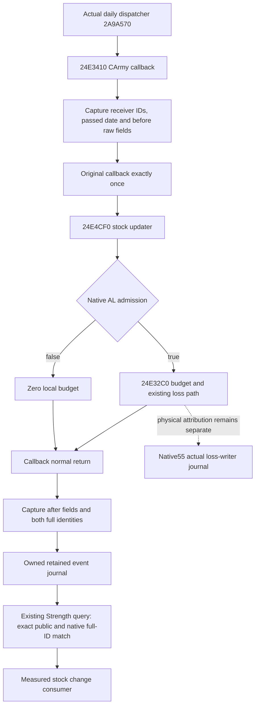

# Actual natural Army supply callback observation — 1.20.0.4

This package observes actual entry and normal return of CArmy callback `24E3410`. It publishes the receiver's supply stock, last supply update date and update byte before and after that invocation. It closes the missing distinction between no matching soldier-writer event and an actual subject callback with a measured stock change. It does not infer physical soldier loss or updater admission from those values.

The exact build is CK3 1.20.0.4 / Steam 25734779, frozen EXE SHA-256 `98702f88a547cde2eaf29a85f93b85f68ee4cf8148336a4f7afaeb75319dd518`. This work reuses that pin and held source; new EXE reads and hashes are zero.

## Source tree and selected observation

The held callback is `[24E3410,24E3A3C)`. Its first 19 bytes are four complete stack/register-save instructions, with no RIP-relative or control operand: `48894c2408 4883ec68 48895c2478 4889742458`. The selected dedicated trampoline copies those bytes, then resumes at `24E3423`. No updater entry patch or RIP relocation is needed. Installation uses the existing suspended startup hook seam; this worker does not install or execute it.

The typed original ABI is `void(__fastcall*)(void* army, const void* date)`. The callback invokes updater `24E4CF0` at `24E3430` and budget function `24E32C0` at `24E343E` only on native updater success. The observation reports the whole callback's before/after stock, without claiming the internal AL result or sole write cause.

| Raw input | Width | Meaning and source |
|---|---:|---|
| CArmy `+10` | signed DWORD | Native CArmy full identity at invocation |
| CArmy `+124` | signed DWORD | Public Unit/Army full identity; existing production Army receiver lookup compares this field to the requested Army ID |
| passed date pointer `+0` | QWORD | Actual caller-supplied CDate bits |
| CArmy `+180` | signed QWORD | Supply stock, Q100000 |
| CArmy `+188` | QWORD | Last supply update date bits |
| CArmy `+22` | BYTE | Supply update byte |

Held updater instructions prove the `+22=1` write, the successful `+188` date store, the signed QWORD ADD at `+180`, and subsequent floor/cap stores. The callback observation measures the net result and leaves cause attribution to the existing source-specific writer evidence.

## Contract and implementation entrance

New optional `actual_supply_callback_observations_v1` is appended to the existing Strength row. Retained events match both `army_id` and `native_carmy_id` exactly, including generation bits. Each event contains sequence, passed date bits, caller return RVA, three optional raw before/after fields, same-instance result and capture flags. Missing fields stay null; a measured zero stays zero. Journal counters are global and are never converted into a subject callback count.

`actual_supply_callback_observation_summary_v1` describes retained matching invocations and complete same-instance stock deltas. A sequence fence can select new events after a previous query. Empty matching events mean no retained matching evidence, rather than proof that no callback or loss occurred. Soldier debit, actual future supply, full monthly execution and complete callback readiness remain unclaimed.

Source plan and the selected instruction receipt are in `Z:/ck3_mod_rewrite_process_assets/g2-background-20261010/g2-natural-attrition-callback-observer/`. `HELD-SOURCE-CLOSURE.json` preserves the selected callback and updater instructions. The original cache locators are `g2-parallel-20261007/attrition-supply/current-callback-root-retry02/actual4_current_supply_loss_caller_24E3410-DETAIL.json` and `g2-background-20261007/upstream-build-migration/army-family-12004/commander-supply/support-first01/support_24E4D10-DETAIL.json` under the same process-assets root.

Qualification is **SOURCE_NOTRUN**. One new compiled whole-fixture → strict normalizer → registered MCP → actual Service compound is prepared for Root's coherent source freeze. This package does not repeat prior qualified cases, the R0086 before/after extraction, or any game query.
