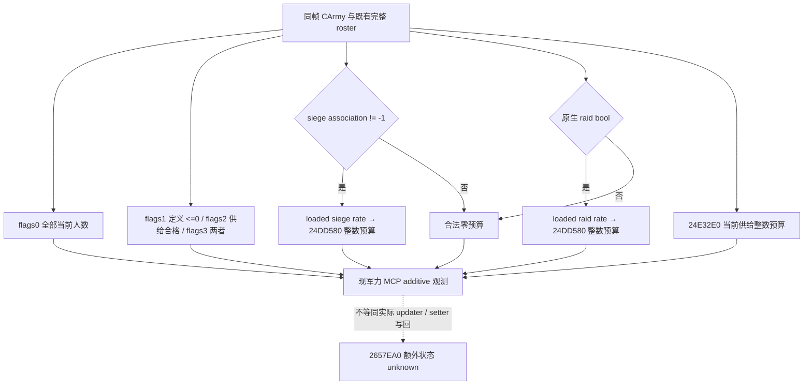
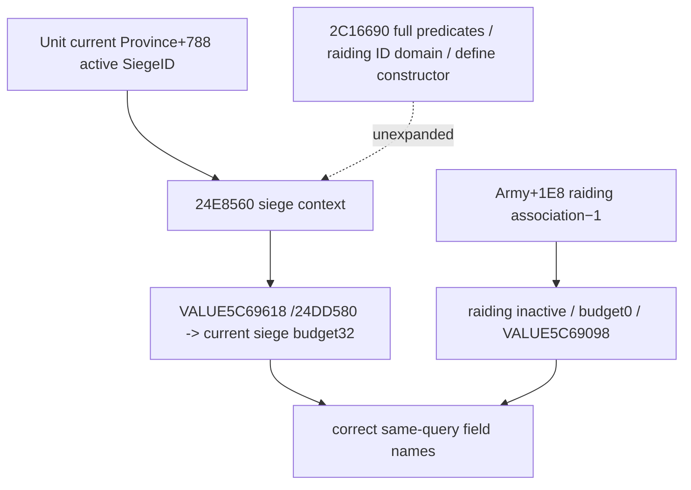
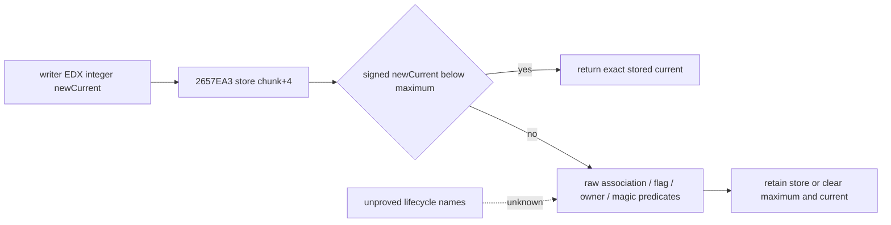
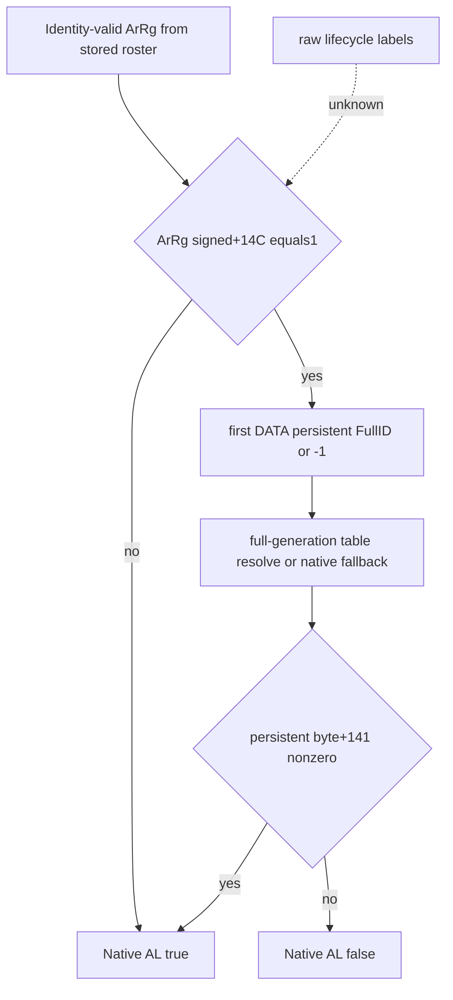
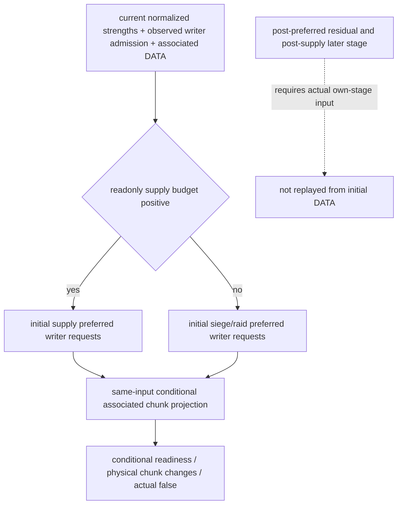
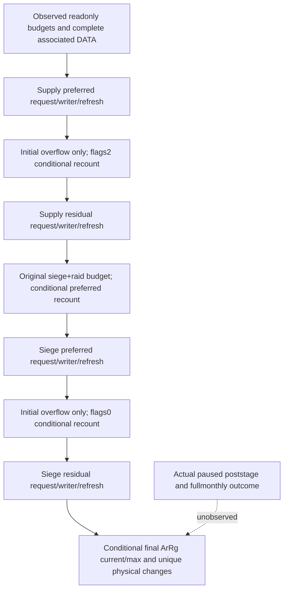
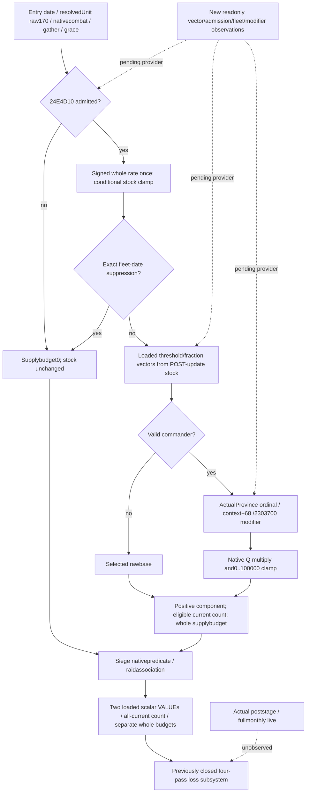
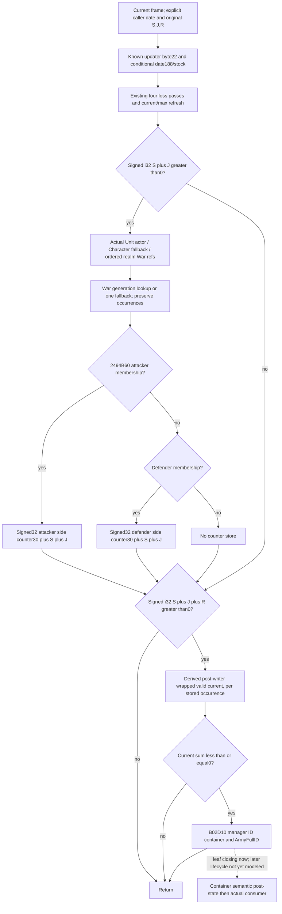
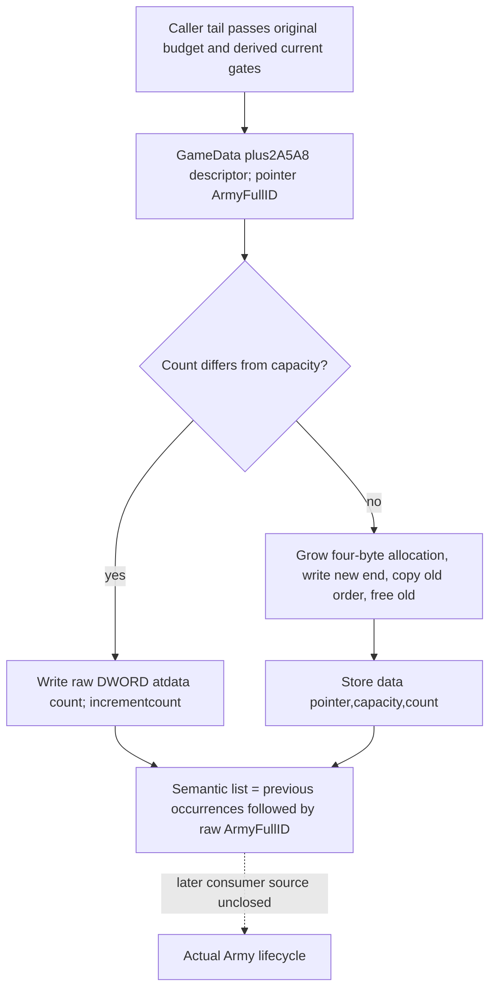
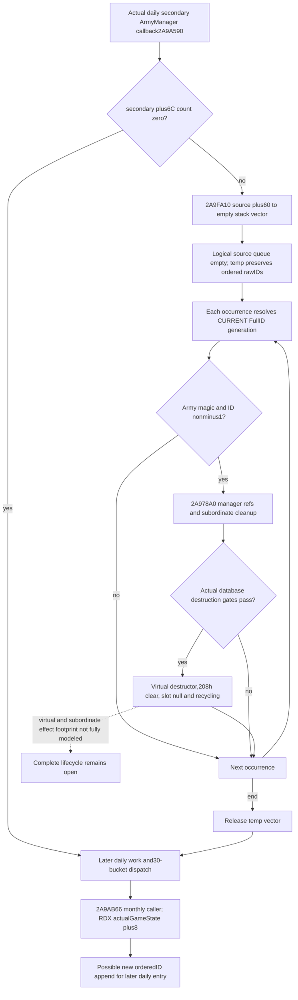

# CK3 1.20.0.3：损耗人数计算与逐兵团写回

2026-10-04，第4期 P0-LOSS 离线增量。冻结 CK3 **1.20.0.3 / Steam build25652598**，本机 EXE `C:/SteamLibrary/steamapps/common/Crusader Kings III/binaries/ck3.exe` 为 101039736 B，SHA-256 `94B55397ABB687A3DCD436805A5D885E6BE90FA6C693FEB44A9E3BBEEADE02A6`。主解释器显式核验为 `D:/workspace/ck3_eternal_recurrence/tools/.venv/Scripts/python.exe` / Python3.14.7 / capstone5.0.9 / pefile2024.8.26。源码阅读 HEAD `563a55c5393086d3b795e7ac8fa7e0fd488d5f01`，未改共享树。

本包闭合**月度损耗执行入口到 ordinary 兵团数量写回的静态链**，并定位独立行军损耗计数入口；不重复已有补给状态表、容量或界面比例 getter。它没有 SDK、进程读取、CK3启动、游戏函数调用、窗口输入、录制、游戏日、策略或 Git ref 写入。静态规则不能替代本期的实际前后人数录像。

## 为什么不能把界面比例直接乘总人数

原生 `0x24E3430` 并不调用 `GetArmyAttritionPercentage` 的最终 getter `0x24E2E50` 来扣兵。它分别产生补给、劫掠、围城的**整数人数预算**，再分配到实际兵团、persistent chunk，最后重算军团总人数。各分量取整、不同资格集合、特殊角色兵团跳过和执行时点都可能使显示比例与实际净人数不形成简单乘法。

原版 `game_concept_attrition_desc` 将损耗解释为逃兵、疾病或饥饿造成的兵员损失。口播使用“损失兵员”更准确，不能将所有损耗都称为“死亡”。两暂停帧的净人数差还可能包含补员、战斗、集结、分合军或其他事件，必须分别排除或记录。

## 实际月度执行链

| 入口 / 输入 | exact 指令事实 | 可以说明的内容 |
| --- | --- | --- |
| `0x24E3430(CArmy*, date*)` | `0x24E3450` 调用 `0x24E4D10`；成功才在 `0x24E345E` 调用 `0x24E32E0` | 补给状态损耗预算的生产依赖真实供给更新成功；补给更新先发生，再读状态比例。scheduler、日期相位及两个anchor由独立补给时钟工作包负责。 |
| `0x24E32E0(CArmy*) -> EAX` | 调用既有 `0x24E4FA0` 得 signed Q100000 供给分量，遍历 Army+38/44 全部实际兵团，要求有效 ArRg 与 `0x2A956D0`；累加各团 whole current+38；`0x24E33FE…3415` 乘比例、向零除100000、上限为eligible人数 | 非负普通输入下，补给预算为 `min(eligible soldiers, trunc0(eligible soldiers * supply component /100000))`。舰队/grace与状态比例复用既有专题；此函数不重新调用最终总比例 getter。 |
| 当前劫掠 | `0x24E3473` predicate `0x24E8560` true，才以 loaded slot `0x5C69618` 调用 `0x24DD580` | 该分量有独立人数取整，不从当前补给状态推断是否劫掠。 |
| 当前围城 | Army+1E8不等于−1，才以 loaded slot `0x5C69098` 调用 `0x24DD580` | 判断依据是当前围城关联ID；原版 `NSiege.MONTHLY_ATTRITION=0.01` 是数据基线，运行期loaded值未在本包读取。 |
| `0x24DD580(rateRaw, CArmy*) -> EAX` | 累加全部有效实际团 current+38，将rate clamp到0…100000，再乘总量、向零除100000，结果不超过总量 | 劫掠与围城分别按当时整个Army的whole总量算整数预算。两项都在实际扣除补给损失之前计算。 |

实际分配分两轮。第一轮处理补给预算；第二轮处理预先计算的“劫掠预算＋围城预算”。第一轮先选 definition receiver `ArmyRegiment+0x18` 的 integer+2A0≤0、且 `2A956D0=true` 的有效实际团；第二轮先选该+2A0≤0的有效实际团。**+2A0字段的语义名字尚未证明**，本包只说明它是实际筛选条件，不能自行叫它“免损耗”或“无敌”字段。

各轮先求筛选集合剩余whole人数，限制本轮可分配预算，再按Army中的团顺序做 `trunc0(regiment soldiers * remaining budget / remaining eligible soldiers)`；调用 `0x26341B0(regiment, allocated soldiers*100000)` 后，从剩余预算和分母中分别扣去本次整数损失和该团的前态人数。供给轮残余调用 `0x2A95800(Army+38, remaining soldiers, flags=2)`，劫掠/围城轮残余用flags0。flags2只要求 `2A956D0`，flags0不加这个条件；fallback不能误写成再次使用前一轮完全相同的筛选集合。

在非溢出的普通游戏人数域内，上述整数算术不会保存“0.4名士兵”到actual current。算术例：假设199名普通合格兵、供给分量5%、围城1%，两个预算分别为9和1；将界面合计6%统一取整则是11。这只是解释取整差的**假设算术例**，不是本期军队实测，也不能替代带人物/日期的正式画面。

## 兵团、record和chunk的数量写回

`0x26341B0(CArmyRegiment*, lossRawQ100000)` 核对ArRg magic/FullID、跳过 `0x2634880` 判定为合法角色兵团的对象，并跳过current+38=0的团。角色判定解析ArmyRegiment+148的FullCharacterID；这不是所有实际団都会扣损失的统一规则。

该writer从ArmyRegiment+20读取data-record数组，+2C为count，**record stride=0x10**。`0x260DB70(record*)` 用record+8的persistent Regiment FullID做generation回读，再读record+C的chunk index，返回 `persistent +0x18 + index*0x24`。这同时闭合了旧首record专题中尚未证明的stride；本包未修改已有reader，也未宣称全部records已实机读取。

ordinary chunk的current是+4，maximum是+0，state是+18。writer在chunk顺序中限定当前数量和剩余损失，向零除100000后调用 `0x2657EA0(chunk, newCurrent)`；setter的 `0x2657EA3` 实际写 `chunk+4`。普通非负且预算为整数的情况下，record顺序依次消耗剩余损失，不能描述成对每个chunk都统一乘界面比例。

存在明确特殊支路：state=3且current=0时，计算有效数量改取maximum，写回起点仍取原current；writer另有第二轮record访问兜底。该state的游戏语义和全部特殊兵生命周期未在本包证明，不把ordinary规则外推到特殊分支。拒绝合法角色兵团与零record等支路也意味着“整数预算”不必等于最终army净减少值。

writer末尾调用 `0x2633340(CArmyRegiment*)`。refresh按相同16字节records解析persistent/chunk、合计current与maximum，`0x26338C0/38C3`分别写回actual+38/+3C；另有合法角色兵团的特例。新增观察口只需复用现Strength循环已读的FullID/current/max，不必先实现完整补员预测。

## 独立的行军损耗入口

当前stock `NArmy.COUNTY_MOVEMENT_ATTRITION_PERCENTAGE=0.05`、`MINIMUM_COUNTY_MOVEMENT_ATTRITION=100`；英文概念提示限定从敌对county进入另一敌对county且目标不邻接已控制county。**这些数据不是任何移动都扣5%或至少100人的无条件规则。**

exact `0x24E2400` 按来源/目的对象及actor条件调用 `0x24E2250`，通过后调用 `0x24E6670(CArmy, null)`产生行军损失人数，再使用同一 `26341B0` 写回。`24E6670`内部先由 `24E6590`得到当前比例输入，再由 `24DD9C0`得到minimum项的modifier输入，以whole总人数计算并向零取整，选择比例项与minimum项较大值，最后限制到当前whole人数。当前native modifier输入和所有邻接/actor谓词的游戏语义仍有具体缺口；不在本包把两常量写成所有主案的最终值。

该链独立于月度总比例getter。沿路线看见“当前损耗率0”，不能据此排除刚发生的county跨越损失。本期先做驻地实验隔离该分量，再在路线实验逐次记录实际到达和人数。

## 本期最小采样与可说范围

第一段使用驻地、无战斗、无集结、无分合军、无参军离军的有限窗口。Root冻结主案后保存start，读同暂停帧date/native revision、CUnit/CArmy FullID、commander、province、空route、combat ID/state、siege关联和gathering状态，再读stock/capacity/month-change/attrition与全部actual团 `{army_regiment_id,current_soldiers,maximum_soldiers,scale:1}`。连续原生录像跨一次实际损耗执行，保存紧邻前后快照与正常after save；通过补给时钟包定位真正结算日，不假定月首。

如果补员不能完整排除，口播只报告“这个窗口净少了X人”，并说明当前比例与实际净变化的区别。首record的两个permission bool保持独立；首record false、某一chunk false、whole persistent月fraction或UI补员开关都不能单独证明整个Army当日没有补员。三方案结果表可以保留实际净人数，不必等全军未来补员公式闭合。

机制因果的证据等级分别为：本包静态链；新读取的当前原生字段；无混杂的实际转移或独立回放对照。只有最后两者进入本期的具体人名/日期/损失数字。录制窗口出现战斗、分合军、gathering、兵团身份集合变更或其他数量事件时，停止单因果叙述并保留attempt；不因此把原片改写成没有发生该事件。

## 证据与未完成项

本包的小型精确切片、源码文档快照、stock取证、图表和delivery位于 `C:/ck3-war-episode04-research-20261004-a01/loss-cause/`。最早只读输出和失败环境/字符编码回执保留在 `D:/ck3-war-episode04-research-20261004-a01/loss-cause/`，未删除或覆盖旧原始切片。历史Z盘研究根本机不存在；本包重新核验当前同SHA EXE并保存自己的有界切片，不制造同名历史替代文件。

| 精确范围 | 新切片文件 | bytes SHA-256 |
| --- | --- | --- |
| 24E32E0..24E3425 | `supply-loss-count.bin` | 2440ecf4047b3c54c9b8273034b018cc82b93d5296183bc8f5309ea5a7c070af |
| 24E3430..24E3A5C | `army-loss-executor.bin` | 7fda4144c5b8015aad9cac8ff059ee79e4895a9e4d5f1da155efc04f24db5bed |
| 24DD580..24DD64F | `rate-to-loss-count.bin` | 0bce03f6d9c921ba50cf40c1fb94946b4b46e8f7d550df4a404a8b143228ff8a |
| 26341B0..26344AF | `regiment-loss-writer.bin` | c88e413b22c0676821267b730251bacd1910432196ba95d9bd665fe771d4a390 |
| 2657EA0..2657F0E | `chunk-current-setter.bin` | 8101e3c101bb81cb321d1beb721bbddc91b47f863750d3aa4a3881a2256bbcac |
| 2633340..2633AE0 | `regiment-strength-refresh.bin` | 1b25b700b5bb5281b98d2a5f9613c27a873266bebbcbf5341fe76fac8027de1d |

`0x24E3425`是前函数return后的INT3 padding；供给updater的 `0x24E3450` 是call-site，完整执行入口为 `0x24E3430`。旧耗尽专题把3425称“dispatch around”的表述仅是历史locator，不可继续作为精确调度依据；独立补给时钟包给出实际scheduler。

`open_kaishek`本机checkout `D:/workspace/open_kaishek` commit `890b32de49081b7b5510e40c5518dfb59d5c8a6d`。本步骤为 `not-applicable`：研究对象是exact EXE中的Army/chunk原生写回及tick转移，现可读README限定Paradox parser/validator/strict IR/finite白名单runtime，没有此原生二进制执行语义或1.20.0.3 Army模型；没有提供或运行fixture/corpus，不用其成功代替native研究。记录检查命令及不支持项，不重复跑无覆盖目标的预验。

剩余项明确为：Root的主案连续人数观测与排混杂；运行期loaded rate/table、两anchor及真实日期节奏（补给时钟包）；行军上下文谓词和modifier最终返回值；特殊state3/character或零record等全部生命周期。普通驻地因果实验与A/B/C拍摄仍可推进，完整原生AI地点评分和调度不是本包门禁。

可复用依据：[当前补给与比例](army-current-supply-capacity-attrition-12003.md)、[补给状态与更新](army-supply-depletion-update-and-state-12003.md)、[补员及两类Regiment](army-regiment-replenishment-raised-reserve-12003.md)。日/周报告记本包 `exact-build-static-chain`；新增游戏天、动作、SDK、录制与live cases均为0，P0-LOSS静态执行链推进，整项实机验收仍pending。

### 2026-10-05：围城/劫掠同输入整数损耗观测

Exact CK3 1.20.0.3 / Steam 25652598 / EXE `94B55397ABB687A3DCD436805A5D885E6BE90FA6C693FEB44A9E3BBEEADE02A6`。闭合 source tree 和 ABI 位于 `Z:/ck3_mod_rewrite_process_assets/g2-resume-20261003/army-supply-attrition/raised-siege-attrition-quarter-v68/native-loss-tree/ROOT-DELIVERY.json`（SHA `42a0ba7a9dabd2437c647c4d1b3cf30f3e3abd0093212935c12bb25df9586cf2`）。`24E3A4D` 是恢复寄存器的 epilogue，不是 quarter/carry；setter `2657EA0` 内部额外状态仍未查明，不推定偏移。

`24DD580(int64 rate VALUE RCX, CArmy* RDX)` 累计全部有效 ArmyRegiment 当前人数，将率 clamp 到 `[0,100000]` 后乘除并截断成整数兵员。围城由 `CArmy+1E8 != -1` 激活，载入率位于 `5C69098`；劫掠由 `24E8560` 原生 bool 激活，载入率位于 `5C69618`。独立整数预算不可由 UI 总 attrition fraction 相加后一次取整替代。`24E32E0(CArmy*)` 是只读当前供给损耗预算，不调用 updater、不写库存/anchors；实际月结路径先成功更新 supply，再计算并分配预算。

已备妥的静态候选在同一 `ck3_query_army_strengths` 增加 `loss_application_inputs_v1`：原生 siege/raid 活动状态、载入率、全军人数、`2A95740` flags 1/2/3 的三个筛选人数、当前供给预算及 siege/raid 独立 wholeloss 输出。兵员 scale 1、率 scale 100000；`definition_le_zero` 只命名原生定义 `+2A0 <= 0` 比较，不推断单位类别。既有 update clock 与 Full DATA 保留，readonly consumer 原样保存这些值，不另造净损失模型。预算是同帧输入下原生只读值，不证明实际 updater 执行、最终 setter 写回或未来净兵数。

R36 已缓存实际主军 `3480/3878`、40 regiment、attrition `.01`、monthly supply `0`、sieging；R35→R36 的 `−35/−6/−1` 只记观测，尚未用新增字段取得同帧 actual，不能归因为某一损耗链。本包接线当前为 static-ready；此次 primitive 的 production-live 验收待 Root v64 部署后唯一新真实 army query，fixture 数据不冒充 actual，工作包新增游戏日为 0。

唯一新增的 production-path focused case GREEN：编译/链接退出0（5.089s），NativeReadArmyStrengths→serializer 退出0（0.116s），registered MCP→NativeDriver normalizer→readonly provider 在 `-B -O` 下退出0（4.651s）；四个 flags 各调用一次，用例 typed rate VALUE1000 得 siege budget34，supply eligible80 / supply budget0，raid inactive / budget0。
该唯一用例复用真实 reader、serializer 和消费入口，但这些输入是 fixture 数据；Root v64 部署后的真实 paused army query 仍待完成，本包不授予新增 production-live primitive、实际扣兵归因或游戏日信用。

## 2026-10-05：R37 首次 paused loss-input 观测（primitive）

本节只消费父协调者派生的 [QUALIFIED-FIELDS.json](Z:/ck3_mod_rewrite_process_assets/g2-resume-20261005/army-loss-r37-actual/QUALIFIED-FIELDS.json)，SHA-256 `def7c4e99f74909e7b1fff4ea4297878ed27a81f690c6b980be2a20356165ed8`；没有读取原 013 或 owner cache，没有 SDK、实机动作、fixture 重跑或新增游戏日。

| 来源层 | 保留的证据 |
| --- | --- |
| 外层 Root runtime 来源 | `R0037` / `g69` / source `a14f3c5fab2079956ddccb7b614d5e3aa41d9bbc` / PID `136112` |
| native source literal build 字段 | `game_version=null`、`executable_sha256=null`；不以外层绑定填入 |
| 同 paused 查询帧 | snapshot `native:3`；native revision `3` / public revision `2`；date raw `53258808`；query sequence `1` |

`query-army-strengths-v1` 本次整体与 scope 均为 `partial`。三个可用 loss domain 的实际计数与原生预算如下；计数/预算单位为整士兵（scale1），列名 `definition_le_zero` 只表示原生 definition filter，不补游戏类别解释。

| ArmyID | whole | definition_le_zero | supply_eligible | definition_le_zero_supply_eligible | supply / siege / raid 预算 |
| --- | ---: | ---: | ---: | ---: | --- |
| 301989997 | 3378 | 3378 | 3378 | 3378 | 0 / 0 / 0 |
| 184549452 | 3000 | 3000 | 3000 | 3000 | 0 / 0 / 0 |
| 268435597 | 2981 | 2961 | 2981 | 2961 | 0 / 0 / 0 |

三个可用行的 `siege_association_id=-1`、`siege_active=false`、`raid_active=false`；已读到的 `siege_rate_raw=raid_rate_raw=1000`（fraction scale100000）与合法 inactive 预算 `0` 分别保留。mode=false 时没有调用 active siege/raid whole-loss 路径，不能把加载标量0.01乘人数当成本帧实际 debit。

第4行 ArmyID `83886508` 是 health `unavailable / native_carmy_not_found`，native CArmyID及兵力 aggregate为 `null`；loss 字段实际缺席，派生展示值为 `null`，不填任何预算0。

本次仅取得 **production-live primitive**：三行当前 inactive loss 输入、过滤计数和供给预算。active whole-loss 路径仍只有 source+fixture 验证；没有激活分支的实机后态、完整损耗循环或新增保存日信用。当前预算0不能归因过去主军−34的净变化，也不能预测未来净损失；setter `2657EA0` 额外 lifecycle/carry 仍未闭合，没有已证实 offset。

### 2026-10-05：R38 实际围城揭示 siege/raid 标签反置

R38 主军301989997→CArmy201326670、native40/public2/date53259768/seq2 的旧 observer 显示 `siege_association_id=-1`、`siege_active=false`、`raid_active=true`、`raid_loss_budget=32`；独立 occupation 已观测P470 / Siege503316504 / besieging3210。已封 exact .3 原生树证明这是组件标签反置，receiver 和整数预算未被该差异证明错误；本节撤回本文及旧 native-loss/attrition-state 树中相反的分支名字，历史 archive、actual 原字节与数值保留。

| 原生输入 / 已闭调用 | 正确字段与配对 |
| --- | --- |
| `24E8560(CArmy*) ->AL`：Unit+20 Province+788有 FullSiegeID，retreat+170<=0，再 `2C16690(CArmy,Province)` | `siege_active`、rate VALUE `5C69618`、`siege_loss_budget` |
| `int32 CArmy+1E8 !=-1`：既有迁移/reuse 已证 raiding 输入 | `raid_association_id`、`raid_active`、rate VALUE `5C69098`、`raid_loss_budget` |

因此 R38 历史字段 `raid_loss_budget=32` 的真实分支语义是**当前围城预算32**（`trunc0(3210*1000/100000)`），不表示实际已经扣32人；+1E8不是当前 FullSiegeID，独立围城ID来自 Province+788。R37 三行 inactive0、filtered counts/current supply budget0 及第四 missing-loss 行保留原数值与 partial 边界，旧 component 名字不再称已精确验证；这些零值不能解释以前主军−34。此前把 war-side+30贡献称“raid+supply、排除siege”的语义亦撤回：实际24E8560分量属于 siege，即 siege+supply、排除raiding；不因此新增净损失归因。

纠正源候选现为 static-ready；唯一生产 reader→serializer→registered MCP 回归 GREEN（native 16 checks），目前尚未 Root v66 部署后的真实 paused query；本段不冒充纠正后 actual 或 applied-loss 验收。原生 cause/tree/最小施工入口见 `Z:/ck3_mod_rewrite_process_assets/g2-resume-20261005/army-loss-r38-branch-truth/native-semantics/ROOT-DELIVERY.json`（SHA `7a7fd76ccc91f05573f2e5329eb3a85bc07fb7094014ab4bc352d4db1553b2f4`）；loaded scalar 的分支角色已闭，命名 defines 的 constructor 绑定与 setter2657EA0额外 lifecycle/carry不在此扩展。本包仅追加本专题 EOF，0新增游戏日、SDK、fixture重跑、共享修改或Git。

### 2026-10-05：R39 修正标签与 resolver 的首次真实 paused query

R39 / v66 / g71，Root 冻结源 `cd0acf19`、PID `126252`；唯一军力查询为 `runtime-preparation/v66/root-results/actual-main-readback-01/005-ck3_query_army_strengths.json`（SHA `a5bddeaccf218acb1ec990697498f1b7e4c03133422119ec928125a6309a7da6`）。真实返回 accepted / status / scope_status 均为 available，query sequence `1`、snapshot `native:3`、native revision `3`、public revision `2`、raw date `53259768`、paused=true。原生 source 的 game_version / executable_sha256 仍为 literal null；以上 Root 外层运行绑定单独记录，未反填原生字段。

| 当前军团 / CArmy | 当前人数 / 上限 / regiment | supply / capacity | 月供给变化 / attrition | 围城 / 劫掠 / 供给整数预算 |
| --- | --- | --- | --- | --- |
| 主军 301989997 / 201326670 | 3210 / 3874 / 39 | 293.63637 / 300 | 0 / .01 | 32 / 0 / 0 |
| 守军 184549452 / 167772208 | 3000 / 3000 / 24 | 100 / 100 | +20 / 0 | 0 / 0 / 0 |
| 敌军 268435597 / 184549476 | 2981 / 4702 / 41 | 292 / 300 | −5 / 0 | 0 / 0 / 0 |

主军的修正 wire 实际为 `raid_association_id=-1`、`raid_active=false`、`siege_active=true`；native unit state 为 `3`。loaded siege / raid rate 均为 `1000 / 100000`。这次真实触发 `24E8560` 围城判断及 `24DD580` 当前输入整数预算，发布到正确的 `siege_loss_budget=32`。修正标签与活跃预算 primitive 已达 production-live primitive，预算32不是已扣32人、未来净损失或过去兵数变化的因果证据。原 R37/R38 错标签 archive 原字节保留为 legacy；setter2657EA0额外 lifecycle/carry 未在此扩展。

新 `native_army_resolution_v1` 的本帧三个 resolved 分支与未触发失败分支边界，由 ArmyReinforcement 在 [补员与 raised/reserve 专题](army-regiment-replenishment-raised-reserve-12003.md) 另行记录；本专题仅引用当前 CArmy 身份，不重复该诊断 primitive 的验收。

compact 缓存为 `Z:/ck3_mod_rewrite_process_assets/g2-resume-20261005/army-loss-r39-corrected-actual/COMPACT-CORRECTED-HEALTH-CACHE.json`（SHA `831a56ee162297dbd2d7657836c24d5d811b4bca101df95955e01a461c467213`）；完整选定 body 缓存已交 ArmyReinforcement 独立 diff/report，禁止其重复读取原005。初次 decoder 因 content.text 与 structuredContent 双副本触发 HARNESS_RED，且在断言前未留 buffer；修正后完成唯一成功解码，原 buffer 总读取2次如实保留。此 harness RED 不是 native capability RED；未新增 SDK、游戏日、动作、测试或窗口操作，既有唯一生产回归直接复用。

### 2026-10-05：R39 正常 24 日后的独立当前军力

Root 正常 `20302` 批次 CLOSED GREEN 并已记 24 日；随后 `38425` 查询 CLOSED exit0 GREEN。新原叶 `Z:/ck3_mod_rewrite_process_assets/g2-resume-20261005/r39-after24-actual-readback-01/006-ck3_query_army_strengths.json`（SHA `2070228656153c36eaaf118df252915348ccd67ace23e0dd9457f564d825c363`）由军需 owner 一次完整缓存。实际 query sequence `2`、snapshot `native:103`、native revision `103`、public revision `2`、raw date `53260344`、paused=true，三个 scope row 均 available；外层继续 R39 / v66 / g71 / `cd0acf19` / PID126252，原生版本与 EXE SHA 的 null 原样保留。

| 当前军团 | 人数 / 上限 / regiment | 对前帧人数净差 | supply / capacity | 当前月变化 / attrition | 当前围城 / 劫掠 / 供给预算 |
| --- | --- | --- | --- | --- | --- |
| 主军 301989997 | 3178 / 3874 / 39 | −32 | 293.63637 / 300 | −1.81818 / .01 | 31 / 0 / 0 |
| 守军 184549452 | 3000 / 3000 / 24 | 0 | 100 / 100 | +20 / 0 | 0 / 0 / 0 |
| 敌军 268435597 | 3045 / 4702 / 41 | +64 | 285 / 300 | −10 / 0 | 0 / 0 / 0 |

主军当前仍 `raid_association_id=-1 / raid_active=false / siege_active=true / unit_state_raw=3`；人数上限与 regiment 数不变，实际库存不变，当前月率从0变为−1.81818，整数围城预算从32变为31。独立实际人数净减32与前帧预算数值相同，但查询没有提供 setter 执行轨迹，不能据相等归因纯损耗、证明预算已扣或预测下一期净减31。敌军独立实际净增64、库存减7、当前月率−5→−10；这些差值同样不由当前 rate 或 budget 单独归因。其当前 `unit_state_raw=2`，本口不提供 battle ID/side，前帧移动边 ETA 不沿用到本帧。

三个 `last_supply_update_date_raw` 分别为主军 `53260080`、守军 `53260032`、敌军 `53260224`，均较前帧锚点前移720 raw小时。当前 day index `394181`、selected phase `11`，三个 army bucket 为 `0 / 28 / 6`；锚点变化可观测，当前暂停帧不据 phase 推定即时执行。三个 resolver 仍 available/ready/resolved，原生预算与损耗标签沿用已获得的 production-live primitive 资格。

完整 health/FULLDATA 缓存已交 ArmyReinforcement 独立 diff；本专题只保留当前损耗与供给输入。compact 为 `Z:/ck3_mod_rewrite_process_assets/g2-resume-20261005/army-loss-r39-after24-actual/COMPACT-AFTER24-HEALTH-CACHE.json`（SHA `48980e0bf75947732f12648d8fd04e8a3faf6e04da002c8909d1fbc035cb2bd8`）。旧 R38 错标签、R39 首次 decoder HARNESS_RED 与原005两次 buffer 读取继续保留；新006实际仅一次 buffer 读取。本消费不新增 SDK、测试、动作或游戏日；母批次累计 `4834 / resume1681 / Oct5+176` 由 Root 记账。

### 2026-10-05：R40 同一补给与损耗口的缓存复用

CommanderObserver 唯一读取 R40 原军力叶后封完整缓存；军需只消费该缓存一次，未重复读取原叶。真实 paused `raw53260776 / native:3 / native3 / public2 / seq1`，三个 scope row 均 available；外层为 `R40 / g72 / PID110616`，原生版本与 EXE SHA null 原样保留。主军仍 `3178/3874/39reg`、补给 `293.63637/300`、当前月率 `−1.81818`、attrition `.01`、`raid_association_id=-1 / raid_active=false / siege_active=true`，当前围城/劫掠/供给预算 `31/0/0`；这些值与 R39 after24 基线一致，保留 production-live primitive 资格，不把预算解释为已扣兵。

守军仍 `3000/3000/24reg`、供给100、月率+20、attrition0。敌军 `3045→2759`（独立人数净−286），上限4702、41reg与库存285不变，当前月率 `−10→+15`、attrition0、当前三预算0；`unit_state_raw=2` 但本口没有 battle ID/side，不从这次查询归因区间损失或认定具体战斗。三个 gathering 均 not_gathering/ready=true；主军缺额696、守军0、敌军1943，缺额变化不冒充已实现补员预测。

当前 day index394199/selected phase29，三军 bucket0/28/6；main/enemy 的 last_supply_update_date_raw 仍为 `53260080 / 53260224`，距当前分别696/552 raw小时，守军锚点 `53260032→53260752`、距当前24 raw小时。仅记录当前时钟与锚点变化，不把暂停帧 phase 当 updater/setter 执行轨迹。当前 movement progress 三行均 not_applicable、ETA null，不沿用旧移动边ETA。

军需派生 compact：`Z:/ck3_mod_rewrite_process_assets/g2-resume-20261005/army-loss-r40-cached-trend/COMPACT-R40-HEALTH-LOSS-CACHE.json`（SHA `123a25d82a9829216f7fc7346ee7c3015e98f0321f6378fee594fad751b64699`）；完整源缓存由 CommanderObserver 持有。单位类型库存与省供给/K保持独立；本次供给值直接来自 health 字段。R39 after24 之后18正常日由 Root 已计至4852，本缓存消费新增0日、0 SDK、0测试、0窗口操作；既有失败 archive 与唯一生产回归保留、不重跑。

### 2026-10-05：v69 同帧前后与独立健康趋势

CommanderObserver 独占原始军力读取；军需只消费其 v69 比较派生与 AFTER health 派生各一次，原始、完整 composition、v68 缓存均未重读。真实 paused `raw53262288 / native:3 / native3 / public2`，前后 query sequence `1→2`，四行已发布字段 diff0；overall/scope 为 partial：旧三军 health available，新 public `285212713` 为 `native_carmy_not_found / native_carmy_id=null / reference_absent(-1)`，health null且损耗/供给对象缺省均不补0。原生版本与 EXE SHA null保留。

主军 `3085/3874/39reg`、库存 `290.00001/300`、月供给变化0、attrition `.01`，当前围城/劫掠/供给预算 `30/0/0`，仍 `siege_active=true / raid_active=false / raid_association_id=-1`。与先前 Commander R41/v68 已提供的 `3116/3874` 相比净减31，库存与月率相同；与 R40 已封帧相比净减93、库存减3.63636，均是独立端点差。当前预算30不是已经扣30人，也不能把净减31归因预算、补员或 Create 尝试。

守军 `3000/3000/24reg`、供给 `100/100`、月率0、attrition0；此前 R41 月率+20。敌军 `2670/4702/41reg`、实际库存285、当前 capacity100、月率+20、attrition0，与 R41 core相同；库存和 capacity 原值分别保留，不自行clip。两军当前三预算均0。主军缺额789、守军0、敌军2032；三可读军团均 not_gathering/ready=true，缺額与当前补员字段不冒充历史净补员原因。

当前 day index394262/selected phase2，三军 bucket0/28/6；last_supply_update_date_raw 主军 `53262240`（距当前48 raw小时）、守军 `53262192`（96小时）、敌军 `53260224`（2064小时）。只记录 updater 锚点；旧 R41 的 budget/clock 未另读、不猜值，不由锚点归因人员变化。主军 ETA null；守军与敌军当前首边 remaining 为 `5.26667 / 4.82347` native days，不冒充整条路线 ETA。

compact：`Z:/ck3_mod_rewrite_process_assets/g2-resume-20261005/army-loss-v69-cached-trend/COMPACT-V69-SUPPLY-LOSS-CLOCK.json`（SHA `6c0a01de034bd1da59b51c5b5949d7d5aefd80dff88d1ab25c277e20a86d8349`）。保留旧错误 archive 与既有生产回归；本包新增0游戏日、0 SDK、0测试、0窗口操作，未读取 ACTIVE `79783` 或授予其未来日信用。当前供给/损耗观测资格为 production-live primitive，未发布损耗因果预测。

### 2026-10-05 R45：器械到470后的实际兵力与供给

R45/g77/v72，paused raw53263896/native144/public2/queryseq4，健康四军available。器械268435481在470为7/11（mangonel Regi50347099↔ArRg184549917当前6/10、observed tier2）；主军301989997为3024/3873，守军184549452在3711为2941/3000，敌268435597为2809/4702。库存/容量/月供给变化依次为300/300/0、290.00001/300/0、90.90910/100/−4.54545、100/100/+20；attr fraction依次为.01/.01/.01/0。

当前supply loss整数预算四军均0、raid均false且预算0；器械/主军/守军siege_active=true，围城预算依次0/30/29。相对已消费R44 day08 raw53263080，净兵数差0/−30/−29/+69仅是实际变化，不能把本帧预算归因过去损兵或预测下一20日已应用损失。主军40条DATA全部chunkCanReplenish=false（24条prepared fraction正），守军24条与器械1条也false；两许可bool保持独立。

独立围城owner同帧已资格化470的actual K=2、Mraw=94350、Draw=247620，来源为`siege-arrival-engine470-g76-readiness/actual-r45-engine470-arrival01/ROOT-DELIVERY.json`（SHA `58b9d88760339d545d9cc94055a13c9b9d3d8141a557acba0058534dee64a9e6`）；没有从库存tier反填省K/M/D。现有供给源树与实际预算支持延续普通双围城，继续复用健康LOSS/clock与occupation richrow观测；当前没有必要新增读口、搬军或拆军门禁。Root随后普通20日已closed GREEN、raw53264376，由军域独立消费；本段健康仍是到场截面，未取得20日后新健康，后继planned20日无结果信用。

外置完整字段与源树：`Z:/ck3_mod_rewrite_process_assets/g2-resume-20261005/engine-arrival-r45/ROOT-DELIVERY.json`。本consumer只读Commander健康派生一次，原006/004、旧缓存、SDK、窗口、测试、共享源码/Git与新增游戏日均0；native version/EXE SHA字段null保真。能力记录为production-live primitive，真实日推进信用由Root/军域账本登记。

### 2026-10-05 R45：强攻选择前的实际健康截面

closed SDK57783的paused raw53264472/native244/public2/queryseq5四军available：主2994/3873、器械7/11在470，守2912/3000在3711，敌2878/4702在735。库存/容量/月变化依次290.00001/300/0、300/300/0、86.36365/100/−4.54545、100/100/−5；attr fraction依次.01/.01/.01/0。实际supply与raid整数预算四军全0，主/器械/守siege_active=true、围城整数预算29/0/29；当前预算不是强攻预算或已经扣兵。

完整DATA主40条available（prepared正24、nativeCan真24、chunkCan真0），器械1条与守24条均prepared0且两许可false；敌133条available（prepared正127、nativeCan真124、chunkCan真69），两许可独立，不预测全军净月补兵。相对raw53263896的主−30/守−29/器械0/敌+69仅观测差，不归因本帧预算。健康口没有专用围城B，公开2994+7=3001不能反填B；强攻选择复用独立occupation/source domain的B、城防/缺口与CanStart。本consumer0 action/day/SDK/window/tests/shared/Git，指定健康派生read1、原008/fullcomposition/occupation0，normalSAVE null保留。完整缓存与字段在`Z:/ck3_mod_rewrite_process_assets/g2-resume-20261005/army-preassault-health-r45/ROOT-DELIVERY.json`。

### 2026-10-05 R46：新运行帧prepared值实读0

R0046/PID104164/g78/d22e9a1的closed SDK11140，paused raw53264472/native3/public2/queryseq1四军available：主2994/3873、器械7/11在470，守2912/3000在3711，敌2878/4702在735。库存/月供给变化/attr与前述R45消息一致；supply与raid损耗预算全0，主/守围城预算29、器械0。

本帧198DATA全部available，`persistent_prepared_replenishment_fraction_raw`字段均存在且实际0（主40、器械1、守24、敌133）。独立月补员fraction仍正、Can/chunkCan真计数主24/0、器械0/0、守0/0、敌124/69；与已held R45同clock消息的prepared主24正/敌127正之差只记观察，不归因冷启/source修复，也不预测未来不补员。健康没有dedicated围城B，whole2994+7=3001不能代B；强攻选择沿Root已持的occupation/source输入，不以健康预算制造新门禁或强攻结果信用。新正常SAVE/environment及native版本/SHA字段null保持，本consumer只读新健康派生1次、原008/fullcomposition/旧R45/SDK/day/window/tests/shared/Git均0。完整字段在`Z:/ck3_mod_rewrite_process_assets/g2-resume-20261005/army-preassault-health-r46/ROOT-DELIVERY.json`。

### 2026-10-05 R46：强攻一日后的实际健康

Root已执行470强攻及普通1日，closed SDK17098的新paused raw53264496/native13/public2/queryseq2：主2919/3873，相对已held pre2994净−75；器械7/11、守2912/3000、敌2878/4702不变。四军库存/月变化/attr也与pre消息相同；当前supply/raid整数预算全0、主/守围城预算29、器械0。198DATA全部available、prepared字段present且raw0，两Can许可计数独立不变。

本健康派生未含专用强攻损耗预算或围城B，当前siege预算29不能归因过去−75，也不能当强攻预算；公开2919+7=2926及历史preB3001均不反填当前native B。继续/停止由Root已持独立rich004与强攻原生输入决策，本包只交当前健康实值。原006/旧缓存/SDK/窗口/测试/共享源码/Git与本consumer新增游戏日均0；1真实日及强攻动作归Root，normalSAVE/environment null保留。完整字段：`Z:/ck3_mod_rewrite_process_assets/g2-resume-20261005/army-post-assault-health-r46-day01/ROOT-DELIVERY.json`。

### 2026-10-05 R46：强攻后十日健康实际变化

closed SDK43501的paused raw53264736/native56/public2/queryseq3四军available。主2304/3873，较已held day1的2919净−615、较pre2994累计−690；器械7/11、守2912/3000、敌2878/4702不变。当前supply/raid预算四军全0、主siege23/守29/器械0；整数预算不作过去减员cause或强攻预算。库存/月变化/attr主290.00001/0/.01、器械300/0/.01、守86.36365/−4.54545/.01、敌95/−5/0。

198DATA available、prepared字段present且raw均0；Can/chunkCan主24/0、器械0/0、守0/0、敌124/0。敌此前chunk69→0与本帧P4893/Combat369098771只并列观察；守P3711/combatnull/siege_active=true/not_gathering，不以旧movement state补健康缺字段。此健康口未发布assault budget/B，whole2311/preB3001均不代当前native B，Root沿独立rich004/source选择继续或停止。本consumer0day/action/SDK/window/tests/shared/Git，原006/旧缓存/fullcomposition0，新querySAVE/environment null；10真实日与whole5017归Root账本。完整字段：`Z:/ck3_mod_rewrite_process_assets/g2-resume-20261005/army-post-assault-health-r46-ten-days/ROOT-DELIVERY.json`。

### 2026-10-05 R46：470攻下后的供给与补员许可

closed SDK20965的paused raw53265024/native107/public2/queryseq4四军available：主2047/3873，较已held postten2304净−257、较pre2994累计−947；器械7/11与守2912/3000不变，敌2858/4702较postten−20。主/器械当前470 regular、siege/raid皆false、损耗预算全0、attr0、月供给+20，库存290.00001与300；3711守军仍siege_active=true/budget29、库存86.36365/月−4.54545/attr.01。四军supply/raid预算均0，差值不归因当前预算。

198DATA available、prepared字段present且raw0；主Can/chunkCan真28/31（独立TT19/TF9/FT12），器械1/1，守0/0，敌124/0，不换算未来净补兵。当前D394376/phase26、守28/器械29/主0下次matching+2/+3/+4只为机会，不要求等候。健康支持继续现有3711 preview/normalMove准备，当前+20不外推目的地条件。Root独立occupation470实际capturedRobert/G25/B0/activeSiegenull/war38不由whole2054倒算，B0不代表army0兵。本consumer健康派生read1、原006/旧cache/occupation/SDK/day/window/tests/shared/Git0，normalquerySAVE/environment null保持。完整字段：`Z:/ck3_mod_rewrite_process_assets/g2-resume-20261005/army-capture470-health-r46/ROOT-DELIVERY.json`。

### 2026-10-05 R46 STOP前：向3711行军六日冻结健康

此段仅为用户接手游戏前Root正常STOP后的历史证据，不声明用户当前状态。冻结paused raw53265168/native140/public2/queryseq5：主2407/3873（较已held捕获+360）、器械8/11（+1）、守2883/3000（−29）、敌2846/4702（−12）。主/器械库存300、月+20、attr0、各损耗预算0；守库存81.81820、月−4.54545、attr.01/围城预算28，敌95/月−5/attr0/预算0，supply/raid四军均0。

198DATA available且prepared字段present：正主28/器械1/守0/敌127，零12/0/24/6，null0；Can/chunk真主28/31、器械1/1、守0/0、敌126/0，保持独立，不沿用此前末态prepared全0或归因净兵数变化。D394382/phase2及lastSupply原值只作调度/库存账本。普通6日SAVEh9048与0日query SAVEh9052分别引用冻结metadata，不互相替代；consumer只读新健康派生1次，原006/旧/fullcomposition/SDK/实机/attach/window/prepare/build/launch/profile/test/compile/shared/Git及新增日均0。完整历史字段：`Z:/ck3_mod_rewrite_process_assets/g2-resume-20261005/army-frozen-march3711-r46-day06/ROOT-DELIVERY.json`。

### 2026-10-05：损耗预算分摊与整数writer请求源闭合

用户独占CK3期间仅复用exact 1.20.0.3缓存片段。24E3430先更新供给库存，分配供给preferred与overflow，再以供给写回后的ArRg current分配原先算出的siege+raid预算。preferred选signed type tier<=0（供给另要求2A956D0），残余分别走2A95800 flags2/flags0；按原ArRg存储顺序进行signed32 IMUL截断、signed IDIV toward0，再传q×100000到writer。whole budget不是residual，eligible total足够时residual为0；writer跳过/钳制也不把请求变成实际损失，历史预算28不能解释净兵数−29。

现regiment_strengths的原数组次序/current及同GDbo signed+2A0 type tier可复用。逐军团2A956D0、真正供给写回后的阶段输入、2634880 skip和2657EA0..2657F0E的110B setter仍是应用投影的具体剩余入口；不能用预算直接预测最终扣兵。外置纯request candidate尚未执行、导入、编译或测试，状态只research/未验证候选。

外置`Z:/ck3_mod_rewrite_process_assets/g2-resume-20261005/background-user-session-round02/attrition-loss-model/ROOT-DELIVERY.json`，3245 B / SHA `1452b95cbf79c0351fba537309d31dd0603609f69b8ad23d6018ded81e9b59f1`，含源树与input合同。源知新增，游戏/SDK/日期及live信用新增0；5035冻结历史不代表用户当前实机。

### 2026-10-05：交接后纯整数请求 consumer 已接入生产查询

本增量遵守用户重新独占 CK3 的指令，仅离线施工；没有启动、attach、查询或操作任何真实 CK3/Steam/窗口，也没有 native 构建或新增游戏日。原 source-ready 外置候选已转为 `ck3_autonomous_player/src/xar_autoplayer/bridge/army_loss_allocation_projection.py`，并由 `GameplayBridgeService.query_army_strengths` 在既有返回中增加独立 `loss_allocation_requests_v1`。原 `army_strengths` native 字段保持原样，派生值不写回 native DTO；不增加第二次查询。

consumer 按原 `regiment_strengths[]` 次序复用 current 与可观测 signed `siege_tier`，以及 `loss_application_inputs_v1` 的真实聚合/预算。每个请求保留当行旧 current、remaining budget/eligible total、signed32 IMUL 低32结果、IDIV toward0 的整数 q 与 signed64 `q*100000` writer 参数；合资格零人数行仍生成零请求。preferred 初始化超额与循环未分完的 budget 是两个独立值；仅前者传 residual，不能将 whole budget 或 writer 实际跳过量当作 residual。

纯 typed API `project_native_loss_sequence` 接收各阶段 `LossAllocationInputs`，顺序固定为 supply preferred → supply residual(flags2) → post-supply siege+raid preferred → post-preferred residual(flags0)。调用者必须提供对应阶段真实 current、筛选行与 total；不得靠减去上一阶段请求推造后态。siege/raid 保留供给写回前产生的两个原预算，之后相加并保留 signed32 算术。

当前 MCP adapter 的可执行范围明确受现有观测输入约束：当 readonly `current_supply_loss_budget=0` 时，可用当前 stored rows 投影**条件性的** siege/raid preferred 请求；其 overflow=0 时四 pass 的全部请求可用。供给预算正值时，逐行 `2A956D0` 与实际 post-supply current 尚缺，返回明确 missing inputs；siege/raid preferred overflow 正值时缺实际 post-preferred residual rows，同样不拿早期 whole/current 代替。readonly budget 本身不是 updater 执行结果，也不预测下次月结。

请求数学与生产 Python 接线为 **static-ready**。`writer_requests_ready` 只表示当前条件输入足够复现请求；`applied_loss_ready=false`、`applied_soldier_loss=null` 保留应用层边界。没有新 paused artifact，不能升级为新 production-live primitive/loop，也不能用本模型归因历史 budget28 与净−29。

唯一针对本增量的离线验证：`Z:/ck3_mod_rewrite/tools/.venv/Scripts/python.exe ck3_autonomous_player/tests/unit/test_army_loss_allocation_projection.py -v`，6 cases GREEN。覆盖实际 service query 接线/原字段保真、stored order 与零 writer、显式阶段输入及 overflow、正供给缺口、residual 不能复用早期帧、signed32 乘法溢出及负数 toward0、不可观测 tier 不按单位名猜值。service fixture 是纯内存 subclass，没有 native endpoint、进程或游戏调用。可核验 stdout/receipt 在 `Z:/ck3_mod_rewrite_process_assets/g2-resume-20261005/background-successor-attrition/focused-test-output.txt` 与 `focused-test-receipt.json`；纯数值域不使用 Paradox parser/runtime，`open_kaishek` 预验为 not-applicable。

### 2026-10-05：最终 chunk setter 的 110 B 完整叶闭合（后台 source）

并行 source owner 仅对冻结 exact 1.20.0.3 副本读取 `[2657EA0,2657F0E)` 110 B，SHA `8101e3c101bb81cb321d1beb721bbddc91b47f863750d3aa4a3881a2256bbcac` 与既有 pin 相符；复用 EXE SHA `94b55397abb687a3dcd436805a5d885e6be90fa6c693feb44a9e3bbeeade02a6`，没有全 EXE 读取/扫描/hash。该完整叶没有 callee 或外跳；PE 映射窄读另计 400 B，不混入代码窗口大小。

`2634374/2634467 ->2657EA0(chunk RCX,int32 newCurrent EDX)` 在 `2657EA3` 直接写 chunk+4；signed newCurrent<maximum+0 时立即返回，普通扣损产生的低于 maximum 结果就是 writer 传入的整数。setter 没有舍入、fraction/carry、state+18 读取或上下界 clamp；负参数也不能擅自截成 0。其余分支仅在 newCurrent>=maximum、chunk+10==-1、byte+14==0 时解析 chunk+8 FullID（table `5D1EB68` / fallback `5D1EB58`）；owner+138==0 且 owner+118 对象 magic+38 不等于 `0x4744624F` 时，`2657F0A` 清零 chunk 首 8 B，即 maximum/current 同时归 0。零请求在 current 已等于 maximum 时也可能进入这条原始谓词分支，不能只建模第一条 store；这些字段的生命周期名称未证，不推断特殊单位类别。

完整 source 与 receipt：`Z:/ck3_mod_rewrite_process_assets/g2-background-20261005/attrition-setter-research/ROOT-DELIVERY.json`（SHA `d784dd25e9c051d2b649d26fb488c8ae4ef4ecafd53944fdbaaf00fd1aa0286b`），`SOURCE-SETTER.md`（SHA `bc5315a8a26ba56c5e54064ee6540111a615fe93ac556c291f2c8d773083c2a7`）。此前“setter 内部未知 clamp/carry”的具体 gap 已闭合；writer-skip `2634880`、逐 ArRg `2A956D0`、完整 DATA/特殊分支原始字段以及真实 post-supply/post-preferred current 仍是最终全链应用投影的独立输入。已有 DATA 的 current/max/state 不包含本叶全部 owner/association 字段，不能将“完整 DATA 观测”误称为全部 setter 输入。

此 source 叶仍为 **research / source-closed**；纯 request consumer 的 static-ready 资格独立保持，继续只报告 requests。新增真实 CK3/SDK/游戏日/UI/Steam/native 构建及 setter 实机验收均 0，不把当前预算或历史净减员当已应用扣兵。

### 2026-10-05 第二轮后台：逐 ArRg 供给损耗资格已接入原查询

用户继续独占 CK3。本包只读 frozen exact 1.20.0.3 / Steam25652598 副本 `[2A956D0,2A95740)` 112 B（完整函数 98 B、尾部 INT3 14 B），SHA `51d048d3dd57f7b8ecc10b2860435db87d6f0b32e02a727160747d957dcb6243`；复用 EXE pin `94b55397abb687a3dcd436805a5d885e6be90fa6c693feb44a9e3bbeeade02a6`，没有全 EXE scan/hash。PE mapping 共 400 B 独立记账，完整读取 ledger/反汇编在 `Z:/ck3_mod_rewrite_process_assets/g2-background-round2-20261005/supply-eligibility/READ-RECEIPT.json` 与 `supply-loss-eligibility.asm.txt`。

`2A956D0(ArRg)->AL` 完整叶没有 CALL、外跳或 memory store。signed ArRg+14C!=1 直接 true；相等时取 DATA+20 第一 record 的 persistent FullID+8（count+2C==0 时为 -1），经 table `5D1EB68` 的 slot/full-generation 检查解析，未解析则使用 native fallback `5D1EB58`；persistent/fallback byte+141!=0 为 true，0 为 false。没有从 troop count、tier、补员 permission 或第二条 DATA 猜值。这些 raw 字段的生命周期名字仍未知，不引入特殊兵种标签。

原 `regiment_strengths[]` 生产 owning-thread 循环新增 `native_supply_loss_eligible` bool/null 与 `supply_loss_eligibility_unavailable_reason`；getter 仅在 exact .3 adapter 绑定，严格 ArRg full-generation receiver 后调用一次。没有新增查询 family、额外 live 查询、排序或 broad native scope。observed false 为有效结果；缺少 getter 时 null/`supply_loss_eligibility_not_bound`，不压制已有兵力。DTO、共享 serializer 和 Python authority 已接线；旧 producer 省略新字段的两种 schema 继续保留。

`loss_allocation_requests_v1` 新增可执行的正供给分支：逐行 native bool 与 signed tier 足够时，按原序选供给 preferred 并复用 native `definition_le_zero_supply_eligible_soldiers`。供给 preferred 超额才转 residual；真实 post-preferred residual rows 与 post-supply siege/raid current 未由本包取得，保持 missing inputs，不减去 request 制造后态。最终 applied loss 继续 null/unready。供给后的全部请求资格只有在其余预算/实际阶段输入足够时才能成立，不授月结完成信用。

唯一新 Python 验证 `test_supply_loss_eligibility_consumer.py -v`：1 case GREEN，覆盖 authority 保真 true/false/null、full/native0、stored order 的正供给 preferred 请求、旧字段省略兼容，以及 post-supply current/final-loss 边界。新 native focused target `xar_ck3_12003_supply_loss_eligibility_test` 提供 production reader/serializer 的 bool/null、原序 receiver 与 stale generation 验证，由 Root 独占 `jobs4` 构建/运行；本 owner 未构建，native 资格待 Root 回执。完整 source、Python stdout/receipt 与 delivery 在同一外置目录；`open_kaishek` not-applicable（native bool/full-ID lookup，不含受支持的 Paradox runtime 语义）。

新增真实 CK3/SDK/real pipe/UI/Steam/process/runtime prepare/stage/profile/save/cache 操作、native build、游戏日均 0。此包为 source-closed provider implementation + 新 Python path GREEN；native static-ready 与新 live 资格不得抢记。下个具体缺口是来源已独立开工的 `2634880`/complete DATA writer 输入与实际阶段 current；没有借未知谓词继续绕圈，也没有把预算解释为最终损兵。

### 2026-10-05：writer admission观测与同输入关联chunk回放

冻结.3原生`2634880`完整86 B叶现已闭合（SHA`f80c7030b99bee7eb5e0c8b5e4082672f6eccf10b1bf6be6489a21b5a0bf3bbe`）：ArRg+148 FullCharacterID为−1返回false；否则按Char storage`5C67568`精确generation解析，未解析走`5C67570`fallback，最终magic+1C==`0x43686172`且FullID+18!=-1返回true。它无callee/写入，true正是`26341B0`的writer skip。完整源树与Mermaid先落盘后才实现，源读receipt保留原128 B叶窗以及纠正漏存false-return的3 B读取；没有整EXE扫描/hash。

已有`ck3_query_army_strengths.regiment_replenishment_records_v1`新增每ArRg的`native_loss_writer_skipped`bool/null与缺失原因；每DATA项新增原生`chunk_army_regiment_id`（chunk+10）。exact.3绑定调用只读2634880，旧binding/旧packet保留已知DATA、缺失admission为null。当前available DATA早已验证chunk+10等于有效ArRgID，因此该查询域不会触发2657EA0要求association−1的maximum/current清零支路；无需虚构owner/flag字段。

新的纯`project_observed_writer_chunk_changes`消费该既有查询以及显式同阶段writer request，完整处理原生Q100000分配、两轮、DATA别名/顺序、raw预算与整数写回差、state3物理0/有效maximum、character skip和parent current0的refresh-only。输出只为conditional关联chunk写回，不是实际/未来损失，也不补raised-regiment/全军终态。一个非平凡source向量：state3/max4/current0先写−3；零remaining仍进入第二轮，native负cap将其恢复0并把300000 raw转移到下一ordinary chunk，使20→17。不得加入zero clamp。

一个focused Python新case在`-B -O`下GREEN；初次缺src import path为harness RED并保留。新增native focused target`xar_ck3_12003_loss_writer_inputs_test`待Root集中编译/执行，本owner没有构建。native实现/当前MCP新增字段仍属候选，真实paused读回待后续用户许可；Python同输入projection为static-ready。真实post-supply/post-preferred阶段DATA仍缺，整月链的applied_loss_ready继续false，没有新增游戏/SDK/UI/Steam/live信用。

外置交付：`Z:/ck3_mod_rewrite_process_assets/g2-background-round2-20261005/loss-writer-inputs/ROOT-DELIVERY.json`，包括源树、read/test receipt、commit和日/周字段。canonical/report/Git发布由Root整合。

### 2026-10-05 第二轮后台：供给资格与 DATA writer 的同输入 consumer 整合

依赖已提交的逐 ArRg `2A956D0` 资格与 `2634880`/associated DATA writer 观察，本包只修改既有 `army_loss_allocation_projection.py` 与一份新 integration test；没有修改 native 字段/fixture、构建 native、运行既有 C/D tests 或触碰 CK3/pipe/进程/Steam/窗口/运行现场。

`loss_allocation_requests_v1` 中新增 `same_input_conditional_chunk_writeback_v1`：明确 `projection_kind=conditional_initial_preferred_chunk_writeback`，phase、status、`same_input_chunk_writeback_ready`、ordered per-request projection、missing inputs 与 `actual_loss=false / actual_post_stage_current=null`。它复用来源已闭合的 `project_observed_writer_chunk_changes`，显示**条件性的** physical chunk/current 变化和实际观察的 writer-skip 分支，不把派生结果写回 original observation。

只允许两个拥有当前 DATA 的 initial pass：正 supply budget 的 `supply_preferred`；supply budget0 时的 `siege_raid_preferred`。它们的 q=0 选中行、native writer skip 和 associated setter 结果均可独立报告。residual、正供给后的 siege/raid preferred 不使用早期 DATA；同输入派生结果也不作为实际 post-stage current，完整月度 `applied_loss_ready=false` 与 `applied_soldier_loss=null` 原样保留。初始 conditional projection 可 ready，同时完整 request sequence 因 post-supply/residual 缺口仍 partial；这两层不能混写为实际减员能力。

一份必要的新 integration case GREEN（1 invocation）：真实生产 `GameplayBridgeService.query_army_strengths` 通过纯内存 subclass 消费同时含 C/D native schema 的 rows；覆盖正 supply initial preferred、supply0 initial siege preferred、native writer skip、stored request order、nonzero residual 的拒绝跨阶段复用，以及 conditional ready/全链 actual unready 的独立字段。没有 native endpoint。已有独立 C/D focused tests 未重跑；`git diff --check` GREEN。命令/输出/receipt、commit 与报告字段保存在 `Z:/ck3_mod_rewrite_process_assets/g2-background-round2-20261005/supply-eligibility/conditional-integration/`。

consumer 整合为 **static-ready Python same-input conditional replay**；native provider 编译/fixture 由 Root 的独占后台构建另记，真实 paused/live 仍未验收。下一具体 gap 为 native raised refresh 与真实后续 allocation-stage current，不能将 physical chunk sum 或本帧预算当作真实军团后态/最终整月减员。`open_kaishek` not-applicable（native integer/associated chunk replay，无受支持的 Paradox language runtime 子集），新增游戏日、SDK、真实游戏/窗口/Steam/pipe/现场操作均0。

### Root C/D 离线验收

实际收口时间：2026-10-05T21:00:25+08:00。C/D 新增生产 reader 与完整 bridge 在 v73 capability flags 下完成纯离线 MSVC /WX 构建；没有 runtime prepare/stage/deploy。原生 source 为 `9b270104`，`native-loss-03.json` 记录增量构建 GREEN（5.65 秒），不是 clean/full build 时长。两个新增 native fixture 各实际执行一次 GREEN：`xar_ck3_12003_loss_writer_inputs`（0.13 秒）与 `xar_ck3_12003_supply_loss_eligibility`（0.10 秒）。首份 CTest 命令把 supply target 名误当 test 名，实际仅运行 writer 1/1；随后仅补跑遗漏的 supply test 1/1，没有重跑 writer。两实际日志分别为 `native-loss-ctest-01.log`、`native-supply-ctest-01.log`。

保留两个真实 build RED：`native-loss-01` 的新 fixture UTF-8 在 CP936 下产生 C4819→C2220；`native-loss-02` 的 narrow diagnostic Unicode minus 产生 C4566→C2220。Root 只补 fixture UTF-8 BOM、将该诊断改为 ASCII minus（`61cbc345`、`9b270104`），没有改 production 运算、放宽 /WX 或更改系统编码；第三 attempt GREEN。原始失败日志和回执不覆盖。

依赖整合源 `352ebd69` → Root `f0c4aa69`，一次新增生产 service 的 C+D 内存 integration case GREEN（1.69 秒进程）。现有 loss request 已返回 `same_input_conditional_chunk_writeback_v1`，只回放当前 initial supply preferred，或 supply budget=0 的 initial siege/raid preferred；residual 与 post-supply 后段不借用旧 DATA。条件 physical chunk 结果与真正 post-stage/current/整月扣兵分列，`actual_loss=false`、`actual_post_stage_current=null`、原 `applied_loss_ready=false` 保持。专题及 Mermaid 已同步，不增加完整月度/live 信用。

证据根：`Z:/ck3_mod_rewrite_process_assets/g2-background-round2-20261005/`，C/D source 与 conditional-integration ROOT-DELIVERY 各自保留。Readiness 为 static-ready（生产路径 fake-memory fixture 与同输入条件运算），非新 paused/live。新 CK3 启动、连接、SDK/真实 pipe、窗口/Steam、profile/save/cache/runtime 操作与游戏日均0；历史5035天不变。人物后缀、actual knight context、holy-order 查询及后续 scratch 仍在推进，不能据此声称后台工作耗尽。

### 2026-10-05：2633340条件raised current/max汇总闭合

完整1952 B`[2633340,2633AE0)`复用已缓存source hex，SHA`1b25b700b5bb5281b98d2a5f9613c27a873266bebbcbf5341fe76fac8027de1d`匹配原pin；新增EXE读取0。源码树和Mermaid先落盘再实现。

该refresh按每条DATA occurrence累加signed32 current/max（wrap），同一物理chunk的多个DATA引用会重复计数。state3且physicalcurrent0时current贡献maximum，其他情况贡献physicalcurrent；maximum恒取maximum。最终Char FullID/magic判定与已有2634880完全相同，true在2633871..3878直接令current/max=1/1，否则在26338B5..38BA加载两累积值，26338C0/38C3写ArRg+38/+3C。其他Q加权统计和失效DATA移除不在本次数值投影范围。

现有query的native_loss_writer_skipped、完整DATA身份/顺序/current/max/state已足够，不新增native字段或重跑D的readerfixture。纯`project_observed_raised_regiment_refresh`已接入writer输出`conditional_raised_regiment_refresh`。例：state3 max4/current0＋ordinary physical20/max25的两个DATA别名，直接条件refresh为44/54；同输入writer对ordinary物理chunk扣3后，条件refresh为38/54，而唯一physical delta为−3。不能把两种统计混为一项。ArRg current0走refresh-only，state3有效贡献仍可能非0；Char writer skip则根本不调用refresh，输出not_called，不能误用独立refresh的1/1覆盖规则。

一个新的focused Python case在`-B -O`下GREEN，覆盖上述各分支和signed32 wrap。状态为static-ready同输入条件aggregate；它不是actual post-stage frame，`raised_regiment_current_after`仍None，整月applied_loss_ready继续false。specialassociation−1仍不在available DATA域；0 SDK/游戏日/进程/UI/Steam/编译/旧测试/新EXE读取。Source、test receipt、commit和日周字段见`Z:/ck3_mod_rewrite_process_assets/g2-background-round3-20261005/raised-refresh/ROOT-DELIVERY.json`，由Root整合canonical报告及发布。

### 2026-10-05：四pass同输入条件损耗子系统串接

Source阶段账本先落盘，再将现有allocation、associated26341B0/2657EA0及2633340条件current/max刷新串接。复用caller和2A95800缓存，必要的新冻结文件read仅为verified.pdata `[262BE30,262C0C4)`660B（SHA`eb6415efb1b5649057f15f979bafa8bc617982d332cc32b5f4718c85ee86826d`），加512B PE mapping及18条12B二分pdata读，没有EXE全扫描或重hash。该统计helper的所有direct非栈store仅写实际caller的80B scratch返回区；refresh只将它加到其他Q统计scratch，Regi-receiver子调用是此前已闭合readonly262CF40/262C700。没有改写本四pass必需的eligibility、admission、tier、DATA identity/state或current。未扩展无关modifier树。

已有army-strengths consumer新增 `same_input_conditional_loss_sequence_v1`。`conditional_sequence_ready`表示从当前readonly budgets和完整必要DATA，可完成四个条件pass的请求、关联物理chunk写回及ArRg current/max刷新。保留原stored FullID顺序；每pass先重统计conditional current，每row在writer前读最新值，再按old current减少分母、按requested q减少预算。残余只接首轮initial overflow：supply flags2、siege/raid flags0，均无bit1 fallback。物理别名按persistent FullID+ordinal整体更新；refresh仍对每条DATA occurrence重复计数。character writer skip不refresh，parent current0照常refresh，不能用request简单减兵。

条件结果的final rows、wrapped flags0 current total、唯一physical chunks及physical delta独立命名。完整物理输入不足时其单独`conditional_physical_chunks_ready=false`且physical结果None；不得将未读chunk视为0。整个中间frame都是derived，`actual_loss=false`、`actual_post_stage_current=null`；原actual-stage missing inputs、`applied_loss_ready=false`及`applied_soldier_loss=None`保持。它只闭合显式输入下的loss current/max子系统，不运行24E4D10或猜未来supplybudget、不回放其他monthly stats、不是新paused观测或fullmonthly live。

一个新增生产service case在`-B -O`下GREEN（3.37秒进程，仅1case），覆盖四pass totals`6→8→2→9`和budgets`8→2→7→5`；DATA别名让physical debit与ArRg统计不同，跳过writer仍消费请求预算，state3/parent0先refresh增兵，后经`−1→0`两遍保持有效current3。最终stored-order current`[0,3,2,1]`、current aggregate`12→6`、唯一physical delta`−7`，查询输入未改写，service只有一次fake内存query。缺失legacy admission时停止条件链且final None，不能补false。没有重跑C/D/refresh旧test，没有native修改/编译或任何游戏操作。

Readiness为static-ready同输入条件loss子系统；actual poststage及完整monthly/live仍未完成。新游戏日0、CK3/SDK/pipe/UI/Steam/profile/save/cache/runtime操作0，历史5035游戏日不变。Source ledger、Mermaid、唯一新test回执、commit及日周字段见 `Z:/ck3_mod_rewrite_process_assets/g2-background-round3-20261005/supply-eligibility/conditional-sequence/ROOT-DELIVERY.json`。Root整合canonical日报/周报/专题；下一项实际施工是用户结束占用后做exact.3 paused同输入观测与真实writer后current/physical互证，或继续明确的外围monthly producer缺口，不能将条件计算当live。

## Source-closed monthly budget construction before the loss writers

Adoption time: 2026-10-05T22:20:30+08:00. SOURCE-PLAN-DELIVERY.json sealed SOURCE-BUDGETS.md / QUERY-PLAN.md before production changes. The current readonly optional inputs and conditional budget connection are now being implemented. No new provider/kernel/native/live qualification is claimed at this source adoption.

Source tree before new observer/kernel implementation. Reuse Steam25652598 /
EXE SHA94b55397abb687a3dcd436805a5d885e6be90fa6c693feb44a9e3bbeeade02a6.
Only cached artifacts and frozen-file seeks were used; no game/SDK/pipe/UI,
Steam/profile/save/cache/runtime operation or new game day.

## Caller order and labels

The corrected labels already established by later canonical evidence apply:
24E8560 is **siege**, loaded scalar5C69618; Army+1E8 is **raid** association,
loaded scalar5C69098. Early archived docs named these oppositely; reuse their
instruction bytes, not those withdrawn labels.

1.24E3450 invokes24E4D10(CArmy,date). It first writes byteArmy+22=1. On
   rejection ALfalse,24E3468 sets the supply budget0. Success alone invokes
  24E345E→24E32E0 against the **post-updater** stock.
2.24E3473 reads siege predicate24E8560. True invokes24DD580 with the VALUE
  QWORD[5C69618]; false stores siege budget0 at24E3494.
3.24E349B tests signed32Army+1E8!=-1. True invokes24DD580 with the VALUE
  QWORD[5C69098]; false stores raid budget0 at24E34BC.
4.All three whole budgets exist before the first26341B0 soldier write at
  24E361A. Supply allocation completes first.24E3666..3676 then combines the
  two original siege/raid whole budgets with signed32 addition. They are
  never recomputed using post-supply current.

This input stage must precede the already delivered four-pass conditional
loss subsystem; current readonly supplybudget is not the event's post-update
budget. The manager's actual bucket admission and any earlier reinforcement
remain separately observed/context-bound.

##24E4D10 admission and stock update

Resolve Army+124 FullCUnitID through Unit table5D1E380, generation match+10,
fallback5D1E378. Admission rejects if resolved Unit signed32+170==3, then if
native24AC3E0 true, then if native24AC160 true, then if signed Army+5C!=0.
It computes signed32 wrapping `elapsed=date.low32−Army+190.low32`, trunc0
`elapsed/24`, and rejects unless this is strictly greater than loaded signed32
grace[5C69AA0]. RawUnit+170 is a source operand: the published D19140-derived
`current_movement_progress.unit_state_raw` must not silently replace it.

New closed24AC160 reads Unit+18==0, generation-resolves its Army+178 through
5D1DE48/fallback5D1DE50 and returns Army+5C!=0. It has no calls or stores.
The later direct Army+5C test is retained as written; strict samequery backlink
will make both use the same actual Army, but a public gathering-days status is
not the raw signed count itself.

Success writes the supplied date64 to Army+188, then passes the resolved
Unit+20 currentProvince/fallback5D1E390 to24E51A0(CArmy,out,Province,null).
It adds this whole signed Q100000 change once to signed64 Army+180 (native
wrap); it neither divides by30 nor multiplies by elapsed days. A negative
sum is stored0; otherwise store `min(sum,current capacity2C53C10)`. Both successful
paths returntrue. Failure leaves stock and+188 unchanged but byte+22 was
already set. The output model must call these conditional changes, not actual
write receipts. Actual clock source/readonly anchors/bucket are already
implemented; this package does not reopen cadence or register/load writers.

##24E32E0 post-update supply budget

It first calls readonly24E8460. The now complete256B window proves:
generation-resolve Army+12C Fleet through5D1F9B8/fallback5D1F9A8; Fleet
magic466C6574 and FullID+10!=-1 are required. Resolve Army+124 Unit and
Fleet+18 Unit through5D1E380/fallback5D1E378, obtain each Unit+20 Province
or5D1E390 fallback, compare their Province FullID+10. ALtrue means matching
resolved provinces for a validFleet, not simply a non−1 fleet ID. No calls
or stores. Both true and false terminal paths are closed.

If this predicate istrue,24E3338 reads signed32Fleet+20. Supply budget is0
when that value differs from signed32global[5C83A68] and is greater than the
current date at pointer[5C68C50]+8. Equality with the sentinel or date equality
does not suppress. Keep the two date values and loaded sentinel explicit;
do not infer suppression from a public embarked/fleet label.

Otherwise24E335B invokes24E4FA0(CArmy,out). Component<=0 immediately returns
budget0 without counting eligible rows. Positive component sums signed32
current+38 of identity-valid ArRg with2A956D0 true; definition tier is **not**
part of this budget count. At24E33FE it multiplies sign-extended wrapped count
by component with low64 signed multiplication, divides signed64 by100000
toward0, compares the quotient's signed low32 to count and returns their
signed32 minimum. In the ordinary nonoverflow domain:

`supplybudget=min(eligibleCurrent,trunc0(eligibleCurrent*component/100000))`.

##24E4FA0 component and the necessary actual inputs

Supply rawArmy+180 is divided signed64 by100000 toward0; the threshold
comparison uses its signed low32 integer. Consumer vector slots, calculated
from the actual RIP displacements, are levels **5456498/54564A4**, fractions
**5451308/5451314**. For levels count<=0 or no matching entry, index=count−1;
otherwise select the first stored threshold satisfied by integerstock>=level.
Negative index or index>=fraction count returns0 (new20B tail5183..5197).
No stock-defined `{60,10,0}` / `{0,0,5000}` table is silently substituted for
runtime vectors.

Read selected signed64base from the fraction vector. Base0 returns0 directly.
Resolve Army+120 Character through5C67568/fallback5C67570; magicChar and
FullID+18!=-1 determine whether a commander is valid. Absent/invalid commander
returns the selectedbase **without a final clamp** at517E, a distinction lost
by the earlier ordinary-case prose. With valid commander:

*28C3AE0 returns actual current modifier context; generic PropertyContainer
 receiver is context+68, not the model pointer itself.
*24E0EB0 supplies actual currentProvince. Its76B leaf was just closed by the
 first-contact owner, SHA4240b7f0d19d423a52cfa429c23db62a2065cb1e6d738b461ead8da6d20a7fe3:
 it only reads Army+124, resolved Unit+20 andfallback; **no stock/+22/+188
 read**. This context remains the same during this single stock update.
*The selected modifier ordinal is U16[QWORD[QWORD[Province+20]+B8]+770].
 Read it through existing2303700(context+68,out,ordinal), signed Q100000.
 Its generic lower-bound/missing-key0 contract and28C3AE0 context fallback
 are already published and reused; no name/ordinal guess or modifier-tree
 expansion is needed.
*Set multiplier=i64(100000+modifier). The ordinary formula is
 `trunc0(base*multiplier/100000)`. Exact native fast path applies only when
 uint64(x+3037000499)<=6074000998 for both operands. Otherwise select high
 and low operands and compute native wrapped64
 `trunc0(high/100000)*low + trunc0((high−trunc0(high/100000)*100000)*low/100000)`.
 Then clamp the resulting signed64 to0..100000. Those overflow branches are
 already in cached5018..517E; they are not arbitrary-precision multiplication.

The effective modifier/context need not be attributed to traits or individual
modifiers to construct this budget. Native current actual query output is
required, and missing reads staynull; true missing key remains a legal0.

##24DD580 siege and raid budgets

Independently traverse the complete Army+38/44 FullID roster in stored order,
validate ArRg identity, sum signed32current+38 with wrap. Neither tier nor
2A956D0 filters this total. Clamp the passed signed64 scalar VALUE to0..100000,
then low64 multiply the sign-extended count, signed divide100000 toward0,
and return the signed32 minimum of quotient/count. With a valid signed32
count and clamped rate this product fits64; ordinary positive-domain formula:

`budget=min(allCurrent,trunc0(allCurrent*clamp(rate,0,100000)/100000))`.

Inactive branch0 is independent of loaded rate value. Active branch can still
produce0 (rate<=0, current0 or whole-soldier truncation). Two fractions are
rounded separately; sum of their integer budgets is not truncation of their
combinedfraction. Both use current **before all loss writers**, including
when the supply update creates a positive post-update supply budget.

## Exact new source and limits

Necessary new code is only228B:20B5183 zero tail,128B84E0 fleet continuation,
80B24AC160 through bothRET andpadding. Cached fleet front128B pin matches;
combined256B SHA4c6cc9e823d3c9a55de0cf713e676323217423299f48278d5e88956aafd18047.
No new24E0EB0/read of its EXE bytes; Root's sealed source is reused. The first
extraction's cached-RVA parser expected8digits while printed source had9;
this harness RED was corrected from already saved slices, no code reread.
Receipt states that the original metadata seek ledger was lost by that final
parser failure; source span offsets/lengths/SHAs and bounded reader are kept.

Source formula/read-order frontier is closed for the budget subsystem given
the listed current native inputs. New observer, pure post-updater budget
construction and live remainpending. Prior allocation/C/D/refresh/sequence
tests are not rerun. `actual_loss=false`, actualpoststage=null and complete
monthly applied outcome/live remain outside source-only credit.

### A0 large-product implementation distinction

The sealed24E5103..5139 source divides MAX(base,multiplier) by100000 and multiplies the remainder byMIN. The trait-context helper divides the other operand. Sharing the Q unit does not make the two overflow models identical; the monthly budget kernel implements its own source-defined MAX/MIN sequence. No existing trait helper is changed or retested. This implementation correction uses already captured A0 source, without new EXE reads or a modifier-tree audit.

## 2026-10-05 monthly budget construction: source-closed consumer and readonly candidate

The caller computes supply only when24E4D10 returns true, using its newly
written stock. A current readonly24E32E0 output alone therefore cannot serve
as that caller budget. The new source-closed construction uses actual current
admission operands, stock/rate/capacity, loaded state tables, fleet-date
suppression and the actual current commander context/ordinal, then rounds
siege and raid separately against original current before any troop write.
The correct associations remain siege24E8560/rate5C69618 and raidArmy+1E8/
rate5C69098. Their whole integer sum wraps signed32 after supply allocation.

`monthly_loss_budget_inputs_v1` is additive on the existing same-query
ArmyStrength row, exact1.20.0.3 only. It publishes nullable nativeUnit+170,
24AC3E0 combat and24AC160 gathering predicates, Army+5C, complete ordered
loaded state level/fraction arrays, exact24E8460 fleet/date/sentinel result,
and actual commander validity/current Province modifier ordinal/raw value.
False and zero remain known; absent commander has modifier ID/rawnull;
read failures remain distinguishable. Strict existing Unit/Army/backlink
validation owns the receiver. Two new-block samples must agree. No24E4D10,
26341B0, soldier setter or gameplay command is invoked by this provider.

The existing Python query result now independently exposes
`same_input_conditional_monthly_loss_budgets_v1` in each allocation row. Its
kernel reports source-ordered updater rejection witnesses, derived post-stock,
derived table selection/component and supply/siege/raid whole budgets with
separate readiness. Known rejection and fleet suppression give supply0
without requiring irrelevant later component inputs. Valid commander clamps
the exact A0 product; invalid commander returns the selected base unclamped.
The slow A0 HIGH-operand decomposition is retained locally because the old
trait helper has a different overflow contract, as recorded in the correction
receipt. Negative updater sums become0; other sums cap at actual capacity;
native low32/low64 wrap and truncation toward0 are preserved.

Ready conditional budgets feed a copied army frame into the existing four-
pass loss/writer/current-max refresh subsystem. That nested sequence is
explicitly `derived_budget_and_loss_subsystem`; the previous current-budget
sequence and original current readonly budget are not replaced. The result
describes conditional caller entry at the current observed date. It does not
predict a future bucket entry or advance the calendar. All intermediate
frames are derived. `actual_loss=false`, `actual_post_stage_current=null`
and `full_monthly_applied_loss_ready=false` remain mandatory.

One new Python production-service case passed once: stock10.5 plus change-1
crosses a level to9.5, leaving current readonly budget0 and its old sequence
final12 intact, while derived supply budget1 yields conditional final11. The
case includes independently rounded siege/raid, rawUnit170 versus public
D19140 state, strict grace boundary, fleet suppression, invalid commander,
partial inputs, empty tables, ordinary/slow commander products, query
immutability and actual-null boundaries. No old passed C/D/sequence/trait
case was rerun. The new native fake-memory reader/wire target is
`xar_ck3_12003_monthly_loss_budget_inputs_test`, CTest name
`xar_ck3_12003_monthly_loss_budget_inputs`; coordinator owns its offline
compile/CTest and retained wire-consumer result. Native results are pending
at this child receipt, not declared GREEN here.

Readiness: source formulas and pure production consumer are static-ready;
the additive native observer is an implemented exact-build candidate pending
central compile/fixture verification. There is no new paused snapshot/live
transition, no new played day, and no upgrade to the full monthly live loop.
Later actual post-updater/post-writer observations and other monthly effects
remain a runtime acceptance gap. The user's CK3 session remains untouched.

Delivery: external monthly-budget-source/ROOT-DELIVERY.json, frozen source
plan receipt e3a24b52eb379566e06cf01d6c3bbe8eedd3e1f46902ab936fe01ed8d7ea57e3,
and local English child commit recorded in the final receipt. Root owns the
canonical topic/report/index merge and push.

## 2026-10-05 final offline qualification of monthly budget provider/consumer

The implemented candidate now has central offline verification. Root adopted
child0e64b517 as8620dbc9 and the minimal table-cap correction7bf52472 as
e6b4219d. That correction removes an unrelated regiment-count ceiling from
the loaded supply table reader; it retains actual missing bindings/pointers
and the source's nonpositive-count branch. No added cap/audit/test matrix or
repeat Python test was introduced.

Central source64bb7db9054fc155839c7c30528405c6b8f4addd built the full DLL and
the two new targets with/WX, jobs4, exit0 in8.350974s incremental build.
Initial batch01 RED was in the other new helper fixture's signed/unsigned
C4389 literal; Root preserved that attempt and applied the minimal literalU
fix. The first new-only CTest invocation then passed2/2; the monthly budget
target took0.09s (total CTest wall receipt0.533938s). Old passed tests were
not rerun. Root build/CTest JSON receipts remain in external
g2-background-round2-20261005/native-final-frontiers-{02,ctest-01}.json.

Only the seven newly generated C++ production-serializer fake-memory rows
were consumed, once, by Z:/gb0's actual GameplayBridgeService, authority
normalizer and monthly budget kernel at that same64bb7db9 source. All7/7
passed in0.034064s consumer time. Derived supply budgets were4,0,6,0,0,0,null
for admitted-commander, fleet-future, invalid-commander, admission-rejected,
empty-tables, partial-inputs and changed-inputs. Siege and raid each retained
their independently rounded original-current budget1, combined2. Original
current supply budget0 remained unchanged in every row. The changed sample
kept supply unknown and independent siege/raid ready; the partial later
combat input did not erase the earlier known rawUnit170 rejection.

These native rows intentionally leave composition/DATA unbound because this
new target verifies the newly added budget input block. Their nested copied
loss sequence keeps its own missing-tier readiness boundary. The one new
Python service case separately supplies the existing normalized tier/DATA
inputs and verifies derived budget1 -> conditional final current11, while
the original current-budget sequence remains12. Neither fixture substitutes
for a new live sample or promotes absent tier/DATA into readiness.

Final readiness is static-ready for this exact .3 readonly provider and
production conditional budget consumer. It remains a source-bound conditional
caller-entry model at the current frame, with derived intermediate states.
`actual_loss=false`, `actual_post_stage_current=null`,
`full_monthly_applied_loss_ready=false`; new played days0, CK3/runtime/UI/
profile/save/cache contacts0. Actual post-updater/post-writer observations
and other monthly effects remain the concrete full-live-loop acceptance gap.

Qualification receipts and SHA-pinned seven wires are indexed in the final
monthly-budget-source/ROOT-DELIVERY.json. Root owns canonical/report/index
integration and push. The first source plan and implementation receipt are
preserved alongside this follow-on qualification.

## Round4: remaining monthly caller effects source before implementation

# Remaining24E3430 caller effects, source-first ledger

2026-10-05. Frozen exact1.20.0.3 / Steam25652598 /
EXE94b55397abb687a3dcd436805a5d885e6be90fa6c693feb44a9e3bbeeade02a6
is reused. This ledger reads cached source; no game is contacted. The existing
post-stock budget and four-pass writer/current-max subsystem are preserved.

## Covered source and independent effects

Cached middle3439..39BD: external
g2-resume-20261003/army-supply-attrition/native-tree/supply-change-next/
caller-24e3439.txt, binary693311197dd9e054a3cb7859da836f65511be01f0c0cb03e7ec677f1bd61b10d,
text25f30be470df2b8171830e04d4945aeabaa4f2dfeef7977769859e245f618867.
Cached9B prologue and159B tail pins/actual spans are sealed in
tail-source/ROOT-DELIVERY.json and SOURCE-TAIL.md. The three fragments end at
RET24E3A5B; no final caller quarter/carry write exists at3A4D.

Let S,J,R be original pre-writer whole supply,siege,raid budgets. Correct
labels remain siege24E8560/5C69618 and raidArmy+1E8/5C69098. These values
are independent of actual chunk loss, request caps, truncation and writer skip.

1. The already closed24E4D10 first sets Army byte+22 to1 unconditionally.
   On rejected admission stock and date+188 stay unchanged. On admission,
   it stores its passed64-bit date at+188, then writes the derived stock.
   Existing budget projection already derives admission/post-stock. Full
   passed-date storage needs an explicit64-bit current-frame input; low32
   clock date alone must not invent its high half.
2. The four existing allocation/writer/refresh passes follow, preserving
   original S,J,R rather than substituting physical casualty deltas. Their
   current/max and associated DATA effects remain a separate conditional
   subsystem. Other Q statistics/cache values are excluded.
3. At37E1..37F4 compute signed wrapped i32(J+S). If<=0, skip the entire war
   accounting branch. R is deliberately excluded. If positive, resolve
   Army+124 Unit by generation/fallback; use actual Unit+174 actor FullID.
   Resolve Character by+18 generation/fallback (no Char magic or ID validity
   gate here); if Character+1C0 realm pointer exists use its+318 stored WarID
   vector, otherwise use the descriptor at5459D38. Preserve stored order and
   every repeated occurrence; this is not the active-wars world projection.
4. Per stored WarID, generation resolve via5D1DE58/+2C capacity/+20 entries,
   FullID atWar+8, fallback from5D1DE40. This source branch does not reject
   ended wars or check War magic. At3935 first call2494B60(War+20,actorID).
   If true select attacker side without asking defender. Otherwise test
   War+80; if true select defender. Neither true selects no counter. At3958
   add i32(J+S) to selected side signed32+30. This is a requested-budget
   counter write, not evidence that the same number of soldiers was removed.
   Repeated valid references alias by resolved FullID; all fallback references
   alias the one fallback object. Each occurrence reloads its current cell.
5. At398D..3999 compute i32(i32(J+R)+S). If<=0 return with no final roster
   scan, irrespective of current. Otherwise sum current+38 of every identity-
   valid ArRg occurrence after all writers/refreshes, signed32 wrap, with no
   tier/eligibility/positive-current filter. Empty roster counts0. Sum>0
   returns. Sum<=0 callsB02D10(GameData+2A5A8,&ArmyFullID+10 copy).

2494B60 and its only comparator2494B50 are already completely source-closed:
130B d3f63a0875e33bdffc3f058809e0c4e4c24224e378813e78ea3cbc72b55acaff,
7B c2af87302b715b8acec91c68c48b58474b6ce6118d12c0b71d2dc16bc8140b04.
They only read the side member vector and compare each member+8 to actor ID;
direct writes are stack only. Reuse the source in war-holy-order/
stock-eligibility/native/span-02494b60-02494be2.txt and its comparator pin.

## Bounded model and remaining dependency

The original frame can independently observe current byte22, explicit date64,
ordered actor-realm War refs and their actual selected counter cells. A pure
model can derive the known direct stores and account the budget increment
with current/fallback aliases, without invoking any native mutator. Current
snapshot fields do not expose these selected side counters or manager ID list.
The existing ActiveWars query filters ended wars, deduplicates participants,
and rejects dual-side actor membership; those policies cannot replace this
caller's raw source path or stored occurrences.

B02D10's actual container operation is the only newly required tail leaf.
It is being closed narrowly in tail-source/B02D10; do not infer immediate
Army destruction from the call. Once append semantics are sealed, observe
that actual manager descriptor and project its semantic ordered ID list.
Allocated addresses/growth bookkeeping and its later consumer are separate.
There is no new paused after-state or full-monthly live result. Every derived
war counter/list/date is explicitly conditional; actual post-state staysnull.
The model keeps current actor/realm refs and selected membership/counter
inputs fixed; weighted Q-statistic cache outcomes remain outside its scope.

# B02D10 closure unlocks the semantic manager ID-list post-state

2026-10-05 follow-on to the cached caller tree; exact .3 frozen source only.
The child tail-source/B02D10 source/read receipt is the authoritative byte
pin. No native mutator is invoked by this research or forthcoming observer.

The target has three adjacent verified pdata fragments,237B total ending at
RETB02DFC. Receiver is a four-byte element container: data pointer+0,
capacity signed32+8, count signed32+C. RDX points to the one raw DWORD to
append. Count!=capacity takes the direct spare-storage path: data[count]=ID,
then increments count. Full capacity grows allocation to at least count+1
(loaded float32 growth factor1.5 participates), puts the ID at the new end,
copies previous IDs in their original order, frees old storage, then writes
pointer/capacity/count. Allocator address/capacity growth are outside the
semantic ordered-ID-list projection; no game lifecycle call exists here.

There is no search, uniqueness, sorting, removal, Army receiver or immediate
Army destruction. An ID already present is appended again.24E3A48 therefore
adds its raw native ArmyFullID to GameData+2A5A8 only after the caller's
positive wrapped original three-budget gate and nonpositive post-loss wrapped
current condition. The later consumer of this container is a separate source
frontier. The model must never mark actual deletion from this append.

The new readonly input list reads exactly this descriptor on the existing
paused owning-thread ArmyStrength path, preserving every ID occurrence. The
pure model derives only ordered semantic list-after, append-requested and
branch readiness. It does not forecast relocated addresses or allocated
capacity, invoke the allocator/append, or claim an actual new queue/lifecycle
observation. Actual effect/deletion/post-state and fullmonthlylive stayfalse/
null. Existing updater/budget/writer/refresh sources are not reopened.

The sealed prologue starts at24E3430;24E3450 is its first updater call,
not a different function entry. The same-input model explicitly chooses the
readonly signed64 GameState+8 storage as the conditional entry argument. That
choice does not prove the real caller RDX on any actual invocation; its upstream
origin remains a concrete source gap. Actual date/effects staynull/false. Source
plan receipt: external monthly-caller-effects/SOURCE-PLAN-DELIVERY.json, SHA
abe43a19f641ee38c386bbbbb7ddd33110b70c8138cdbca3749256cc98fec115.

## Oct6 caller-effect production-wire qualification (2026-10-06T00:21:35+08:00)

#2026-10-06 finite caller qualification

The NEW caller target first centralCTest passed0.09s, within the first4/4
newonlyCTest batch. The necessary incremental centralfullDLL+4newtargets
build passed9.400365s atsource89cb683dbed31bad3bc0c008ea525faf1db08db0.
The firstbatchpersonfixture typedconstant/WX RED is retained; its minimal
fixturefix did not alter this caller capability. No priorpassedtarget was
rerun by this lane.

SixNEW actualfake-memory C++productionserializer frames were consumed once
through Z:/gb0's realnormalizer/kernel/service atthat exactsource.6/6GREEN;
consumerelapsed0.029180200s, processtool1.5449922s. Allwirepaths/bytes/SHA are
inNATIVE-WIRE-CONSUMER-RECEIPT.json. Oldsamples/oldcases0.
The actualobserver ordering, fallbackActor/War, endedWar inclusion,
attackerpriority, signedcounter, raw64datehighhalf, duplicateIDlist and
stablepartial/changedframe survive strictproductionauthority unchanged.
The focusednativefixture intentionally isolatescalleroperands and doesnot
providebudget/DATAframes, so derivedwarwrites stayunknownthere. The NEW
productionPythonservicecase already suppliesbudget/DATA andcoverscomplete
finiteconditional writes; it wasnotrerun.

Readiness remainsstatic-ready withofflinecompiledwire qualification.
Actualeffects/loss=false, actualpoststate/datecalltime=null, fullmonthly
live/appliedloss=false. Gamequeries/actions/newdays/runtimechanges all0.
The nextsource2A9FA10/dailyconsumer/datepointerpackage is separatelysealed
withOct6 timestamps; its newprovider/kernel work isongoing.

## 2026-10-06 source-first: daily deferred ArmyID transfer and real date pointer

Source sealed before daily-queue production implementation. Receipt: `Z:/ck3_mod_rewrite_process_assets/g2-background-round4-20261005/monthly-caller-effects/queue-consumer-source/ROOT-DELIVERY.json`, SHA `cdbfeaf8e1a0e79419060d30ab1dc7049bce721735397d7adf4d983a73338180`. Only621 B new frozen code; reused dispatcher and removal bodies. No game access/newdays0.

# Actual daily consumer of GameData+2A5A8

Exact1.20.0.3 / Steam25652598 / frozen EXE SHA
`94b55397abb687a3dcd436805a5d885e6be90fa6c693feb44a9e3bbeeade02a6`.
Reuse cached daily dispatcher and Army-removal source. Only the genuinely
missing2A9FA10 transfer body required a new frozen-file read: verified pdata
`2A9FA10..2A9FC7D`, unwind5127064, record146869,621B SHA
`05b125d14dbe142ff29bfba1c09536eaa8a81e8799694c21e2d66646a28745c2`.
Targeted pdata metadata uses the existing PE map; no new header/data scan,
whole EXE scan/hash, process access, native call, game query, test or build.

## Receiver and reachable ordering

GameState global5C68C50 points to an object whose+A0 is GameData.
Primary CArmyManager isGameData+2A540. The daily callback2A9A590 receives
its secondary interface atprimary+8: it savesRCX inR14, then2A9A681 forms
R15=R14−8. This is also corroborated by its later explicit GameData+2A540
receiver at2A9A9B2 before another2A978A0 call.

Thus the monthly tail's descriptor atGameData+2A5A8 is:

`primary CArmyManager+68 = daily secondary receiver+60`.

Its count isprimary+74 / secondary+6C. These relative operands explain why
searching only the large absolute2A5A8 offset did not reveal the consumer.
The cached daily body2A9A590..2A9AB93 contains both the consumer and the
later daily30-bucket monthly caller. No new dispatcher execution is inferred.

At2A9A69D, zero descriptor count skips the transfer/removal loop. Otherwise
2A9A6A7..C0 initializes an empty stack DWORD-vector descriptor with its
actual temporary allocator.2A9A6C5 setsRDX=secondary+60,RCX=stackdescriptor,
and2A9A6CE invokes2A9FA10. The source descriptor is transferred/drained before
iterating the temporary IDs. This phase precedes2A9AB66→24E3430 in the same
callback, so IDs newly appended by that final monthly caller are processed
on a later daily consumer entry; this does not invent an actual future frame.

##2A9FA10 exact transfer

The receiver layout is the already closed DWORD-vector shape:
data+0,capacity+8,count+C,allocator+10. Destination isRCX, source isRDX.

*Equal allocator path2A9FA35..8A*: release destinationdata through allocator
vtable+10, zero its pointer/capacity/count, then transfer source pointer to
destination and clear source pointer. Swap the counts and capacities; for
this actual empty destination, source count/capacity become0. Element order
is retained without per-ID resolution, sorting or deduplication.

*Different allocator path2A9FB21..FC55*: destinationcount is set0; source IDs
are copied in stored order into existing or newly allocated destination
storage, growing when needed.2A9FC55 explicitly sets sourcecount0. The source
pointer/capacity remain allocated in this path. Its capacity-growth constant
is the previously read49F6400 float1.5; no reread was necessary. Three reverse
calls atFC3A/45/50 are bypassed for this initialized-empty destination prefix,
so no unrelated helper tree is needed to establish its actual transfer.

Both normal caller branches therefore yield the same **logical** poststate:
temporary orderedIDs equal source entryIDs and the source logical list is[]
before Army-removal calls. Physical source data/capacity afterstate depends
on allocator equality and is not substituted with one universal value.
Platform allocation/free and the generic second-compare/recursive exchange
machinery are not expanded into gameplay claims.

## Ordered lookup and actual removal route

2A9A6D4..74E walks the transferred temporary IDs in stored order. Each
iteration newly generation-resolves the raw ArmyFullID through globalArmy
database5D1DE48 (slot low24, database+2C bound, database+20 entries/+8 pointer,
receiver FullID+10 comparison), or fallback5D1DE50. It checks native Army
magic+14=`41726D79` and ID+10!=-1. Invalid/fallback non-Army occurrences skip.
For a valid occurrence,2A9A737 calls2A978A0(primaryManager,actualArmyPointer).
The database globals are reloaded after that call.2A9A758..775 releases the
temporary vector; it does not restore the source logical count.

This is a genuine delayed Army-removal route, rather than the B02D10 append
being immediate teardown. Each later occurrence resolves **after earlier
removal effects**. A frozen initial-generation predicate cannot stand in for
the later stage. In an ordinary successful registry removal, a duplicated
ArmyID is no longer resolved by its original FullID on its next occurrence;
the source itself rechecks this instead of deduplicating the temporary list.
Other registry gates/virtual effects can affect that outcome, so a whole
ordered removal-request list is not ready from initial observations alone.

## Reused2A978A0 body and honest effect boundary

The full1569B body2A978A0..2A97EC1 was already read inround2 holy-order-release,
selected-native SHA
`b324251def171eaf33abbef8e4e5eea70c359611a9619787dcb76bf4063f8aef`.
Its metadata and actual assembly are reused, with no new EXE access:

*2A978B6 calls2A98200 withmanager/rawArmyID before its own Army magic/ID
checks. That already cached method removes manager/bucket and auxiliary
collection references. Actual daily loop reaches it only after its Army
magic/ID checks, but it has its own deeper gates afterward.
*Valid-body branches detach combat-side references (264E180), raid association
(24E3F60), commander linkage (28CC110), and iterate regimental IDs with its
published detach/manager cleanup calls including2A972B0. These are calls,
not a proof that every downstream/virtual side effect is modeled here.
*Direct2A97C43 setsArmy regimental count+44=0;2A97CA4 setsFleetID+12C=-1,
with an earlier conditional fleet-manager removal. Later calls maintain
Army/Unit and cached owner/province references.
*At2A97DC8 it reads the actual database atprimaryManager+48. Registry
destruction requires database byte+48==0, a valid low24 slot within+2C,
non-null slot pointer and matching current FullID+10. When those gates pass,
it decrements database+3C and sets byte+4A=1, invokes the object's virtual
destructor atvtable+0 withEDX=0, clears208h bytes through4226F30, writes the
recycled sentinel FullID (`old generation bits OR00FFFFFF`) to+10, nulls
the slot pointer, updates the last-occupied scan and free-slot chain/+40.

Consequently an actual source-reachable registry removal and Army destructor
call are now established for the gated daily route. The complete polymorphic
destructor and subordinate cleanup effects remain outside this finite
source model. It is not full monthly lifecycle completion, a live deletion
receipt, or a holy-order-employer release claim. No new virtual subtree is
opened for this independent transfer/route result.

## Actual monthly entry-date pointer source

The same cached daily body also closes the actual pointer origin, without
another read:

| RVA | Dataflow |
| --- | --- |
|2A9A65A|RAX=QWORD[global5C68C50], actualGameState pointer|
|2A9A669|RBX=GameState+8|
|2A9A66D|`[rsp+B0]=RBX`|
|2A9AB52|RSI=`[rsp+B0]`|
|2A9AB60|RDX=RSI, pointer to actualGameState+8 date storage|
|2A9AB63|RCX=stored CArmy pointer from selected actual30-bucket|
|2A9AB66|call24E3430(CArmy*,GameState+8)|

The cached9B prologue3430..3439 only storesRCX and adjustsRSP. Its following
fragment through3450 makes noRDX assignment before calling24E4D10. Thus the
real daily-bucket updater receives the actualGameState+8 storage pointer; no
64-bit high half is reconstructed from the public low32 date. This upgrades
**pointer-origin source knowledge**, not sampled event-time value readiness.
The current-frame observed64-bit storage may still be chosen only as the
explicit hypothetical entry argument in the existing conditional model:
`actual_caller_passed_date_raw64` remainsnull until an actual entry-time
observation exists. Other systems may run between a current query and the
future callback; source address identity is not that future-value receipt.

The minimum current-frame provider planned here is optional `monthly_daily_queue_inputs_v1`: ordered raw list plus initial per-occurrence generation/fallback, actualArmyID/magic and the caller identity predicate. The independent `same_input_conditional_daily_id_transfer_v1` can reproduce temporary orderedIDs/source logical[] and select only the first reachable removal call after an initial invalid prefix. Subsequent occurrences need post-call slot/generation/effect state. Actualtransfer/lifecycle/poststate and fullmonthly remainfalse/null. The already shipped monthly model retains compatibility inputbasis but will additionally identify the source-closed native argument cell as GameState+8; actualevent-time date staysnull.

### 2026-10-06 current-frame daily transfer implementation

The exact.3 ArmyStrength provider now optionally publishes
`monthly_daily_queue_inputs_v1`: the full ordered manager ID list and each
initial generation/fallback resolution, actualFullID, rawArmy+14 magic and
nativeidentitypredicate. It doesnot call transfer/removal. An independent
two-sample comparison preservesstablepartial operands and clears drift.
The .2 binder and oldfakefixturebindings leave this familyabsent.

The production allocation sibling
`same_input_conditional_daily_id_transfer_v1` models temporaryorderedIDs and
logicalsource[] at the explicit same-input consumerentry. It consumes an
initialinvalidprefix and selects atmostthe first source-eligible2A978A0
request; a source-eligible fallback object remainslegal. Lateroccurrences
afterthatcall require post-callgeneration/slot/virtualeffectstate and stay
partial, even iftheirinitialsnapshot lookedvalid. No pointer/capacityreset,
actualdrain/removal or complete lifecycle is fabricated.

One NEW productionservicecase passedonce (1case0.003s/process1.6225922s),
covering duplicateIDalias suffix, validfallback, empty/unknown/allinvalid
prefixes, immutableonequery and actualfalse/null. It also verifies the
monthly model's new GameState+8 source-closed dateprovenance while retaining
actualpasseddate64=null and compatibilityexplicitcurrentframeinputbasis.
The newnative target `xar_ck3_12003_daily_queue_inputs_test` / CTest
`xar_ck3_12003_daily_queue_inputs` and fourproductionserializer wires await
Rootcentralfirstqualification: invalid-prefix-first-call, empty-queue,
partial-prefix and valid-fallback-first-call, underdaily-queue-inputs-wire.
Currentreadiness is static-ready/PythonGREEN; no newlive/newgamedays.

## Next daily queue production qualification adopted (2026-10-06T00:48:39+08:00)

#2026-10-06 daily queue compiled-producer qualification

At exactproduction source9d3461e4fe31c57d04824c331edda54d7a2fd8c2,
necessaryincremental fullDLL+twoNEWtarget build GREEN7.598313s; firsttwo
newonlyCTest2/2GREEN total.29s, queue target.08s. The firstcentralbatch
storedfixtureTransitionWire undeclared/C3861 harnessRED171.6032s isretained,
followedbyminimalactualserializer fix. QueuereaderTU alreadycompiled then,
butno wirewasconsumed untilwholebatchGREEN.

FourNEWactualC++productionserializer wires wereconsumedonce throughZ:/gb0
productionnormalizer/kernel/service,4/4GREEN; consumerelapsed.033556700s,
process1.623987s. Allfourpaths/bytes/SHA arein theconsumerreceipt. Initial
requestindices1/none/none/0 preserve validfallback andunknownprefix branches.
Logicalsource[]/temporaryorder are independentlyready; afterthefirstcall,
remainingoccurrences stayexplicitlypost-removalstage ratherthanreusing
initialgenerationpredicates. Sourceclosed GameState+8 datepointer metadata
passes theproductionpath whileeventtime date remainsnull.

Readiness is static-ready withfirstofflinecompiledproducerqualification.
Actualtransfer/removal/poststate/fullorderedremoval/fullmonthlylifecycle
stayfalse/null. Oldcases/oldsamples/old6callerwire reruns0; gamequeries/actions/
newdays/runtimechanges0. Nextconcretefrontier is2A978A0's first2A98200 call
footprint beforeitsownArmyidentity/registrygates, cachefirst/sourceonly.
