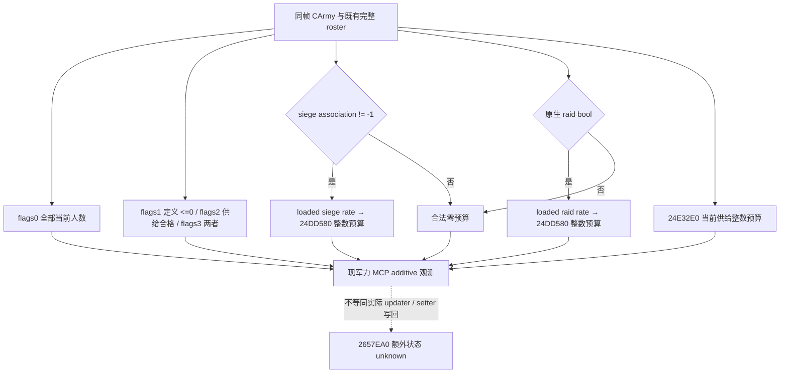
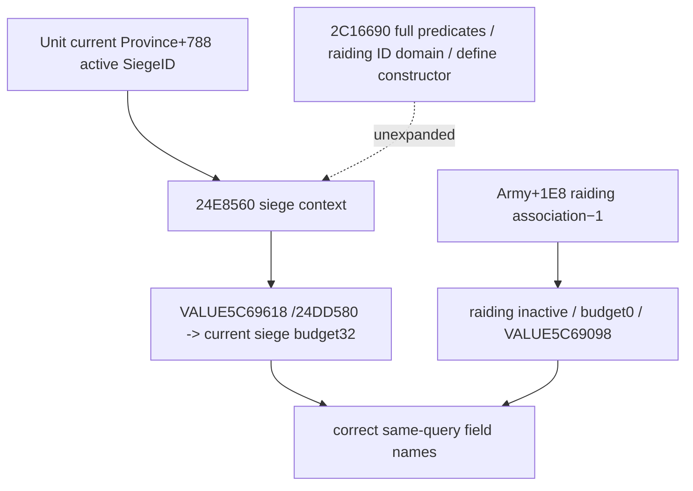

# CK3 1.20.0.3：损耗人数计算与逐兵团写回

2026-10-04，第4期 P0-LOSS 离线增量。冻结 CK3 **1.20.0.3 / Steam build25652598**，本机 EXE `C:/SteamLibrary/steamapps/common/Crusader Kings III/binaries/ck3.exe` 为 101039736 B，SHA-256 `94B55397ABB687A3DCD436805A5D885E6BE90FA6C693FEB44A9E3BBEEADE02A6`。主解释器显式核验为 `D:/workspace/ck3_eternal_recurrence/tools/.venv/Scripts/python.exe` / Python3.14.7 / capstone5.0.9 / pefile2024.8.26。源码阅读 HEAD `563a55c5393086d3b795e7ac8fa7e0fd488d5f01`，未改共享树。

本包闭合**月度损耗执行入口到 ordinary 兵团数量写回的静态链**，并定位独立行军损耗计数入口；不重复已有补给状态表、容量或界面比例 getter。它没有 SDK、进程读取、CK3启动、游戏函数调用、窗口输入、录制、游戏日、策略或 Git ref 写入。静态规则不能替代本期的实际前后人数录像。

## 为什么不能把界面比例直接乘总人数

原生 `0x24E3430` 并不调用 `GetArmyAttritionPercentage` 的最终 getter `0x24E2E50` 来扣兵。它分别产生补给、劫掠、围城的**整数人数预算**，再分配到实际兵团、persistent chunk，最后重算军团总人数。各分量取整、不同资格集合、特殊角色兵团跳过和执行时点都可能使显示比例与实际净人数不形成简单乘法。

原版 `game_concept_attrition_desc` 将损耗解释为逃兵、疾病或饥饿造成的兵员损失。口播使用“损失兵员”更准确，不能将所有损耗都称为“死亡”。两暂停帧的净人数差还可能包含补员、战斗、集结、分合军或其他事件，必须分别排除或记录。

## 实际月度执行链

| 入口 / 输入 | exact 指令事实 | 可以说明的内容 |
| --- | --- | --- |
| `0x24E3430(CArmy*, date*)` | `0x24E3450` 调用 `0x24E4D10`；成功才在 `0x24E345E` 调用 `0x24E32E0` | 补给状态损耗预算的生产依赖真实供给更新成功；补给更新先发生，再读状态比例。scheduler、日期相位及两个anchor由独立补给时钟工作包负责。 |
| `0x24E32E0(CArmy*) -> EAX` | 调用既有 `0x24E4FA0` 得 signed Q100000 供给分量，遍历 Army+38/44 全部实际兵团，要求有效 ArRg 与 `0x2A956D0`；累加各团 whole current+38；`0x24E33FE…3415` 乘比例、向零除100000、上限为eligible人数 | 非负普通输入下，补给预算为 `min(eligible soldiers, trunc0(eligible soldiers * supply component /100000))`。舰队/grace与状态比例复用既有专题；此函数不重新调用最终总比例 getter。 |
| 当前劫掠 | `0x24E3473` predicate `0x24E8560` true，才以 loaded slot `0x5C69618` 调用 `0x24DD580` | 该分量有独立人数取整，不从当前补给状态推断是否劫掠。 |
| 当前围城 | Army+1E8不等于−1，才以 loaded slot `0x5C69098` 调用 `0x24DD580` | 判断依据是当前围城关联ID；原版 `NSiege.MONTHLY_ATTRITION=0.01` 是数据基线，运行期loaded值未在本包读取。 |
| `0x24DD580(rateRaw, CArmy*) -> EAX` | 累加全部有效实际团 current+38，将rate clamp到0…100000，再乘总量、向零除100000，结果不超过总量 | 劫掠与围城分别按当时整个Army的whole总量算整数预算。两项都在实际扣除补给损失之前计算。 |

实际分配分两轮。第一轮处理补给预算；第二轮处理预先计算的“劫掠预算＋围城预算”。第一轮先选 definition receiver `ArmyRegiment+0x18` 的 integer+2A0≤0、且 `2A956D0=true` 的有效实际团；第二轮先选该+2A0≤0的有效实际团。**+2A0字段的语义名字尚未证明**，本包只说明它是实际筛选条件，不能自行叫它“免损耗”或“无敌”字段。

各轮先求筛选集合剩余whole人数，限制本轮可分配预算，再按Army中的团顺序做 `trunc0(regiment soldiers * remaining budget / remaining eligible soldiers)`；调用 `0x26341B0(regiment, allocated soldiers*100000)` 后，从剩余预算和分母中分别扣去本次整数损失和该团的前态人数。供给轮残余调用 `0x2A95800(Army+38, remaining soldiers, flags=2)`，劫掠/围城轮残余用flags0。flags2只要求 `2A956D0`，flags0不加这个条件；fallback不能误写成再次使用前一轮完全相同的筛选集合。

在非溢出的普通游戏人数域内，上述整数算术不会保存“0.4名士兵”到actual current。算术例：假设199名普通合格兵、供给分量5%、围城1%，两个预算分别为9和1；将界面合计6%统一取整则是11。这只是解释取整差的**假设算术例**，不是本期军队实测，也不能替代带人物/日期的正式画面。

## 兵团、record和chunk的数量写回

`0x26341B0(CArmyRegiment*, lossRawQ100000)` 核对ArRg magic/FullID、跳过 `0x2634880` 判定为合法角色兵团的对象，并跳过current+38=0的团。角色判定解析ArmyRegiment+148的FullCharacterID；这不是所有实际団都会扣损失的统一规则。

该writer从ArmyRegiment+20读取data-record数组，+2C为count，**record stride=0x10**。`0x260DB70(record*)` 用record+8的persistent Regiment FullID做generation回读，再读record+C的chunk index，返回 `persistent +0x18 + index*0x24`。这同时闭合了旧首record专题中尚未证明的stride；本包未修改已有reader，也未宣称全部records已实机读取。

ordinary chunk的current是+4，maximum是+0，state是+18。writer在chunk顺序中限定当前数量和剩余损失，向零除100000后调用 `0x2657EA0(chunk, newCurrent)`；setter的 `0x2657EA3` 实际写 `chunk+4`。普通非负且预算为整数的情况下，record顺序依次消耗剩余损失，不能描述成对每个chunk都统一乘界面比例。

存在明确特殊支路：state=3且current=0时，计算有效数量改取maximum，写回起点仍取原current；writer另有第二轮record访问兜底。该state的游戏语义和全部特殊兵生命周期未在本包证明，不把ordinary规则外推到特殊分支。拒绝合法角色兵团与零record等支路也意味着“整数预算”不必等于最终army净减少值。

writer末尾调用 `0x2633340(CArmyRegiment*)`。refresh按相同16字节records解析persistent/chunk、合计current与maximum，`0x26338C0/38C3`分别写回actual+38/+3C；另有合法角色兵团的特例。新增观察口只需复用现Strength循环已读的FullID/current/max，不必先实现完整补员预测。

## 独立的行军损耗入口

当前stock `NArmy.COUNTY_MOVEMENT_ATTRITION_PERCENTAGE=0.05`、`MINIMUM_COUNTY_MOVEMENT_ATTRITION=100`；英文概念提示限定从敌对county进入另一敌对county且目标不邻接已控制county。**这些数据不是任何移动都扣5%或至少100人的无条件规则。**

exact `0x24E2400` 按来源/目的对象及actor条件调用 `0x24E2250`，通过后调用 `0x24E6670(CArmy, null)`产生行军损失人数，再使用同一 `26341B0` 写回。`24E6670`内部先由 `24E6590`得到当前比例输入，再由 `24DD9C0`得到minimum项的modifier输入，以whole总人数计算并向零取整，选择比例项与minimum项较大值，最后限制到当前whole人数。当前native modifier输入和所有邻接/actor谓词的游戏语义仍有具体缺口；不在本包把两常量写成所有主案的最终值。

该链独立于月度总比例getter。沿路线看见“当前损耗率0”，不能据此排除刚发生的county跨越损失。本期先做驻地实验隔离该分量，再在路线实验逐次记录实际到达和人数。

## 本期最小采样与可说范围

第一段使用驻地、无战斗、无集结、无分合军、无参军离军的有限窗口。Root冻结主案后保存start，读同暂停帧date/native revision、CUnit/CArmy FullID、commander、province、空route、combat ID/state、siege关联和gathering状态，再读stock/capacity/month-change/attrition与全部actual团 `{army_regiment_id,current_soldiers,maximum_soldiers,scale:1}`。连续原生录像跨一次实际损耗执行，保存紧邻前后快照与正常after save；通过补给时钟包定位真正结算日，不假定月首。

如果补员不能完整排除，口播只报告“这个窗口净少了X人”，并说明当前比例与实际净变化的区别。首record的两个permission bool保持独立；首record false、某一chunk false、whole persistent月fraction或UI补员开关都不能单独证明整个Army当日没有补员。三方案结果表可以保留实际净人数，不必等全军未来补员公式闭合。

机制因果的证据等级分别为：本包静态链；新读取的当前原生字段；无混杂的实际转移或独立回放对照。只有最后两者进入本期的具体人名/日期/损失数字。录制窗口出现战斗、分合军、gathering、兵团身份集合变更或其他数量事件时，停止单因果叙述并保留attempt；不因此把原片改写成没有发生该事件。

## 证据与未完成项

本包的小型精确切片、源码文档快照、stock取证、图表和delivery位于 `C:/ck3-war-episode04-research-20261004-a01/loss-cause/`。最早只读输出和失败环境/字符编码回执保留在 `D:/ck3-war-episode04-research-20261004-a01/loss-cause/`，未删除或覆盖旧原始切片。历史Z盘研究根本机不存在；本包重新核验当前同SHA EXE并保存自己的有界切片，不制造同名历史替代文件。

| 精确范围 | 新切片文件 | bytes SHA-256 |
| --- | --- | --- |
| 24E32E0..24E3425 | `supply-loss-count.bin` | 2440ecf4047b3c54c9b8273034b018cc82b93d5296183bc8f5309ea5a7c070af |
| 24E3430..24E3A5C | `army-loss-executor.bin` | 7fda4144c5b8015aad9cac8ff059ee79e4895a9e4d5f1da155efc04f24db5bed |
| 24DD580..24DD64F | `rate-to-loss-count.bin` | 0bce03f6d9c921ba50cf40c1fb94946b4b46e8f7d550df4a404a8b143228ff8a |
| 26341B0..26344AF | `regiment-loss-writer.bin` | c88e413b22c0676821267b730251bacd1910432196ba95d9bd665fe771d4a390 |
| 2657EA0..2657F0E | `chunk-current-setter.bin` | 8101e3c101bb81cb321d1beb721bbddc91b47f863750d3aa4a3881a2256bbcac |
| 2633340..2633AE0 | `regiment-strength-refresh.bin` | 1b25b700b5bb5281b98d2a5f9613c27a873266bebbcbf5341fe76fac8027de1d |

`0x24E3425`是前函数return后的INT3 padding；供给updater的 `0x24E3450` 是call-site，完整执行入口为 `0x24E3430`。旧耗尽专题把3425称“dispatch around”的表述仅是历史locator，不可继续作为精确调度依据；独立补给时钟包给出实际scheduler。

`open_kaishek`本机checkout `D:/workspace/open_kaishek` commit `890b32de49081b7b5510e40c5518dfb59d5c8a6d`。本步骤为 `not-applicable`：研究对象是exact EXE中的Army/chunk原生写回及tick转移，现可读README限定Paradox parser/validator/strict IR/finite白名单runtime，没有此原生二进制执行语义或1.20.0.3 Army模型；没有提供或运行fixture/corpus，不用其成功代替native研究。记录检查命令及不支持项，不重复跑无覆盖目标的预验。

剩余项明确为：Root的主案连续人数观测与排混杂；运行期loaded rate/table、两anchor及真实日期节奏（补给时钟包）；行军上下文谓词和modifier最终返回值；特殊state3/character或零record等全部生命周期。普通驻地因果实验与A/B/C拍摄仍可推进，完整原生AI地点评分和调度不是本包门禁。

可复用依据：[当前补给与比例](army-current-supply-capacity-attrition-12003.md)、[补给状态与更新](army-supply-depletion-update-and-state-12003.md)、[补员及两类Regiment](army-regiment-replenishment-raised-reserve-12003.md)。日/周报告记本包 `exact-build-static-chain`；新增游戏天、动作、SDK、录制与live cases均为0，P0-LOSS静态执行链推进，整项实机验收仍pending。

### 2026-10-05：围城/劫掠同输入整数损耗观测

Exact CK3 1.20.0.3 / Steam 25652598 / EXE `94B55397ABB687A3DCD436805A5D885E6BE90FA6C693FEB44A9E3BBEEADE02A6`。闭合 source tree 和 ABI 位于 `Z:/ck3_mod_rewrite_process_assets/g2-resume-20261003/army-supply-attrition/raised-siege-attrition-quarter-v68/native-loss-tree/ROOT-DELIVERY.json`（SHA `42a0ba7a9dabd2437c647c4d1b3cf30f3e3abd0093212935c12bb25df9586cf2`）。`24E3A4D` 是恢复寄存器的 epilogue，不是 quarter/carry；setter `2657EA0` 内部额外状态仍未查明，不推定偏移。

`24DD580(int64 rate VALUE RCX, CArmy* RDX)` 累计全部有效 ArmyRegiment 当前人数，将率 clamp 到 `[0,100000]` 后乘除并截断成整数兵员。围城由 `CArmy+1E8 != -1` 激活，载入率位于 `5C69098`；劫掠由 `24E8560` 原生 bool 激活，载入率位于 `5C69618`。独立整数预算不可由 UI 总 attrition fraction 相加后一次取整替代。`24E32E0(CArmy*)` 是只读当前供给损耗预算，不调用 updater、不写库存/anchors；实际月结路径先成功更新 supply，再计算并分配预算。

已备妥的静态候选在同一 `ck3_query_army_strengths` 增加 `loss_application_inputs_v1`：原生 siege/raid 活动状态、载入率、全军人数、`2A95740` flags 1/2/3 的三个筛选人数、当前供给预算及 siege/raid 独立 wholeloss 输出。兵员 scale 1、率 scale 100000；`definition_le_zero` 只命名原生定义 `+2A0 <= 0` 比较，不推断单位类别。既有 update clock 与 Full DATA 保留，readonly consumer 原样保存这些值，不另造净损失模型。预算是同帧输入下原生只读值，不证明实际 updater 执行、最终 setter 写回或未来净兵数。

R36 已缓存实际主军 `3480/3878`、40 regiment、attrition `.01`、monthly supply `0`、sieging；R35→R36 的 `−35/−6/−1` 只记观测，尚未用新增字段取得同帧 actual，不能归因为某一损耗链。本包接线当前为 static-ready；此次 primitive 的 production-live 验收待 Root v64 部署后唯一新真实 army query，fixture 数据不冒充 actual，工作包新增游戏日为 0。

唯一新增的 production-path focused case GREEN：编译/链接退出0（5.089s），NativeReadArmyStrengths→serializer 退出0（0.116s），registered MCP→NativeDriver normalizer→readonly provider 在 `-B -O` 下退出0（4.651s）；四个 flags 各调用一次，用例 typed rate VALUE1000 得 siege budget34，supply eligible80 / supply budget0，raid inactive / budget0。
该唯一用例复用真实 reader、serializer 和消费入口，但这些输入是 fixture 数据；Root v64 部署后的真实 paused army query 仍待完成，本包不授予新增 production-live primitive、实际扣兵归因或游戏日信用。

## 2026-10-05：R37 首次 paused loss-input 观测（primitive）

本节只消费父协调者派生的 [QUALIFIED-FIELDS.json](Z:/ck3_mod_rewrite_process_assets/g2-resume-20261005/army-loss-r37-actual/QUALIFIED-FIELDS.json)，SHA-256 `def7c4e99f74909e7b1fff4ea4297878ed27a81f690c6b980be2a20356165ed8`；没有读取原 013 或 owner cache，没有 SDK、实机动作、fixture 重跑或新增游戏日。

| 来源层 | 保留的证据 |
| --- | --- |
| 外层 Root runtime 来源 | `R0037` / `g69` / source `a14f3c5fab2079956ddccb7b614d5e3aa41d9bbc` / PID `136112` |
| native source literal build 字段 | `game_version=null`、`executable_sha256=null`；不以外层绑定填入 |
| 同 paused 查询帧 | snapshot `native:3`；native revision `3` / public revision `2`；date raw `53258808`；query sequence `1` |

`query-army-strengths-v1` 本次整体与 scope 均为 `partial`。三个可用 loss domain 的实际计数与原生预算如下；计数/预算单位为整士兵（scale1），列名 `definition_le_zero` 只表示原生 definition filter，不补游戏类别解释。

| ArmyID | whole | definition_le_zero | supply_eligible | definition_le_zero_supply_eligible | supply / siege / raid 预算 |
| --- | ---: | ---: | ---: | ---: | --- |
| 301989997 | 3378 | 3378 | 3378 | 3378 | 0 / 0 / 0 |
| 184549452 | 3000 | 3000 | 3000 | 3000 | 0 / 0 / 0 |
| 268435597 | 2981 | 2961 | 2981 | 2961 | 0 / 0 / 0 |

三个可用行的 `siege_association_id=-1`、`siege_active=false`、`raid_active=false`；已读到的 `siege_rate_raw=raid_rate_raw=1000`（fraction scale100000）与合法 inactive 预算 `0` 分别保留。mode=false 时没有调用 active siege/raid whole-loss 路径，不能把加载标量0.01乘人数当成本帧实际 debit。

第4行 ArmyID `83886508` 是 health `unavailable / native_carmy_not_found`，native CArmyID及兵力 aggregate为 `null`；loss 字段实际缺席，派生展示值为 `null`，不填任何预算0。

本次仅取得 **production-live primitive**：三行当前 inactive loss 输入、过滤计数和供给预算。active whole-loss 路径仍只有 source+fixture 验证；没有激活分支的实机后态、完整损耗循环或新增保存日信用。当前预算0不能归因过去主军−34的净变化，也不能预测未来净损失；setter `2657EA0` 额外 lifecycle/carry 仍未闭合，没有已证实 offset。

### 2026-10-05：R38 实际围城揭示 siege/raid 标签反置

R38 主军301989997→CArmy201326670、native40/public2/date53259768/seq2 的旧 observer 显示 `siege_association_id=-1`、`siege_active=false`、`raid_active=true`、`raid_loss_budget=32`；独立 occupation 已观测P470 / Siege503316504 / besieging3210。已封 exact .3 原生树证明这是组件标签反置，receiver 和整数预算未被该差异证明错误；本节撤回本文及旧 native-loss/attrition-state 树中相反的分支名字，历史 archive、actual 原字节与数值保留。

| 原生输入 / 已闭调用 | 正确字段与配对 |
| --- | --- |
| `24E8560(CArmy*) ->AL`：Unit+20 Province+788有 FullSiegeID，retreat+170<=0，再 `2C16690(CArmy,Province)` | `siege_active`、rate VALUE `5C69618`、`siege_loss_budget` |
| `int32 CArmy+1E8 !=-1`：既有迁移/reuse 已证 raiding 输入 | `raid_association_id`、`raid_active`、rate VALUE `5C69098`、`raid_loss_budget` |

因此 R38 历史字段 `raid_loss_budget=32` 的真实分支语义是**当前围城预算32**（`trunc0(3210*1000/100000)`），不表示实际已经扣32人；+1E8不是当前 FullSiegeID，独立围城ID来自 Province+788。R37 三行 inactive0、filtered counts/current supply budget0 及第四 missing-loss 行保留原数值与 partial 边界，旧 component 名字不再称已精确验证；这些零值不能解释以前主军−34。此前把 war-side+30贡献称“raid+supply、排除siege”的语义亦撤回：实际24E8560分量属于 siege，即 siege+supply、排除raiding；不因此新增净损失归因。

纠正源候选现为 static-ready；唯一生产 reader→serializer→registered MCP 回归 GREEN（native 16 checks），目前尚未 Root v66 部署后的真实 paused query；本段不冒充纠正后 actual 或 applied-loss 验收。原生 cause/tree/最小施工入口见 `Z:/ck3_mod_rewrite_process_assets/g2-resume-20261005/army-loss-r38-branch-truth/native-semantics/ROOT-DELIVERY.json`（SHA `7a7fd76ccc91f05573f2e5329eb3a85bc07fb7094014ab4bc352d4db1553b2f4`）；loaded scalar 的分支角色已闭，命名 defines 的 constructor 绑定与 setter2657EA0额外 lifecycle/carry不在此扩展。本包仅追加本专题 EOF，0新增游戏日、SDK、fixture重跑、共享修改或Git。

### 2026-10-05：R39 修正标签与 resolver 的首次真实 paused query

R39 / v66 / g71，Root 冻结源 `cd0acf19`、PID `126252`；唯一军力查询为 `runtime-preparation/v66/root-results/actual-main-readback-01/005-ck3_query_army_strengths.json`（SHA `a5bddeaccf218acb1ec990697498f1b7e4c03133422119ec928125a6309a7da6`）。真实返回 accepted / status / scope_status 均为 available，query sequence `1`、snapshot `native:3`、native revision `3`、public revision `2`、raw date `53259768`、paused=true。原生 source 的 game_version / executable_sha256 仍为 literal null；以上 Root 外层运行绑定单独记录，未反填原生字段。

| 当前军团 / CArmy | 当前人数 / 上限 / regiment | supply / capacity | 月供给变化 / attrition | 围城 / 劫掠 / 供给整数预算 |
| --- | --- | --- | --- | --- |
| 主军 301989997 / 201326670 | 3210 / 3874 / 39 | 293.63637 / 300 | 0 / .01 | 32 / 0 / 0 |
| 守军 184549452 / 167772208 | 3000 / 3000 / 24 | 100 / 100 | +20 / 0 | 0 / 0 / 0 |
| 敌军 268435597 / 184549476 | 2981 / 4702 / 41 | 292 / 300 | −5 / 0 | 0 / 0 / 0 |

主军的修正 wire 实际为 `raid_association_id=-1`、`raid_active=false`、`siege_active=true`；native unit state 为 `3`。loaded siege / raid rate 均为 `1000 / 100000`。这次真实触发 `24E8560` 围城判断及 `24DD580` 当前输入整数预算，发布到正确的 `siege_loss_budget=32`。修正标签与活跃预算 primitive 已达 production-live primitive，预算32不是已扣32人、未来净损失或过去兵数变化的因果证据。原 R37/R38 错标签 archive 原字节保留为 legacy；setter2657EA0额外 lifecycle/carry 未在此扩展。

新 `native_army_resolution_v1` 的本帧三个 resolved 分支与未触发失败分支边界，由 ArmyReinforcement 在 [补员与 raised/reserve 专题](army-regiment-replenishment-raised-reserve-12003.md) 另行记录；本专题仅引用当前 CArmy 身份，不重复该诊断 primitive 的验收。

compact 缓存为 `Z:/ck3_mod_rewrite_process_assets/g2-resume-20261005/army-loss-r39-corrected-actual/COMPACT-CORRECTED-HEALTH-CACHE.json`（SHA `831a56ee162297dbd2d7657836c24d5d811b4bca101df95955e01a461c467213`）；完整选定 body 缓存已交 ArmyReinforcement 独立 diff/report，禁止其重复读取原005。初次 decoder 因 content.text 与 structuredContent 双副本触发 HARNESS_RED，且在断言前未留 buffer；修正后完成唯一成功解码，原 buffer 总读取2次如实保留。此 harness RED 不是 native capability RED；未新增 SDK、游戏日、动作、测试或窗口操作，既有唯一生产回归直接复用。

### 2026-10-05：R39 正常 24 日后的独立当前军力

Root 正常 `20302` 批次 CLOSED GREEN 并已记 24 日；随后 `38425` 查询 CLOSED exit0 GREEN。新原叶 `Z:/ck3_mod_rewrite_process_assets/g2-resume-20261005/r39-after24-actual-readback-01/006-ck3_query_army_strengths.json`（SHA `2070228656153c36eaaf118df252915348ccd67ace23e0dd9457f564d825c363`）由军需 owner 一次完整缓存。实际 query sequence `2`、snapshot `native:103`、native revision `103`、public revision `2`、raw date `53260344`、paused=true，三个 scope row 均 available；外层继续 R39 / v66 / g71 / `cd0acf19` / PID126252，原生版本与 EXE SHA 的 null 原样保留。

| 当前军团 | 人数 / 上限 / regiment | 对前帧人数净差 | supply / capacity | 当前月变化 / attrition | 当前围城 / 劫掠 / 供给预算 |
| --- | --- | --- | --- | --- | --- |
| 主军 301989997 | 3178 / 3874 / 39 | −32 | 293.63637 / 300 | −1.81818 / .01 | 31 / 0 / 0 |
| 守军 184549452 | 3000 / 3000 / 24 | 0 | 100 / 100 | +20 / 0 | 0 / 0 / 0 |
| 敌军 268435597 | 3045 / 4702 / 41 | +64 | 285 / 300 | −10 / 0 | 0 / 0 / 0 |

主军当前仍 `raid_association_id=-1 / raid_active=false / siege_active=true / unit_state_raw=3`；人数上限与 regiment 数不变，实际库存不变，当前月率从0变为−1.81818，整数围城预算从32变为31。独立实际人数净减32与前帧预算数值相同，但查询没有提供 setter 执行轨迹，不能据相等归因纯损耗、证明预算已扣或预测下一期净减31。敌军独立实际净增64、库存减7、当前月率−5→−10；这些差值同样不由当前 rate 或 budget 单独归因。其当前 `unit_state_raw=2`，本口不提供 battle ID/side，前帧移动边 ETA 不沿用到本帧。

三个 `last_supply_update_date_raw` 分别为主军 `53260080`、守军 `53260032`、敌军 `53260224`，均较前帧锚点前移720 raw小时。当前 day index `394181`、selected phase `11`，三个 army bucket 为 `0 / 28 / 6`；锚点变化可观测，当前暂停帧不据 phase 推定即时执行。三个 resolver 仍 available/ready/resolved，原生预算与损耗标签沿用已获得的 production-live primitive 资格。

完整 health/FULLDATA 缓存已交 ArmyReinforcement 独立 diff；本专题只保留当前损耗与供给输入。compact 为 `Z:/ck3_mod_rewrite_process_assets/g2-resume-20261005/army-loss-r39-after24-actual/COMPACT-AFTER24-HEALTH-CACHE.json`（SHA `48980e0bf75947732f12648d8fd04e8a3faf6e04da002c8909d1fbc035cb2bd8`）。旧 R38 错标签、R39 首次 decoder HARNESS_RED 与原005两次 buffer 读取继续保留；新006实际仅一次 buffer 读取。本消费不新增 SDK、测试、动作或游戏日；母批次累计 `4834 / resume1681 / Oct5+176` 由 Root 记账。

### 2026-10-05：R40 同一补给与损耗口的缓存复用

CommanderObserver 唯一读取 R40 原军力叶后封完整缓存；军需只消费该缓存一次，未重复读取原叶。真实 paused `raw53260776 / native:3 / native3 / public2 / seq1`，三个 scope row 均 available；外层为 `R40 / g72 / PID110616`，原生版本与 EXE SHA null 原样保留。主军仍 `3178/3874/39reg`、补给 `293.63637/300`、当前月率 `−1.81818`、attrition `.01`、`raid_association_id=-1 / raid_active=false / siege_active=true`，当前围城/劫掠/供给预算 `31/0/0`；这些值与 R39 after24 基线一致，保留 production-live primitive 资格，不把预算解释为已扣兵。

守军仍 `3000/3000/24reg`、供给100、月率+20、attrition0。敌军 `3045→2759`（独立人数净−286），上限4702、41reg与库存285不变，当前月率 `−10→+15`、attrition0、当前三预算0；`unit_state_raw=2` 但本口没有 battle ID/side，不从这次查询归因区间损失或认定具体战斗。三个 gathering 均 not_gathering/ready=true；主军缺额696、守军0、敌军1943，缺额变化不冒充已实现补员预测。

当前 day index394199/selected phase29，三军 bucket0/28/6；main/enemy 的 last_supply_update_date_raw 仍为 `53260080 / 53260224`，距当前分别696/552 raw小时，守军锚点 `53260032→53260752`、距当前24 raw小时。仅记录当前时钟与锚点变化，不把暂停帧 phase 当 updater/setter 执行轨迹。当前 movement progress 三行均 not_applicable、ETA null，不沿用旧移动边ETA。

军需派生 compact：`Z:/ck3_mod_rewrite_process_assets/g2-resume-20261005/army-loss-r40-cached-trend/COMPACT-R40-HEALTH-LOSS-CACHE.json`（SHA `123a25d82a9829216f7fc7346ee7c3015e98f0321f6378fee594fad751b64699`）；完整源缓存由 CommanderObserver 持有。单位类型库存与省供给/K保持独立；本次供给值直接来自 health 字段。R39 after24 之后18正常日由 Root 已计至4852，本缓存消费新增0日、0 SDK、0测试、0窗口操作；既有失败 archive 与唯一生产回归保留、不重跑。

### 2026-10-05：v69 同帧前后与独立健康趋势

CommanderObserver 独占原始军力读取；军需只消费其 v69 比较派生与 AFTER health 派生各一次，原始、完整 composition、v68 缓存均未重读。真实 paused `raw53262288 / native:3 / native3 / public2`，前后 query sequence `1→2`，四行已发布字段 diff0；overall/scope 为 partial：旧三军 health available，新 public `285212713` 为 `native_carmy_not_found / native_carmy_id=null / reference_absent(-1)`，health null且损耗/供给对象缺省均不补0。原生版本与 EXE SHA null保留。

主军 `3085/3874/39reg`、库存 `290.00001/300`、月供给变化0、attrition `.01`，当前围城/劫掠/供给预算 `30/0/0`，仍 `siege_active=true / raid_active=false / raid_association_id=-1`。与先前 Commander R41/v68 已提供的 `3116/3874` 相比净减31，库存与月率相同；与 R40 已封帧相比净减93、库存减3.63636，均是独立端点差。当前预算30不是已经扣30人，也不能把净减31归因预算、补员或 Create 尝试。

守军 `3000/3000/24reg`、供给 `100/100`、月率0、attrition0；此前 R41 月率+20。敌军 `2670/4702/41reg`、实际库存285、当前 capacity100、月率+20、attrition0，与 R41 core相同；库存和 capacity 原值分别保留，不自行clip。两军当前三预算均0。主军缺额789、守军0、敌军2032；三可读军团均 not_gathering/ready=true，缺額与当前补员字段不冒充历史净补员原因。

当前 day index394262/selected phase2，三军 bucket0/28/6；last_supply_update_date_raw 主军 `53262240`（距当前48 raw小时）、守军 `53262192`（96小时）、敌军 `53260224`（2064小时）。只记录 updater 锚点；旧 R41 的 budget/clock 未另读、不猜值，不由锚点归因人员变化。主军 ETA null；守军与敌军当前首边 remaining 为 `5.26667 / 4.82347` native days，不冒充整条路线 ETA。

compact：`Z:/ck3_mod_rewrite_process_assets/g2-resume-20261005/army-loss-v69-cached-trend/COMPACT-V69-SUPPLY-LOSS-CLOCK.json`（SHA `6c0a01de034bd1da59b51c5b5949d7d5aefd80dff88d1ab25c277e20a86d8349`）。保留旧错误 archive 与既有生产回归；本包新增0游戏日、0 SDK、0测试、0窗口操作，未读取 ACTIVE `79783` 或授予其未来日信用。当前供给/损耗观测资格为 production-live primitive，未发布损耗因果预测。

### 2026-10-05 R45：器械到470后的实际兵力与供给

R45/g77/v72，paused raw53263896/native144/public2/queryseq4，健康四军available。器械268435481在470为7/11（mangonel Regi50347099↔ArRg184549917当前6/10、observed tier2）；主军301989997为3024/3873，守军184549452在3711为2941/3000，敌268435597为2809/4702。库存/容量/月供给变化依次为300/300/0、290.00001/300/0、90.90910/100/−4.54545、100/100/+20；attr fraction依次为.01/.01/.01/0。

当前supply loss整数预算四军均0、raid均false且预算0；器械/主军/守军siege_active=true，围城预算依次0/30/29。相对已消费R44 day08 raw53263080，净兵数差0/−30/−29/+69仅是实际变化，不能把本帧预算归因过去损兵或预测下一20日已应用损失。主军40条DATA全部chunkCanReplenish=false（24条prepared fraction正），守军24条与器械1条也false；两许可bool保持独立。

独立围城owner同帧已资格化470的actual K=2、Mraw=94350、Draw=247620，来源为`siege-arrival-engine470-g76-readiness/actual-r45-engine470-arrival01/ROOT-DELIVERY.json`（SHA `58b9d88760339d545d9cc94055a13c9b9d3d8141a557acba0058534dee64a9e6`）；没有从库存tier反填省K/M/D。现有供给源树与实际预算支持延续普通双围城，继续复用健康LOSS/clock与occupation richrow观测；当前没有必要新增读口、搬军或拆军门禁。Root随后普通20日已closed GREEN、raw53264376，由军域独立消费；本段健康仍是到场截面，未取得20日后新健康，后继planned20日无结果信用。

外置完整字段与源树：`Z:/ck3_mod_rewrite_process_assets/g2-resume-20261005/engine-arrival-r45/ROOT-DELIVERY.json`。本consumer只读Commander健康派生一次，原006/004、旧缓存、SDK、窗口、测试、共享源码/Git与新增游戏日均0；native version/EXE SHA字段null保真。能力记录为production-live primitive，真实日推进信用由Root/军域账本登记。

### 2026-10-05 R45：强攻选择前的实际健康截面

closed SDK57783的paused raw53264472/native244/public2/queryseq5四军available：主2994/3873、器械7/11在470，守2912/3000在3711，敌2878/4702在735。库存/容量/月变化依次290.00001/300/0、300/300/0、86.36365/100/−4.54545、100/100/−5；attr fraction依次.01/.01/.01/0。实际supply与raid整数预算四军全0，主/器械/守siege_active=true、围城整数预算29/0/29；当前预算不是强攻预算或已经扣兵。

完整DATA主40条available（prepared正24、nativeCan真24、chunkCan真0），器械1条与守24条均prepared0且两许可false；敌133条available（prepared正127、nativeCan真124、chunkCan真69），两许可独立，不预测全军净月补兵。相对raw53263896的主−30/守−29/器械0/敌+69仅观测差，不归因本帧预算。健康口没有专用围城B，公开2994+7=3001不能反填B；强攻选择复用独立occupation/source domain的B、城防/缺口与CanStart。本consumer0 action/day/SDK/window/tests/shared/Git，指定健康派生read1、原008/fullcomposition/occupation0，normalSAVE null保留。完整缓存与字段在`Z:/ck3_mod_rewrite_process_assets/g2-resume-20261005/army-preassault-health-r45/ROOT-DELIVERY.json`。

### 2026-10-05 R46：新运行帧prepared值实读0

R0046/PID104164/g78/d22e9a1的closed SDK11140，paused raw53264472/native3/public2/queryseq1四军available：主2994/3873、器械7/11在470，守2912/3000在3711，敌2878/4702在735。库存/月供给变化/attr与前述R45消息一致；supply与raid损耗预算全0，主/守围城预算29、器械0。

本帧198DATA全部available，`persistent_prepared_replenishment_fraction_raw`字段均存在且实际0（主40、器械1、守24、敌133）。独立月补员fraction仍正、Can/chunkCan真计数主24/0、器械0/0、守0/0、敌124/69；与已held R45同clock消息的prepared主24正/敌127正之差只记观察，不归因冷启/source修复，也不预测未来不补员。健康没有dedicated围城B，whole2994+7=3001不能代B；强攻选择沿Root已持的occupation/source输入，不以健康预算制造新门禁或强攻结果信用。新正常SAVE/environment及native版本/SHA字段null保持，本consumer只读新健康派生1次、原008/fullcomposition/旧R45/SDK/day/window/tests/shared/Git均0。完整字段在`Z:/ck3_mod_rewrite_process_assets/g2-resume-20261005/army-preassault-health-r46/ROOT-DELIVERY.json`。

### 2026-10-05 R46：强攻一日后的实际健康

Root已执行470强攻及普通1日，closed SDK17098的新paused raw53264496/native13/public2/queryseq2：主2919/3873，相对已held pre2994净−75；器械7/11、守2912/3000、敌2878/4702不变。四军库存/月变化/attr也与pre消息相同；当前supply/raid整数预算全0、主/守围城预算29、器械0。198DATA全部available、prepared字段present且raw0，两Can许可计数独立不变。

本健康派生未含专用强攻损耗预算或围城B，当前siege预算29不能归因过去−75，也不能当强攻预算；公开2919+7=2926及历史preB3001均不反填当前native B。继续/停止由Root已持独立rich004与强攻原生输入决策，本包只交当前健康实值。原006/旧缓存/SDK/窗口/测试/共享源码/Git与本consumer新增游戏日均0；1真实日及强攻动作归Root，normalSAVE/environment null保留。完整字段：`Z:/ck3_mod_rewrite_process_assets/g2-resume-20261005/army-post-assault-health-r46-day01/ROOT-DELIVERY.json`。

### 2026-10-05 R46：强攻后十日健康实际变化

closed SDK43501的paused raw53264736/native56/public2/queryseq3四军available。主2304/3873，较已held day1的2919净−615、较pre2994累计−690；器械7/11、守2912/3000、敌2878/4702不变。当前supply/raid预算四军全0、主siege23/守29/器械0；整数预算不作过去减员cause或强攻预算。库存/月变化/attr主290.00001/0/.01、器械300/0/.01、守86.36365/−4.54545/.01、敌95/−5/0。

198DATA available、prepared字段present且raw均0；Can/chunkCan主24/0、器械0/0、守0/0、敌124/0。敌此前chunk69→0与本帧P4893/Combat369098771只并列观察；守P3711/combatnull/siege_active=true/not_gathering，不以旧movement state补健康缺字段。此健康口未发布assault budget/B，whole2311/preB3001均不代当前native B，Root沿独立rich004/source选择继续或停止。本consumer0day/action/SDK/window/tests/shared/Git，原006/旧缓存/fullcomposition0，新querySAVE/environment null；10真实日与whole5017归Root账本。完整字段：`Z:/ck3_mod_rewrite_process_assets/g2-resume-20261005/army-post-assault-health-r46-ten-days/ROOT-DELIVERY.json`。

### 2026-10-05 R46：470攻下后的供给与补员许可

closed SDK20965的paused raw53265024/native107/public2/queryseq4四军available：主2047/3873，较已held postten2304净−257、较pre2994累计−947；器械7/11与守2912/3000不变，敌2858/4702较postten−20。主/器械当前470 regular、siege/raid皆false、损耗预算全0、attr0、月供给+20，库存290.00001与300；3711守军仍siege_active=true/budget29、库存86.36365/月−4.54545/attr.01。四军supply/raid预算均0，差值不归因当前预算。

198DATA available、prepared字段present且raw0；主Can/chunkCan真28/31（独立TT19/TF9/FT12），器械1/1，守0/0，敌124/0，不换算未来净补兵。当前D394376/phase26、守28/器械29/主0下次matching+2/+3/+4只为机会，不要求等候。健康支持继续现有3711 preview/normalMove准备，当前+20不外推目的地条件。Root独立occupation470实际capturedRobert/G25/B0/activeSiegenull/war38不由whole2054倒算，B0不代表army0兵。本consumer健康派生read1、原006/旧cache/occupation/SDK/day/window/tests/shared/Git0，normalquerySAVE/environment null保持。完整字段：`Z:/ck3_mod_rewrite_process_assets/g2-resume-20261005/army-capture470-health-r46/ROOT-DELIVERY.json`。

### 2026-10-05 R46 STOP前：向3711行军六日冻结健康

此段仅为用户接手游戏前Root正常STOP后的历史证据，不声明用户当前状态。冻结paused raw53265168/native140/public2/queryseq5：主2407/3873（较已held捕获+360）、器械8/11（+1）、守2883/3000（−29）、敌2846/4702（−12）。主/器械库存300、月+20、attr0、各损耗预算0；守库存81.81820、月−4.54545、attr.01/围城预算28，敌95/月−5/attr0/预算0，supply/raid四军均0。

198DATA available且prepared字段present：正主28/器械1/守0/敌127，零12/0/24/6，null0；Can/chunk真主28/31、器械1/1、守0/0、敌126/0，保持独立，不沿用此前末态prepared全0或归因净兵数变化。D394382/phase2及lastSupply原值只作调度/库存账本。普通6日SAVEh9048与0日query SAVEh9052分别引用冻结metadata，不互相替代；consumer只读新健康派生1次，原006/旧/fullcomposition/SDK/实机/attach/window/prepare/build/launch/profile/test/compile/shared/Git及新增日均0。完整历史字段：`Z:/ck3_mod_rewrite_process_assets/g2-resume-20261005/army-frozen-march3711-r46-day06/ROOT-DELIVERY.json`。

### 2026-10-05：损耗预算分摊与整数writer请求源闭合

用户独占CK3期间仅复用exact 1.20.0.3缓存片段。24E3430先更新供给库存，分配供给preferred与overflow，再以供给写回后的ArRg current分配原先算出的siege+raid预算。preferred选signed type tier<=0（供给另要求2A956D0），残余分别走2A95800 flags2/flags0；按原ArRg存储顺序进行signed32 IMUL截断、signed IDIV toward0，再传q×100000到writer。whole budget不是residual，eligible total足够时residual为0；writer跳过/钳制也不把请求变成实际损失，历史预算28不能解释净兵数−29。

现regiment_strengths的原数组次序/current及同GDbo signed+2A0 type tier可复用。逐军团2A956D0、真正供给写回后的阶段输入、2634880 skip和2657EA0..2657F0E的110B setter仍是应用投影的具体剩余入口；不能用预算直接预测最终扣兵。外置纯request candidate尚未执行、导入、编译或测试，状态只research/未验证候选。

外置`Z:/ck3_mod_rewrite_process_assets/g2-resume-20261005/background-user-session-round02/attrition-loss-model/ROOT-DELIVERY.json`，3245 B / SHA `1452b95cbf79c0351fba537309d31dd0603609f69b8ad23d6018ded81e9b59f1`，含源树与input合同。源知新增，游戏/SDK/日期及live信用新增0；5035冻结历史不代表用户当前实机。
