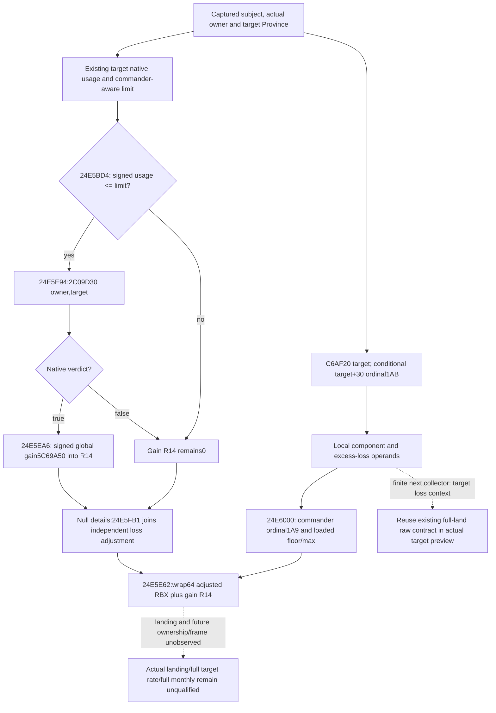

# Captured target land supply gain input quality — exact 1.20.0.3

This Oct7 source-first continuation uses frozen source
`3cbffaf59e167b64a1ae7d7a08aad40fcfedbc15` and exact CK3 `1.20.0.3`, Steam
`25652598`, EXE SHA
`94B55397ABB687A3DCD436805A5D885E6BE90FA6C693FEB44A9E3BBEEADE02A6`
as supplied metadata. No EXE byte, hash, SDK, live process or game was read.
Status is **research / SOURCE_PREPARED / FIRST_NOT_RUN**.

The actual target preview already supplies usage/limit, native
`2C09D30(actual owner,target Province)` eligibility, optional actual signed
`5C69A50` raw gain, and the native target `C6AF20`/ordinal `1AB` component.
The loaded gain is global rather than Province-specific, but the cached native
gain branch does not have a second Province gain coefficient. The native
owner/Province predicate and usage/limit supply its target-specific admission.
Adding a duplicate gain observer would not provide a new necessary input.

The held `CACHED-CALLER-EXCERPT.txt` under
`Z:/ck3_mod_rewrite_process_assets/g2-background-round7-20261006/resupply-eligibility/`
contains `24E5BD4..24E5BD7` signed usage/limit admission,
`24E5E8E..24E5EA6` actual owner/Province call and signed gain load into `R14`,
the null-details bypass `24E5EAD..24E5FB6`, and final adjusted `RBX+R14`
output at `24E5E62`. With null details, the source selects the actual loaded gain
or leaves it zero; it does not reconstruct gain from stock or scale it by a
guessed Province property. Non-null details format the displayed contribution,
with the preserved local component used by the common negative-adjustment path.

The already qualified
[land resupply admission](army-land-resupply-admission-12003.md) and
[full current land rate](army-land-supply-rate-inputs-12003.md) establish the
separate native commander/fallback and loss operand contract. Their current
Province families do not certify a requested target while the subject is at sea.
The target extension does not call a landing/supply mutator or assert landfall.

The finite next implementation entrance, if a full target rate is requested,
is the captured target loss context: reuse loaded slope/min/max at
`24E5BE3..24E5CA4`, the current subject's actual commander/fallback ordinal `1A9`
and divisor-floor/max adjustment from complete `24E6000..24E6464`, and the
already observed target component/usage/limit. Extend the existing readonly
preview collector only for any missing target-context operands. Existing
current total rate, selected refill, current20/current21 and prepared inputs are
not replacements for these operands. A subsequent whole-preview fixture would
qualify that new observation; actual disembark requires its separate actual
frame/state transition. This packet adds no such duplicate observer or policy.

One new consumer source is prepared:
`CapturedTargetLandSupplyWholeService12003Tests.test_native_preview_whole_driver_service_preserves_target_inputs_and_rejects_malformed_siblings`.
It uses the actual `NativeHeadlessGameplayDriver` preview branch through the
actual `GameplayBridgeService.execute_step`. Only its endpoint, hello,
paused scope/frame and request correlation are synthetic. The eight native
whole authority files retain original bytes, and every native value survives
the accepted driver/Service output with exact scalar types, false, zero and null.
Five explicitly synthetic whole copies cover only the new sibling contract's
unexpected key, bool-as-raw, signed-width, readiness mismatch and target ID.
There is one method, no old test import and no direct normalizer substitute.

Each scene saves original whole/native-context, raw sibling, runtime whole,
actual driver/Service result or exception and a finally receipt; the compound
receipt preserves setup/import failure. Source, native target and consumer are
NOTRUN. A successful future FIRST qualifies only these captured target input
observations and parser integration, never actual landing/full rate/after/monthly
or live gameplay. Root owns adoption, FIRST, source commit/push and qualification.
