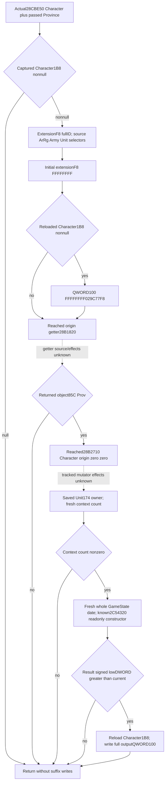

# Character detachment suffix — CK3 1.20.0.4

Frozen source: CK3 **1.20.0.4**, Steam **25734779**, EXE SHA-256
`98702f88a547cde2eaf29a85f93b85f68ee4cf8148336a4f7afaeb75319dd518`.
The concrete existing production partial is
`actually_selected28CBE70_inner_effects` in the current detachment DATA pure
consumer's nonnull Character1B8 branch. Outer invalid CharacterID and null1B8
cases already have independent no-call results.

The old complete semantic wrapper `28CBE70..28CC079` was held in a528B cache;
seven trailing padding bytes were excluded. Root's cached runtime ordinal
140151 gave candidate `28CBE50`. The candidate was not bound from its address:
Root separately approved one521B read, and the complete actual
**`28CBE50..28CC059`** matched every old instruction, ordinary control branch,
member/literal operand and ordered relative/RIP edge. Owner current31 confirmed
no earlier actual4 paired receipt. External proof is
`army-future-dates-12004/character-suffix-map01/FAMILY-MAP.json` and its DETAIL.
Fresh cost: **521 actual4 bytes/one read**, no old EXE, new metadata, hashes,
padding or selected helper expansion. This lane's intentional cumulative source
cost is now **1265 bytes/nine reads**; previous milestone costs stay historical.

The wrapper captures Character1B8 once as its initial extension and saves the
passed Province pointer. Null initial extension returns immediately. Otherwise
it reads extensionF8 fullID, resolves ArRg through registry`5D1F340` and
fallback`5D1F338`, then Army through registry`5D1DE48`/fallback`5D1DE50` and
ArRg140, then Unit through registry`5D1E380`/fallback`5D1E378` and Army124.
Selectors use low24 slot indexes, unsigned count2C and complete object10 ID
equality; each later requested member is only read when its registry is
nonnull. A missing slot chooses the source fallback. The saved Unit pointer
is used later, rather than re-resolving that Unit after the Province mutator.

After these selectors it stores initial extensionF8=`0xFFFFFFFF`. It then
reloads Character1B8; a nonnull reloaded extension receives full
QWORD100=`0xFFFFFFFF029C77F8`. This is a source-defined extension reset,
not a Character return value or an observed post-call state.

The wrapper calls actual origin getter **`28B1820(Character)`**. Its returned
object's DWORD85C is compared with `0x50726F76` (`Prov`). A non-Prov result
exits after the reset; Prov selects actual **`28B2710(Character, origin,0,0)`**.
Both helper effects remain unclosed; neither is invoked as a readonly getter
from this source proof. Cached metadata gives the getter's selected first
runtime interval399B and the mutator's first45B fragment; the mutator fragment
is not a complete method. Separate finite plans must precede new body reads.

After the mutator, the saved Unit174 owner is freshly resolved through Character
registry`5C67568`/fallback`5C67570`, comparing complete ID at18. Owner1C0 selects
its+318 context or source fallback`5459D38`; context DWORD+C zero exits. Nonzero
loads current GameState through`5C68C50` and copies its full QWORD+8 into the
already held readonly date constructor **`2C54320`** with saved Unit, original
passed Province and getter-returned origin. Only **signed low-DWORD** result
strictly greater than the captured current low-DWORD writes the constructor's
whole QWORD into freshly reloaded Character1B8+100. Equal/earlier leaves the
source sentinel. Entry date/owner/context are not the source's post-mutator
rereads and cannot stand in for those effects.

State is **research / complete direct wrapper source**. No new Character input
code, native call, import, test, build, SDK query or paused artifact is credited.
The next same-Army MCP increment should publish real extension reset operands,
selected source-role resolutions and origin observation after readonly source
closure. It must keep reset, non-Prov, owner-context and computed-date branches
independent, and label mutator/post-call gaps as selected dependencies. No new
forecast prerequisite is added to current legal OODA or migration acceptance.
