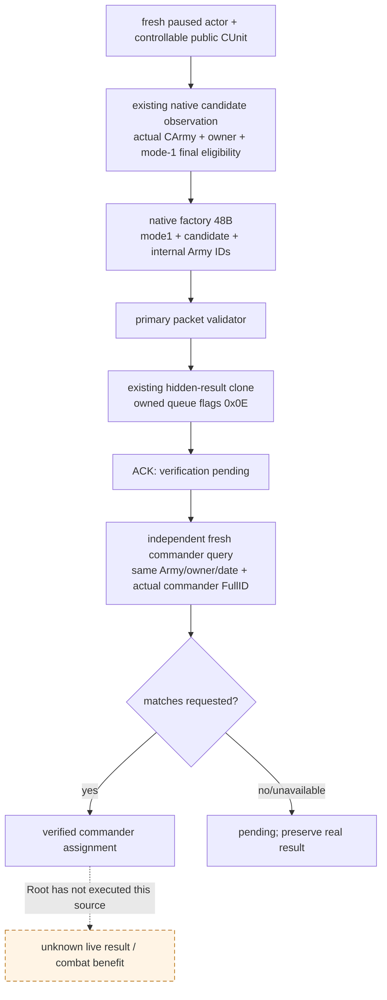

# CK3 1.20.0.3 玩家军队的 typed 将领任命

2026-10-03，状态 `static-ready`；10 个 native cases / 29 项断言与 4 个注册 MCP cases GREEN，没有 SDK 或实机任命动作。当前功能必要性是 Robert `29829` 的真实军队 `83886367` 已观察到 commander absent。此包补齐名单之后的正式任命动作，并复用名单查询独立读回；不得把单个 queue ACK 写成已任命或战斗胜利。

构建为 CK3 **1.20.0.3 / Steam 25652598**，EXE SHA-256 `94B55397ABB687A3DCD436805A5D885E6BE90FA6C693FEB44A9E3BBEEADE02A6`。原生策略与命令施工输入先于实现落盘于 [候选与最终资格](commander-candidates-and-assignment-12003.md)、[正式玩家命令](commander-player-assignment-12003.md)；本包不猜候选，也不直接写 `CArmy+0x120`。

## MCP 与执行链

调用 `ck3_assign_army_commander_v1(army_id, commander_character_id, expected_revision)`；`expected_revision` 必填。它使用现有 generic `execute_step` 传输，typed command 为 `assign-army-commander-v1-army-N-to-character-N`，能力为 `game.command.assign-army-commander-v1-army-N-to-character-N`。没有新增 feature flag、私有 permit 或机器路径协议。

当前 paused snapshot 必须包含玩家可控军队。原生同帧查询解算实际 public `CUnit` → `CArmy`、owner、current commander 与原生候选；选中角色必须来自该原生集合且最终 mode-1 任命资格为 true。名单中其他不可读角色不阻断一个已独立确认的合法候选。已任命同一角色只返回实际 observation，零重发。

原生动作使用 `0x297BB00` native factory 建立 caller-owned **48-byte CSetCommanderCommand**。仅填写 `+0x20 mode=1`、`+0x24 candidate FullCharacterID`、`+0x28 internal FullCArmyID`；public CUnit ID 不能填入 Army 字段。`0x2971480(primary,nullptr)` 执行正式 packet validator，然后复用 `ck3_12002::SubmitCommandCopy(...,0x0E)`，以真实 hidden-result clone `0x2977C10` 把 owned clone 交给 queue `0x37F06F0`。`0x0E` 是实际玩家 commander handler 的通道，generic helper 默认 `7` 不适用于此命令。原始 factory source 由 native primary deleting destructor 清理；provider 不直接调 secondary executor、不构造自己的游戏 allocator。

slot 16 的既有 application-main executor 位置承载窄 assignment callback，仅 exact .3 注册。原有 commander observer 的 slot 15 保留。提交结果为 `submitted_verification_pending`；inner `army_commander_assignment.status` 为 `submitted`。资格或 validator 未观察时使用 `null`，合法 false 与未求值分开。`command_submitted=true` 仅代表 native queue 接受 clone。

随后 typed service 重新捕获 paused snapshot，调用原有 `ck3_query_army_commander_candidates_v1`，检查同一 public CUnit、internal CArmy、actual owner、玩家/episode/date 以及 current commander 的原生 full-ID/getter 对照。只有匹配请求角色才返回 `commander_assigned_verified`；仍 absent、不同角色或不可读都保留 pending，不根据请求 ID 制造成功。后置原生资格是当前规则状态，不能替代 commander 身份读回。

## 验证与后续

Focused fixture 使用真实 production reader、command submit、serializer、typed service 与注册 MCP；伪 native 对象只替换 fixture 的地址/调用，不作为 live 输入。覆盖 native mode-1 false、原生候选缺席、owner/back-reference 不匹配、packet validator false、queue 拒绝、合法 source/clone 生命周期、ACK 后仍 absent、独立 commander 读回匹配以及已任命零重发。旧 observer 的已验证矩阵不重跑。

首次 dispatcher 编译追加一个 `else if` 分支触发 MSVC `C1061`（最大嵌套限制），属于真实 static source integration RED。修复复用既有 commander 分支中的条件分派，保持原有链深度；只重编译有变化的 bridge/serializer，保留失败 attempt。此静态故障没有外推为 CK3 live 故障。

`open_kaishek` 预验为 `not-applicable`：此包处理 exact-build native C++ ABI 和 MCP wire，不运行其 parser、Paradox 脚本或 finite-runtime 支持语义；确定性子集由本包 focused production fixture 执行。没有游戏日推进、SDK/window 操作或 G2 信用。

剩余由 Root 合入并构建新的冻结 DLL，读取 Robert 当帧真实候选，再根据已冻结原生质量字段做单军最小策略、执行一次 typed 任命并保存独立后置 artifact。原生全军排序、auto-commander bits、大表 tie-order 与目标地形质量尚不由本最小策略复刻，质量差距继续记入原生专题和 blocker ledger；它们不构成这项单军合法任命的额外门禁。

## v36 实际名单与首个任命 attempt（2026-10-03）

新冻结源码/native head `6b0e6bdfa6b18396394ce8f12301e464825f1f46`，`Z:/g37`，CK3 1.20.0.3 / Steam 25652598，PID `90596`（仅当次历史身份），同 Robert `29829`、episode `native-29829-2bc2d599f7f9`、paused `date_raw=53236728`。Root 原 SDK 批次 `runtime-preparation/v36-retry-02/actual-new-leaves-v36-01/result.json` 已完整正常保存；aggregate RED 与本项 query `024` 的 GREEN 分开。

实际 `ck3_query_army_commander_candidates_v1` 为 available、native/public revision `2/2`、query sequence `1`，public CUnit `83886367` → internal CArmy `50331794`、owner `29829`；current commander **absent** 是合法缺席，非读取失败。native `(filter_now=false, allow_guests=true)` collection有 `19` 行，19/19 身份、player mode-1 final资格和两个质量 getter均完整，19/19 can_assign=true。Robert本人 `29829` 的 native base quality/generic advantage `29/29` 唯一最高，`34867` 次高 `28/28`，随后 `32716=23/23`、`33435=22/22`。29不能改称独立martial字段，两getter本帧相等不能一般化为同一字段或胜率。

File-only最小单军策略从这些实际原生eligible候选动态选择最高base quality，再generic advantage，同分保留原生collection顺序，选择Robert `29829`，没有假定fixture人物ID。原生全军mode-2 owner-priority/group/tie/目标地形策略仍按既有原生树记质量差距。观察器此项可记 `production-live primitive`；策略选择是证据消费，不领取任命或战斗信用。名单正常checkpoint为 `4712`，SHA `31ef035624be4146e8f9f9743081e27b0418e18ea3f67d885252648e97a8b784`。

Root随后仅发送一次 `ck3_assign_army_commander_v1(army_id=83886367,commander_character_id=29829,expected_revision=2)`，失败artifact `commander-assignment-provider/actual-assignment-v36-01/005-ck3_assign_army_commander_v1.json` 为实际 RED：`application-main army-commander assignment executor unavailable or busy`。002/003动作前诊断已观察共同mailbox `failure=512`、ready=false，published/completed/started/executed均13，submission_enabled=true，paused/date仍一致。`512=1U<<9` 是既有executor_exception位，不能把它归给未进入的统帅command factory。

**此 attempt确定未入application-main mailbox，也未到native CSetCommanderCommand queue。** frozen `bridge.cpp:11936-11942` 仅在 `TrySubmitMainThreadQueryV1 != submitted` 时产生上述确切字符串；mailbox源码在 `1433-1434` 检查既有failure并在 `1469-1478` 发布ticket/queued之前返回。所有非submitted返回均在publication前，已queued路径只于1502返回submitted。assignment callback→`ApplyArmyCommanderAssignment`→native factory/validator/`SubmitCommandCopy` 没有进入。这是按源码分支确定的本attempt零执行，并非伪造实测counter。该error没有公开具体TrySubmit拒绝enum；pre-existing512足以解释infrastructure_failed，但不把推断的enum写成已观测字段。

这与已进入callback之后的 `army-commander assignment execution unresolved; query actual commander` 或native queue接受后的 `submitted_verification_pending` 不同。本attempt没有queue ACK，也没有独立post-command commander读回，因此任命仍未完成，不能记production-live assignment primitive/loop。正常checkpoint `4714` GREEN，SHA `8a9e4345edb07ba6b6e118a6ad4eee12daecf21ab58bee095a346ff1d80119a5`，同date/actor/episode；它不证明任命结果。

外置 `commander-assignment-provider/actual-v36-new-leaves-01/ACTUAL-ASSIGNMENT-CLASSIFICATION.json` 保存actual packet、源码branch与文件hash。保留once失败attempt，不重发；Root恢复共同mailbox后先执行已经准备的 `selection/READBACK-ONLY-CALLS.json`。只有读取当前实际commander后仍需任命，才用新fresh名单/revision绑定下一次动作。本项worker未连接SDK、未操作窗口/Git、未重跑旧测试；没有新增游戏日、G2或战斗胜利信用。
