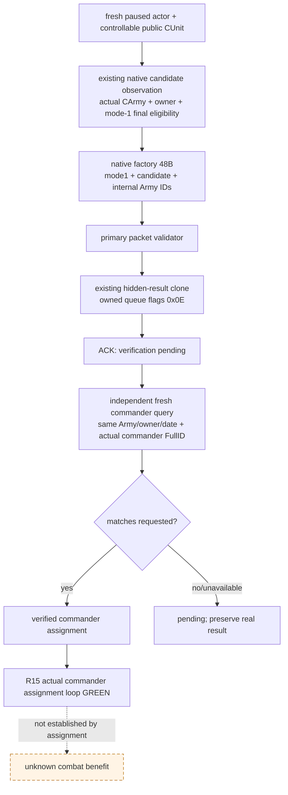

# CK3 1.20.0.3 玩家军队的 typed 将领任命

2026-10-03，当前状态 **`production-live loop`（当前单军统帅任命）**。R15 已完成真实候选观察、动态选择、一次正式玩家命令及独立读回，Robert `29829` 已任命到军队 `83886367`；实机证据与前次 RED 保留在下文。战斗循环与收益尚未由本项证明。

原始静态交付基线：10 个 native cases / 29 项断言与 4 个注册 MCP cases GREEN，当时没有 SDK 或实机任命动作。原功能必要性为该军 commander absent；本包补齐名单之后的正式任命动作，并复用名单查询独立读回。

构建为 CK3 **1.20.0.3 / Steam 25652598**，EXE SHA-256 `94B55397ABB687A3DCD436805A5D885E6BE90FA6C693FEB44A9E3BBEEADE02A6`。原生策略与命令施工输入先于实现落盘于 [候选与最终资格](commander-candidates-and-assignment-12003.md)、[正式玩家命令](commander-player-assignment-12003.md)；本包不猜候选，也不直接写 `CArmy+0x120`。

## MCP 与执行链

调用 `ck3_assign_army_commander_v1(army_id, commander_character_id, expected_revision)`；`expected_revision` 必填。它使用现有 generic `execute_step` 传输，typed command 为 `assign-army-commander-v1-army-N-to-character-N`，能力为 `game.command.assign-army-commander-v1-army-N-to-character-N`。没有新增 feature flag、私有 permit 或机器路径协议。

当前 paused snapshot 必须包含玩家可控军队。原生同帧查询解算实际 public `CUnit` → `CArmy`、owner、current commander 与原生候选；选中角色必须来自该原生集合且最终 mode-1 任命资格为 true。名单中其他不可读角色不阻断一个已独立确认的合法候选。已任命同一角色只返回实际 observation，零重发。

原生动作使用 `0x297BB00` native factory 建立 caller-owned **48-byte CSetCommanderCommand**。仅填写 `+0x20 mode=1`、`+0x24 candidate FullCharacterID`、`+0x28 internal FullCArmyID`；public CUnit ID 不能填入 Army 字段。`0x2971480(primary,nullptr)` 执行正式 packet validator，然后复用 `ck3_12002::SubmitCommandCopy(...,0x0E)`，以真实 hidden-result clone `0x2977C10` 把 owned clone 交给 queue `0x37F06F0`。`0x0E` 是实际玩家 commander handler 的通道，generic helper 默认 `7` 不适用于此命令。原始 factory source 由 native primary deleting destructor 清理；provider 不直接调 secondary executor、不构造自己的游戏 allocator。

slot 16 的既有 application-main executor 位置承载窄 assignment callback，仅 exact .3 注册。原有 commander observer 的 slot 15 保留。提交结果为 `submitted_verification_pending`；inner `army_commander_assignment.status` 为 `submitted`。资格或 validator 未观察时使用 `null`，合法 false 与未求值分开。`command_submitted=true` 仅代表 native queue 接受 clone。

随后 typed service 重新捕获 paused snapshot，调用原有 `ck3_query_army_commander_candidates_v1`，检查同一 public CUnit、internal CArmy、actual owner、玩家/episode/date 以及 current commander 的原生 full-ID/getter 对照。只有匹配请求角色才返回 `commander_assigned_verified`；仍 absent、不同角色或不可读都保留 pending，不根据请求 ID 制造成功。后置原生资格是当前规则状态，不能替代 commander 身份读回。

## 验证与后续

Focused fixture 使用真实 production reader、command submit、serializer、typed service 与注册 MCP；伪 native 对象只替换 fixture 的地址/调用，不作为 live 输入。覆盖 native mode-1 false、原生候选缺席、owner/back-reference 不匹配、packet validator false、queue 拒绝、合法 source/clone 生命周期、ACK 后仍 absent、独立 commander 读回匹配以及已任命零重发。旧 observer 的已验证矩阵不重跑。

首次 dispatcher 编译追加一个 `else if` 分支触发 MSVC `C1061`（最大嵌套限制），属于真实 static source integration RED。修复复用既有 commander 分支中的条件分派，保持原有链深度；只重编译有变化的 bridge/serializer，保留失败 attempt。此静态故障没有外推为 CK3 live 故障。

`open_kaishek` 预验为 `not-applicable`：此包处理 exact-build native C++ ABI 和 MCP wire，不运行其 parser、Paradox 脚本或 finite-runtime 支持语义；确定性子集由本包 focused production fixture 执行。没有游戏日推进、SDK/window 操作或 G2 信用。

静态交付时的后续（已由下文 R15 实测完成）：由 Root 合入并构建新的冻结 DLL，读取 Robert 当帧真实候选，再根据已冻结原生质量字段做单军最小策略、执行一次 typed 任命并保存独立后置 artifact。原生全军排序、auto-commander bits、大表 tie-order 与目标地形质量尚不由本最小策略复刻，质量差距继续记入原生专题和 blocker ledger；它们不构成这项单军合法任命的额外门禁。

## v36 实际名单与首个任命 attempt（2026-10-03）

新冻结源码/native head `6b0e6bdfa6b18396394ce8f12301e464825f1f46`，`Z:/g37`，CK3 1.20.0.3 / Steam 25652598，PID `90596`（仅当次历史身份），同 Robert `29829`、episode `native-29829-2bc2d599f7f9`、paused `date_raw=53236728`。Root 原 SDK 批次 `runtime-preparation/v36-retry-02/actual-new-leaves-v36-01/result.json` 已完整正常保存；aggregate RED 与本项 query `024` 的 GREEN 分开。

实际 `ck3_query_army_commander_candidates_v1` 为 available、native/public revision `2/2`、query sequence `1`，public CUnit `83886367` → internal CArmy `50331794`、owner `29829`；current commander **absent** 是合法缺席，非读取失败。native `(filter_now=false, allow_guests=true)` collection有 `19` 行，19/19 身份、player mode-1 final资格和两个质量 getter均完整，19/19 can_assign=true。Robert本人 `29829` 的 native base quality/generic advantage `29/29` 唯一最高，`34867` 次高 `28/28`，随后 `32716=23/23`、`33435=22/22`。29不能改称独立martial字段，两getter本帧相等不能一般化为同一字段或胜率。

File-only最小单军策略从这些实际原生eligible候选动态选择最高base quality，再generic advantage，同分保留原生collection顺序，选择Robert `29829`，没有假定fixture人物ID。原生全军mode-2 owner-priority/group/tie/目标地形策略仍按既有原生树记质量差距。观察器此项可记 `production-live primitive`；策略选择是证据消费，不领取任命或战斗信用。名单正常checkpoint为 `4712`，SHA `31ef035624be4146e8f9f9743081e27b0418e18ea3f67d885252648e97a8b784`。

Root随后仅发送一次 `ck3_assign_army_commander_v1(army_id=83886367,commander_character_id=29829,expected_revision=2)`，失败artifact `commander-assignment-provider/actual-assignment-v36-01/005-ck3_assign_army_commander_v1.json` 为实际 RED：`application-main army-commander assignment executor unavailable or busy`。002/003动作前诊断已观察共同mailbox `failure=512`、ready=false，published/completed/started/executed均13，submission_enabled=true，paused/date仍一致。`512=1U<<9` 是既有executor_exception位，不能把它归给未进入的统帅command factory。

**此 attempt确定未入application-main mailbox，也未到native CSetCommanderCommand queue。** frozen `bridge.cpp:11936-11942` 仅在 `TrySubmitMainThreadQueryV1 != submitted` 时产生上述确切字符串；mailbox源码在 `1433-1434` 检查既有failure并在 `1469-1478` 发布ticket/queued之前返回。所有非submitted返回均在publication前，已queued路径只于1502返回submitted。assignment callback→`ApplyArmyCommanderAssignment`→native factory/validator/`SubmitCommandCopy` 没有进入。这是按源码分支确定的本attempt零执行，并非伪造实测counter。该error没有公开具体TrySubmit拒绝enum；pre-existing512足以解释infrastructure_failed，但不把推断的enum写成已观测字段。

这与已进入callback之后的 `army-commander assignment execution unresolved; query actual commander` 或native queue接受后的 `submitted_verification_pending` 不同。本attempt没有queue ACK，也没有独立post-command commander读回，因此任命仍未完成，不能记production-live assignment primitive/loop。正常checkpoint `4714` GREEN，SHA `8a9e4345edb07ba6b6e118a6ad4eee12daecf21ab58bee095a346ff1d80119a5`，同date/actor/episode；它不证明任命结果。

外置 `commander-assignment-provider/actual-v36-new-leaves-01/ACTUAL-ASSIGNMENT-CLASSIFICATION.json` 保存actual packet、源码branch与文件hash。保留once失败attempt，不重发；Root恢复共同mailbox后先执行已经准备的 `selection/READBACK-ONLY-CALLS.json`。只有读取当前实际commander后仍需任命，才用新fresh名单/revision绑定下一次动作。本项worker未连接SDK、未操作窗口/Git、未重跑旧测试；没有新增游戏日、G2或战斗胜利信用。

## R15 实际统帅任命循环（2026-10-03）

本项当前状态升级为 **`production-live loop`：观察 → 选择 → 正式任命 → 独立统帅读回**，范围为 Robert 的当前单军统帅任命。它不代表战斗循环、胜率预测、战斗收益或整代 OODA 已完成。以下 R15 结果接续并保留上节 R14 的 `not_submitted` RED；没有把失败 attempt 覆盖成成功。

R14 的 common mailbox 在任命动作前已有 `failure=512`，确切 error 证明该次请求未发布、未进入 native command queue。Root 正常关闭 R14 后，从最新正常 checkpoint **4714**（SHA `8a9e4345edb07ba6b6e118a6ad4eee12daecf21ab58bee095a346ff1d80119a5`）冷恢复 R15。此次复用 source/native compile head `6b0e6bdfa6b18396394ce8f12301e464825f1f46`、`Z:/g37` 及同一 DLL，SHA `bdb08f2e6cc7bc5afd4d65119e8d19ca5cf19fba50c1e356eb8fa892c1702c16`；没有借冷恢复重放旧动作或改回较早存档。PID `66772` 仅为这次 capture 的历史身份，窗口实测 minimized=true、foreground=false。同 actor `29829`、episode `native-29829-2bc2d599f7f9`、paused `date_raw=53236728`。

Root 首先重挂既有四条 Sway recorder，再执行现成 READBACK-ONLY 配置。`commander-assignment-provider/actual-r15-readback-01/result.json` 全批 GREEN；名单 query **012** 为 available，native/public revision **3/2**、query sequence **1**，同 public CUnit `83886367` → internal CArmy `50331794`、owner `29829`，current commander 仍为合法 **absent**。19/19 候选完整、final mode-1 资格与质量可观测，19/19 can_assign=true。实际选择输入仍是 Robert `29829=29/29`，次高 `34867=28/28`；外置 `actual-r15-selection-01/SELECTION.json` 从这份新查询动态选择 Robert，没有把后态 34/34 倒填成选择输入。选择规则为最高 native base quality，再 generic advantage，同分保留原生 collection 顺序；其单军策略质量边界与上文一致。动作前 diagnostics failure=0、ready=true。只读阶段正常 checkpoint **4717**，SHA `e3225e4f6934bd177f4eedaf5377a296df7e054824bb12437d09632858904e3f`。

Root 随后在新会话仅发一次 fresh `ck3_assign_army_commander_v1(army_id=83886367,commander_character_id=29829,expected_revision=2)`。`actual-r15-assignment-01/004-ck3_assign_army_commander_v1.json` **GREEN**，outer status **`commander_assigned_verified`**、command sequence `1`；submitted native/public revision **5/2**。native DTO 真实观察到 final eligibility=true、packet validation=true、command_submitted=true。其 inner `status=submitted`、`verification_pending=true` 与 `native_submission_status=submitted_verification_pending` 保留提交时含义，不能单凭它们计成功。

成功依据是同一 typed service 随后的**独立只读** `commander_readback`：query sequence **2**、native/public revision **5/2**、同 paused date，实际 current commander 为 available / **`29829`**；public army `83886367`、internal CArmy `50331794`、actual owner `29829` 全部匹配。`commander_assignment_verification` 的 verified、army_context_matches、commander_matches 均为 true。它复用已有 native CArmy commander FullID/getter 对照，未根据请求人物 ID 合成读回。后态 Robert 的两个质量 getter 为 **34/34**，而该行 final mode-1 can_assign=false，另18行仍 true；后置资格是当前原生规则状态，不能用该 false 推翻已独立证实的任命身份。29/29 → 34/34 只记两次实测，未查明变化原因，不改称独立 martial、一般 getter 等价或胜率。

成功批次 initial/final 均 actor/date/paused 一致，全批 GREEN，正常 checkpoint **4720**（90,873,582 bytes），SHA **`c36ea27922a6bb5c627aa2b4b4e3a4ec40ddadad872a426a9c92eb20029612f0`**。本循环推进 **0 游戏日**，没有战斗胜利、围城完成或 G2 完成信用。外置 `commander-assignment-provider/actual-r15-live-loop-delivery-01/ACTUAL-R15-COMMANDER-LIVE-LOOP.json` 保存 before query、fresh selection、真实 command/readback、R15 source/DLL/checkpoint 和窗口 pins。原 native/MCP focused GREEN 直接复用，无旧测试重跑；本文件消费 worker 的 SDK、窗口、Git 操作均为0。下一步由 Root 沿当前普通战役继续军事 OODA；该军统帅已读回，无需重发任命。当前原生全军 owner-priority/group/tie/目标地形质量差距仍保留，不能把本次单军任命循环外推为整套战斗策略。

## 2026-10-04 R28：港口战争当前军队将领有限闭环

冻结帧 CUnit184549452→CArmy167772208、owner29829、@2619，raw53251272；任命前 native74/public2，29候选中27人正式mode-1 CanAssign=true。
合法集合最高为34867：native base quality／generic advantage均28，次高32716为23；Robert29829虽33/33但CanAssign=false、reason=null，不猜拒绝原因。
ROOT一次既有注册assign返回commander_assigned_verified；正式native validator／submission通过，独立verifier及后续注册候选查询均确认同一军队当前commander34867。
独立post为native76/public2，同日；34867质量仍28/28、siege modifier raw−10000/Q100000。post CanAssign=false是再任命predicate，不否定实际已任命，原因仍未发布。
movement-weight实读land4.95→5.25、naval26.25→33.75（Q100000 raw495000→525000／2625000→3375000）；emptyroute的edge仍not_applicable，不据此推ETA或整场围城收益。
只将“观察→真实合法最高选择→typed assign→独立readback”这一单军任务记为production-live loop；战争／战斗／route／完整军团分配不由此完成，包内新增游戏日0。
证据：`Z:/ck3_mod_rewrite_process_assets/g2-resume-20261003/commander-observer/actual-r28-current-army-01/R28-FINITE-COMMANDER-LOOP.json`；三raw各读一次，随后只用派生缓存，两条reason lane并行，没有新增SDK／测试／窗口／Git。
native source edbe025c（g59）与Python source b5add463（g60）分开绑定，DLL SHA6e08a432bea5b6fc7f6cdd23bee99008a2212bb3a5793e6abebc2c8d82321135；ROOT后续正常gather日与本冻结包分账。
