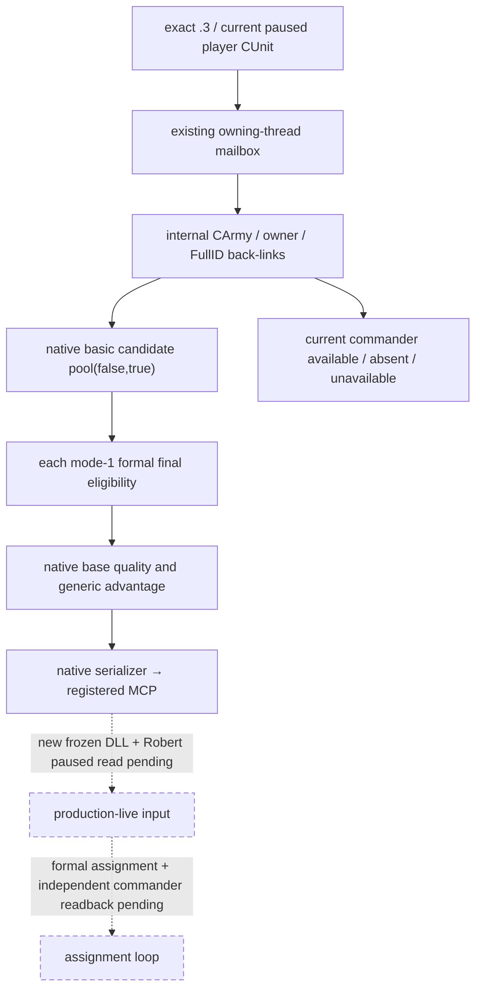

# CK3 1.20.0.3 当前玩家军队将领候选观测

2026-10-03 实现包，当前边界为 `static-ready`；组合 DLL 与 Robert 暂停帧实读尚待 ROOT 完成。实际必要性来自 Robert 当前玩家军队 `83886367` 的将领合法缺席：已有战斗查询能读取当前将领，却不能列出可任命人物。原生研究先于实现，见[候选与正式任命资格原生树](commander-candidates-and-assignment-12003.md)。

绑定为 CK3 **1.20.0.3 / Steam 25652598**，EXE SHA-256 `94B55397ABB687A3DCD436805A5D885E6BE90FA6C693FEB44A9E3BBEEADE02A6`。没有复制原版 scripted rule 来猜最终资格，没有调用任命 executor。

同一核心 MCP 新增 `ck3_query_army_commander_candidates_v1(army_id, expected_revision)`。ID 是当前可控玩家军队发布的 public **CUnit FullID**，内部先复用 `CUnit+0x178` 解析 `CArmy FullID`，再核对 `CArmy+0x124` 的 Unit 回链和 `CUnit+0x174` 的真实 owner。查询在现有 owning-thread mailbox 中读取一帧暂停状态，候选名单以 `0x2C11C10(owner,out,false,true)` 取得并复制，caller-owned native vector 经实际 allocator 的 vtable `+0x10`、alignment 8 释放。

每个候选以 full CharacterID 和 `Char` tag 回读实际存储，再调用 `0x2971510(1,candidate,army,null)`。**mode 1 是玩家／手动正式资格；mode 2 要求 AI controller，不能用于 Robert。** `can_assign=false` 是有效观测，不能当成读取失败。候选使用玩家列表的 basic pool，故暂不可任命人物仍列出，并由正式 predicate 单独标记。

两个质量输入分别发布：`native_ai_base_quality` 来自 `0x2C0B270(candidate)`；`generic_advantage_points` 来自现有 `0xC6DED0(candidate,-1,false)`。两者是独立原生整数，不互换、不称为胜率。当前将领另用 `available / absent / unavailable` 区分合法 `-1` 缺席与 generation／helper 读取失败；名单完整与单行资格／质量可用也独立表示。

此最小观测口不等待完整原生 AI 军队组排序、玩家自动配将 bits、目标地形 roll bounds 或完整政治 utility。这些分支已经在原生树记为后续质量输入，不能阻断目前缺席将领的单军功能施工。没有 CK3 实读时不能写成 live；没有正式任命与独立 `CArmy+0x120` 读回时不能写成任命完成、战争胜利或新增 G2 信用。

## 聚焦验收

严格 MSVC `/O2 /std:c++20 /W4 /WX` 编译 6 个真实生产／测试 TU，16 项原生断言与 3 份真实 serializer JSON → native driver／service → 注册 MCP 场景均 GREEN。场景覆盖合法无将领与 public CUnit 0、合法不可任命与零质量、已有将领但 final false、stale candidate generation 的 partial／null 质量；实际 native vector 释放 3/3。独立 wire 接线 4 个 TU 的严格 object compile 也 GREEN。

首次 bridge 手工编译缺少 CMake 派生宏、首次 fixture 缺少 3 个 executor 链接依赖，均保留为 harness RED；前者仅补齐编译宏，后者加入两个已有真实生产依赖完成，生产源码没有因这些 harness 错误反复修改。最终验收回执 `Z:/ck3_mod_rewrite_process_assets/g2-resume-20261003/commander-observer/fixture-attempt-02/RESULT.json`，SHA-256 `6e16ca4a6c251edfd670823ec74155139d15ec1106852a59f075a827f9eda772`。

可复用 native runner 位于 `native_bridge/research/run_ck3_12003_commander_observer_focused.py`；注册 MCP consumer 位于 `native_bridge/research/fixtures/run_army_commander_mcp_fixture.py`。验收仅使用隔离 projection 与 owned fixture bytes，没有 DLL 整体构建、CK3、SDK、窗口操作或游戏日推进。
