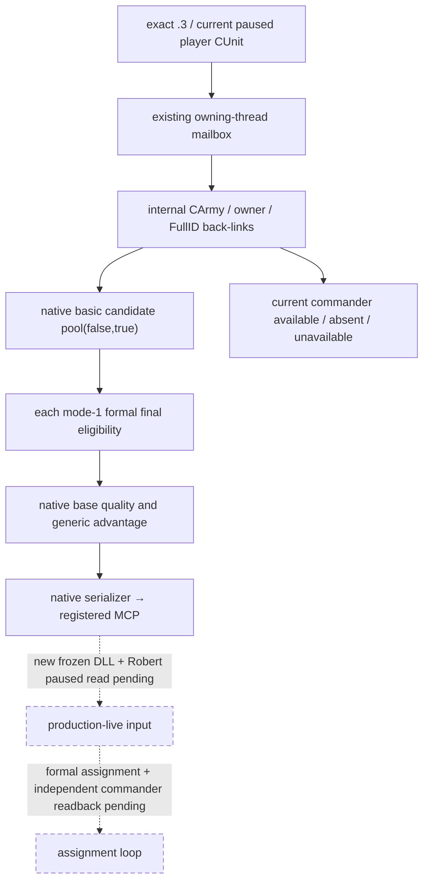

# CK3 1.20.0.3 当前玩家军队将领候选观测

2026-10-03 实现包，当前边界为 `static-ready`；组合 DLL 与 Robert 暂停帧实读尚待 ROOT 完成。实际必要性来自 Robert 当前玩家军队 `83886367` 的将领合法缺席：已有战斗查询能读取当前将领，却不能列出可任命人物。原生研究先于实现，见[候选与正式任命资格原生树](commander-candidates-and-assignment-12003.md)。

绑定为 CK3 **1.20.0.3 / Steam 25652598**，EXE SHA-256 `94B55397ABB687A3DCD436805A5D885E6BE90FA6C693FEB44A9E3BBEEADE02A6`。没有复制原版 scripted rule 来猜最终资格，没有调用任命 executor。

同一核心 MCP 新增 `ck3_query_army_commander_candidates_v1(army_id, expected_revision)`。ID 是当前可控玩家军队发布的 public **CUnit FullID**，内部先复用 `CUnit+0x178` 解析 `CArmy FullID`，再核对 `CArmy+0x124` 的 Unit 回链和 `CUnit+0x174` 的真实 owner。查询在现有 owning-thread mailbox 中读取一帧暂停状态，候选名单以 `0x2C11C10(owner,out,false,true)` 取得并复制，caller-owned native vector 经实际 allocator 的 vtable `+0x10`、alignment 8 释放。

每个候选以 full CharacterID 和 `Char` tag 回读实际存储，再调用 `0x2971510(1,candidate,army,null)`。**mode 1 是玩家／手动正式资格；mode 2 要求 AI controller，不能用于 Robert。** `can_assign=false` 是有效观测，不能当成读取失败。候选使用玩家列表的 basic pool，故暂不可任命人物仍列出，并由正式 predicate 单独标记。

两个质量输入分别发布：`native_ai_base_quality` 来自 `0x2C0B270(candidate)`；`generic_advantage_points` 来自现有 `0xC6DED0(candidate,-1,false)`。两者是独立原生整数，不互换、不称为胜率。当前将领另用 `available / absent / unavailable` 区分合法 `-1` 缺席与 generation／helper 读取失败；名单完整与单行资格／质量可用也独立表示。

此最小观测口不等待完整原生 AI 军队组排序、玩家自动配将 bits、目标地形 roll bounds 或完整政治 utility。这些分支已经在原生树记为后续质量输入，不能阻断目前缺席将领的单军功能施工。没有 CK3 实读时不能写成 live；没有正式任命与独立 `CArmy+0x120` 读回时不能写成任命完成、战争胜利或新增 G2 信用。

## 聚焦验收

严格 MSVC `/O2 /std:c++20 /W4 /WX` 编译 6 个真实生产／测试 TU，16 项原生断言与 3 份真实 serializer JSON → native driver／service → 注册 MCP 场景均 GREEN。场景覆盖合法无将领与 public CUnit 0、合法不可任命与零质量、已有将领但 final false、stale candidate generation 的 partial／null 质量；实际 native vector 释放 3/3。独立 wire 接线 4 个 TU 的严格 object compile 也 GREEN。

首次 bridge 手工编译缺少 CMake 派生宏、首次 fixture 缺少 3 个 executor 链接依赖，均保留为 harness RED；前者仅补齐编译宏，后者加入两个已有真实生产依赖完成，生产源码没有因这些 harness 错误反复修改。最终验收回执 `Z:/ck3_mod_rewrite_process_assets/g2-resume-20261003/commander-observer/fixture-attempt-02/RESULT.json`，SHA-256 `6e16ca4a6c251edfd670823ec74155139d15ec1106852a59f075a827f9eda772`。

可复用 native runner 位于 `native_bridge/research/run_ck3_12003_commander_observer_focused.py`；注册 MCP consumer 位于 `native_bridge/research/fixtures/run_army_commander_mcp_fixture.py`。验收仅使用隔离 projection 与 owned fixture bytes，没有 DLL 整体构建、CK3、SDK、窗口操作或游戏日推进。

## v36 Robert 实际暂停帧：将领名单观测已闭合

2026-10-03，当前玩家军队 **83886367 → CArmy50331794**、真实 owner **29829** 已通过注册 MCP `ck3_query_army_commander_candidates_v1` 实读，状态升级为 **production-live primitive（只读）**。native/source 为 `6b0e6bdfa6b18396394ce8f12301e464825f1f46`，PID90596 仅记录本次历史身份；日期 raw53236728、native/public revision2/2、connection generation2、query sequence1、episode `native-29829-2bc2d599f7f9`。组合 DLL SHA `bdb08f2e6cc7bc5afd4d65119e8d19ca5cf19fba50c1e356eb8fa892c1702c16`。

当前将领为合法 **absent**，FullCharacterID 为 null，原生读取没有失败。玩家候选 collector flags 为 `(false,true)`；名单完整，19 个真实候选全部 available、final eligibility observable、quality observable，正式 **mode-1 CanAssign 全部 true**，partial／unavailable 行为 0。mode 1 是玩家／手动最终资格，不能改成要求 AI controller 的 mode 2。

下面按已发布 native base quality 降序展示，候选 ID 均来自实际集合；它不是完整原生 army-group 分配结果。

| Character FullID | mode-1 CanAssign | native AI base quality | generic advantage points |
|---|---|---|---|
| 29829 | true | 29 | 29 |
| 34867 | true | 28 | 28 |
| 32716 | true | 23 | 23 |
| 33435 | true | 22 | 22 |
| 35637 | true | 14 | 14 |
| 43706 | true | 13 | 13 |
| 43712 | true | 13 | 13 |
| 36077 | true | 12 | 12 |
| 33437 | true | 11 | 11 |
| 34333 | true | 11 | 11 |
| 32023 | true | 9 | 9 |
| 43696 | true | 7 | 7 |
| 56513 | true | 7 | 7 |
| 30784 | true | 6 | 6 |
| 43699 | true | 6 | 6 |
| 38574 | true | 5 | 5 |
| 32440 | true | 4 | 4 |
| 38822 | true | 4 | 4 |
| 43700 | true | 1 | 1 |

Robert29829 的两个独立原生 getter 在本帧均为 **29**，是已发布质量的唯一最高值；34867 为 **28/28**，本帧差值 1。两个 getter 这一次相等不证明其一般等价；base quality 包含原生 modifier，不把 29 改称为独立读取的 martial skill，也不把 advantage points 称为胜率。完整原生 AI army-group 排序、owner 优先阈值与目标地形 roll inputs 的质量差距仍在原生树中，不阻断按真实 final-eligible 输入执行确定单军策略。

该查询024为 GREEN；40-call 容器整体 RED 留存其他叶的失败，不能改写那些失败。完整 final 暂停帧和正常 save4712 均存在：checkpoint SHA `31ef035624be4146e8f9f9743081e27b0418e18ea3f67d885252648e97a8b784`、日期 raw53236728。实读证据 `Z:/ck3_mod_rewrite_process_assets/g2-resume-20261003/runtime-preparation/v36-retry-02/actual-new-leaves-v36-01/024-ck3_query_army_commander_candidates_v1.json`；消费解释与输入 pins `Z:/ck3_mod_rewrite_process_assets/g2-resume-20261003/commander-observer/actual-v36-new-leaves-01/ACTUAL-COMMANDER-INTERPRETATION.json`。此 worker 只读取已完成文件，没有新 SDK、窗口、命令或游戏日推进。这里尚未证明任命完成／独立任命后态，不计战斗胜利或新增 G2 信用。

后续 ROOT 正式任命尝试 `actual-assignment-v36-01` 的005返回 RED：`application-main army-commander assignment executor unavailable or busy`。共同 mailbox 的 failure_flags512 已在动作前诊断002/003出现；assignment provider 已沿 exact source branch 确认该错误位于 `TrySubmit != submitted`，没有进入 assignment callback／原生命令 queue。这项任命未完成，保留失败并由 ROOT 修复真实 mailbox 故障后先独立读取当前 commander，不盲重发。该后续失败不改变 earlier query024 的完整只读名单证据；observer 保持 production-live primitive，不升级 assignment loop。失败 capture 正常 checkpoint 为 save4714、SHA `8a9e4345edb07ba6b6e118a6ad4eee12daecf21ab58bee095a346ff1d80119a5`；完整回执 `Z:/ck3_mod_rewrite_process_assets/g2-resume-20261003/commander-assignment-provider/actual-assignment-v36-01/result.json`。
