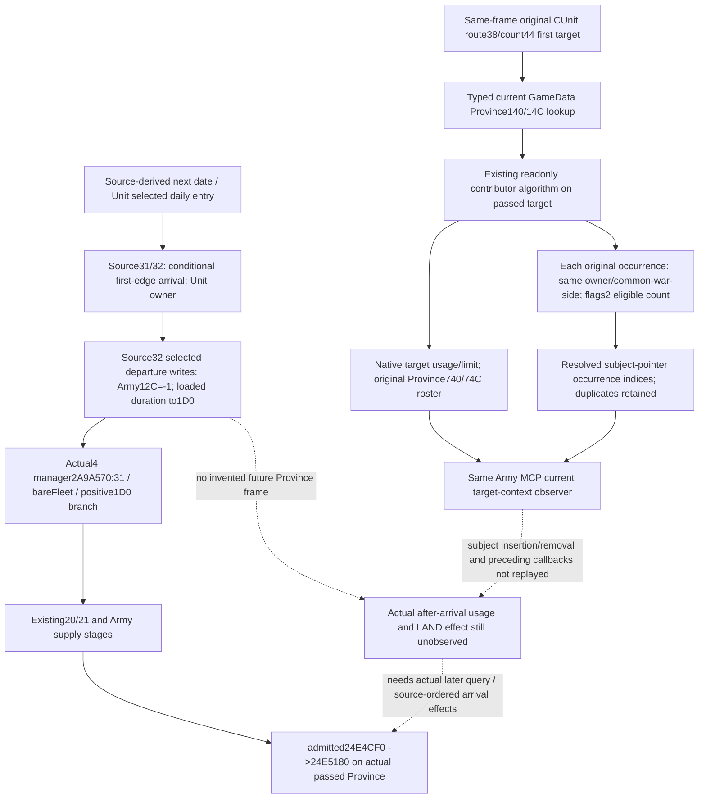

# Committed first-edge target supply contributors, CK3 1.20.0.4

2026-10-08 / ISO2026-W41. Exact installed build remains Steam25734779, executable SHA `98702f88a547cde2eaf29a85f93b85f68ee4cf8148336a4f7afaeb75319dd518`. This source package observes current target Province inputs through the existing `ck3_query_army_strengths`. It does not run movement or supply callbacks. New native/whole Service FIRST is **NOTRUN**, and this owner adds no game, SDK, process, EXE, build or test operation.

The actual R76 movement is Army218104048, Robert29829, Province2618 to2615, war100663329. That Root-provided context motivates the work; the new fixture uses synthetic IDs and receives no R76 live credit. The completed LAND next-stock package and Runtime28 qualification are reused without packet reads or replay.

## Native order and the decision gap

The existing next-date pair/full CDate source and Unit arrival branches are owned and closed separately. Source32's selected Army departure rule has actual target-definition byte1B at24E2416 and old-definition byte1B at24E241F. On its selected nonzero-target/zero-old branch it writes Army12C=-1 at24E2811, reads loaded5C69984 at24E281C and stores Army1D0 at24E2822. No semantic sea/land enumeration is invented for those raw bytes.

The full current LAND source24E5180 uses the Province passed at its actual rate stage. Existing target preview already captures target native usage/limit, component1AB and owner-versus-target resupply Boolean/loaded gain. Those observations are reused. Current LAND stock projection carries the original current Province operands; those operands cannot establish destination usage after arrival.

The retained actual4 daily manager2A9A570,1539B, tests Army31 at2A9A97E. In its non31 branch it calls bare Fleet24E8440 at2A9A9A9; the true branch reads loaded5C69984 at2A9A9B2, and the false branch decrements only signed-positive Army1D0 at2A9A9C4. Common store is2A9A9C6, before the existing20/21 stages. This is source ordering, not an additional timer observer or a future timer result. The loaded rule is Source32-owned.

The selected missing input is **the committed target's actual ordered contributor roster and whether the subject is already included**. Adding total Strength soldiers to a target scalar would mix flags0 with the native flags2 eligible contribution and could count an original duplicate twice. The existing current Province packet does not expose the destination roster.

## Source-use ledger

| Reused source | Exact meaning used |
| --- | --- |
| `ck3_12002_army.cpp` base/current contributor seam | Actual Unit/Army generation-bound join and same-query inputs; the new collector is called after current contributors and before resupply. |
| `ck3_12003_current_province_supply_contributors.cpp:39–86` | Resolve each original Unit; same-owner or actual common-war-side inclusion. Included Army uses descriptor+38 with flags2, retains Regiment order and native eligibility. |
| Same file121–141 | Native limit/usage are called with its passed Province. Original Province+740 IDs and +74C count are read without subject insertion or deduplication. The implementation has no subject-current-Province or membership requirement. |
| Source31/32 current committed target | The original first route ID comes from Unit38/count44; typed target Province resolution is current observation. Source32 definition/rule inputs remain owned by Unit owner and are not republished here. |
| Existing readonly preview target sibling | Component1AB, resupply Boolean, loaded gain, native target limit/usage already exist. No new duplicate getter, RVA or numerical source capture is needed. |
| `support_2A9A590-DETAIL.json` held actual4 instructions | Daily manager's actual31/Fleet/1D0 order described above, normalized-equal full1539B. No bytes reread or recapture. |

The native helper reuses the existing contributor implementation for a distinctly labeled current target context. The original current Province field, wire source and reader contract remain independent. Full resolved subject pointer equality identifies actual matching roster positions, rather than interpreting a raw ID coincidence as arrival. Legal empty target roster has complete inputs and zero matching positions. Partial/unresolved target roster keeps a nullable included count, so an unreadable occurrence is not a proven absence.

## Observer and consumer contract

New optional Army row sibling is `current_first_route_target_supply_contributors_v1`, with16 keys. It contains source/status/reason/readiness, subject Unit/Army and current/first-target Province IDs, original route count, the unchanged14-key contributor packet, original matching occurrence indices and nullable included occurrence count. Input basis is `captured_committed_first_route_target`. Three explicit fields remain false: actual arrival, actual after-arrival usage and complete arrival supply transition.

The Service exposes the same sibling as a current input projection, joined to the original same-frame Army context's first committed target. It does not add an MCP tool, preview route, pending command, current-stock overwrite or computed future usage. The independently qualified scalar usage, flags2 count and original roster are preserved.

Three new whole scenes cover a genuinely empty target, two original subject occurrences, and a foreign excluded occurrence followed by an unresolved ID. The real Strength reader and full serializer produce the packets; the sole registered Service compound consumes those bodies with outer correlation rebinding only. New target FIRST and sole consumer remain Root-only/NOTRUN. No older GREEN is replayed.

## Exact continuation and owned cost

The next numerical dependency is the source-ordered roster insertion/removal at the actual selected arrival, including whether it inserts the subject once and how existing occurrences are handled. Source32's pre-store/departure writes alone do not prove that roster update. This observer supplies its missing original target operands; it does not introduce a new general readiness gate.

External package and precise shared hooks: `Z:/ck3_mod_rewrite_process_assets/g2-parallel-20261008/army-first-target-contributors-12004/`. New mapper/EXE/body/decode/hash reads0; no current31/24E3410/24E5180/LAND stock source recapture. Native source child reuses the held manager DETAIL once for selected instruction metadata, and both children inspect only necessary existing contributor source/DTO contracts. Root owns shared hook adoption, source freeze, build, unique FIRST and any eventual paused-game observation.
