# CK3 1.19.0.6 原生军队移动、接触与同日冲突决策树

## 范围、版本与证据边界

- [static-confirmed] 本文只适用于 CK3 `1.19.0.6`、
  `Crusader Kings III/binaries/ck3.exe` SHA-256
  `2D00FF3101EF70B566F2FCBAE292F09263199C80E9DC8F139B82D7D96F83DB86`；所有 RVA 都以该模块
  基址为零点。
- [static-confirmed] 原版数据来自同一安装包。用于本页上游目标选择与接敌/避战门槛的冻结文件为：

  | 文件 | SHA-256 |
  |---|---|
  | `game/common/ai_war_stances/_ai_war_stances.info` | `0F01AAAB6922FDCA19B87A4421768F83B0C75534A128A73AF8CECADD52F6205E` |
  | `game/common/ai_war_stances/00_ai_war_stances.txt` | `4F5AA322C4D7272338F4C7B111B7462D4A1FEC886E93E7178084D318CEB8E294` |
  | `game/common/defines/ai/00_ai.txt` | `C78F9CD8DF9938CC9F38E817BCB6E32CD13720B5BD9DE077B85E3E1C6F030293` |

- [static-confirmed] 本轮新增结论来自冻结 EXE 的静态反汇编、direct xref 与数据布局互证；没有启动 CK3，
  没有 live snapshot，也没有调用任何会推进时间或构造战斗的函数。
- [static-confirmed] 上游 **AI 选择去哪里、是否接受危险路径** 与下游 **单位已经落入同一省后怎样组成战斗**
  是两条不同的链。后一条是所有合格军队共用的引擎接触规则，不会因为 initiator 是 AI 而重新计算 stance、
  objective score 或 `combat prediction ratio`。
- [unknown] 本页已经闭合 normal daily movement 的同日排队顺序，但没有把事件、脚本传送、撤退结束及其它
  非 daily placement 入口强行归并成同一顺序合同；这些入口仍以虚线 `unknown` 表示。

证据标签沿用 [README.md](README.md)：`static-confirmed` 是原版数据或 exact-build 执行分支直接支持，
`inference` 是尚缺独立执行分支的解释，`unknown` 是不能据此实现原生行为的缺口。Mermaid 的 unknown 边和节点
一律使用虚线。

配套的只读 scope ABI、机器 fixture 与 future paused-live gate 见
[actual-contact-scope.md](actual-contact-scope.md)；本文只负责原生行为树与证据边界，不把静态闭合写成已发布 capability。

## 一张图：从原生 AI 目标到实际接触

[army-controller.md](army-controller.md) 已给出完整 stance/objective 表和 target-score 参数；
[combat-prediction.md](combat-prediction.md) 已给出 ratio 算法与严格等号语义。本节只把它们与本页新闭合的
movement/contact 链接起来，不另造一套目标评分。

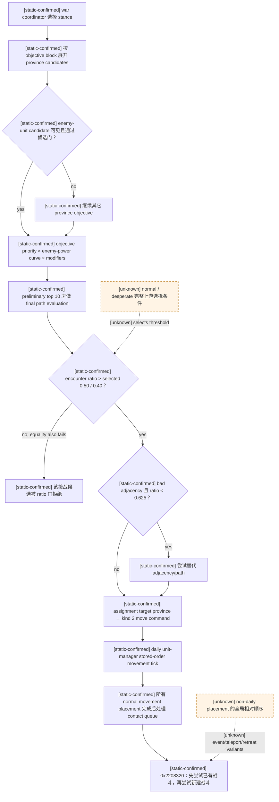

关键边界如下：

- [static-confirmed] stance 先按 side、relative power 与 `desperate` 属性过滤，再执行 `can_be_picked`，最后采用
  最高 `ai_will_do` weight；同分规则仍是 [army-controller.md](army-controller.md) 中的 unknown。
- [static-confirmed] `enemy_unit_province` 只为可见敌军生成候选。敌军约等于本 stack `0.5` 倍 power 时，
  原版目标曲线达到峰值；final pathfinding 只进入 preliminary top `10`。
- [static-confirmed] normal/desperate 接战门分别是严格 `ratio > 0.50` / `> 0.40`；等于阈值仍拒绝。
  `ratio < 0.625` 才尝试规避 bad adjacency，`>= 0.625` 不由该门绕路。
- [static-confirmed] 这些门决定 AI 是否把危险省份/路线当成可接受候选。单位一旦由 movement placement 落入
  同一省，`0x2208320` 不再读取这些分数；它只按关系、单位/战斗状态及内部表顺序解决接触。

## normal daily movement 的同日顺序

### exact-build 调用链

| 证据 | RVA / 布局 | 已证行为 |
|---|---|---|
| [static-confirmed] | `0x27F9B50..0x27F9BC5` | 入口先冻结 CUnitManager `+0x20` CUnitID data 与 `+0x2C` count 对应的 end，再按原 stored order 遍历，generation-resolve 后对有效 CUnit 调 `0x2247C50`；RTTI 对应主/次 vtable RVA `0x4340468/0x43404A0`。 |
| [static-confirmed] | `0x2247D3C..0x2247D94` | movement tick 把 speed 加入 `CUnit+0x168` progress，走 native edge-completion branch 后扣 edge cost、pop route head。 |
| [static-confirmed] | `0x2247ED9`、`0x2247F19` | daily normal path 把传给 placement commit 的三字节结构之 byte 0 写为 `0`，随后调用 `0x224B1B0`；byte 1/2 的完整业务名未查明。 |
| [static-confirmed] | `0x224B456..0x224B460` | placement commit 读取该 byte 0，并调用 `0x220BAA0(target_province, CUnitID, byte0)`。 |
| [static-confirmed] | `0x220BAF0..0x220BB7A` | 先拒绝重复 CUnitID，再以 unsigned full CUnitID 数值做 lower-bound 插入 `CProvince+0x748`，count 在 `+0x754`；因此该省单位表是数值升序，不是抵达顺序。 |
| [static-confirmed] | `0x220BB7F..0x220BBEF` | byte 0 为 `0` 且 `CUnit+0x18 == 0` 时，解析 `CUnit+0x178 → CArmy`，把 full CArmyID 送入 contact queue。 |
| [static-confirmed] | `0xA886F0..0xA887DC` | queue helper 只在尾部 append；扩容时保持既有顺序，不排序、不去重。 |
| [static-confirmed] | `0x27F9BCC..0x27F9BEB` | unit manager 全表 movement tick 结束后才 tail-call `0x27C0E90`；所以本日 normal placements 全部先完成，随后才集中接触。 |
| [static-confirmed] | `0x27C0E90..0x27C1029` | 入口冻结 manager-like object `+0x98` CArmyID data 与 `+0xA4` count 对应的 end，再按 queue order 处理；已有 active CCombat 的 army 跳过，否则以当前 `CUnit+0x20` Province 调 `0x2208320`，循环后把 count 清零。 |

[static-confirmed] 因而 normal daily path 的同日 tie 不是随机掷骰，也不是“画面上谁离得近”：

1. unit manager 的 `+0x20/+0x2C` stored order 决定各 CUnit 本日 movement tick 的先后；
2. 成功 normal placement 的 CArmy 按该先后 tail-append 到 contact queue；
3. 完成所有 movement 后，`0x27C0E90` 才按 queue order选择 initiator；
4. 此时 target Province 已含本轮全部 placement，且 `+0x748/+0x754` 按 full CUnitID 数值升序；
5. 所以后述“第一个合格 opponent”取自**移动完成后的数值升序省份表**，不取自 arrival queue；
6. 先处理的 initiator 若创建了 CCombat，后续 queued army 会先看到该现有战斗，或因已经链接 active combat 而跳过。

[static-confirmed] 若单个 CUnit 在其一次 `0x2247C50` 执行中产生多个 placement commit，append helper 仍保持该
CUnit 内部的实际调用顺序；全局不做二次排序。

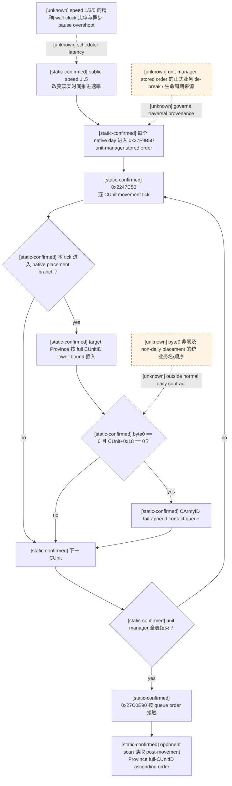

这里闭合的是 normal daily movement 同日规则，不是把 unit manager stored order猜成“创建时间”或“ArmyID 排序”。
反汇编证明遍历和传播顺序，却尚未证明该 manager 表为什么形成当前顺序。

### 时间线速度不会替代 daily movement/contact 计算

- [static-confirmed] public `set-speed-1..5` 只把 user-facing `1..5` 映射为 native `0..4`，经
  `CSetGameSpeedCommand` 写入 `CGameState+0x70`；同一 exact build 的 normal daily movement/contact 链仍以每个
  native day 为单位进入 `0x27F9B50 -> 0x2247C50 -> 0x27C0E90`。本文已闭合的 movement stored order、Province
  数值序与 contact queue 规则没有按 public speed 分叉。因此较高时间线速度不会省略 CK3 的逐日 movement/contact
  计算；它只让这些 native day 在更短现实时间内被调度。
- [live-confirmed] 2026-08-23 的 minimized exact-build probe 已实际提交 `set-speed-3`、`resume-map`，观察
  `date_raw=53171400 -> 53171424` 后提交 `pause-map` 并回读 `paused=true`。这证明 speed 3 可执行相同的
  paused -> running -> date tick -> paused 原生命令链；它不单独证明活动战争下每次都只越过一个日界。
- [live-confirmed] 2026-08-27 的正式一代长跑又反证 speed 1 不是“严格逐日”保证：当前恢复段的成功
  speed-1 `life-advance` 已出现 `elapsed_days=2` 与 `3`。所以 planner 必须按 action 自报的实际 date delta 和
  更新后的 paused state 验证，而不能把 speed 数值当作计算次数或日界上限。
- [unknown] 1/3/5 速的精确 wall-clock tick 比率、world-size/load 对 pump latency 的影响，以及异步
  `pause-map` 在 speed 3/5 下的最大 overshoot 尚未闭合。任何提速 counter-policy 都必须保留 paused 后置回读；
  battle、retreat、Assault 和已证明的一日 route-contact transaction 不得仅凭上述 speed-3 probe 放宽。

## 多支可控军队：同一日界、逐军状态与实际接触

- [static-confirmed] 游戏日期是全局推进的，但 `0x27F9B50` 逐项读取 unit-manager 中的 CUnit；每个 CUnit
  各自保留 current Province、active MovePath 与 movement progress。原生 controller 的
  `CAISubunitStack` assignment 也逐 stack 解析并提交各自 move command。不存在“只要一支军队的一日路线安全，
  其它玩家军队就自动安全”的原生分支。
- [static-confirmed] 反过来也没有“某敌军未来 route 经过静止军所在省，就在当前日立即接触”的原生分支。
  normal daily 接触只在本日所有实际 movement placement 完成后，由 contact queue 对当时 Province 中的单位执行
  `0x2208320`。未来 route vertex 是 planner 的风险包络，不是原生 contact trigger。
- [static-confirmed] 因此多军团的一日放行必须把两层语义分开：CK3 只执行一次全局日界；我方在放行前则要对
  每支可能在该日接触的可控军队分别取得可审计证据，再对这些证据取 conjunction。该 conjunction 是
  counter-policy，不是 CK3 原生 AI 的全局 horizon 对象。

### 2026-08-28 正式长跑帧：遥远 route vertex 被误当成当前威胁

[live-confirmed] 正式一代长跑 PID `42596` 在 paused `snapshot_id=native:167`、service revision `168`、
native revision `167`、`date_raw=53212728` 遇到真实 planner blocker。报告位于
`C:/Users/xenoa/AppData/Local/Temp/xar-marriage-reject-c21c096-state/runs/20260827T192055Z-one-generation-1d8c0f50/report.json`，
SHA-256 `FC7D4E5069C84A4D10A3E5359A387C3F9BD5CD422FFE20D45ACCEB0ADDD4DF90`；冻结
`first-blocker.json` SHA-256 为
`AB9FDD76D0251070F1A12AAE8CAE51C2CB23B0CA675EF229DF42724C35500AB0`。该 run 使用
`ck3-1.19.0.6-msvc-x64` adapter；本地 exact EXE 复核仍为本页冻结 SHA。

- [live-confirmed] 六支可控军中，Army `33554818` 与 Army `150995278` 同在 Province `8658`。前者为
  `embarked`、有已提交 target `5715` 和 route；后者为 `regular`、无 target、route 为空，确实是独立的
  stationary CUnit，而不是 moving row 的别名。其余四支 stationary army 均在 Province `2619`；三支
  non-retreating hostile 为 `83886265 / 117440646 / 117440838`，本帧没有玩家 combat 或 retreat。
- [live-confirmed] 对 moving Army `33554818` 的 fresh typed horizon 保留完整 hostile scope，并返回
  `one_day_contact_free=true`、窗口 `[53212728,53212752]`。同一结果中的 enemy `117440646` active route
  虽然最终穿过 Province `8658`，其原生 arrival timeline 到该省是 `53215944`：距当前 `3216` raw hours，
  即 `134` 游戏日。moving subject 的首个 arrival 也要到 `53212848`，所以它在这一日窗口内仍占据当前省。
- [live-confirmed] 旧 geometric stationary 检查只问 `8658 in enemy.route_province_ids`，不读取 arrival；于是把
  `134` 日后的 vertex 立即归类为 `enemy_route_to_stationary_province`，令 Army `150995278` 阻断已经通过的
  moving horizon。这是我方 counter-policy 的时间维度丢失，不是原生 contact resolver 报告危险。

[live-confirmed] commit `1048a45` 的 cold replay 已经实际提交第二条 query：driver history index `3176` 是
`query-route-contact-horizon-v1-150995278-to-8658-h-3-83886265-117440646-117440838`，但 application-main reader
返回 `route_unavailable`，外层错误为 `CK3 could not build a complete contact route`。run 位于
`C:/Users/xenoa/AppData/Local/Temp/xar-marriage-reject-c21c096-state/runs/20260827T195517Z-one-generation-fb0d980b/`；
`report.json` SHA-256 为 `396003CC8C325C0D2B8B02082E0F2B19831DC52E90922354725234FD012655F1`，
`first-blocker.json` SHA-256 为 `04017F1AE0D414EA755168F7D534481D4B3B6A0476064645E7AA7F55A219ACC8`。
同帧 moving query index `3175` 仍成功，故失败不是 hostile scope、暂停态或 mailbox 不可达。

[static-confirmed] 这里必须区分“wire/schema 能表达”与“exact-build reader 能生成”：Python normalization 接受
`target=current`、空 subject route/arrival arrays，`BuildTimelineIntervals` 也会把这种 timeline 解释为 current Province
覆盖完整闭区间 `[horizon_start,horizon_end]`；但 `BuildSubjectRouteTimeline` 只对**非空**且末端等于 target 的 committed
route 直接调用 `BuildActiveRouteTimeline`。空 route 会先调用
`get_army_move_mode(unit,current,1)`、再调用 `resolve_move_origin`，之后才到 same-current early return。对本帧
`regular` hold，生产 reader 在这些前置中返回 `route_unavailable`；当前粗粒度 status 不能再区分是 move mode `2`、
origin 为 null，还是空 route 下 origin 不是 current。此前把后置 same-current 分支写成“现有 reader 已支持 stationary
query”属于证据误读，现已由 live artifact 纠正。

[static-confirmed + counter-policy] 不需要第二条 subject query，也不需要修改 native ABI。成功的 moving query 已在同一
paused revision 返回**完整 hostile scope 的全部 `hostile_routes` 和原生 arrival dates**；bridge 只有在
completion/current/previous 三份完整 snapshot 相等时才发布结果。因此可以把同一帧中每支明确为
`regular/sieging`、无 target、空 route、非 combat/retreat 的玩家军建模成只读 hold occupancy，并严格复刻原生
`BuildTimelineIntervals` / `ClosedIntervalsOverlap`：

- stationary occupancy 是 `[horizon_start,horizon_end]` 闭区间；
- hostile current Province 占用 `[horizon_start, first_arrival]`，空 route 时占用到 horizon end；每个 route Province
  占用 `[arrival[i], next_arrival 或 horizon_end]`，所有边界都闭合；
- 因而敌军已经在 stationary Province，或对该 Province 的任一原生 arrival `<= horizon_end`（包括恰在一日末端）时
  都必须判 unsafe；本帧 `53215944 > 53212752`，所以 `8658` 在下一日没有 same-province overlap；
- stationary subject 没有 edge，只需重投影 `same_province`，不得凭空产生 `opposing_edge`；moving subject 自身的
  opposing-edge 仍由原生 query 结果负责。

[counter-policy] 最小入口是让 planner 与 advance-step advertisement 共用同一个 closed-interval helper：从 fresh moving
horizon 取得 hostile timelines，对同一 snapshot 的所有 stationary rows 重投影，再与 moving
`one_day_contact_free=true`、其它 geometric-safe rows及无 combat/retreat 条件取全局 conjunction。只有 conjunction 为真才
复用原有 moving-proof-bound one-day advance；任一 timeline、date/revision/connection/episode binding、hostile scope 或
stationary shape 不完整时继续 reroute/hold/block。该复用是我方基于同帧原生 hostile timeline 的派生判定，不冒充
stationary ArmyID 自己取得了 native subject proof。推进后仍重读全部 ArmyID、route、combat、retreat 与 paused date。

[static-ready, live replay pending] 共享 hostile timeline 方案尚未从该 durable checkpoint 完成 fresh replay，不能标
production-live。现有一日 predicate 也不宣称预测窗口内可能发生的原生 retarget/invalidation，更不授权 speed 2..5 或
多日 tranche；这些边界沿用既有一日 paused-to-paused 合同，不为本 blocker 扩张。

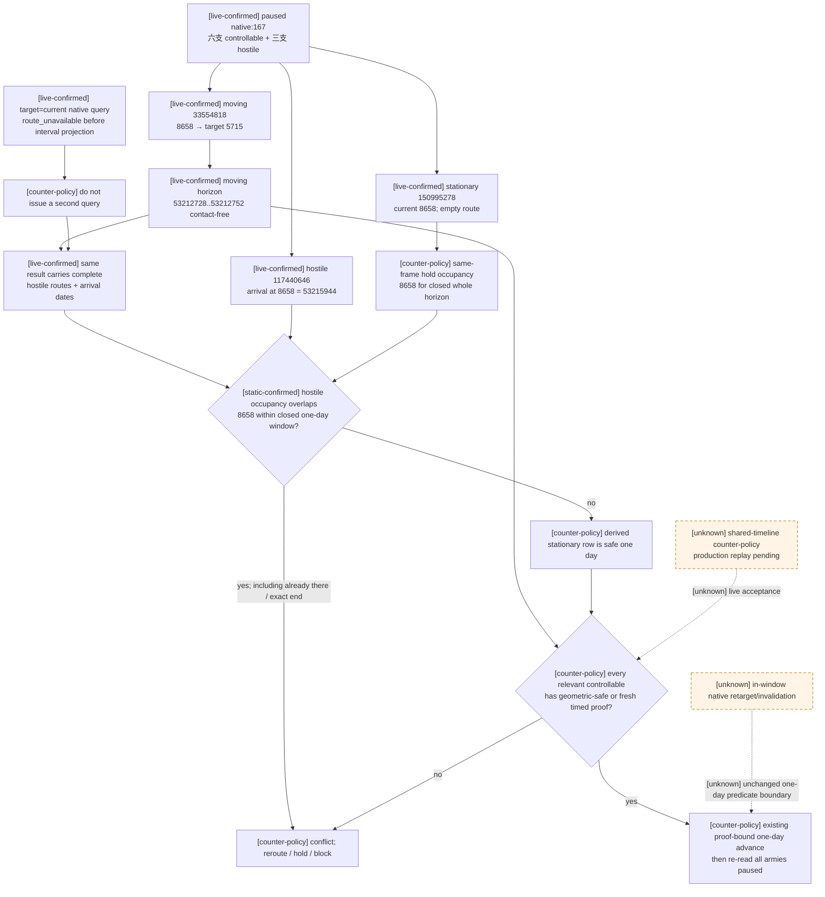

### 2026-08-30 G2 长跑帧：全静止目标缺少可复用的 hostile timeline

[production-live blocker] G2 attempt04
`C:/Users/xenoa/AppData/Local/Temp/xar-marriage-reject-c21c096-state/g2-runs/20260830T151352Z-next-episode-df7f4dc1/`
从第二角色的 durable checkpoint 连续执行到 turn `734` / `date_raw=53290584` 后停在
`native_war_no_safe_exact_route`。`report.json` SHA-256 为
`460985436DBA413D814F967F16B2F6BC7F6F8CA0A9B6C727D8DCBFF2799C3E07`，`first-blocker.json`
SHA-256 为 `B8922DE00F164A9B65DD79AE3DD4CEE282F01071C4274D574E316597FCE53EE5`；最后 durable
checkpoint 为 turn `722` / history `1918` / `date_raw=53290248` / SHA-256
`B3A9FF0C5DDC2BED5718B1FA0AC79BD6D137EE4F9FCA64C1934FB434BC2D9A23`。角色 `29829` 仍存活，
session、shutdown、进程树和 driver cleanup 均为 GREEN。

- [production-live blocker] 本帧只有一支可控 Army `134218218`，它已停在 exact objective Province `2619`，
  无 active route。三场战争均仍 active；敌 Army `167772532` 当前在 `2604`，target 为 `2619`，remaining route
  为 `[2605,8757,2615,2616,2617,2618,2619]`。旧 `_stationary_province_threats` 只按 route membership
  产生 `enemy_targeting_stationary_province`，没有 arrival date，因而把“未来会到”直接当成“下一日会接触”。
- [production-live blocker] 这次不存在可作为 subject 的 moving 玩家军，所以 2026-08-28 已闭合的“从同帧 moving
  horizon 复用完整 hostile timelines”没有输入。保守停止是诚实的，但它现在已成为第二角色完整寿命长跑的真实 blocker。
- [static-confirmed] 同一 frozen exact-build reader 的 `BuildActiveRouteTimeline` 已能验证 CUnit current Province
  指针、读取 active MovePath header，并在 route count 为 `0` 时发布 `current_province_id`、相同
  `effective_origin_province_id` 与空 route/arrival arrays。`BuildTimelineIntervals` 随后会把该 row 投影成覆盖整个
  `[horizon_start,horizon_end]` 的闭区间。完整 hostile scope、每条 hostile active timeline 以及 before/after paused
  snapshot equality 门禁也已经存在；缺口仅是 `BuildSubjectRouteTimeline` 在 same-current empty-route 情形仍先走
  `get_army_move_mode/resolve_move_origin`，使这些既有只读能力不可达。
- [counter-policy] 最小原生扩展不新增 schema 或命令：仅当 subject 可控、`regular/sieging`、非 combat/retreat、
  move target 已明确为空、公开 route 为空、request target 等于 current Province，且 raw active MovePath header 也确认
  count 为 `0` 时，直接复用 `BuildActiveRouteTimeline` 构造 stationary subject timeline。其它 target、状态或不完整
  shape 仍走原路线构造或 fail closed；hostile scope 与原子 before/after 绑定不变。
- [counter-policy] Python 只为上述 exact stationary hold 广告 `target=current` horizon。fresh query 若证明下一日
  contact-free，才广告既有 proof-bound one-day advance；若证明 current-Province contact unavoidable，则仍走既有严格
  contact-transition 后置；任何 unavailable/stale/conflicting 结果继续保持暂停。该入口不授权多日 hold、猜 ETA、按 hop
  数估时或把 contact-free 改写成“战斗有利”。

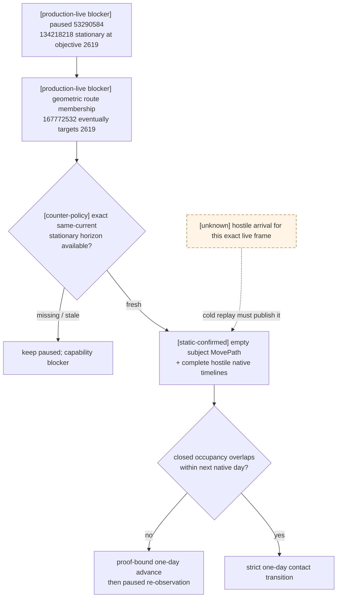

### 2026-08-31 G2 实机闭环：stationary hostile timeline → 严格接触转换

- [production-live] attempt05
  `C:/Users/xenoa/AppData/Local/Temp/xar-marriage-reject-c21c096-state/g2-runs/20260830T155719Z-next-episode-f2241f93/`
  用 DLL SHA-256 `8E0770310DCB1CCA43AFC1FE63E9431735985F045BE2C0B771E5EDEE3AA8A262`
  从 `53290248 / history 1918` 冷恢复。新 stationary query 在旧 blocker `53290584` 返回可用时间线，随后连续推进
  到 `53291856`；本次共 `152 attempted / 151 successful / 55 visible gameplay`。这证明
  `target=current + raw empty MovePath` 入口已在 production loop 可达，不再把未来 53 日后的 route vertex 当成次日接触。
  最后 durable checkpoint 为 `53291832 / history 2085 /`
  `1B24C2486BF2258D3DBA8B201FB9AAC15B7B62825CAAA1330C14C3DD7B9EB7C6`；report SHA-256
  `D23D36FFAB490825493F8EE742B4C3DD2FBEEBAF89BC3787A362746118EA0CED`。
- [production-live] `53291856` 的 fresh horizon 又给出真实冲突：stationary player Army `134218218@2619`，
  hostile `167772532` 将在闭区间端点 `53291880` 到达同省，`one_day_contact_free=false`。旧 planner 在这里仍停止，
  因为通用 `unavoidable_current_province_contact_in_horizon` 只接受非空 moving subject route；这是 attempt05 的新
  capability RED，不是否定 stationary reader。
- [counter-policy] stationary 冲突不能抢在可用撤离路线前执行。planner 先保存这一份同省 proof，继续检查全部
  exact-objective candidates；只有其它 exact objective 都被拒绝时，才选择 speed-1 proof-bound contact transition。
  driver 对 stationary proof 仍要求 `target=current`、空 subject route/arrival、完整 hostile scope 与同一 snapshot 绑定；
  endpoint marker 另要求 subject 前后均保持 stationary，不能把 ACK 或单纯跨日当成接触。
- [production-live] attempt06
  `C:/Users/xenoa/AppData/Local/Temp/xar-marriage-reject-c21c096-state/g2-runs/20260830T160740Z-next-episode-c2ef48a8/`
  从 `53291832` 冷恢复。`53291856→53291880` 的第一日严格转换只得到
  `predicted_contact_boundary_reached`，没有冒充已接触；唯一允许的相邻日 follow-up 随后在 `53291904` 直接观察到
  player `134218218` 与 hostile `167772532 / 251658360` 的真实 active CombatID 状态，后置为
  `active_combat_observed`。这把 stationary horizon → endpoint marker → actual combat 的完整 OODA 边界升为
  production-live。durable checkpoint 为 `53291904 / history 2096 /`
  `0D5B9F116DDAEFCD7C8DE0A9446924B88814D78FFBBD35FFD1F5E10C8D812858`；report SHA-256
  `8144BC04E7FB905AE9F212EFEDDB94C2EABF6B0C2751A5E4793AEF89F81F3014`。
- [production-live blocker] 同一 attempt 的下一 turn 首次读取
  `query-battle-control-snapshot-v1-134218218` 时，原生 query 返回
  `CK3 battle-control state changed during query`。这发生在新 combat 已落盘、checkpoint 已保存之后；当前只记为待冷恢复
  区分的一次 query RED，尚不能声称是稳定 capability 缺口。first-blocker SHA-256
  `E0F3DFD147B92FB1E96A5D081E14D6BAE82A93376505CDA05C5971D2D68ABC88`。

### 2026-08-31 G2 冷恢复结论：接触已物化，旧 consumer 错拒 signed full CombatID

- [production-live correction] attempts 08/09 从 `53291904 / history=2096 / 0D5B9F11...2858` 冷恢复后稳定复现
  query RED；attempt10 唯一一次 `+24h` 仍被旧“positive CombatID”门拒绝。exact-build resolver 证明 low24 只用于选槽，
  object identity 必须与完整 signed dword 相等；因此负值不是“接触尚未物化”。
- [production-live] attempt12 同帧双查询读到稳定 `CombatID=-2147483647 / BattleResultID=-2046820351`；attempt16 又让
  该身份经过一次 7 日 speed-3 battle decision epoch，并在 `combat_roster_changed` 原生日界停表后 paused 重读为同一 ID、
  phase `main`。新 durable checkpoint 为 `53292072 / history=2103 / ED031039...C8E3`。
- [readiness boundary] stationary timeline→endpoint marker→actual combat→battle action→paused verification 这条相邻 OODA 链已
  production-live；G2 第二角色仍存活，完整寿命、死亡结算与再跨 episode 尚未完成，不能由这一切片冒充。

### 2026-08-28 正式长跑帧：第二条几何安全 active route 被 capability gate 丢失

[live-confirmed] 正式一代长跑在 paused `snapshot_id=native:578`、service revision `579`、native revision
`578`、`date_raw=53220312` 暴露了另一个多军团 blocker。run 位于
`C:/Users/xenoa/AppData/Local/Temp/xar-marriage-reject-c21c096-state/runs/20260828T000753Z-one-generation-a09470a0/`；
`report.json` SHA-256 为 `AFEECF331F298F73F41D62A4CA78AE1C69C5BD09850EF4E692394645FDA12809`，
`first-blocker.json` SHA-256 为 `52C46EA6AA0335A7A7086021EC5B3FD1BF2AC373AFE1673C9B8E8659C0AAAD50`。
这不是 CK3 原生查询、hostile scope 或 action capability 缺失：同一 DLL、同一 session 已连续为 Army
`83886358` 执行 proof-bound 一日推进；本帧对新 subject Army `117440751` 的 query 也已成功返回 fresh
`one_day_contact_free=true` 及完整六敌军 timed routes。

- [live-confirmed] Army `117440751` 位于 Province `2619`，active route 为
  `8651 -> 1109 -> ... -> 3610`。该 route 与六敌军的 current/target/route envelope 相交，故 planner 正确要求
  fresh timed horizon；其窗口 `[53220312,53220336]` 无实际 timed conflict。
- [live-confirmed] 另一支 Army `83886358` 已抵达 Province `8651`，仍以 `embarked` 状态沿
  `1109 -> 3553 -> ... -> 3610` 前进。多个 hostile 的 future target/route 确实包含其 current Province
  `8651`，但最早 arrival `53220408` 晚于 horizon end `53220336`，所以 closed-interval timed occupancy 证明
  它本日仍安全；`8651` 之后的 remaining route 再与六敌军通过 current/target/shared-next-hop/route-vertex/
  opposite-edge 几何审计互斥。它就是既有全局审计中的 geometric-safe moving row，而非 stationary row。
- [implementation-confirmed] planner 已把 `83886358` 排除在 `other_unsafe_armies` 外，但 driver 的动态
  `_route_contact_advance_scope_isolated` 只接受“subject + 其余全部 stationary”。所以同一 fresh proof 能被 planner
  消费，却没有被投影为 composite action step，最终产生
  `native_war_route_contact_horizon_progress_unsupported`。缺口位于我方 capability advertisement 的多 subject 映射，
  不是原生 AI 决策树新增输入，也不需要 bridge ABI 或额外 native query。

[counter-policy] 最小修复是把既有 conjunction 如实落到动态 capability gate：subject 继续必须有 fresh、同帧、
完整 hostile-scope timed proof；每一条其它 active player route 必须结构完整，并以该 proof 中同一组 hostile routes
先验证其 current Province 的 closed-interval occupancy 在一日窗口内无接触，再通过与 planner 相同的 conservative
remaining-route geometric audit；stationary row 继续使用同一 closed-interval occupancy 投影。任一其它
moving route 有 current/target/route/shared-next-hop/opposite-edge 冲突，或任一 shape 不完整，仍不得广告一日推进。
执行后仍只推进一个 native day，并重读全部军队。该修复不会把一支 Army 的 timed subject proof冒充为另一支的 timed
proof；它只恢复文档和 planner 已定义的“fresh timed subject + 其它 geometric-safe rows”全局 conjunction。

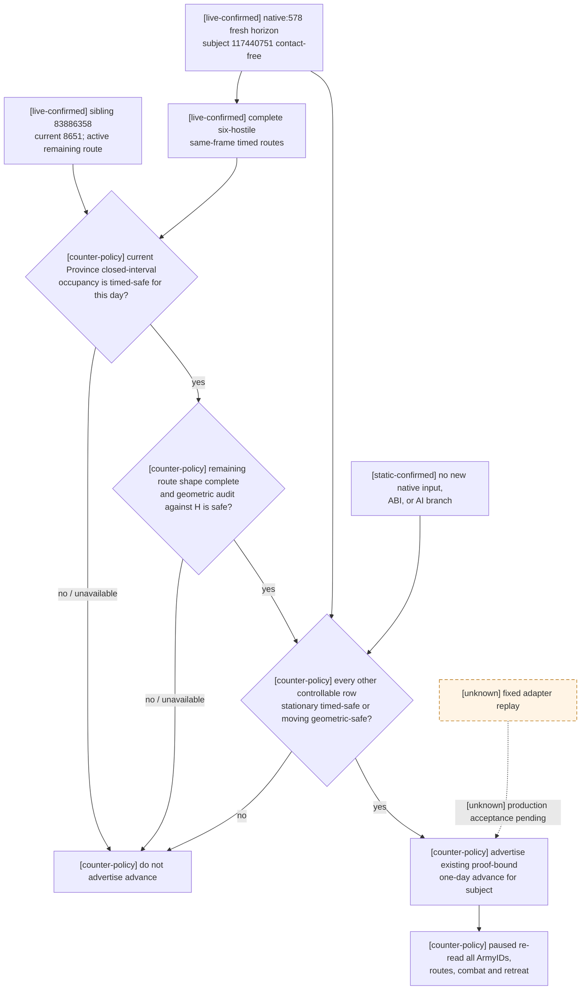

### 2026-08-28 续跑帧：closed endpoint 要求逐 moving subject 的同帧 proof

[production-live primitive] commit `b4a1cc4` 的 cold replay 已穿过上一帧，并把同一 episode 从
`53220312` 连续推进到 `53220384`；最新 durable checkpoint 为 `date_raw=53220360`、history `4104`、
SHA-256 `94FBEFF444F18303CAE9BF369EA33AA26DA704ADB759402F480DAD8EB77B26AAA`。这把“其它 active route 的
current Province timed occupancy + remaining-route geometry”从 static-ready 升为 production-live primitive。

[live-confirmed] 同一 replay 在 paused `snapshot_id=native:18`、service revision `19`、native revision `18`、
`date_raw=53220384` 暴露下一层真实 blocker。run 位于
`C:/Users/xenoa/AppData/Local/Temp/xar-marriage-reject-c21c096-state/runs/20260828T003711Z-one-generation-0e6e6129/`；
`report.json` SHA-256 为 `389E11D53B1592FCF6F12931A5B343BB83AD6C0A9B5E52715F99E5F3EBA005FE`，
`first-blocker.json` SHA-256 为 `2E16865AC0EDC77F8BDDE2E606A20C2364AF00C0F957E567F9CAC6F31B4182D6`。

- [live-confirmed] moving subject Army `117440751` 的 target 已变为 `744`；其 fresh exact horizon
  `[53220384,53220408]` 为 `one_day_contact_free=true`，且 route/hostile scope/frame binding 完整。
- [live-confirmed] moving sibling Army `83886358` 仍在 Province `8651`，active target `3610`、remaining route
  `1109 -> ... -> 3610`。hostile `167772266` 的同帧 arrival 恰为 `53220408`，等于 closed horizon end；所以
  把 sibling current Province 当作整日 hold 的派生检查必须判 unsafe。`b4a1cc4` 的拒绝是正确边界，不得改成
  open interval 或用 remaining-route disjoint 覆盖 current occupancy。
- [implementation-confirmed] planner 仍只消费 `117440751` 的 subject proof，随后期待其 advance step；它没有在
  sibling 的派生 current-occupancy 失败时请求 sibling 自己的 active-route timeline。driver 因而正确不广告，planner
  却误报为 backend unsupported。这仍是我方多 subject proof orchestration 缺口；原生 AI 树、exact-build query ABI
  与 hostile observation 没有新增输入。

[counter-policy] 最小闭合改为同一 paused frame 的逐 moving-army conjunction。先保留主 subject 的 fresh proof；对每支
其它 active moving army，若“current Province closed-interval timed-safe + remaining route geometric-safe”已经由该 proof
证明，则无需重复 query。否则 planner 必须先提交该 sibling 自己现有的
`query-route-contact-horizon-v1-<army>-to-<target>-...`；不得直接 block，也不得猜测其离省时刻。driver 只有在每支 moving
row 满足以下二者之一时才广告任一全局 exact-day advance：

1. 可由候选 subject proof 完整证明 current timed-safe 且 remaining route geometric-safe；或
2. 拥有同一 snapshot/date/native revision/connection/episode、相同完整 hostile scope、且与当前 ArmyID/current/target/
   remaining route 严格一致的 fresh `one_day_contact_free=true` subject proof。

任一 sibling proof 缺失、stale、hostile scope 不同、route/target/current 不匹配，或明确返回 timed conflict，都继续拒绝。
多份 proof 只共同授权**一个**全局 native day；执行后全部失效并重读所有军队。若 sibling 自己的 proof 显示 unavoidable
current contact，则后续必须以该 subject 的既有严格 contact-transition 合同处理，不能借另一支军的 contact-free proof 放行。

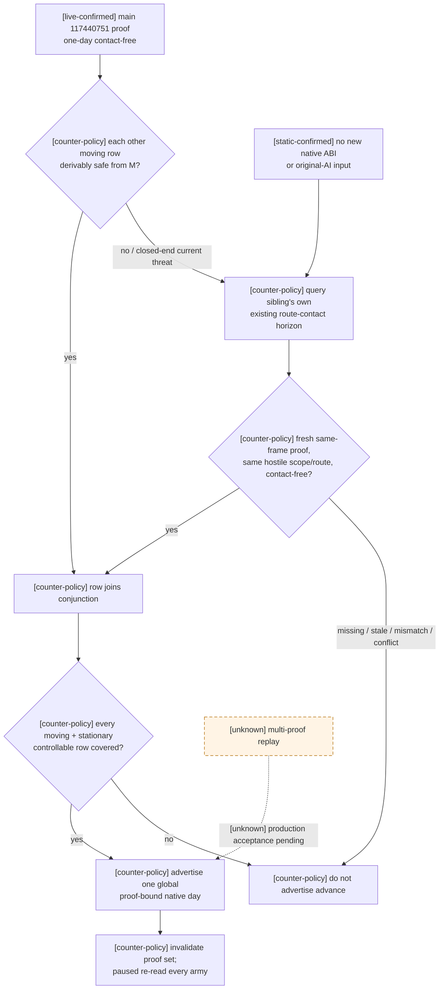

### 2026-08-28 G1 吞吐修复：proof-kind 自适应时间线速度

[static-confirmed] public speed `1..5` 不改变本页已经冻结的 native daily movement/contact 顺序；
[live-confirmed] active-battle stop-envelope 的十笔平衡小样本又在当前机器上得到五档全部精确 `+24`、零观察/停稳
超调，其中 speed 3 的平均端到端耗时为 `1.252s`、speed 2 为 `1.740s`、speed 1 为 `3.221s`。artifact 为
`C:/Users/xenoa/AppData/Local/Temp/xar-smx-stop-ae8-20260828-01/artifacts/stop-envelope-active-battle-1to5.json`，
SHA-256 `0B6818DA2630786A31EE28729694CA911A27781C9E8A60F1955B4F07F0DE6FEA`。这不证明 route parity，
结合用户对 G1 wall time 的明确优先级，当前默认 candidate 取 speed 3，speed 1/2 保留同 checkpoint 对照；无需新增 native ABI。

[implementation-confirmed] driver 现在按 fresh proof kind 选档：

| paused proof / slice | 速度 | 准入 |
|---|---:|---|
| fresh global conjunction，selected proof 为 `contact_free` | 默认 `3` | 继续强制 `ending=start+24`、paused readback 与 proof 一次性消费；待当前 checkpoint live A/B |
| `unavoidable_current_province_contact` | `1` | 必须观察 active combat/retreat/war/episode 或严格 endpoint follow-up，不接受配置提速 |
| contact-free targeted research arm | `1..5` | `--route-contact-speed N`；`4..5` 另需 `--allow-route-contact-high-speed-ab` |
| 所选 `set-speed-N` 未发布 | `1` | typed policy 明记 `fallback_speed_1` |
| 无 fresh proof / sibling conjunction 不完整 | 不推进 | 维持既有拒绝，不因提速修改 proof gate |

该 selector 把 1/2/3/4/5 全部纳入同一可比较事务，production candidate 默认从 1 升到 3；speed 2 保留显式
对照/回退档，speed 4/5 仍是显式 high-speed A/B，
不是 contact sentinel 或 production-live。multi-army proof conjunction、closed endpoint 与执行后全 proof 失效的语义完全不变。

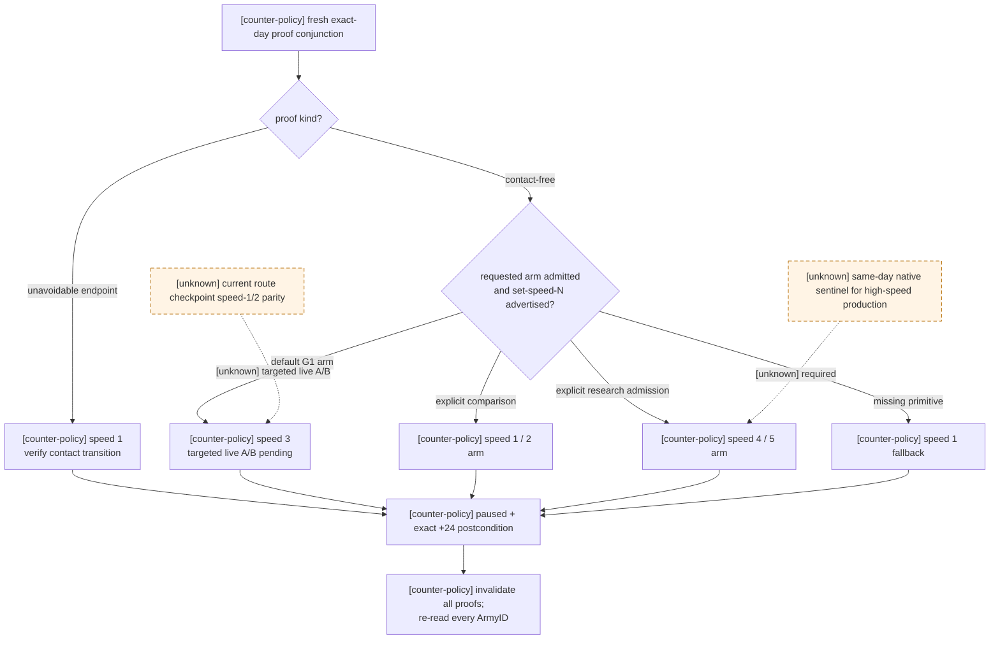

[counter-policy] 当前 native route-horizon request 只发布 `[start,start+24]`；所以不能把一份 contact-free proof
复用成两日或更多日。原 exact-day 路径继续作为无 sentinel 或无已承诺 route 时的回退；下节的 application-main
committed-route sentinel 是独立 multi-day 合同，不声称重用或放宽该一日 proof。

### 2026-08-28 G1 停点压缩：已承诺 route 由 native sentinel 托管

[static-confirmed] normal daily 的全部 movement placement 和 contact queue 在 final daily stage 前已完成。新接触成功后
`0x2208320/0x2303CF0` 已把新 full CombatID 写入 `CArmy+0x128`；因此在 final-stage original 返回后读该字段，
能在**同一 native day**观察到 contact transition。高速时不需要让 Python 抢在下一日前轮询，也不存在可以
插入“已到达但尚未接触”的中间决策点。

[implementation-confirmed] 已有 `tactical_daily_sentinel_v1` arm 只要求完整 watch 集合非空；它从 watched
public CUnit 的 `CArmy+0x128` 派生 pre-arm CombatID 集。所有 watched army 当前均无战斗时，`combat_count=0`
是合法原生 arm，而不是 capability 失败。Python 现显式区分两个 scope：

| scope | arm 约束 | 用途 |
|---|---|---|
| `active_battle` | `combat_count > 0` | 原普通 speed-3 战斗 hold |
| `committed_route` | decision mode 且 `combat_count == 0` | 已提交、非空、末点等于 move target 的行军 route |

[production-live counter-policy] planner 只在 paused/map-ready、无 event/pending interaction、无 active combat/retreat/Assault、
独立 `committed_route_sentinel_live_ready=true`，并能将**全部** controllable public CUnitID 完整放入 `1..64` watch
时选该 scope。计划必须指定一支确切 subject；该 subject 自己必须是 controllable moving/embarked CUnit，拥有完整非空 route，
且 route 末点精确等于请求 target。其它 sibling 的 route 不能替代 subject，也不能靠起始 snapshot 推测 scope。

显式命令合同为
`committed-route-sentinel-advance-army-<subject>-to-<province>-until-<date_raw>`：literal 同时携带 scope、subject、target
与 bound；driver 必须逐项对拍，并要求 watch 集合中 `combat_count=0`、无 active retreat。原
`battle-decision-epoch-advance-to-*` 只接受 `active_battle` 且 `combat_count>0`，两条入口不能静默互换。当前 production 默认
广告 route composite 与 live readiness；两者均以 speed 3 一次 resume，absolute bound 最多为 `+45d`。

运行中不做 external pause 或 rich route/battle query；仅在以下边界由 native final stage 当日停表：

- watched CUnit/CArmy generation/backlink 失效；
- direct route target 改变（包括到达后清除或新命令）；
- CombatID 改变（接触、参战或换战）；
- retreat 改变、CK3 原生已暂停、基础设施异常或 absolute date 到界。

[counter-policy] 该最小策略**不直接观察 hostile route retarget**。它表达的决定是“继续 CK3 已经接受的
route，如真正接触则在当日停下转入 battle OODA”，不是“预测期间所有敌军改道并主动避战”。后者仍是
route/forecast 质量债，不能被本 scope 冒充完成。

[production-live loop] 从 `53256000 / EE6D1B37...06D85` cold continuation 的 run
`20260828T080926Z-one-generation-9e0ac8cb` 连续选择 5 个显式 route arm，分别推进 `6/9/10/11/8` 日，共 44 日；每臂
`external_pause_count=0`、`external_rich_query_count=0`、`intermediate_pause_count=0`、`overshoot_days=0`。前四臂只在
真实 route target 变化当日停；第五臂在 `53257056` 同日记录 `route_target_changed + combat_transition`，下一 turn 立即进入
exact battle-control query。随后普通 speed-3 battle arm 连跑 `15+24` 日到 terminal，同样零中停/RQ/过冲。report SHA-256
`713348FCA67C44A1D83A94FC9D5B42184C0B894CD2B5151AE3CFEAF8F4178F73`；`20/20` turns、3 checkpoints、cleanup
全绿，最新 checkpoint `53258328 / history=5207 / 5AFCE04F...8960`。这把显式 route scope 与 phase/winner 停点压缩一起升为
production-live；不证明 hostile 未接触 retarget forecast。

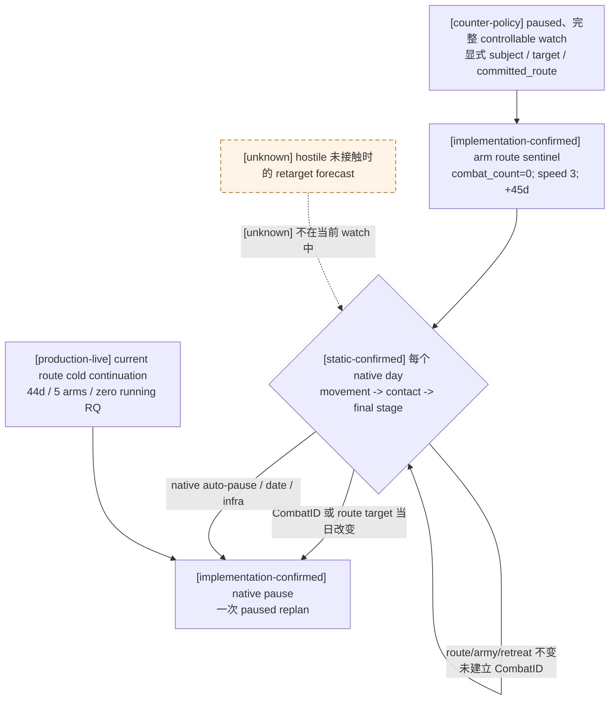

### 2026-08-31 G2 alternate-seed production RED：timeline 失败角色仍为 unknown

[production-live RED] exact build 仍为 CK3 `1.19.0.6`、EXE SHA-256
`2D00FF3101EF70B566F2FCBAE292F09263199C80E9DC8F139B82D7D96F83DB86`。冻结 run
`C:\Users\xenoa\AppData\Local\Temp\xar-g2-route-diagnostic-C78CD-20260831-v1\g2-runs\20260830T193023Z-next-episode-27de27cd\`
的 `first-blocker.json` SHA-256 为
`B4BF9AFEA65A43FA73E4BC7DF542624C6FDFBF9D9B9D9A95A26337B805FB3202`，`report.json` SHA-256 为
`DDF72DA418FBD5DF0D4A9DADB2191C94DDC0B04176EE5903F54A9A041A6FBF94`。CharacterID `29829` 在同一 episode
中对 `150995107 -> 5715` 连续完成 9 次 exact one-day route-contact query；随后 committed-route sentinel 从
`53217360` 推进到 `53218080`，subject 从 `moving @ 3575` 变为 `embarked @ 8652`，target 仍为 `5715`，并因
`route_target_changed` 当日停表。可恢复 checkpoint SHA-256 为
`C78CD16A627DD530F0842733FB9FC01CD71DC273D50949CAEC7613E54CDFC529`。

紧邻 checkpoint 的 war-termination query 成功；下一条同 subject/target 的 route-contact query 则返回
`CK3 route arrival timeline is unavailable`。该帧 subject 的 committed suffix 为
`[1038,1037,8658,1017,942,1111,8665,947,8668,950,951,8672,5696,5709,704,5715]`；请求还包含 hostile
`83886281 / 100663502 / 134217777`，其中 `83886281` 与 subject 已有同点及反向边交叉。失败发生在 paused native
query；blocker 的 `result`、`after` 均为 `null`，CK3 `debug.log/error.log` 没有对应引擎错误。

[unknown] 这份生产证据只证明 failure 出现在 subject 进入 embarked 后，**不能**证明失败者就是 subject。
当前 reader 将 subject committed-path 的 `BuildActiveRouteTimeline` 失败，以及任一 hostile 的同函数失败，全都折叠为
`timeline_unavailable`；mailbox 又只发布同一条 generic error。因而 subject/hostile 角色、具体 ArmyID 和构建阶段在该
artifact 中不可恢复。[implementation-confirmed] failure path 已增加 bounded `role + ArmyID + path + stage` 诊断，最大
256 bytes，并沿现有 command error 交给 Python。各 projector/validator 只在原有 `return false` 短路点记录第一个
failure stage；`stage != none` 后不再覆盖，未请求诊断的共享 caller 仍传空指针，成功求值顺序、返回条件及响应
serializer/schema 均保持不变。

[production-live cold replay] 从同一 C78CD checkpoint 冷恢复的三回合 run
`C:\Users\xenoa\AppData\Local\Temp\xar-g2-c78cd-replay-3turn-20260831-0928\runs\20260831T012828Z-one-generation-0852a36e\report.json`
SHA-256 为 `5AD0F16A51AE683A73DCEF365BFE7876D92A2D6867069A05CE6B125ACEE527DB`；该 run 使用的 bridge DLL
SHA-256 为 `270264A950833F324E205288C8500BE5B8E458A665BDD9680B40B539EA1D4E5D`。在 `53218080`，同一
`150995107 -> 5715`、同一 hostile set 的 query 返回 `status=available / accepted=true / query_sequence=1`，没有进入
新 failure diagnostic；随后 exact one-day contact-free composite 以 speed 3 从 `53218080` 推进到 `53218104`，
`progress_status=postcondition`。subject 前后均为 `embarked/state 4 @ 8652`，target `5715` 且上述 committed suffix
不变；新 checkpoint SHA-256 为 `4AB0BB2A4AA35C5E731F4AE829C6BBA9174E7510AEE3E802E7B5A0160C66DE25`。

[evidence boundary] cold replay 证明旧 timeline RED 不能从冷存档稳定复现，并解除该 checkpoint 的即时一日 continuation
blocker；它没有触发 failure path，故不能反推历史 failing role、ArmyID、stage 或 root cause。该 run 最终仍是
`turn_limit / bounded_incomplete`，first blocker 为 `run_bound_exhausted`，不能称为一代闭环；report 内 CK3 EXE SHA
仍为 `null`，exact-build 绑定继续引用外层冻结证据，不能由本报告单独声称。

[counter-policy] 该 artifact 同时确定暴露一处独立 admission gap：subject 已有非空 committed route、尾点仍精确等于
target，且没有 combat/retreat，但 strategy 与 native driver 都只接受 `moving/state 7`，因此 `embarked/state 4` 被迫回退
到 exact one-day query。两层现同时接受 `moving/state 7` 或 `embarked/state 4`；paused/map-ready、完整 watch、无玩家决策、
无 combat/retreat/assault、正整数非空 route 和 `route[-1] == target` 等门禁均保持不变。

[production-live primitive] 修复 admission 后，从上一段 `4AB0BB2A...DE25` checkpoint 冷恢复的两回合 run
`C:\Users\xenoa\AppData\Local\Temp\xar-g2-altseed-after-embarked-fix-20260831-0937\runs\20260831T013746Z-one-generation-9644124d\`
不再为该 embarked subject 发起 exact one-day route-contact query：首回合只读 War `50331699` 的 termination options；第二回合
直接选择 `committed-route-sentinel-advance-army-150995107-to-5715-until-53219184`。`report.json` SHA-256 为
`3F5432FDD6D26D69F33FDCFC49CC5259A801B5C960A921ED94BDA6C450147B1D`，`first-blocker.json` SHA-256 为
`33BA0D95B01BA0398D7BBA947F2A4B8656ABB8EEE3F82FD45BE931953F5986ED`。speed-3 sentinel 将 paused date 从
`53218104` 推进至 `53218176`；Army `150995107` 从 `embarked/state 4 @ 8652` 移至 `embarked/state 4 @ 1038`，
move target 与 committed route 尾点都仍为 `5715`。它在第三个 daily tick 以 `route_target_changed` 当日停表，
`intermediate_pause_count=0`、`overshoot_days=0`、`zero_intermediate_pause=true`，结束帧保持 paused。

最终续跑 checkpoint SHA-256 为 `B322B1DA403D23D6CCF2ABF7C5CBBF1CF8478AD0FCB22A07F6B1CC1A3DFFD7AC`
（`date_raw=53218176 / history_index=997`）。cleanup 的
`session_report_ok / shutdown_ok / tree_gone / cleanup_proven / driver_closed / ok` 全为 `true`，session
`restart_count=0`。这把“embarked/state 4 进入既有
committed-route sentinel”从 static-ready 升为 production-live primitive；它没有放宽 route/watch/combat/retreat/assault
门禁。run 总体仍是 `turn_limit / bounded_incomplete`，first blocker 仅为 `run_bound_exhausted`，角色仍存活、未发生死亡结算，
因此不能写成 G2 或 one-generation complete。

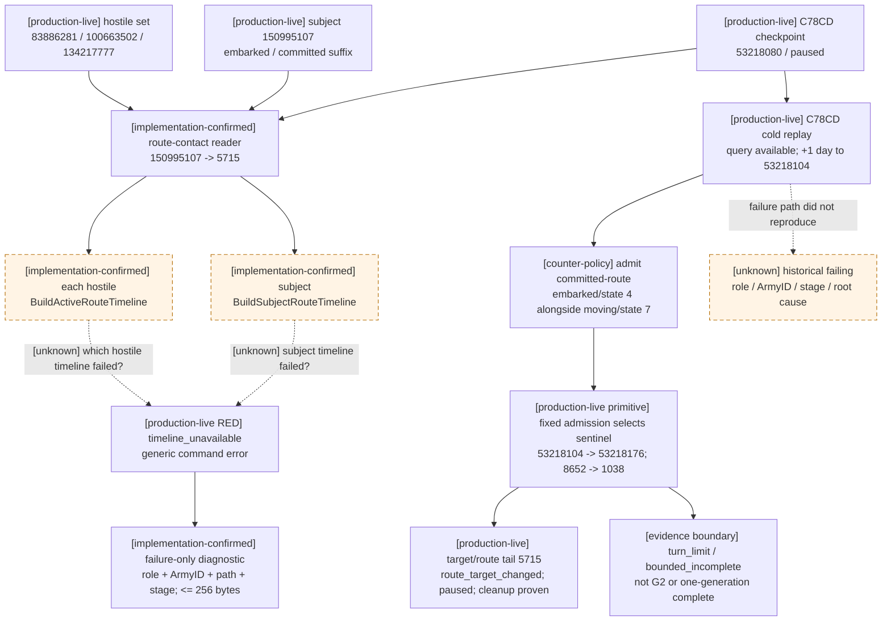

#### 2026-08-31 100-turn continuation：embarked sentinel soak 未复发 timeline RED

[production-live] 后续 run
`C:\Users\xenoa\AppData\Local\Temp\xar-g2-altseed-after-embarked-fix-20260831-0937\runs\20260831T015622Z-one-generation-a809dec5\report.json`
SHA-256 为 `142AD4E357733C575453181A7B06AC044B28A299CAFCD82F388F59D0DD11E50C`。100-turn 上限内实际
attempt `79` 次、成功 `78` 次；其中 `43` 次 committed-route sentinel 合计推进 `205` 个游戏日，`43/43`
均为 `zero_intermediate_pause=true`，没有正 overshoot（`40` 次为 `0`，`3` 次为 `-1` / not applicable）。

[production-live] 全 run 只有 turn `13` 发出一次 route-contact query：subject `167772444 -> 5715`，hostile
`83886281 / 100663502 / 134217777`；返回 `status=available / accepted=true`，subject 与三支 hostile 的 timeline
均 observable，exact one-day 结果为 contact-free。报告中新增的 bounded timeline failure diagnostic 字符串出现次数为
`0`。因此这份 soak 只能证明此前 RED 在本次 `205` 日 continuation 内**没有复发**，不能把历史 failure 的 role、stage
或 root cause 从 `unknown` 升级为已闭合。

[production-live boundary] 最后 durable checkpoint SHA-256 为
`F79BD6718A76CC7C50B5CA913FE61EE52F4BA5357EC7DE8397516A1099DD2461`，`date_raw=53223072`，且
`cleanup_proven=true`。turn `79` 的最终 blocker 是未 allowlist 的 `call_ally_interaction` pending-interaction policy，属于
interaction 专题；它不构成 route/sentinel 回归证据，也不改变本节 timeline 根因仍为 unknown 的结论。

## `0x2208320`：同省接触 resolver

### 入口与前置门

- [static-confirmed] direct callsites 是 `0x220D3BA`、`0x27C0FDF`；`0x2277F6B` 还从 CArmy wrapper
  `0x2277E80` tail-jump 进入。`0x2208320` 的参数是 target `CProvince*` 与 incoming `CUnit*`。
- [static-confirmed] resolver 先检查 target map-node raw gate、全局 raw gate、
  `0x290CFF0(incoming_unit,true)` 及 incoming owner 的 active/valid predicate。任一失败即返回 false。
- [unknown] `CProvince->map node +0x1B`、全局对象 `+0x28` 和 `CUnit+0x18` 的完整原生字段名尚未由
  RTTI/字符串闭合。本文只记录它们的比较和值，不给它们杜撰业务名。

### 决策树

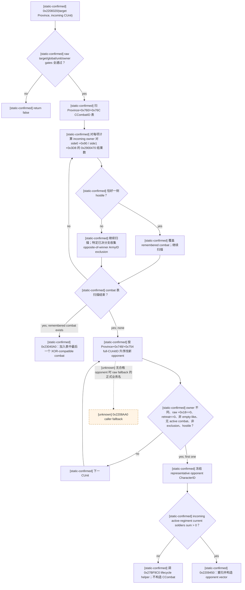

### 已有战斗优先及多个战斗的 tie-break

- [static-confirmed] resolver **始终先扫** `CProvince+0x760/+0x76C` 的 CCombatID 表；只在没有兼容现有战斗时
  才扫描 `+0x748/+0x754` 以创建新战斗。
- [static-confirmed] 每个 `CCombat+0x704 finalized == 0` 的 candidate，分别以
  `0x2900470(incoming_owner, side_representative_owner, false)` 测 side0 `+0x90` 和 side1 `+0x3D8`。
  两个结果之和必须恰好为 `1`；同时 hostile 于两侧或两侧都不 hostile 均不兼容。
- [static-confirmed] `0x2208549` 遇到每一个 XOR-compatible combat 都覆盖 remembered pointer，随后继续全表；
  因而选择的是扫描中的**最后一个** compatible combat，不是第一个。
- [static-confirmed] 新 contact 在 `0x22099AD..0x2209A0D` 对 Province `+0x760` 做 unsigned full
  CCombatID lower-bound 插入。该维护路径下，最后一个 compatible row 也就是数值最高的 compatible full CCombatID。
- [static-confirmed] 尚未选中 compatible combat 时，resolver generation-resolve `CCombat+0x708`
  full BattleResultID；BattleResult `+0x28 ready != 0` 且 `CCombat+0x6E0 winner != -1` 时，把 winner 对侧的
  ArmyIDs 加入临时 exclusion。后续新 opponent 的首次选择会拒绝该集合。

### 新 opponent 的首次选择

扫描顺序就是 target Province 的 full CUnitID 数值升序。首个同时通过以下条件的 CUnit 冻结
`representative_opponent_character_id`：

| 证据 | 条件 |
|---|---|
| [static-confirmed] | candidate owner full CharacterID 与 incoming owner 不同。 |
| [static-confirmed] | raw `CUnit+0x18 == 0`。 |
| [static-confirmed] | `CUnit+0x170 retreat_raw <= 0`。 |
| [static-confirmed] | `CUnit+0x178` generation-resolve 为 CArmy。 |
| [static-confirmed] | `0x2277290(CArmy)` 为 false。该 helper 为 true 的精确条件是 active-regiment current-soldier sum `<=0` 且 `CArmy+0x5C gathering_count==0`；其正式函数名未知。 |
| [static-confirmed] | `0x22771F0(CArmy)` 为 false。该 helper generation-resolve `CArmy+0x128` CCombatID 并调用 CCombat active predicate。 |
| [static-confirmed] | CArmyID 不在前述 opposite-of-winner 临时 exclusion 中。 |
| [static-confirmed] | `0x2900470(incoming_owner,candidate_owner,false)` 为 true。 |

[static-confirmed] 这一步没有距离、ETA、兵数最接近、AI objective score 或 request order tie-break。若首个合格
candidate owner 是 `-1`，不进入 builder。若 incoming army 的 active-regiment current-soldier sum 不大于零，
resolver 走 `0x27BF9C0` lifecycle helper 而不创建 CCombat。

## `0x2209450`：新战斗 participant 与攻守方向

### opponent vector 不是首次筛选结果的简单复用

[static-confirmed] `0x2209450(target, initiating_army, representative_opponent_id)` 从头重扫
`CProvince+0x748/+0x754`，保持 full CUnitID 数值升序 append `Vector<CArmy*> opponents`。每项要求：

- raw `CUnit+0x18 == 0`、`retreat_raw <= 0`；
- `0x2277290(CArmy) == false`；
- `CArmy+0x128` 没有 generation-valid active CCombat；
- candidate owner 等于 `representative_opponent_id`，**或者**在 owner 不同时满足方向调用
  `0x2900470(candidate_owner, initiating_owner, false)`。

[static-confirmed] builder 不接收首次选择阶段的临时 exclusion vector，而是按上述条件独立重筛。因此不能把
“首次 representative 的过滤式”和“最终 opponents 全体过滤式”写成完全相同的函数，也不能把 mixed-owner
opponents 简化成单一 owner coalition。`0x2900470` 的正式外交关系名与复杂多战争/第三方语义尚未闭合。

### `initiator_is_defender`，不是 `initiator_is_attacker`

- [static-confirmed] builder 初始令 bool 为 false。target `CProvince+0x858 fort_level > 0` 时，它优先从
  `+0x744` holder、再由 `+0x740` title fallback 解析 province holder，并测试
  `0x2900710(initiating_owner, holder)`；true 令 bool 为 true。
- [static-confirmed] 上述关系未命中或 `+0x858 <= 0` 时，还调用
  `0x290CD60(initiating_owner,target_province)`；true 同样令 bool 为 true。两个 helper 的完整业务关系名尚未闭合，
  但 bool 的 side 方向已由 constructor 独立证明。
- [static-confirmed] builder 从 initiating `CArmy+0x124 → CUnit` 的 origin/target map nodes 扫 final adjacency，
  得 native kind，然后调用：

  ```cpp
  CCombat* create_contact_combat(
      CCombatStorage* storage,
      CArmy* initiating_army,
      Vector<CArmy*>* opponents,
      bool initiator_is_defender,
      CProvince* target,
      int32_t adjacency_kind);
  // RVA 0x27FB7C0; calls CCombat ctor RVA 0x2303CF0
  ```

- [static-confirmed] adjacency scan 位于 `0x2209C48..0x2209D0F`，row stride `0x30`、kind `+0x00`、target
  ProvinceID `+0x04`；若未找到通过 native node gates 的 matching edge，生产 contact path 保留 raw kind `0`。
  这只描述生产构造器的 exact default，不授权只读 hypothetical query 把缺失 edge 宣称为已验证 normal adjacency。

- [static-confirmed] `0x2303CF0` 对 bool 的两条 indirect-wrapper 路径给出不可歧义的 side 方向：

  | bool | initiating army | ordered opponents |
  |---|---|---|
  | `true` | `0x23044F0` → side1 defender `CCombat+0x368` | `0x23043F0` → side0 attacker `CCombat+0x20` |
  | `false` | `0x23043F0` → side0 attacker `CCombat+0x20` | `0x23044F0` → side1 defender `CCombat+0x368` |

[static-confirmed] 因而 first queued initiator 不等于 attacker。领地 holding 关系可以令后到省份的 initiator
成为 defender；攻守必须读上述原生 bool 分支，不能从移动方向或 UI 左右推断。

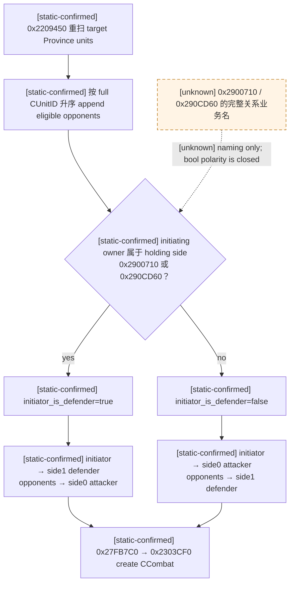

## `0x23040A0`：加入已有战斗

- [static-confirmed] `0x23040A0(CCombat*, incoming CArmy*)` 先取 incoming owner；若方向调用
  `0x2900470(side0_representative, incoming_owner, false)` 为 true，则调用 `0x23044F0` 加入 side1 defender；
  否则若 `0x2900470(side1_representative, incoming_owner, false)` 为 true，则调用 `0x23043F0` 加入 side0 attacker。
- [static-confirmed] resolver admission 使用相反方向 `incoming_owner → side representative` 的 XOR gate；当前没有
  证据把 `0x2900470` 宣布为对称关系。dispatcher 自身也不是完整 validator：它按 reverse-direction side0-first
  分支执行，之后仍会写 combat link。严格只读镜像必须让 reverse-direction 也恰好命中一侧，否则 unavailable，
  不能脱离 caller contract 猜 side。
- [static-confirmed] 加入后写 `CArmy+0x128 = CCombatID`，重算两侧 fighting totals；已有 base width 时更新 width。
  若 phase `CCombat+0x6B0 == 2`（pursuit），则重开为 main phase `1` 并清
  `winner +0x6E0 = -1`。

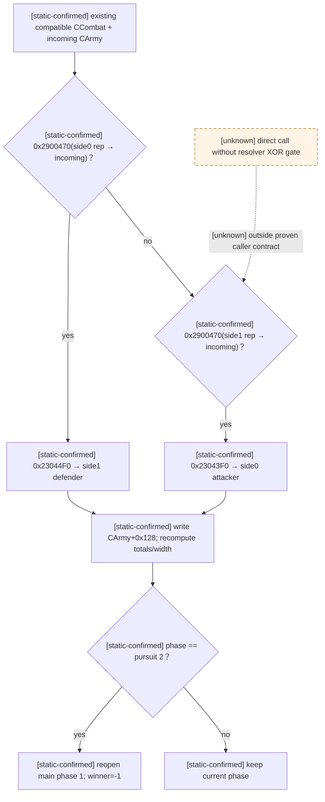

## 省份重扫与非 daily 入口边界

- [static-confirmed] `0x220D2A0(CProvince*)` 按 `+0x748/+0x754` 的升序 CUnitID 表从 index `0` 向上遍历；
  对 raw `+0x18==0`、`retreat<=0` 且无 active combat 的 unit 调 `0x2208320`，resolver 返回 false 才调
  `0x2208AA0` fallback。
- [static-confirmed] 已定位 direct caller `0x230AE86`：它先从 `CCombat+0x6B8` 取 target Province、从
  Province `+0x760` 移除该 CombatID并调用 `0x2208C10`，随后对该省执行 `0x220D2A0`。这证明战斗移除后的
  省份重解析也服从当前 full CUnitID 数值升序。
- [static-confirmed] CArmy wrapper `0x2277E80..0x2277F6B` 在 army 没有 active combat 时解析
  `CArmy+0x124 → CUnit` 与其当前 Province，再 tail-jump `0x2208320`。它还有多个 callsites；本页不把这些
  event-driven callsites 的相对调度顺序冒充 normal daily queue order。

## 2026-08-28 live correction：CFleet carrier 不是独立战术军队

- [live-confirmed] `e619219` canary 已证明共享 hostile timeline 能正确跨过原 `8658` frame；正式 run
  `20260827T201247Z-one-generation-c1cdfbc7` 又从同一 episode 推进 38 个游戏日到
  `date_raw=53213736`。report SHA-256 为
  `C011A2B624FF5EF4333F4FD1AE51A0BA6B942A4C47A99E1D912635C5405DD226`，first-blocker SHA-256 为
  `1BF4F6668B4D4396B174504DF791315366349DA8B395B72807866D573A735A87`；角色仍活、checkpoint 可恢复、cleanup 全绿。
- [live-confirmed] CUnit `150995278` 自 `53212320` 起与 CUnit `33554818` 连续 **59 个游戏日**逐省同步，经过
  `8651 → 1038 → 1037 → 8658 → 1017 → 942 → 1111 → 8665 → 947 → 8668 → 950 → 951`。
  同期 `33554818` 是 `embarked` 且拥有 committed route；旧 reader 却把 `150995278` 投影成
  `regular / target=null / route=[]`。最终 planner 对后者做了 186 次 preview，全部 `army_not_move_ready`，合计
  `572.765s`。这不是 186 条真实路线均不可走，而是同一个非 orderable CUnit 被错当成独立 ArmySnapshot。
- [static-confirmed] CUnit `+0x18` 是 raw kind。`0` 经 `CUnit+0x178 → CArmy`；`1` 经
  `CUnit+0x17C → CFleet`。CFleet storage 是 `module+0x57BFDE0`，RTTI/vtable 为
  `0x54A3488 / 0x43075A8`；`CFleet+0x18` 回链 carrier CUnit，`CFleet+0x1C` 连接 CArmy，后者
  `+0x124` 给出 canonical/orderable CUnit。`0x2246EC0` 与 `0x22492A0` 分别闭合这两条解析路径。
- [static-confirmed] `CanArmyUseMoveMode` (`0x2248860`) 与原生 contact queue (`0x220BB88` 一带) 都要求
  `CUnit+0x18 == 0`。`GetUnitState` (`0x0C7AAB0`) 却会对 kind `1` 盲读 `+0x178`，所以旧投影的
  `regular` 不能证明它可独立移动或参与接触。raw kind 的正式枚举符号名尚未恢复，文档只使用
  `raw-kind 0 direct-CArmy-linked` 与 `raw-kind 1 CFleet-linked`。
- [inference] artifact 尚未直接发布 raw kind，因此“`150995278` 是 kind `1` carrier、canonical CUnit 为
  `33554818`”仍需 cold replay 的 paused snapshot 结果闭环；59 日同步轨迹与 exact-build 结构使其成为当前最强解释，
  但在 live 复验前不升级为该具体 ID 对的 live-confirmed 关系。
- [static-ready] snapshot reader 现只发布 raw-kind `0`，并要求
  `CUnit+0x178 → generation-valid CArmy → CArmy+0x124 == 当前完整 CUnitID`；kind `1` 与 backlink 不闭合的行均不进入
  `player_armies/allied_armies/enemy_armies`。fixture 已覆盖 raw-kind `1`、错误 backlink 与恢复后的 canonical row。
  Python 同时保留 exact preview rejection stage，并在受威胁主体首次原生拒绝后停止后续 target 枚举。

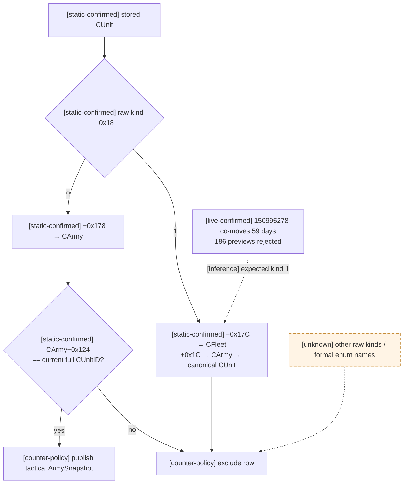

## 已闭合结论与剩余 unknown

| 主题 | 状态 | 结论 / 缺口 |
|---|---|---|
| AI 目标选择 | [static-confirmed] | stance → objective block → visible enemy province candidate → power/score → preliminary top 10 → final path；详见 `army-controller.md`。 |
| 接敌/避战 | [static-confirmed] | normal/desperate 严格 `>0.50/>0.40`；bad adjacency 仅 `<0.625` 尝试替代路线；详见 `combat-prediction.md`。 |
| normal daily 同日 initiator 顺序 | [static-confirmed] | unit-manager stored order movement → tail-appended CArmy queue → 全部 movement 后按 queue order contact。 |
| 同省 opponent 顺序 | [static-confirmed] | Province `+0x748` 是 unsigned full CUnitID lower-bound 数值升序；首筛取第一个合格 opponent，builder 也按此序 append。 |
| 已有战斗 vs 新战斗 | [static-confirmed] | 始终优先已有 XOR-compatible CCombat；多个 compatible 时取 `+0x760` 升序表中的最后一个，再否则创建新战斗。 |
| 同日第三军 | [static-confirmed] | 先处理的 initiator 创建/加入 combat 后，后续 queue row 会观察到更新后的 active combat；加入 pursuit 可重开 main phase。 |
| 多支可控军的一日放行 | [static-confirmed + live blocker] | 日期只推进一次，接触按实际 placement/Province 逐军发生；future route vertex 不是立即 contact。stationary `target=current` native query 已 live 证明在 interval projection 前返回 `route_unavailable`；当前 static-ready 入口是复用 moving result 的完整 hostile timelines，按闭区间重投影同帧 holds，再与 moving proof 取 conjunction。 |
| 攻守方向 | [static-confirmed] | 由 holding 关系计算 `initiator_is_defender`；true 是 initiator side1 defender，绝非 initiator attacker。 |
| manager stored order 来源 | [unknown] | 已证它传播为同日 initiator tie-break，但未闭合该表由创建、ID、分区或其它生命周期规则如何维护。 |
| non-daily placement 全序 | [unknown] | script/event placement、传送、撤退结束及 wrapper 多 callsite 尚未闭合统一相对顺序。 |
| CUnit raw kind / tactical identity | [static-confirmed + names unknown] | raw `0` 是 direct-CArmy-linked、可进入 move/contact gate；raw `1` 是 CFleet-linked carrier，经 CFleet 回到 CArmy/canonical CUnit。正式枚举名与其它 kind 值仍未知。`CArmy+0x5C gathering_count`、`CCombat+0x704 finalized`、BattleResult `+0x28 ready` 的消费语义已静态闭合。 |
| 外交谓词完整业务名 | [unknown] | `0x2900470`、`0x2900710`、`0x290CD60` 的调用方向与 bool 消费已闭合，复杂多战争/第三方关系语义名仍未知。 |

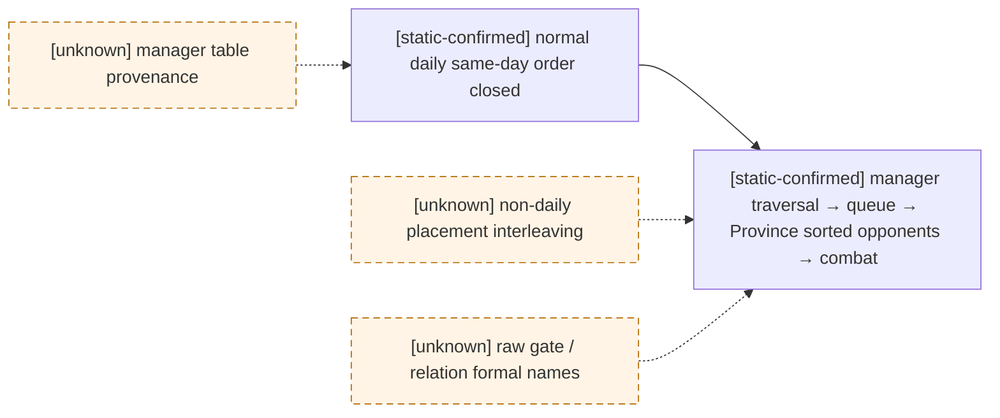

## 静态复核入口

对同一 EXE 复核时，最小地址集如下；升级 build 后不得沿用：

```text
daily traversal / deferred contact : 0x27F9B50, 0x27C0E90
movement progress / placement       : 0x2247C50, 0x2247ED9, 0x2247F19, 0x224B1B0
Province insert / queue append       : 0x220BAA0, 0x220BAF0..0x220BBEF, 0xA886F0
contact resolver                     : 0x2208320
new-contact opponent builder         : 0x2209450
combat allocation / ctor             : 0x27FB7C0, 0x2303CF0
existing-combat join                 : 0x23040A0, 0x23043F0, 0x23044F0
army state helpers                   : 0x22771F0, 0x2277290, 0x2277E80
post-combat Province rescan           : 0x220D2A0, caller 0x230AE86
relation / holding predicates         : 0x2900470, 0x2900710, 0x290CD60
```
