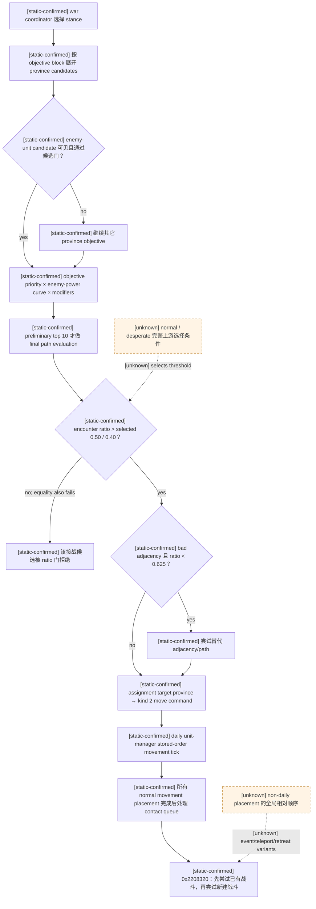
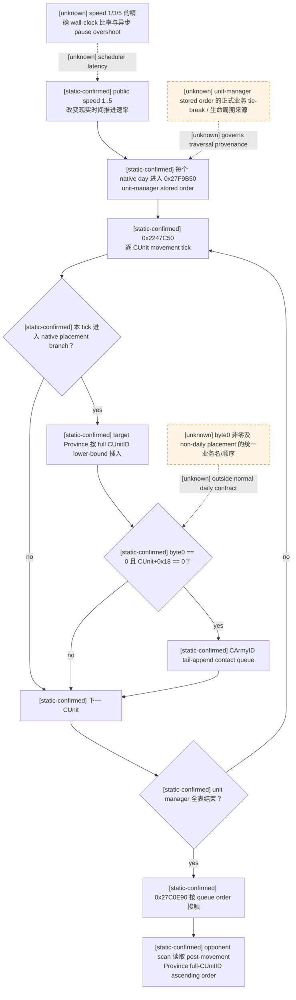
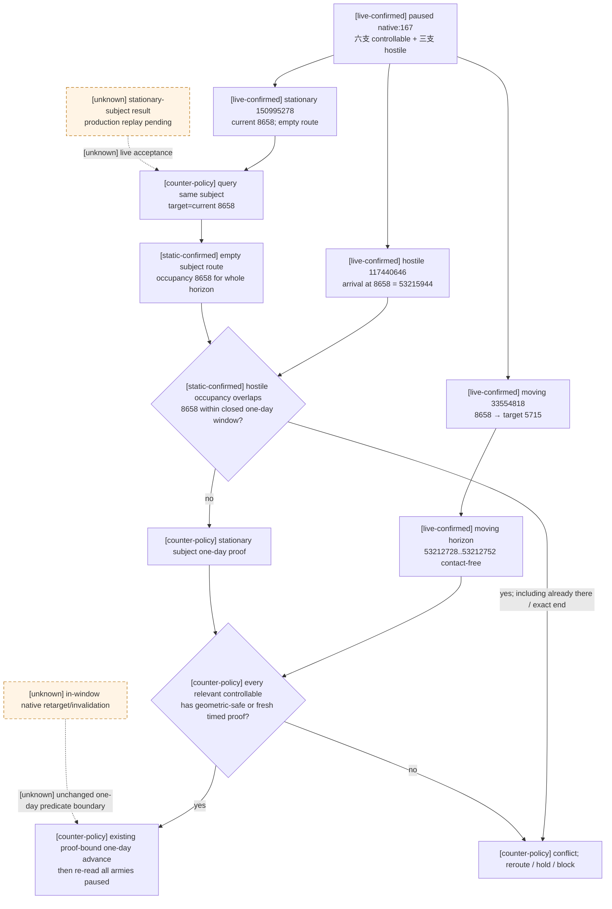
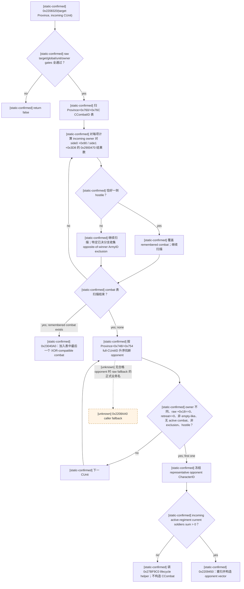
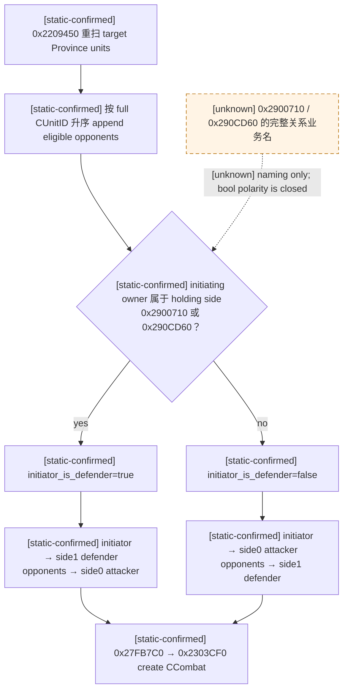
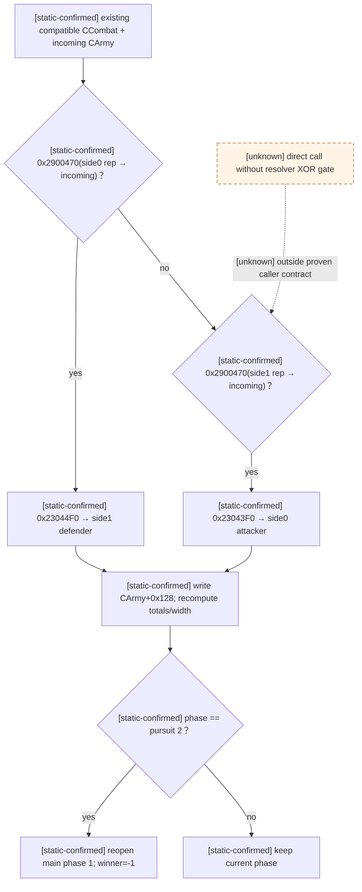
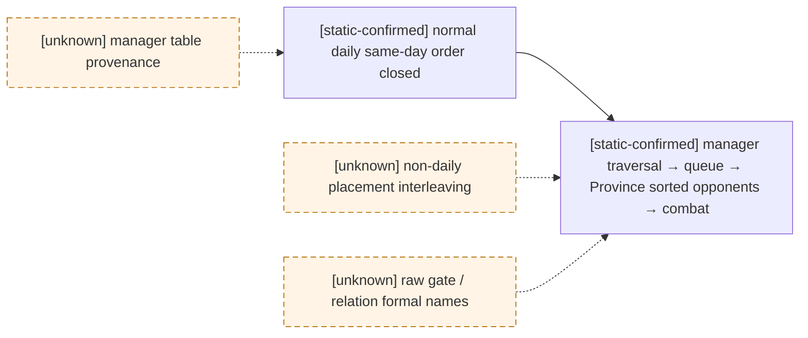

# CK3 1.19.0.6 原生军队移动、接触与同日冲突决策树

## 范围、版本与证据边界

- [static-confirmed] 本文只适用于 CK3 `1.19.0.6`、
  `Crusader Kings III/binaries/ck3.exe` SHA-256
  `2D00FF3101EF70B566F2FCBAE292F09263199C80E9DC8F139B82D7D96F83DB86`；所有 RVA 都以该模块
  基址为零点。
- [static-confirmed] 原版数据来自同一安装包。用于本页上游目标选择与接敌/避战门槛的冻结文件为：

  | 文件 | SHA-256 |
  |---|---|
  | `game/common/ai_war_stances/_ai_war_stances.info` | `0F01AAAB6922FDCA19B87A4421768F83B0C75534A128A73AF8CECADD52F6205E` |
  | `game/common/ai_war_stances/00_ai_war_stances.txt` | `4F5AA322C4D7272338F4C7B111B7462D4A1FEC886E93E7178084D318CEB8E294` |
  | `game/common/defines/ai/00_ai.txt` | `C78F9CD8DF9938CC9F38E817BCB6E32CD13720B5BD9DE077B85E3E1C6F030293` |

- [static-confirmed] 本轮新增结论来自冻结 EXE 的静态反汇编、direct xref 与数据布局互证；没有启动 CK3，
  没有 live snapshot，也没有调用任何会推进时间或构造战斗的函数。
- [static-confirmed] 上游 **AI 选择去哪里、是否接受危险路径** 与下游 **单位已经落入同一省后怎样组成战斗**
  是两条不同的链。后一条是所有合格军队共用的引擎接触规则，不会因为 initiator 是 AI 而重新计算 stance、
  objective score 或 `combat prediction ratio`。
- [unknown] 本页已经闭合 normal daily movement 的同日排队顺序，但没有把事件、脚本传送、撤退结束及其它
  非 daily placement 入口强行归并成同一顺序合同；这些入口仍以虚线 `unknown` 表示。

证据标签沿用 [README.md](README.md)：`static-confirmed` 是原版数据或 exact-build 执行分支直接支持，
`inference` 是尚缺独立执行分支的解释，`unknown` 是不能据此实现原生行为的缺口。Mermaid 的 unknown 边和节点
一律使用虚线。

配套的只读 scope ABI、机器 fixture 与 future paused-live gate 见
[actual-contact-scope.md](actual-contact-scope.md)；本文只负责原生行为树与证据边界，不把静态闭合写成已发布 capability。

## 一张图：从原生 AI 目标到实际接触

[army-controller.md](army-controller.md) 已给出完整 stance/objective 表和 target-score 参数；
[combat-prediction.md](combat-prediction.md) 已给出 ratio 算法与严格等号语义。本节只把它们与本页新闭合的
movement/contact 链接起来，不另造一套目标评分。



关键边界如下：

- [static-confirmed] stance 先按 side、relative power 与 `desperate` 属性过滤，再执行 `can_be_picked`，最后采用
  最高 `ai_will_do` weight；同分规则仍是 [army-controller.md](army-controller.md) 中的 unknown。
- [static-confirmed] `enemy_unit_province` 只为可见敌军生成候选。敌军约等于本 stack `0.5` 倍 power 时，
  原版目标曲线达到峰值；final pathfinding 只进入 preliminary top `10`。
- [static-confirmed] normal/desperate 接战门分别是严格 `ratio > 0.50` / `> 0.40`；等于阈值仍拒绝。
  `ratio < 0.625` 才尝试规避 bad adjacency，`>= 0.625` 不由该门绕路。
- [static-confirmed] 这些门决定 AI 是否把危险省份/路线当成可接受候选。单位一旦由 movement placement 落入
  同一省，`0x2208320` 不再读取这些分数；它只按关系、单位/战斗状态及内部表顺序解决接触。

## normal daily movement 的同日顺序

### exact-build 调用链

| 证据 | RVA / 布局 | 已证行为 |
|---|---|---|
| [static-confirmed] | `0x27F9B50..0x27F9BC5` | 入口先冻结 CUnitManager `+0x20` CUnitID data 与 `+0x2C` count 对应的 end，再按原 stored order 遍历，generation-resolve 后对有效 CUnit 调 `0x2247C50`；RTTI 对应主/次 vtable RVA `0x4340468/0x43404A0`。 |
| [static-confirmed] | `0x2247D3C..0x2247D94` | movement tick 把 speed 加入 `CUnit+0x168` progress，走 native edge-completion branch 后扣 edge cost、pop route head。 |
| [static-confirmed] | `0x2247ED9`、`0x2247F19` | daily normal path 把传给 placement commit 的三字节结构之 byte 0 写为 `0`，随后调用 `0x224B1B0`；byte 1/2 的完整业务名未查明。 |
| [static-confirmed] | `0x224B456..0x224B460` | placement commit 读取该 byte 0，并调用 `0x220BAA0(target_province, CUnitID, byte0)`。 |
| [static-confirmed] | `0x220BAF0..0x220BB7A` | 先拒绝重复 CUnitID，再以 unsigned full CUnitID 数值做 lower-bound 插入 `CProvince+0x748`，count 在 `+0x754`；因此该省单位表是数值升序，不是抵达顺序。 |
| [static-confirmed] | `0x220BB7F..0x220BBEF` | byte 0 为 `0` 且 `CUnit+0x18 == 0` 时，解析 `CUnit+0x178 → CArmy`，把 full CArmyID 送入 contact queue。 |
| [static-confirmed] | `0xA886F0..0xA887DC` | queue helper 只在尾部 append；扩容时保持既有顺序，不排序、不去重。 |
| [static-confirmed] | `0x27F9BCC..0x27F9BEB` | unit manager 全表 movement tick 结束后才 tail-call `0x27C0E90`；所以本日 normal placements 全部先完成，随后才集中接触。 |
| [static-confirmed] | `0x27C0E90..0x27C1029` | 入口冻结 manager-like object `+0x98` CArmyID data 与 `+0xA4` count 对应的 end，再按 queue order 处理；已有 active CCombat 的 army 跳过，否则以当前 `CUnit+0x20` Province 调 `0x2208320`，循环后把 count 清零。 |

[static-confirmed] 因而 normal daily path 的同日 tie 不是随机掷骰，也不是“画面上谁离得近”：

1. unit manager 的 `+0x20/+0x2C` stored order 决定各 CUnit 本日 movement tick 的先后；
2. 成功 normal placement 的 CArmy 按该先后 tail-append 到 contact queue；
3. 完成所有 movement 后，`0x27C0E90` 才按 queue order选择 initiator；
4. 此时 target Province 已含本轮全部 placement，且 `+0x748/+0x754` 按 full CUnitID 数值升序；
5. 所以后述“第一个合格 opponent”取自**移动完成后的数值升序省份表**，不取自 arrival queue；
6. 先处理的 initiator 若创建了 CCombat，后续 queued army 会先看到该现有战斗，或因已经链接 active combat 而跳过。

[static-confirmed] 若单个 CUnit 在其一次 `0x2247C50` 执行中产生多个 placement commit，append helper 仍保持该
CUnit 内部的实际调用顺序；全局不做二次排序。



这里闭合的是 normal daily movement 同日规则，不是把 unit manager stored order猜成“创建时间”或“ArmyID 排序”。
反汇编证明遍历和传播顺序，却尚未证明该 manager 表为什么形成当前顺序。

### 时间线速度不会替代 daily movement/contact 计算

- [static-confirmed] public `set-speed-1..5` 只把 user-facing `1..5` 映射为 native `0..4`，经
  `CSetGameSpeedCommand` 写入 `CGameState+0x70`；同一 exact build 的 normal daily movement/contact 链仍以每个
  native day 为单位进入 `0x27F9B50 -> 0x2247C50 -> 0x27C0E90`。本文已闭合的 movement stored order、Province
  数值序与 contact queue 规则没有按 public speed 分叉。因此较高时间线速度不会省略 CK3 的逐日 movement/contact
  计算；它只让这些 native day 在更短现实时间内被调度。
- [live-confirmed] 2026-08-23 的 minimized exact-build probe 已实际提交 `set-speed-3`、`resume-map`，观察
  `date_raw=53171400 -> 53171424` 后提交 `pause-map` 并回读 `paused=true`。这证明 speed 3 可执行相同的
  paused -> running -> date tick -> paused 原生命令链；它不单独证明活动战争下每次都只越过一个日界。
- [live-confirmed] 2026-08-27 的正式一代长跑又反证 speed 1 不是“严格逐日”保证：当前恢复段的成功
  speed-1 `life-advance` 已出现 `elapsed_days=2` 与 `3`。所以 planner 必须按 action 自报的实际 date delta 和
  更新后的 paused state 验证，而不能把 speed 数值当作计算次数或日界上限。
- [unknown] 1/3/5 速的精确 wall-clock tick 比率、world-size/load 对 pump latency 的影响，以及异步
  `pause-map` 在 speed 3/5 下的最大 overshoot 尚未闭合。任何提速 counter-policy 都必须保留 paused 后置回读；
  battle、retreat、Assault 和已证明的一日 route-contact transaction 不得仅凭上述 speed-3 probe 放宽。

## 多支可控军队：同一日界、逐军状态与实际接触

- [static-confirmed] 游戏日期是全局推进的，但 `0x27F9B50` 逐项读取 unit-manager 中的 CUnit；每个 CUnit
  各自保留 current Province、active MovePath 与 movement progress。原生 controller 的
  `CAISubunitStack` assignment 也逐 stack 解析并提交各自 move command。不存在“只要一支军队的一日路线安全，
  其它玩家军队就自动安全”的原生分支。
- [static-confirmed] 反过来也没有“某敌军未来 route 经过静止军所在省，就在当前日立即接触”的原生分支。
  normal daily 接触只在本日所有实际 movement placement 完成后，由 contact queue 对当时 Province 中的单位执行
  `0x2208320`。未来 route vertex 是 planner 的风险包络，不是原生 contact trigger。
- [static-confirmed] 因此多军团的一日放行必须把两层语义分开：CK3 只执行一次全局日界；我方在放行前则要对
  每支可能在该日接触的可控军队分别取得可审计证据，再对这些证据取 conjunction。该 conjunction 是
  counter-policy，不是 CK3 原生 AI 的全局 horizon 对象。

### 2026-08-28 正式长跑帧：遥远 route vertex 被误当成当前威胁

[live-confirmed] 正式一代长跑 PID `42596` 在 paused `snapshot_id=native:167`、service revision `168`、
native revision `167`、`date_raw=53212728` 遇到真实 planner blocker。报告位于
`C:/Users/xenoa/AppData/Local/Temp/xar-marriage-reject-c21c096-state/runs/20260827T192055Z-one-generation-1d8c0f50/report.json`，
SHA-256 `FC7D4E5069C84A4D10A3E5359A387C3F9BD5CD422FFE20D45ACCEB0ADDD4DF90`；冻结
`first-blocker.json` SHA-256 为
`AB9FDD76D0251070F1A12AAE8CAE51C2CB23B0CA675EF229DF42724C35500AB0`。该 run 使用
`ck3-1.19.0.6-msvc-x64` adapter；本地 exact EXE 复核仍为本页冻结 SHA。

- [live-confirmed] 六支可控军中，Army `33554818` 与 Army `150995278` 同在 Province `8658`。前者为
  `embarked`、有已提交 target `5715` 和 route；后者为 `regular`、无 target、route 为空，确实是独立的
  stationary CUnit，而不是 moving row 的别名。其余四支 stationary army 均在 Province `2619`；三支
  non-retreating hostile 为 `83886265 / 117440646 / 117440838`，本帧没有玩家 combat 或 retreat。
- [live-confirmed] 对 moving Army `33554818` 的 fresh typed horizon 保留完整 hostile scope，并返回
  `one_day_contact_free=true`、窗口 `[53212728,53212752]`。同一结果中的 enemy `117440646` active route
  虽然最终穿过 Province `8658`，其原生 arrival timeline 到该省是 `53215944`：距当前 `3216` raw hours，
  即 `134` 游戏日。moving subject 的首个 arrival 也要到 `53212848`，所以它在这一日窗口内仍占据当前省。
- [live-confirmed] 旧 geometric stationary 检查只问 `8658 in enemy.route_province_ids`，不读取 arrival；于是把
  `134` 日后的 vertex 立即归类为 `enemy_route_to_stationary_province`，令 Army `150995278` 阻断已经通过的
  moving horizon。这是我方 counter-policy 的时间维度丢失，不是原生 contact resolver 报告危险。

[static-confirmed] 现有 `query-route-contact-horizon-v1-N` native reader 已具备直接闭合该 stationary row 的
全部原生输入，无需新增 C++ ABI：以 subject `150995278`、target=current `8658` 和同一完整 hostile scope 查询时，
`BuildSubjectRouteTimeline` 对 `effective_origin == current == target` 返回 available，subject route/arrival arrays
为空；`BuildTimelineIntervals` 因而把 Province `8658` 作为覆盖完整一日窗口的 occupancy。随后仍以所有 hostile
active route 的原生 arrival dates 计算 closed-interval overlap：

- 敌军已经在 `8658` 时，双方 occupancy 在 horizon start 就重叠，必须返回 `same_province` conflict；
- 敌军恰在 horizon end 到达时，closed boundary 仍算 conflict；
- 本帧敌军到达 `8658` 是 `53215944`，远在 horizon end `53212752` 后，不构成这一日的 overlap；
- stationary subject 没有 route edge，因此不会伪造 opposing-edge 冲突；任一 current、timeline、完整 hostile
  scope 或 before/after paused identity 不闭合时，query 仍返回 unavailable/state-changed，而不是猜安全。

[counter-policy] 最小可行入口是复用现有单-subject query，而不是扩成新的 multi-subject native API：先保留
Army `33554818` 的 fresh moving horizon，再为每支 geometric-threatened stationary army 用
`target=current province` 取得同一 paused revision 的 fresh horizon；只有所有必要 subject 都
`one_day_contact_free=true`，且其它军队已经由 complete geometric audit 证明无交集，才使用既有 moving subject 的
proof-bound one-day advance。当前 Python action-step projection 会排除“空 route + current target”的 query literal，
因此只需窄化地把这一既有 typed query 暴露给被威胁 stationary army，并在 planner 中做全军 conjunction；不需要
新 native 字段、命令或 schema。任一 stationary query 为 false/unavailable 时继续 reroute/hold/block，绝不由另一支
军队的 proof 代签。推进后仍重读全部 ArmyID、route、combat、retreat 与 paused date。

[unknown] 该 exact frame 尚未实际执行 subject `150995278 -> 8658` 的 production query，因此上面的 reader/interval
语义是 static-confirmed，具体返回值在 fresh replay 前仍为 live-pending。现有一日 predicate也不宣称预测窗口内
可能发生的原生 retarget/invalidation，更不授权 speed 2..5 或多日 tranche；这些边界沿用既有一日
paused-to-paused 合同，不为本 blocker 扩张。



## `0x2208320`：同省接触 resolver

### 入口与前置门

- [static-confirmed] direct callsites 是 `0x220D3BA`、`0x27C0FDF`；`0x2277F6B` 还从 CArmy wrapper
  `0x2277E80` tail-jump 进入。`0x2208320` 的参数是 target `CProvince*` 与 incoming `CUnit*`。
- [static-confirmed] resolver 先检查 target map-node raw gate、全局 raw gate、
  `0x290CFF0(incoming_unit,true)` 及 incoming owner 的 active/valid predicate。任一失败即返回 false。
- [unknown] `CProvince->map node +0x1B`、全局对象 `+0x28` 和 `CUnit+0x18` 的完整原生字段名尚未由
  RTTI/字符串闭合。本文只记录它们的比较和值，不给它们杜撰业务名。

### 决策树



### 已有战斗优先及多个战斗的 tie-break

- [static-confirmed] resolver **始终先扫** `CProvince+0x760/+0x76C` 的 CCombatID 表；只在没有兼容现有战斗时
  才扫描 `+0x748/+0x754` 以创建新战斗。
- [static-confirmed] 每个 `CCombat+0x704 finalized == 0` 的 candidate，分别以
  `0x2900470(incoming_owner, side_representative_owner, false)` 测 side0 `+0x90` 和 side1 `+0x3D8`。
  两个结果之和必须恰好为 `1`；同时 hostile 于两侧或两侧都不 hostile 均不兼容。
- [static-confirmed] `0x2208549` 遇到每一个 XOR-compatible combat 都覆盖 remembered pointer，随后继续全表；
  因而选择的是扫描中的**最后一个** compatible combat，不是第一个。
- [static-confirmed] 新 contact 在 `0x22099AD..0x2209A0D` 对 Province `+0x760` 做 unsigned full
  CCombatID lower-bound 插入。该维护路径下，最后一个 compatible row 也就是数值最高的 compatible full CCombatID。
- [static-confirmed] 尚未选中 compatible combat 时，resolver generation-resolve `CCombat+0x708`
  full BattleResultID；BattleResult `+0x28 ready != 0` 且 `CCombat+0x6E0 winner != -1` 时，把 winner 对侧的
  ArmyIDs 加入临时 exclusion。后续新 opponent 的首次选择会拒绝该集合。

### 新 opponent 的首次选择

扫描顺序就是 target Province 的 full CUnitID 数值升序。首个同时通过以下条件的 CUnit 冻结
`representative_opponent_character_id`：

| 证据 | 条件 |
|---|---|
| [static-confirmed] | candidate owner full CharacterID 与 incoming owner 不同。 |
| [static-confirmed] | raw `CUnit+0x18 == 0`。 |
| [static-confirmed] | `CUnit+0x170 retreat_raw <= 0`。 |
| [static-confirmed] | `CUnit+0x178` generation-resolve 为 CArmy。 |
| [static-confirmed] | `0x2277290(CArmy)` 为 false。该 helper 为 true 的精确条件是 active-regiment current-soldier sum `<=0` 且 `CArmy+0x5C gathering_count==0`；其正式函数名未知。 |
| [static-confirmed] | `0x22771F0(CArmy)` 为 false。该 helper generation-resolve `CArmy+0x128` CCombatID 并调用 CCombat active predicate。 |
| [static-confirmed] | CArmyID 不在前述 opposite-of-winner 临时 exclusion 中。 |
| [static-confirmed] | `0x2900470(incoming_owner,candidate_owner,false)` 为 true。 |

[static-confirmed] 这一步没有距离、ETA、兵数最接近、AI objective score 或 request order tie-break。若首个合格
candidate owner 是 `-1`，不进入 builder。若 incoming army 的 active-regiment current-soldier sum 不大于零，
resolver 走 `0x27BF9C0` lifecycle helper 而不创建 CCombat。

## `0x2209450`：新战斗 participant 与攻守方向

### opponent vector 不是首次筛选结果的简单复用

[static-confirmed] `0x2209450(target, initiating_army, representative_opponent_id)` 从头重扫
`CProvince+0x748/+0x754`，保持 full CUnitID 数值升序 append `Vector<CArmy*> opponents`。每项要求：

- raw `CUnit+0x18 == 0`、`retreat_raw <= 0`；
- `0x2277290(CArmy) == false`；
- `CArmy+0x128` 没有 generation-valid active CCombat；
- candidate owner 等于 `representative_opponent_id`，**或者**在 owner 不同时满足方向调用
  `0x2900470(candidate_owner, initiating_owner, false)`。

[static-confirmed] builder 不接收首次选择阶段的临时 exclusion vector，而是按上述条件独立重筛。因此不能把
“首次 representative 的过滤式”和“最终 opponents 全体过滤式”写成完全相同的函数，也不能把 mixed-owner
opponents 简化成单一 owner coalition。`0x2900470` 的正式外交关系名与复杂多战争/第三方语义尚未闭合。

### `initiator_is_defender`，不是 `initiator_is_attacker`

- [static-confirmed] builder 初始令 bool 为 false。target `CProvince+0x858 fort_level > 0` 时，它优先从
  `+0x744` holder、再由 `+0x740` title fallback 解析 province holder，并测试
  `0x2900710(initiating_owner, holder)`；true 令 bool 为 true。
- [static-confirmed] 上述关系未命中或 `+0x858 <= 0` 时，还调用
  `0x290CD60(initiating_owner,target_province)`；true 同样令 bool 为 true。两个 helper 的完整业务关系名尚未闭合，
  但 bool 的 side 方向已由 constructor 独立证明。
- [static-confirmed] builder 从 initiating `CArmy+0x124 → CUnit` 的 origin/target map nodes 扫 final adjacency，
  得 native kind，然后调用：

  ```cpp
  CCombat* create_contact_combat(
      CCombatStorage* storage,
      CArmy* initiating_army,
      Vector<CArmy*>* opponents,
      bool initiator_is_defender,
      CProvince* target,
      int32_t adjacency_kind);
  // RVA 0x27FB7C0; calls CCombat ctor RVA 0x2303CF0
  ```

- [static-confirmed] adjacency scan 位于 `0x2209C48..0x2209D0F`，row stride `0x30`、kind `+0x00`、target
  ProvinceID `+0x04`；若未找到通过 native node gates 的 matching edge，生产 contact path 保留 raw kind `0`。
  这只描述生产构造器的 exact default，不授权只读 hypothetical query 把缺失 edge 宣称为已验证 normal adjacency。

- [static-confirmed] `0x2303CF0` 对 bool 的两条 indirect-wrapper 路径给出不可歧义的 side 方向：

  | bool | initiating army | ordered opponents |
  |---|---|---|
  | `true` | `0x23044F0` → side1 defender `CCombat+0x368` | `0x23043F0` → side0 attacker `CCombat+0x20` |
  | `false` | `0x23043F0` → side0 attacker `CCombat+0x20` | `0x23044F0` → side1 defender `CCombat+0x368` |

[static-confirmed] 因而 first queued initiator 不等于 attacker。领地 holding 关系可以令后到省份的 initiator
成为 defender；攻守必须读上述原生 bool 分支，不能从移动方向或 UI 左右推断。



## `0x23040A0`：加入已有战斗

- [static-confirmed] `0x23040A0(CCombat*, incoming CArmy*)` 先取 incoming owner；若方向调用
  `0x2900470(side0_representative, incoming_owner, false)` 为 true，则调用 `0x23044F0` 加入 side1 defender；
  否则若 `0x2900470(side1_representative, incoming_owner, false)` 为 true，则调用 `0x23043F0` 加入 side0 attacker。
- [static-confirmed] resolver admission 使用相反方向 `incoming_owner → side representative` 的 XOR gate；当前没有
  证据把 `0x2900470` 宣布为对称关系。dispatcher 自身也不是完整 validator：它按 reverse-direction side0-first
  分支执行，之后仍会写 combat link。严格只读镜像必须让 reverse-direction 也恰好命中一侧，否则 unavailable，
  不能脱离 caller contract 猜 side。
- [static-confirmed] 加入后写 `CArmy+0x128 = CCombatID`，重算两侧 fighting totals；已有 base width 时更新 width。
  若 phase `CCombat+0x6B0 == 2`（pursuit），则重开为 main phase `1` 并清
  `winner +0x6E0 = -1`。



## 省份重扫与非 daily 入口边界

- [static-confirmed] `0x220D2A0(CProvince*)` 按 `+0x748/+0x754` 的升序 CUnitID 表从 index `0` 向上遍历；
  对 raw `+0x18==0`、`retreat<=0` 且无 active combat 的 unit 调 `0x2208320`，resolver 返回 false 才调
  `0x2208AA0` fallback。
- [static-confirmed] 已定位 direct caller `0x230AE86`：它先从 `CCombat+0x6B8` 取 target Province、从
  Province `+0x760` 移除该 CombatID并调用 `0x2208C10`，随后对该省执行 `0x220D2A0`。这证明战斗移除后的
  省份重解析也服从当前 full CUnitID 数值升序。
- [static-confirmed] CArmy wrapper `0x2277E80..0x2277F6B` 在 army 没有 active combat 时解析
  `CArmy+0x124 → CUnit` 与其当前 Province，再 tail-jump `0x2208320`。它还有多个 callsites；本页不把这些
  event-driven callsites 的相对调度顺序冒充 normal daily queue order。

## 已闭合结论与剩余 unknown

| 主题 | 状态 | 结论 / 缺口 |
|---|---|---|
| AI 目标选择 | [static-confirmed] | stance → objective block → visible enemy province candidate → power/score → preliminary top 10 → final path；详见 `army-controller.md`。 |
| 接敌/避战 | [static-confirmed] | normal/desperate 严格 `>0.50/>0.40`；bad adjacency 仅 `<0.625` 尝试替代路线；详见 `combat-prediction.md`。 |
| normal daily 同日 initiator 顺序 | [static-confirmed] | unit-manager stored order movement → tail-appended CArmy queue → 全部 movement 后按 queue order contact。 |
| 同省 opponent 顺序 | [static-confirmed] | Province `+0x748` 是 unsigned full CUnitID lower-bound 数值升序；首筛取第一个合格 opponent，builder 也按此序 append。 |
| 已有战斗 vs 新战斗 | [static-confirmed] | 始终优先已有 XOR-compatible CCombat；多个 compatible 时取 `+0x760` 升序表中的最后一个，再否则创建新战斗。 |
| 同日第三军 | [static-confirmed] | 先处理的 initiator 创建/加入 combat 后，后续 queue row 会观察到更新后的 active combat；加入 pursuit 可重开 main phase。 |
| 多支可控军的一日放行 | [static-confirmed + live blocker] | 日期只推进一次，接触按实际 placement/Province 逐军发生；future route vertex 不是立即 contact。当前 blocker 的完整 timed hostile route 已可观测，缺口仅是为 stationary `target=current` 取得 subject-bound proof 并与 moving proof 取 conjunction。 |
| 攻守方向 | [static-confirmed] | 由 holding 关系计算 `initiator_is_defender`；true 是 initiator side1 defender，绝非 initiator attacker。 |
| manager stored order 来源 | [unknown] | 已证它传播为同日 initiator tie-break，但未闭合该表由创建、ID、分区或其它生命周期规则如何维护。 |
| non-daily placement 全序 | [unknown] | script/event placement、传送、撤退结束及 wrapper 多 callsite 尚未闭合统一相对顺序。 |
| raw gate 正式语义 | [unknown] | `CUnit+0x18` 与全局 gate 的正式字段/枚举名未闭合；`CArmy+0x5C gathering_count`、`CCombat+0x704 finalized`、BattleResult `+0x28 ready` 的消费语义已静态闭合。 |
| 外交谓词完整业务名 | [unknown] | `0x2900470`、`0x2900710`、`0x290CD60` 的调用方向与 bool 消费已闭合，复杂多战争/第三方关系语义名仍未知。 |



## 静态复核入口

对同一 EXE 复核时，最小地址集如下；升级 build 后不得沿用：

```text
daily traversal / deferred contact : 0x27F9B50, 0x27C0E90
movement progress / placement       : 0x2247C50, 0x2247ED9, 0x2247F19, 0x224B1B0
Province insert / queue append       : 0x220BAA0, 0x220BAF0..0x220BBEF, 0xA886F0
contact resolver                     : 0x2208320
new-contact opponent builder         : 0x2209450
combat allocation / ctor             : 0x27FB7C0, 0x2303CF0
existing-combat join                 : 0x23040A0, 0x23043F0, 0x23044F0
army state helpers                   : 0x22771F0, 0x2277290, 0x2277E80
post-combat Province rescan           : 0x220D2A0, caller 0x230AE86
relation / holding predicates         : 0x2900470, 0x2900710, 0x290CD60
```
