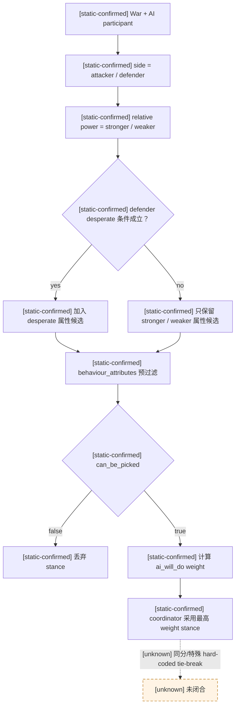
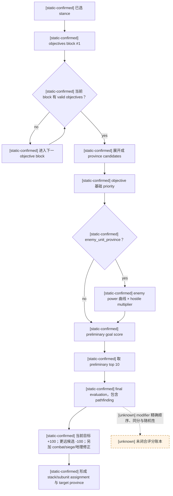
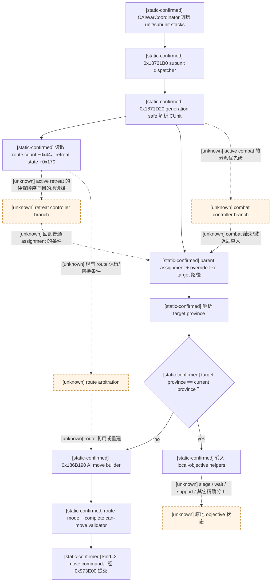
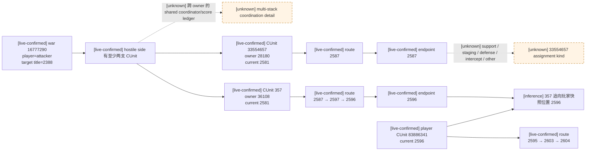
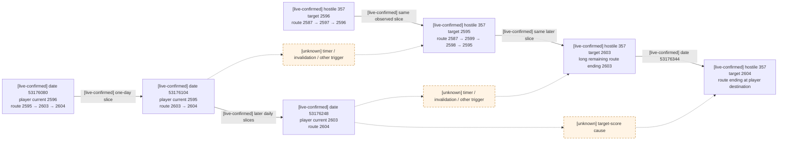

# CK3 1.19.0.6 原生陆军 AI controller 决策树

## 范围与版本

- [static-confirmed] 本文只适用于 CK3 `1.19.0.6`、EXE SHA-256
  `2D00FF3101EF70B566F2FCBAE292F09263199C80E9DC8F139B82D7D96F83DB86`；所有 RVA 均相对
  `ck3.exe` 模块基址。
- [static-confirmed] 脚本侧证据来自同一安装包的
  `game/common/ai_war_stances/_ai_war_stances.info`、
  `game/common/ai_war_stances/00_ai_war_stances.txt` 和
  `game/common/defines/ai/00_ai.txt`。
- [live-confirmed] 当前实例证据来自 2026-08-24 的 PID `100912` 只读快照；读取时模块基址为
  `0x7FF6287C0000`，没有向 CK3 写内存、调用函数、提交命令、改变暂停状态或控制进程。
- [unknown] 本文没有闭合每个 live `CAIUnitStack`/`CAISubunitStack` 的堆对象地址、assignment 枚举值
  与逐项评分账本，因此不会把路线终点反推成一个未经证实的 objective 类型。

## 证据标签

- [static-confirmed] `static-confirmed`：原版说明/数据直接给出，或 exact-build 反汇编闭合到执行分支。
- [live-confirmed] `live-confirmed`：exact-build 的只读进程快照直接给出。
- [inference] `inference`：由已证输入和结果推出的策略解释，尚未独立闭合中间执行分支。
- [unknown] `unknown`：仍缺少证据；Mermaid 中虚线边或带 `unknown` 的节点均属此类。

## 原生对象与执行主干

| 证据 | 对象/入口 | exact-build 结论 |
|---|---|---|
| [static-confirmed] | `CAIWarCoordinator` | RTTI RVA `0x52FB408`，主 vtable RVA `0x41923B0`；构造引用包括 `0x1852423`、`0x18528C7`。 |
| [static-confirmed] | `CAIWarPlan` | RTTI RVA `0x530BFF8`，主 vtable RVA `0x419D160`；构造引用在 `0x1913FC8` 一带。 |
| [static-confirmed] | `CAIStrategy` | RTTI RVA `0x52F9310`，主 vtable RVA `0x4191750`。 |
| [static-confirmed] | `CAIUnitStack` | RTTI RVA `0x52F9638`，主 vtable RVA `0x4191870`。 |
| [static-confirmed] | `CAISubunitStack` | RTTI RVA `0x52FC278`，主 vtable RVA `0x4192778`。 |
| [static-confirmed] | `CAIPathfinder` | RTTI RVA `0x54A3410`，主 vtable RVA `0x43072E0`。 |
| [static-confirmed] | coordinator 循环 | `0x18552C0..0x18554EF` 更新 coordinator/strategy 状态并遍历 unit stack 与 subunit stack；`0x18553A0` 调用 `0x18721B0`，随后 `0x18553A8` 调用 `0x18726C0`。 |
| [static-confirmed] | `0x1871D20` | 从 `CAISubunitStack+0x10` 的 ID 数组和 `+0x1C` count 做 generation-safe `CUnit` 解析。 |
| [static-confirmed] | subunit 关系 | `CAISubunitStack+0x40` 连接 parent unit stack；`+0x48` 的指针参与 target override/resolution 路径。 |
| [unknown] | `CAISubunitStack+0x48` 语义名 | 已证它参与目标解析，但尚未闭合其完整类型、所有权和枚举语义，本文只称“override-like target”。 |
| [static-confirmed] | `0x18721B0` | subunit 分派器读取 `CUnit+0x44` route count、`CUnit+0x170` retreat state，经 `0x1873AC0`/`0x1873D30` 一带解析 assignment/target province，并比较目标省与当前省。 |
| [static-confirmed] | `0x186B190` | 目标省不同于当前省时进入 AI move builder：`0x26B51B0` 取 route mode，`0x26B4610` 做 complete can-move，构造 kind `2` 的 native move command，再由 `0x973E00` 以 flags `7` 提交。 |
| [static-confirmed] | 同省分支 | 目标省等于当前省时转入 `0x191B080`/`0x1873100` 一带的 local-objective helpers。 |
| [unknown] | local-objective helper | helpers 的精确分工尚未闭合，可能涉及 siege、wait、support 或其它原地任务；现阶段不得把任一 helper 命名为 exact “start siege”。 |

## 第一层：war stance 选择

- [static-confirmed] 原版 `_ai_war_stances.info` 明确说明：stance 先按 AI 所在 side 与相对 power
  （计入精锐兵质量的 army size）选择适用候选，coordinator 采用最高评分的 stance。
- [static-confirmed] `behaviour_attributes` 的 `stronger`、`weaker`、`desperate` 在
  `can_be_picked` 之前过滤；`desperate` 只用于 defender，条件是显著弱势且接近战败或只剩一个 landed
  title。
- [static-confirmed] 通过属性过滤后还要执行 `can_be_picked`，再由 `ai_will_do` fixed-point value
  形成 stance 权重。
- [unknown] 多个 stance 同分时的 tie-break、随机性及所有 hard-coded 特例的先后顺序尚未闭合。

### 默认 stance 的 objective 基础优先级

- [static-confirmed] 下表按 `00_ai_war_stances.txt` 的 objective block 原顺序抄录；括号内是限定 area，
  分号后的 `fallback` 是后续 objective block，不与前一 block 冒充同层加总。
- [static-confirmed] 所有这些默认 stance 的 `enemy_unit_priority` 都是 `100`；它还会受敌军 power 曲线和
  hostile-unit multiplier 影响。

| 证据 | stance / 适用条件 | 第一个 objective block（从高到低列出同值项） | 后续 block |
|---|---|---|---|
| [static-confirmed] | `attacker_offensive` / stronger | wargoal 500；enemy unit（wargoal 或 primary_attacker area）250；enemy capital 150；enemy province 100；enemy ally 75；own capital 50；own province 25；其它 enemy unit 10 | defend wargoal 5 |
| [static-confirmed] | `attacker_defensive` / weaker | 任意 enemy unit 500；wargoal 500；enemy capital 150；enemy province 100；enemy ally 75；own capital 50；own province 25 | defend wargoal 5 |
| [static-confirmed] | `defender_offensive` / stronger | wargoal 500；enemy unit（wargoal 或 primary_defender area）250；任意 enemy unit 200；enemy capital 150；enemy province 100；enemy ally 75；own capital 50；own province 25 | defend wargoal 5 |
| [static-confirmed] | `defender_defensive` / weaker | wargoal 500；enemy unit（wargoal 或 primary_defender area）250；任意 enemy unit 200；defend wargoal 100；enemy capital 50；own capital 50；enemy province 30；enemy ally 20；own province 15 | defend wargoal 5 |
| [static-confirmed] | `defender_desperate` | wargoal 500；enemy unit（wargoal 或 primary_defender area）250；own capital 50；own province 25 | defend wargoal 5 |
| [static-confirmed] | `great_holy_war_attacker` / stronger 或 weaker | wargoal 500；enemy unit（wargoal 或 primary_attacker area）300；enemy capital 250；enemy province 200 | defend wargoal 5 |
| [static-confirmed] | `great_holy_war_defender` / stronger、weaker 或 desperate | wargoal 500；enemy unit（wargoal 或 primary_defender area）300 | own capital 50 + own province 25；再 fallback defend wargoal 5 |

## 第二层：objective blocks、候选省与最终评分

- [static-confirmed] 每个 stance 可以有多个 `objectives` block，coordinator 按 block 自上而下寻找 valid
  objectives；`defend_wargoal_province` 是允许既不立即开 siege、也不立即开 combat 的 fallback。
- [static-confirmed] objective 最终变成“向哪个 province 移动或在哪个 province 驻守”的候选评分，不是
  直接对某个画面上的军队对象持续跟随。
- [static-confirmed] `enemy_unit_province` 只会为 AI 能看见的敌军 stack 产生候选。
- [static-confirmed] 从所有 potential goals 中，每个 unit stack 只对 preliminary top
  `MIN_GOALS_PER_STACK=10` 做包含 pathfinding 在内的 final evaluation。
- [unknown] block 内各类候选的完整去重顺序、所有 modifier 的精确算术顺序、同分处理和 path cost 公式尚未闭合。

### 敌军目标 power 曲线

- [static-confirmed] `IDEAL_ENEMY_POWER_TO_TARGET=0.5`，因此
  `Ideal = OurPower × 0.5`。
- [static-confirmed] 当 `EnemyPower <= Ideal` 时，
  `Multiplier = 0.5 + 0.5 × (EnemyPower / Ideal)`。
- [static-confirmed] 当 `EnemyPower > Ideal` 时，
  `Multiplier = (OurPower - EnemyPower) / Ideal`。
- [static-confirmed] 最终 `Multiplier` clamp 到 `[0, 1]`；它在敌军约等于我方 stack 一半 power 时达到
  `1`，极小目标仍至少从 `0.5` 起算，而接近或超过我方 power 时降向 `0`。
- [static-confirmed] `HOSTILE_UNIT_PRIORITY_MULTIPLIER=0.5`，用于 hostile unit score；
  `RAIDER_UNIT_PRIORITY_MULTIPLIER=0.9` 另管 raider。
- [unknown] `OurPower`/`EnemyPower` 的完整质量、补给、盟军聚合公式尚未从 EXE 闭合；不能把 UI 兵数
  直接当成曲线输入。

| 证据 | 示例（以 `OurPower=A`） | power multiplier |
|---|---|---|
| [static-confirmed] | `EnemyPower=0` | `0.5` |
| [static-confirmed] | `EnemyPower=0.25A` | `0.75` |
| [static-confirmed] | `EnemyPower=0.5A` | `1.0`（理想猎物） |
| [static-confirmed] | `EnemyPower=0.75A` | `0.5` |
| [static-confirmed] | `EnemyPower>=A` | `0`（clamp 后） |

- [inference] 把一支接近 `A` 的玩家军拆成两支约 `0.5A` 的军队，可能把“曲线接近 0 的大目标”变成
  两个“曲线接近 1 的理想猎物”；若敌方有多个 unit stack/assignment，两半都可能被分别追踪，不能把拆半
  自动视作稳定诱饵。
- [static-confirmed] 上述风险仍受 `CHASE_MIN_SIZE=500` 门槛、可见性、路径、objective area、战斗预测和
  其它候选分数限制；小于 500 的军队不会被 AI 费力追击。

### 追击门槛与候选修正

| 证据 | define | 值与语义 |
|---|---|---|
| [static-confirmed] | `CHASE_PRIMARY_ENEMY_MIN_SCORE` | `0.75`；目标 stack 含敌方总 strength 的比例形成 0..1 score，若由 primary enemy 统领则至少抬到该值。 |
| [static-confirmed] | `CHASE_PRIMARY_ENEMY_SOLDIER_MODIFIER` | `2.0`；判断是否值得承受 hostile attrition 时放大目标兵数。 |
| [static-confirmed] | `CHASE_MAX_SPEED_DIFFERENCE` | `0.2`；比追击方快超过该差值的目标会被忽略，除非目标相邻。 |
| [static-confirmed] | `TARGET_SCORE_SUPPORT_PLAYER_ONE_STEP/TWO_STEP/THREE_STEP` | 支援玩家候选分别 `+1000/+500/+250`。 |
| [static-confirmed] | `TARGET_SCORE_IS_SIEGING` | 特定 AI unit 已在围攻该省时 `+500`。 |
| [static-confirmed] | `TARGET_SCORE_WOULD_LIFT_SIEGE` | 能解围时 `+190`。 |
| [static-confirmed] | `TARGET_SCORE_WOULD_START_COMBAT` | 会开战时 `+80`。 |
| [static-confirmed] | `TARGET_SCORE_WOULD_START_SIEGE` | 会开围城时 `+70`。 |
| [static-confirmed] | `TARGET_SCORE_CLOSE_TO_WAR_GOAL` | 接近战争目标时 `+100`。 |
| [static-confirmed] | `TARGET_SCORE_SAME_PROVINCE` | 同省 `+25`。 |
| [static-confirmed] | `TARGET_SCORE_SAME_COUNTY` | 同 county `+150`。 |
| [static-confirmed] | `TARGET_SCORE_SAME_COUNTY_AS_ENEMY_CAPITAL` | 位于同/相邻 county 且目标同 enemy capital county 时 `+75`。 |
| [static-confirmed] | `TARGET_SCORE_NEIGHBOR_COUNTY` | 相邻 county `+100`。 |
| [static-confirmed] | `TARGET_SCORE_CURRENT` | 继续当前 target `+100`。 |
| [static-confirmed] | `TARGET_SCORE_FURTHER_AWAY` | 候选比“本军到当前 target”还远时 `-100`。 |
| [static-confirmed] | `POTENTIAL_PROVINCE_TARGET_ADJACENT_TO_FRIENDLY_SCORE` | 候选邻接友方控制 county 时 `+100`。 |

- [inference] `TARGET_SCORE_CURRENT=+100` 与 `TARGET_SCORE_FURTHER_AWAY=-100` 共同制造目标黏性；目标不是
  每天无成本重选，所以画面上会出现“先沿旧路线追、刷新后再掉头”的折返。
- [unknown] 事件驱动的即时 invalidation 可能早于周期 tick；尚未闭合哪些死亡、失去可见性、战斗或占领事件
  会立刻清除 assignment。

## 重算频率与 stack 划分

| 证据 | 周期/阈值 | exact-build 语义 |
|---|---|---|
| [static-confirmed] | `UPDATE_WAR_STANCE_TICK=30` 日 | 每 30 日重新评估 war stance。 |
| [static-confirmed] | `UPDATE_SPLIT_MERGE_TICK=14` 日 | 每 14 日评估 unit stack 的 split/merge。 |
| [static-confirmed] | `UPDATE_TARGETS_TICK=7` 日 | 正常局面每 7 日更新 targets；idle stack 也按此周期重试 orders。 |
| [static-confirmed] | `UPDATE_TARGETS_TICK_LOPSIDED=14` 日 | 一边 power 不超过另一边的 `0.33` 时视作 lopsided，目标更新/idle retry 改为 14 日。 |
| [static-confirmed] | `WANTED_POWER_RATIO_AGAINST_ENEMY_FOR_WAR_PLAN=1.25` | war plan 希望分配到敌方 maximum power 的 1.25 倍。 |
| [static-confirmed] | `STRONGEST_OPPONENT_SIZE_MULTIPLIER=1.5` | 计算每 stack 所需 strength 时尝试达到最强对手的 1.5 倍。 |
| [static-confirmed] | `MIN_STACK_SIZE_THRESHOLD=0.75` | 低于 preferred stack size 的 0.75 倍时尝试 merge。 |
| [static-confirmed] | `STACK_SIZE_SPLIT_THRESHOLD=1.1` | 高于 preferred stack size 的 1.1 倍时尝试 split。 |

- [static-confirmed] `00_ai.txt` 把 unit stack 定义为协同行动的集合，一个 unit stack 可以拆成多个
  subunit stacks；只有本方数量优势足够时通常才会有多个 unit stacks。
- [static-confirmed] coordinator 对象在 `+0x94/+0x98/+0x9C` 一带维护日计数/期限字段。
- [unknown] 三个字段与 7/14/30 日周期的逐一映射、随机 jitter，以及事件触发的提前重算入口尚未闭合。

## 第三层：CAISubunitStack 分派、route 与本地目标状态机

- [static-confirmed] “追击”在已证部分表现为：`enemy_unit_province` 生成一个可见敌军所在省的候选，最终 assignment
  保存 target province，再由普通 AI move command 建路；它不是已证的逐帧锁定敌军 handle。
- [inference] 因此移动目标在两次 target evaluation 之间继续运动时，追兵可先走向敌军旧省；到 7/14 日刷新、
  assignment invalidation 或旧省抵达后才可能换向。
- [static-confirmed] “围城”在评分层有明确黏性：本 unit 已在特定省围城 `+500`，继续本 stack 的 ongoing siege
  `+80`，会开始新 siege `+70`。
- [static-confirmed] 离开仍有 occupation warscore 价值的 ongoing siege 会受基础 `-100` 惩罚，并按距离可得
  occupation warscore cap 的剩余比例缩放；该惩罚在
  `APPLY_TARGET_WILL_BREAK_ONGOING_SIEGE_RATIO=0.5` 条件下应用。
- [static-confirmed] 没有 siege weapons 时，只有预计至少还要 `30` 日结束，AI 才允许相应 subunit stack
  放弃 siege。
- [unknown] 抵达目标省后究竟由 `0x191B080` 还是 `0x1873100` 启动/维持 siege，以及二者的参数结构，
  尚未闭合。

## 战斗、救援、撤退与围城之间的切换

| 证据 | 条件 | 已证行为边界 |
|---|---|---|
| [static-confirmed] | 普通 combat prediction ratio ≥ `0.5` | AI 认为进入附近敌军所在省是 valid。 |
| [static-confirmed] | desperate combat ratio ≥ `0.4` | desperate 模式降低进入风险省份的阈值。 |
| [static-confirmed] | prediction ratio < `0.66` | unit stack 尝试请求增援；达到 `0.75` 后停止继续请求。 |
| [static-confirmed] | 当前 unit stack 被敌方 out-powered 达 `ASK_FOR_HELP_OTHER_STACK_TROOPS_RATIO=1.5` 门槛 | 尝试请求附近友军 stack 介入；现有证据不把该 define 改写成未经闭合的分子/分母公式。 |
| [static-confirmed] | siege 进度 ≥ `0.6` | 为救援而打断 siege 的门槛改为更保守的 `1.7`。 |
| [static-confirmed] | prediction ratio < `0.45`，且另处至少有本军 25% strength 或 2 省内有更好防守地形 | AI 满足 retreat 条件。 |
| [static-confirmed] | stand-and-fight | 最长保持 30 日；放弃后 45 日 cooldown。 |

- [static-confirmed] `CLOSE_TO_VICTORY_WAR_SCORE=80` 时，若剩余可得 occupation warscore 至少 `20`，
  breaking-siege penalty 乘 `2`；若剩余可得 battle warscore 至少 `20`，stance 的
  `enemy_unit_priority` 乘 `2`。
- [static-confirmed] 原版注释明确警告：close-to-victory 的 battle multiplier 仍叠加 ideal-enemy-power
  曲线，AI 可能为了易赢战斗打断围城。
- [inference] “正在围城”不是绝对锁定：高分解围、可赢 combat、跨 stack 救援或临近胜利的 battle
  机会都可能压过 siege 黏性；能否压过取决于完整候选账本和路径。
- [unknown] combat 已开始后的 exact controller 调度、撤退 command 构造入口、撤退目的地评分，以及
  stand-and-fight 的进入分支仍未闭合到 EXE 调用链。

## 当前战争 16777290：双敌军 assignment 实例

- [live-confirmed] 战争 `16777290` 中玩家位于 attacker side，targeted title 为 `2388`；已知目标层级含
  Spoleto，已解析目标 capital province `2585`，primary opponent 为 character `36108`。
- [live-confirmed] PID `100912` 快照中，敌军 `357` 的 owner 为 `36108`，current province `2581`，
  exact route 为 `[2587, 2597, 2596]`，target province `2596`，retreat raw `0`，没有 live combat。
- [live-confirmed] 同一快照中，敌军 `33554657` 的 owner 为 `28180`，current province `2581`，
  exact route 为 `[2587]`，target province `2587`，retreat raw `0`，没有 live combat。
- [live-confirmed] 玩家军 `83886341` 的 owner 为 `29829`，current province `2596`，exact route 为
  `[2595, 2603, 2604]`，target province `2604`，retreat raw `0`，没有 live combat。
- [live-confirmed] 两支敌军从同省出发且共享第一跳 `2587`，但 route endpoint 分别为 `2596` 与 `2587`；
  这足以证明当前命令/assignment 已分化，而不是两军永远作为一个视觉 blob 同目标移动。
- [unknown] 两个 owner 是否在同一个 higher-level coordinator 中共享 score ledger、`33554657` 的
  objective kind，以及它停在 `2587` 是支援、拦截、驻防还是其它任务，尚未闭合。

### 合军后的一日切片复核

- [live-confirmed] 玩家在日期 `53175984` 把 sibling `16777558` 合回原主军 `83886341`；暂停快照确认
  source 消失、destination 保留，未推进日期完成合军。
- [live-confirmed] 合军后的主军连续取得同一 fresh preview `[2595,2603,2604]`。它在前四个一日切片中仍报告
  current `2596`、state `sieging`，到日期 `53176104` 才抵达首跳 `2595`，remaining route 自然缩短为
  `[2603,2604]`、state 变为 `moving`。这证明 CK3 的省级 snapshot 在边内不发布连续进度；不能仅因
  current/state 数日不变就把 route 判成 stale。
- [live-confirmed] 同一个 `53176080 → 53176104` 切片后，敌军 `357` 仍在 `2581`，但 target 从 `2596`
  改为 `2595`，route 从 `[2587,2597,2596]` 改为 `[2587,2599,2598,2595]`。
- [live-confirmed] 因而 7/14 日 target cadence 不是“端点在窗口内不可变化”的锁；端点可以在已观测跨度不足
  7 日时变化，counter-policy 必须逐个 paused frame 重审。
- [unknown] 该一日切片内无法区分这次改令来自玩家抵达新省触发的 invalidation、恰逢原生定时评估，还是
  其它事件；不得把相关性写成已经证实的即时追踪因果。
- [live-confirmed] 日期 `53176248`，玩家又抵达 `2603`、remaining route 缩短为 `[2604]`；同帧 `357`
  再把 target 从 `2595` 改为 `2603`，remaining route 变为
  `[2587,2585,2586,2579,2589,2591,2602,8759,2603]`。这提供第二个独立的“玩家抵达与敌端点改令同帧”
  观察，但触发因果仍然 unknown。
- [live-confirmed] 日期 `53176344`，玩家仍在 `2603 → 2604` 的边内时，`357` 又把 target 从
  `2603` 改为 `2604`，route 变为 `[2599,2598,2595,2603,2604]`。因此原生 AI 的 endpoint 不只会追踪
  已观测 current；它也可能选择玩家公开 route 的 destination，但当前仍无法读出对应 objective kind/score。

### 为什么会看到“来回追踪”

1. [live-confirmed] 在该快照时刻，`357` 的 endpoint 仍是玩家 current province `2596`，但玩家已经有
   前往 `2604` 的 route；因此二者的 route target 已不相同。
2. [static-confirmed] 普通 target evaluation 是 7 日一次，lopsided 战争是 14 日一次；当前 target
   另有 `+100`，更远的新候选可能受 `-100`。
3. [inference] 在刷新前，`357` 可继续走向 `2596`；刷新时，新的玩家可见省、路径成本和 power 曲线可能
   使它转向，于是画面表现为滞后追踪与折返，而不是每帧重新寻路。
4. [live-confirmed] `33554657` 当前只走到 `2587`，说明第二支敌军没有复制 `357` 的完整追击路线。
5. [inference] 第二支敌军的独立 assignment 会改变“诱饵”效果：一支追兵被拉走不等于另一支也被拉走，
   另一支可能仍卡在接近玩家路线的省或承担战争目标任务。
6. [unknown] 下一次刷新是否一定把 `357` 改指 `2604` 无法由当前证据保证，因为可见性、即时 invalidation、
   objective block、其它候选和 final pathfinding 都可能改变结果。

## 对我方 planner 的策略指导

- [inference] 决策时优先读取敌军 `route[0]` 与 endpoint，而不只读 current province；current 相同但
  endpoint 不同的 stack 已经是在执行不同任务。
- [inference] 不要逐日追着敌军 current province 反向改令；以其 endpoint、共同 choke point 和 7/14 日
  target cadence 规划拦截或稳定战争目标，能减少双方因旧目标黏性造成的折返。
- [inference] 对移动中的敌军应在一日后先确认 route 是否实际建立，再跨过至少一个 7 日普通 target window
  观察 endpoint 是否保持；若战力比进入 lopsided 区间，则观察窗应按 14 日理解。
- [inference] 上述观察窗不是“7 日内绝不会改令”的保证；planner 必须在每次快照处理 route 消失、combat、
  retreat 或 endpoint 提前变化，因为即时 invalidation 仍是 unknown。
- [inference] 不把“拆军”当默认诱饵。只有两支拆分军各自有可守、可汇合的 durable goal，并且任一敌方
  stack 对任一半的 combat prediction 都可接受时才考虑拆分；否则两半都可能更接近 `0.5×AI power` 的
  理想猎物。
- [inference] 若需要诱导追击，应控制目标可见性、相邻性、速度差与兵力曲线，并预设第二敌军不跟随诱饵的
  路线；在 assignment kind 未闭合前，不依赖单个诱饵稳定吸住所有 hostile stacks。
- [inference] 围城期间可利用 `+500` 已围城、`+80` 续围和 breaking penalty 的黏性争取行动窗口，但每次
  敌军求援、临近胜利或出现 easy battle 时重新评估，不能把围城军视作钉死。
- [inference] 当前实例中把 `2587` 同时视为 `357` 的第一跳和 `33554657` 的 endpoint hazard；在不知道
  后者 objective kind 前，不应把 `357` 离开 `2581` 解读为该方向已经安全。
- [inference] 我方策略实现只消费稳定的 snapshot 字段（current province、route、target、combat、
  retreat、siege），不应依赖本文仍为 unknown 的内存指针或 helper 地址。

## 未闭合清单

- [unknown] stance 同分时 tie-break、随机性和 hard-coded 特例的完整优先顺序。
- [unknown] relative power 的 exact 质量、补给、盟军和损耗聚合公式。
- [unknown] objective block 内的候选去重、modifier 算术顺序、final path cost 与同分规则。
- [unknown] 7/14/30 日定时器与 `CAIWarCoordinator+0x94/+0x98/+0x9C` 的逐字段映射及 jitter。
- [unknown] 目标死亡、离开视野、进入战斗、占领变化等事件触发的即时 assignment invalidation 表。
- [unknown] `CAISubunitStack+0x48` 的完整类型、assignment 枚举与 live score ledger。
- [unknown] `0x191B080`/`0x1873100` local-objective helpers 对 siege/wait/support 的精确分工。
- [unknown] active combat、retreat、stand-and-fight 的 exact 调度入口、分支顺序和目的地评分。
- [unknown] 不同 owner 的 allied armies 是共享一个 higher-level coordinator，还是经多个 coordinator
  交换 war-plan/支援信息。
- [unknown] 当前 `33554657` 的 exact objective kind；`2587` endpoint 本身不能证明它在拦截或驻防。
