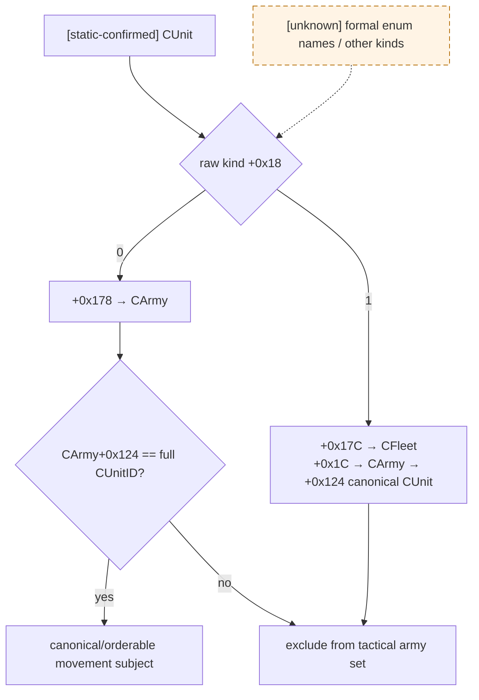
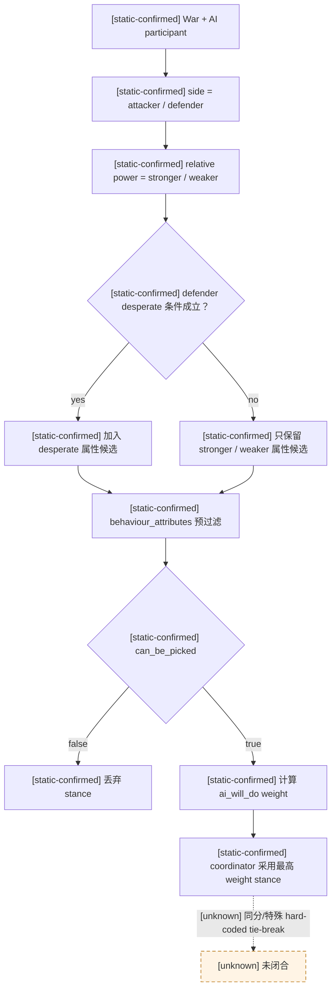
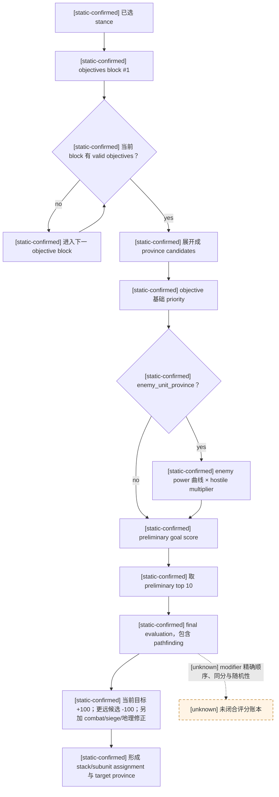
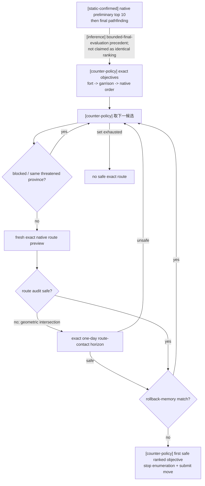
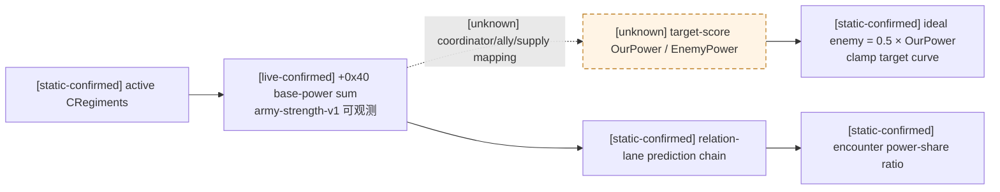
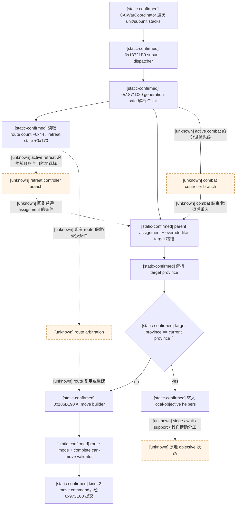
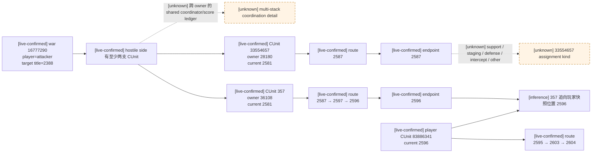
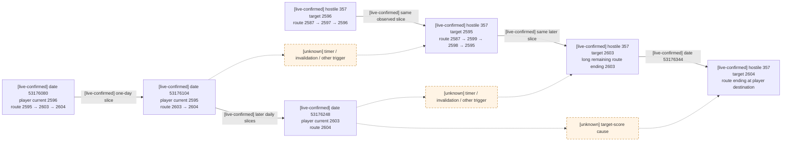
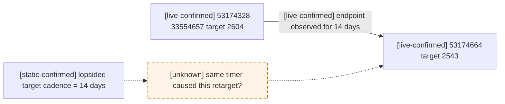
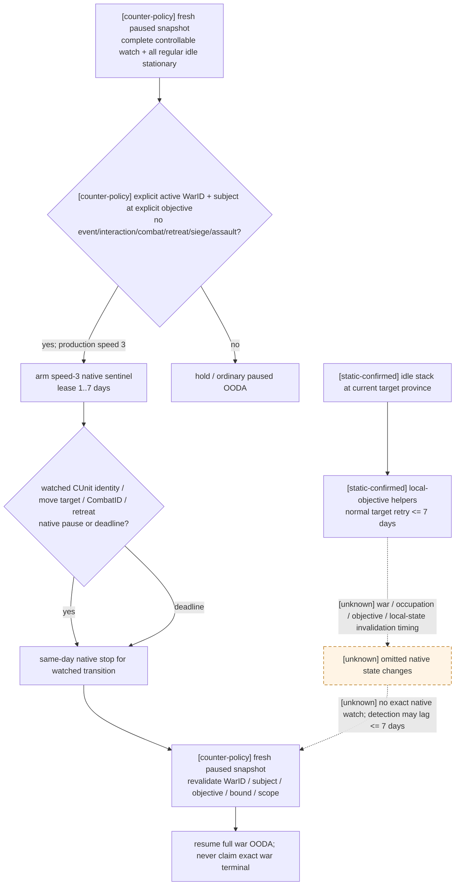

# CK3 1.19.0.6 原生陆军 AI controller 决策树

## 范围与版本

- [static-confirmed] 本文只适用于 CK3 `1.19.0.6`、EXE SHA-256
  `2D00FF3101EF70B566F2FCBAE292F09263199C80E9DC8F139B82D7D96F83DB86`；所有 RVA 均相对
  `ck3.exe` 模块基址。
- [static-confirmed] 脚本侧证据来自同一安装包的
  `game/common/ai_war_stances/_ai_war_stances.info`、
  `game/common/ai_war_stances/00_ai_war_stances.txt` 和
  `game/common/defines/ai/00_ai.txt`。
- [live-confirmed] 当前实例证据来自 2026-08-24 的 PID `100912` 只读快照；读取时模块基址为
  `0x7FF6287C0000`，没有向 CK3 写内存、调用函数、提交命令、改变暂停状态或控制进程。
- [unknown] 本文没有闭合每个 live `CAIUnitStack`/`CAISubunitStack` 的堆对象地址、assignment 枚举值
  与逐项评分账本，因此不会把路线终点反推成一个未经证实的 objective 类型。

## 证据标签

- [static-confirmed] `static-confirmed`：原版说明/数据直接给出，或 exact-build 反汇编闭合到执行分支。
- [live-confirmed] `live-confirmed`：exact-build 的只读进程快照直接给出。
- [inference] `inference`：由已证输入和结果推出的策略解释，尚未独立闭合中间执行分支。
- [unknown] `unknown`：仍缺少证据；Mermaid 中虚线边或带 `unknown` 的节点均属此类。

## 原生对象与执行主干

| 证据 | 对象/入口 | exact-build 结论 |
|---|---|---|
| [static-confirmed] | `CAIWarCoordinator` | RTTI RVA `0x52FB408`，主 vtable RVA `0x41923B0`；构造引用包括 `0x1852423`、`0x18528C7`。 |
| [static-confirmed] | `CAIWarPlan` | RTTI RVA `0x530BFF8`，主 vtable RVA `0x419D160`；构造引用在 `0x1913FC8` 一带。 |
| [static-confirmed] | `CAIStrategy` | RTTI RVA `0x52F9310`，主 vtable RVA `0x4191750`。 |
| [static-confirmed] | `CAIUnitStack` | RTTI RVA `0x52F9638`，主 vtable RVA `0x4191870`。 |
| [static-confirmed] | `CAISubunitStack` | RTTI RVA `0x52FC278`，主 vtable RVA `0x4192778`。 |
| [static-confirmed] | `CAIPathfinder` | RTTI RVA `0x54A3410`，主 vtable RVA `0x43072E0`。 |
| [static-confirmed] | coordinator 循环 | `0x18552C0..0x18554EF` 更新 coordinator/strategy 状态并遍历 unit stack 与 subunit stack；`0x18553A0` 调用 `0x18721B0`，随后 `0x18553A8` 调用 `0x18726C0`。 |
| [static-confirmed] | `0x1871D20` | 从 `CAISubunitStack+0x10` 的 ID 数组和 `+0x1C` count 做 generation-safe `CUnit` 解析。 |
| [static-confirmed] | subunit 关系 | `CAISubunitStack+0x40` 连接 parent unit stack；`+0x48` 的指针参与 target override/resolution 路径。 |
| [unknown] | `CAISubunitStack+0x48` 语义名 | 已证它参与目标解析，但尚未闭合其完整类型、所有权和枚举语义，本文只称“override-like target”。 |
| [static-confirmed] | `0x18721B0` | subunit 分派器读取 `CUnit+0x44` route count、`CUnit+0x170` retreat state，经 `0x1873AC0`/`0x1873D30` 一带解析 assignment/target province，并比较目标省与当前省。 |
| [static-confirmed] | `0x186B190` | 目标省不同于当前省时进入 AI move builder：`0x26B51B0` 取 route mode，`0x26B4610` 做 complete can-move，构造 kind `2` 的 native move command，再由 `0x973E00` 以 flags `7` 提交。 |
| [static-confirmed] | 同省分支 | 目标省等于当前省时转入 `0x191B080`/`0x1873100` 一带的 local-objective helpers。 |
| [unknown] | local-objective helper | helpers 的精确分工尚未闭合，可能涉及 siege、wait、support 或其它原地任务；现阶段不得把任一 helper 命名为 exact “start siege”。 |

### CUnit、CFleet 与 canonical movement subject

- [static-confirmed] CUnit `+0x18` 是 raw kind。raw `0` 使用 `+0x178` 的 CArmyID；raw `1` 使用
  `+0x17C` 的 CFleetID。`0x2246EC0` 分别沿这两条路径取关联 CArmy。
- [static-confirmed] CFleet storage 为 `module+0x57BFDE0`，RTTI/vtable 为 `0x54A3488 / 0x43075A8`；
  `CFleet+0x18` 回链 public carrier CUnit，`CFleet+0x1C` 连接 CArmy，CArmy `+0x124` 再给出
  canonical/orderable CUnit。`0x22492A0` 直接消费这组字段。
- [static-confirmed] player move validator `0x2248860` 与 contact queue `0x220BB88` 一带均拒绝 raw kind 非零的
  CUnit。故 AI controller/tactical planner 的独立移动主体必须是 raw-kind `0` 且
  `CUnit+0x178 → CArmy → CArmy+0x124` 回到同一完整 CUnitID；CFleet-linked carrier 不是另一个 stationary stack。
- [live-confirmed + inference] 正式长跑中 `150995278` 与 embarked canonical row `33554818` 连续 59 日逐省同步，
  但旧 snapshot 把前者误投影为 `regular/no route` 并做了 186 次失败 preview。具体 ID 对的 raw-kind/CFleet 关系仍待
  cold replay 直接闭环；完整 artifact 与边界见 [army-contact-resolution.md](army-contact-resolution.md)。
- [unknown] raw kind 的正式枚举符号名、其它可能值与完整舰队创建/销毁树尚未恢复；这些 unknown 不改变 raw `1`
  已由 exact movement/contact gate 排除的结论，也不构成本次 G1 blocker-removal 的前置。

## 第一层：war stance 选择

- [static-confirmed] 原版 `_ai_war_stances.info` 明确说明：stance 先按 AI 所在 side 与相对 power
  （计入精锐兵质量的 army size）选择适用候选，coordinator 采用最高评分的 stance。
- [static-confirmed] `behaviour_attributes` 的 `stronger`、`weaker`、`desperate` 在
  `can_be_picked` 之前过滤；`desperate` 只用于 defender，条件是显著弱势且接近战败或只剩一个 landed
  title。
- [static-confirmed] 通过属性过滤后还要执行 `can_be_picked`，再由 `ai_will_do` fixed-point value
  形成 stance 权重。
- [unknown] 多个 stance 同分时的 tie-break、随机性及所有 hard-coded 特例的先后顺序尚未闭合。

### 默认 stance 的 objective 基础优先级

- [static-confirmed] 下表按 `00_ai_war_stances.txt` 的 objective block 原顺序抄录；括号内是限定 area，
  分号后的 `fallback` 是后续 objective block，不与前一 block 冒充同层加总。
- [static-confirmed] 所有这些默认 stance 的 `enemy_unit_priority` 都是 `100`；它还会受敌军 power 曲线和
  hostile-unit multiplier 影响。

| 证据 | stance / 适用条件 | 第一个 objective block（从高到低列出同值项） | 后续 block |
|---|---|---|---|
| [static-confirmed] | `attacker_offensive` / stronger | wargoal 500；enemy unit（wargoal 或 primary_attacker area）250；enemy capital 150；enemy province 100；enemy ally 75；own capital 50；own province 25；其它 enemy unit 10 | defend wargoal 5 |
| [static-confirmed] | `attacker_defensive` / weaker | 任意 enemy unit 500；wargoal 500；enemy capital 150；enemy province 100；enemy ally 75；own capital 50；own province 25 | defend wargoal 5 |
| [static-confirmed] | `defender_offensive` / stronger | wargoal 500；enemy unit（wargoal 或 primary_defender area）250；任意 enemy unit 200；enemy capital 150；enemy province 100；enemy ally 75；own capital 50；own province 25 | defend wargoal 5 |
| [static-confirmed] | `defender_defensive` / weaker | wargoal 500；enemy unit（wargoal 或 primary_defender area）250；任意 enemy unit 200；defend wargoal 100；enemy capital 50；own capital 50；enemy province 30；enemy ally 20；own province 15 | defend wargoal 5 |
| [static-confirmed] | `defender_desperate` | wargoal 500；enemy unit（wargoal 或 primary_defender area）250；own capital 50；own province 25 | defend wargoal 5 |
| [static-confirmed] | `great_holy_war_attacker` / stronger 或 weaker | wargoal 500；enemy unit（wargoal 或 primary_attacker area）300；enemy capital 250；enemy province 200 | defend wargoal 5 |
| [static-confirmed] | `great_holy_war_defender` / stronger、weaker 或 desperate | wargoal 500；enemy unit（wargoal 或 primary_defender area）300 | own capital 50 + own province 25；再 fallback defend wargoal 5 |

## 第二层：objective blocks、候选省与最终评分

- [static-confirmed] 每个 stance 可以有多个 `objectives` block，coordinator 按 block 自上而下寻找 valid
  objectives；`defend_wargoal_province` 是允许既不立即开 siege、也不立即开 combat 的 fallback。
- [static-confirmed] objective 最终变成“向哪个 province 移动或在哪个 province 驻守”的候选评分，不是
  直接对某个画面上的军队对象持续跟随。
- [static-confirmed] `enemy_unit_province` 只会为 AI 能看见的敌军 stack 产生候选。
- [static-confirmed] 从所有 potential goals 中，每个 unit stack 只对 preliminary top
  `MIN_GOALS_PER_STACK=10` 做包含 pathfinding 在内的 final evaluation。
- [unknown] block 内各类候选的完整去重顺序、所有 modifier 的精确算术顺序、同分处理和 path cost 公式尚未闭合。

### 2026-08-27 production 反例：我方 exact objective 不得全量做 final route scan

- [static-confirmed] 上述原生树只让 preliminary top `MIN_GOALS_PER_STACK=10` 进入包含 pathfinding 的 final
  evaluation；它没有对一个 stack 的全部潜在目标逐一做昂贵 final pathfinding。这个原生边界不能证明我方应照抄
  top 10，但足以证明“先缩小候选，再做 exact route”是原生 controller 的既有结构，而不是要求全量扫描才能正确行动。
- [production-live] 正式一代长跑的普通 `claim_cb` 战争 `33554527` 在 paused `date_raw=53208648` 发布了
  `187` 个互异 `war_objective_province_ids`。玩家军 `33554797` 正在 Province `5598` 围城，敌军
  `117440838` 的完整 route 终点也是 `5598`，故 planner 合法进入 threatened exact-siege 换路分支。旧 counter-policy
  为了全局选择 `shortest_safe_route_then_objective_rank`，在游戏日期完全不变时从 history `2578` 到 `2744`
  连续完成 `132` 次 exact move preview 与 `35` 次 route-contact horizon，共 `167` 条原生查询，仍未提交 move。
  冻结 driver-state 为
  `C:\Users\xenoa\AppData\Local\Temp\xar-war-route-planning-history2738-frozen-driver-state.json`，size
  `79,517,587` bytes，SHA-256
  `3A5BFF57D6AA41403503DD8D922510279B0B6F667AC8C4A32B293AFF9E981AFB`。
- [production-live] 同一冻结状态中，既有 fort/garrison/native-order 排名的第一个未完成候选就是 Province
  `3708`（fort `1`、garrison `250`）。history `2578` 的第一条 preview 已返回 exact route
  `[738,951,950,8668,947,8665,8666,3788,3796,3703,3704,3708]`；对同帧两支非撤退敌军的
  current/target/full route audit 为 `safe`、零 conflict。因此这次真实局面并不需要后续 `166` 条已观测查询：第一条
  preview 已足以授权既有 move command 与其 route/contact 后置验证。
- [counter-policy] threatened exact-siege 换路从现在起按已经发布的
  `fort_level -> garrison_size -> native objective order` 逐项处理，在**第一个**同时通过 fresh exact route、
  route/contact horizon（若相交）与 rollback-memory 检查的候选处立即停止并提交 move。它不是固定 top-K：前项 blocked、
  deferred、unsafe 或 rollback-failed 时仍继续下一项，直到找到安全候选或穷尽全集，因此不会因为人为上限把后部已有安全
  候选错误写成“无目标”。move ACK 后原有 route/contact paused postcondition 保持不变。
- [counter-policy] 明确质量取舍：该冻结帧的 first-safe `3708` 是 `12` hops；旧全局最短扫描后来已经看到的
  `5590` 是 `1` hop，但其 fort/garrison 为 `4/625`。新策略优先保留既有攻城质量排名和立即脱离受威胁位置，不再为
  全局最短路阻塞游戏时间。只有后续 production outcome 证明该取舍实际恶化战争结果时，才考虑“保留当前 best-safe 并
  有界比较更多候选”的替换入口；不得恢复全量门禁。
- [implementation-confirmed] 将上述冻结文件的完整 `2744` 条 command history、真实 `187` 项 objective/state、双方军队
  route 和同帧能力投影离线回放给新 planner 后，它在约 `0.020` 秒内直接返回
  `move-army-33554797-to-3708`，并记录 `evaluated_candidate_count=1`、`unevaluated_candidate_count=185`。
  这项计时不包含读取/解析 79 MB JSON，也不冒充 native command 的实机延迟；它证明 planner 不再等待全量候选查询。

### 2026-08-28 production 反例：全局战分骤降不等于当前省战败

- [production-live] 同一正式长跑在 history `5739` 的 `53263584 → 53263632` 切片中，战争
  `33554565` 的玩家相对战分由 `50` 降至 `16`；玩家军 `201326874` 始终为 `regular@2635`，且当前省
  `local_enemy_ids=[]`。旧 `_recent_war_tactics` 只看战分降幅达到 `20`，仍把 Province `2635` 记入 90 日
  defeat cooldown，导致下一轮错误拒绝当前目标。该切片只证明远处 occupation / objective 等全局分项可以改变战分，
  不证明玩家军在 `2635` 发生本地接触或战败。
- [counter-policy / static-ready] 战分骤降仍可作为本地战败的辅助信号，但只有同一 before-frame 的玩家当前省存在
  至少一支 generation-valid、非撤退 hostile army 时，才把该敌军与当前省绑定到 collision cooldown。若本地敌军集合为空，
  战分变化只更新全局战争判断，不得制造当前省/当前 objective 的本地禁区；真实同省敌军加战分骤降仍保持原 90 日冷却。

### 敌军目标 power 曲线

- [static-confirmed] `IDEAL_ENEMY_POWER_TO_TARGET=0.5`，因此
  `Ideal = OurPower × 0.5`。
- [static-confirmed] 当 `EnemyPower <= Ideal` 时，
  `Multiplier = 0.5 + 0.5 × (EnemyPower / Ideal)`。
- [static-confirmed] 当 `EnemyPower > Ideal` 时，
  `Multiplier = (OurPower - EnemyPower) / Ideal`。
- [static-confirmed] 最终 `Multiplier` clamp 到 `[0, 1]`；它在敌军约等于我方 stack 一半 power 时达到
  `1`，极小目标仍至少从 `0.5` 起算，而接近或超过我方 power 时降向 `0`。
- [static-confirmed] `HOSTILE_UNIT_PRIORITY_MULTIPLIER=0.5`，用于 hostile unit score；
  `RAIDER_UNIT_PRIORITY_MULTIPLIER=0.9` 另管 raider。
- [unknown] `OurPower`/`EnemyPower` 的完整质量、补给、盟军聚合公式尚未从 EXE 闭合；不能把 UI 兵数
  直接当成曲线输入。
- [static-confirmed] [combat-prediction.md](combat-prediction.md) 已闭合另一条同 controller 邻域的底层入口：
  `0x19179E0` 从 `CUnit+0x178 → CArmy+0x38/+0x44 → CRegiment`，对 active regiment 分别累加
  `+0x38` current soldiers 和 `+0x40` base-power qword。它足以施工
  [combat-simulation-inputs.md](combat-simulation-inputs.md) 的 `army-strength-v1` 只读 MCP；该 MCP 已在 paused
  revision `4` live-confirmed，但尚无证据证明
  这里的 target-score `OurPower/EnemyPower` 逐项等于该 qword，故不改写上面的曲线输入名。

| 证据 | 示例（以 `OurPower=A`） | power multiplier |
|---|---|---|
| [static-confirmed] | `EnemyPower=0` | `0.5` |
| [static-confirmed] | `EnemyPower=0.25A` | `0.75` |
| [static-confirmed] | `EnemyPower=0.5A` | `1.0`（理想猎物） |
| [static-confirmed] | `EnemyPower=0.75A` | `0.5` |
| [static-confirmed] | `EnemyPower>=A` | `0`（clamp 后） |

- [inference] 把一支接近 `A` 的玩家军拆成两支约 `0.5A` 的军队，可能把“曲线接近 0 的大目标”变成
  两个“曲线接近 1 的理想猎物”；若敌方有多个 unit stack/assignment，两半都可能被分别追踪，不能把拆半
  自动视作稳定诱饵。
- [static-confirmed] 上述风险仍受 `CHASE_MIN_SIZE=500` 门槛、可见性、路径、objective area、战斗预测和
  其它候选分数限制；小于 500 的军队不会被 AI 费力追击。

### 追击门槛与候选修正

| 证据 | define | 值与语义 |
|---|---|---|
| [static-confirmed] | `CHASE_PRIMARY_ENEMY_MIN_SCORE` | `0.75`；目标 stack 含敌方总 strength 的比例形成 0..1 score，若由 primary enemy 统领则至少抬到该值。 |
| [static-confirmed] | `CHASE_PRIMARY_ENEMY_SOLDIER_MODIFIER` | `2.0`；判断是否值得承受 hostile attrition 时放大目标兵数。 |
| [static-confirmed] | `CHASE_MAX_SPEED_DIFFERENCE` | `0.2`；比追击方快超过该差值的目标会被忽略，除非目标相邻。 |
| [static-confirmed] | `TARGET_SCORE_SUPPORT_PLAYER_ONE_STEP/TWO_STEP/THREE_STEP` | 支援玩家候选分别 `+1000/+500/+250`。 |
| [static-confirmed] | `TARGET_SCORE_IS_SIEGING` | 特定 AI unit 已在围攻该省时 `+500`。 |
| [static-confirmed] | `TARGET_SCORE_WOULD_LIFT_SIEGE` | 能解围时 `+190`。 |
| [static-confirmed] | `TARGET_SCORE_WOULD_START_COMBAT` | 会开战时 `+80`。 |
| [static-confirmed] | `TARGET_SCORE_WOULD_START_SIEGE` | 会开围城时 `+70`。 |
| [static-confirmed] | `TARGET_SCORE_CLOSE_TO_WAR_GOAL` | 接近战争目标时 `+100`。 |
| [static-confirmed] | `TARGET_SCORE_SAME_PROVINCE` | 同省 `+25`。 |
| [static-confirmed] | `TARGET_SCORE_SAME_COUNTY` | 同 county `+150`。 |
| [static-confirmed] | `TARGET_SCORE_SAME_COUNTY_AS_ENEMY_CAPITAL` | 位于同/相邻 county 且目标同 enemy capital county 时 `+75`。 |
| [static-confirmed] | `TARGET_SCORE_NEIGHBOR_COUNTY` | 相邻 county `+100`。 |
| [static-confirmed] | `TARGET_SCORE_CURRENT` | 继续当前 target `+100`。 |
| [static-confirmed] | `TARGET_SCORE_FURTHER_AWAY` | 候选比“本军到当前 target”还远时 `-100`。 |
| [static-confirmed] | `POTENTIAL_PROVINCE_TARGET_ADJACENT_TO_FRIENDLY_SCORE` | 候选邻接友方控制 county 时 `+100`。 |

- [inference] `TARGET_SCORE_CURRENT=+100` 与 `TARGET_SCORE_FURTHER_AWAY=-100` 共同制造目标黏性；目标不是
  每天无成本重选，所以画面上会出现“先沿旧路线追、刷新后再掉头”的折返。
- [unknown] 事件驱动的即时 invalidation 可能早于周期 tick；尚未闭合哪些死亡、失去可见性、战斗或占领事件
  会立刻清除 assignment。

## 重算频率与 stack 划分

| 证据 | 周期/阈值 | exact-build 语义 |
|---|---|---|
| [static-confirmed] | `UPDATE_WAR_STANCE_TICK=30` 日 | 每 30 日重新评估 war stance。 |
| [static-confirmed] | `UPDATE_SPLIT_MERGE_TICK=14` 日 | 每 14 日评估 unit stack 的 split/merge。 |
| [static-confirmed] | `UPDATE_TARGETS_TICK=7` 日 | 正常局面每 7 日更新 targets；idle stack 也按此周期重试 orders。 |
| [static-confirmed] | `UPDATE_TARGETS_TICK_LOPSIDED=14` 日 | 一边 power 不超过另一边的 `0.33` 时视作 lopsided，目标更新/idle retry 改为 14 日。 |
| [static-confirmed] | `WANTED_POWER_RATIO_AGAINST_ENEMY_FOR_WAR_PLAN=1.25` | war plan 希望分配到敌方 maximum power 的 1.25 倍。 |
| [static-confirmed] | `STRONGEST_OPPONENT_SIZE_MULTIPLIER=1.5` | 计算每 stack 所需 strength 时尝试达到最强对手的 1.5 倍。 |
| [static-confirmed] | `MIN_STACK_SIZE_THRESHOLD=0.75` | 低于 preferred stack size 的 0.75 倍时尝试 merge。 |
| [static-confirmed] | `STACK_SIZE_SPLIT_THRESHOLD=1.1` | 高于 preferred stack size 的 1.1 倍时尝试 split。 |

- [static-confirmed] `00_ai.txt` 把 unit stack 定义为协同行动的集合，一个 unit stack 可以拆成多个
  subunit stacks；只有本方数量优势足够时通常才会有多个 unit stacks。
- [static-confirmed] coordinator 对象在 `+0x94/+0x98/+0x9C` 一带维护日计数/期限字段。
- [unknown] 三个字段与 7/14/30 日周期的逐一映射、随机 jitter，以及事件触发的提前重算入口尚未闭合。

## 第三层：CAISubunitStack 分派、route 与本地目标状态机

- [static-confirmed] “追击”在已证部分表现为：`enemy_unit_province` 生成一个可见敌军所在省的候选，最终 assignment
  保存 target province，再由普通 AI move command 建路；它不是已证的逐帧锁定敌军 handle。
- [static-confirmed] assignment/move command 之后的 normal daily movement 与实际同省接触不再属于 target-score
  账本：[army-contact-resolution.md](army-contact-resolution.md) 已闭合 unit-manager traversal → deferred contact queue、
  Province full-CUnitID 数值序 opponent、已有战斗优先与攻守分配。接触 resolver 不会重新计算 stance、objective
  score 或 AI combat ratio。
- [inference] 因此移动目标在两次 target evaluation 之间继续运动时，追兵可先走向敌军旧省；到 7/14 日刷新、
  assignment invalidation 或旧省抵达后才可能换向。
- [static-confirmed] “围城”在评分层有明确黏性：本 unit 已在特定省围城 `+500`，继续本 stack 的 ongoing siege
  `+80`，会开始新 siege `+70`。
- [static-confirmed] 离开仍有 occupation warscore 价值的 ongoing siege 会受基础 `-100` 惩罚，并按距离可得
  occupation warscore cap 的剩余比例缩放；该惩罚在
  `APPLY_TARGET_WILL_BREAK_ONGOING_SIEGE_RATIO=0.5` 条件下应用。
- [static-confirmed] 没有 siege weapons 时，只有预计至少还要 `30` 日结束，AI 才允许相应 subunit stack
  放弃 siege。
- [unknown] 抵达目标省后究竟由 `0x191B080` 还是 `0x1873100` 启动/维持 siege，以及二者的参数结构，
  尚未闭合。

## 战斗、救援、撤退与围城之间的切换

| 证据 | 条件 | 已证行为边界 |
|---|---|---|
| [static-confirmed] | 普通 combat prediction ratio > `0.5` | AI 的接战候选通过该 ratio 门；等于 `0.5` 仍拒绝。 |
| [static-confirmed] | desperate combat ratio > `0.4` | desperate 模式降低进入风险省份的阈值；等于 `0.4` 仍拒绝。 |
| [static-confirmed] | prediction ratio < `0.66` | unit stack 尝试请求增援；达到 `0.75` 后停止继续请求。 |
| [static-confirmed] | 当前 unit stack 被敌方 out-powered 达 `ASK_FOR_HELP_OTHER_STACK_TROOPS_RATIO=1.5` 门槛 | 尝试请求附近友军 stack 介入；现有证据不把该 define 改写成未经闭合的分子/分母公式。 |
| [static-confirmed] | siege 进度 ≥ `0.6` | 为救援而打断 siege 的门槛改为更保守的 `1.7`。 |
| [static-confirmed] | prediction ratio < `0.45`，且另处至少有本军 25% strength 或 2 省内有更好防守地形 | AI 满足 retreat 条件。 |
| [static-confirmed] | stand-and-fight | 最长保持 30 日；放弃后 45 日 cooldown。 |

- [static-confirmed] `CLOSE_TO_VICTORY_WAR_SCORE=80` 时，若剩余可得 occupation warscore 至少 `20`，
  breaking-siege penalty 乘 `2`；若剩余可得 battle warscore 至少 `20`，stance 的
  `enemy_unit_priority` 乘 `2`。
- [static-confirmed] 原版注释明确警告：close-to-victory 的 battle multiplier 仍叠加 ideal-enemy-power
  曲线，AI 可能为了易赢战斗打断围城。
- [inference] “正在围城”不是绝对锁定：高分解围、可赢 combat、跨 stack 救援或临近胜利的 battle
  机会都可能压过 siege 黏性；能否压过取决于完整候选账本和路径。
- [unknown] combat 已开始后的 exact controller 调度、撤退 command 构造入口、撤退目的地评分，以及
  stand-and-fight 的进入分支仍未闭合到 EXE 调用链。

## 当前战争 16777290：双敌军 assignment 实例

- [live-confirmed] 战争 `16777290` 中玩家位于 attacker side，targeted title 为 `2388`；已知目标层级含
  Spoleto，已解析目标 capital province `2585`，primary opponent 为 character `36108`。
- [live-confirmed] PID `100912` 快照中，敌军 `357` 的 owner 为 `36108`，current province `2581`，
  exact route 为 `[2587, 2597, 2596]`，target province `2596`，retreat raw `0`，没有 live combat。
- [live-confirmed] 同一快照中，敌军 `33554657` 的 owner 为 `28180`，current province `2581`，
  exact route 为 `[2587]`，target province `2587`，retreat raw `0`，没有 live combat。
- [live-confirmed] 玩家军 `83886341` 的 owner 为 `29829`，current province `2596`，exact route 为
  `[2595, 2603, 2604]`，target province `2604`，retreat raw `0`，没有 live combat。
- [live-confirmed] 两支敌军从同省出发且共享第一跳 `2587`，但 route endpoint 分别为 `2596` 与 `2587`；
  这足以证明当前命令/assignment 已分化，而不是两军永远作为一个视觉 blob 同目标移动。
- [unknown] 两个 owner 是否在同一个 higher-level coordinator 中共享 score ledger、`33554657` 的
  objective kind，以及它停在 `2587` 是支援、拦截、驻防还是其它任务，尚未闭合。

### 合军后的一日切片复核

- [live-confirmed] 玩家在日期 `53175984` 把 sibling `16777558` 合回原主军 `83886341`；暂停快照确认
  source 消失、destination 保留，未推进日期完成合军。
- [live-confirmed] 合军后的主军连续取得同一 fresh preview `[2595,2603,2604]`。它在前四个一日切片中仍报告
  current `2596`、state `sieging`，到日期 `53176104` 才抵达首跳 `2595`，remaining route 自然缩短为
  `[2603,2604]`、state 变为 `moving`。这证明 CK3 的省级 snapshot 在边内不发布连续进度；不能仅因
  current/state 数日不变就把 route 判成 stale。
- [live-confirmed] 同一个 `53176080 → 53176104` 切片后，敌军 `357` 仍在 `2581`，但 target 从 `2596`
  改为 `2595`，route 从 `[2587,2597,2596]` 改为 `[2587,2599,2598,2595]`。
- [live-confirmed] 因而 7/14 日 target cadence 不是“端点在窗口内不可变化”的锁；端点可以在已观测跨度不足
  7 日时变化，counter-policy 必须逐个 paused frame 重审。
- [unknown] 该一日切片内无法区分这次改令来自玩家抵达新省触发的 invalidation、恰逢原生定时评估，还是
  其它事件；不得把相关性写成已经证实的即时追踪因果。
- [live-confirmed] 日期 `53176248`，玩家又抵达 `2603`、remaining route 缩短为 `[2604]`；同帧 `357`
  再把 target 从 `2595` 改为 `2603`，remaining route 变为
  `[2587,2585,2586,2579,2589,2591,2602,8759,2603]`。这提供第二个独立的“玩家抵达与敌端点改令同帧”
  观察，但触发因果仍然 unknown。
- [live-confirmed] 日期 `53176344`，玩家仍在 `2603 → 2604` 的边内时，`357` 又把 target 从
  `2603` 改为 `2604`，route 变为 `[2599,2598,2595,2603,2604]`。因此原生 AI 的 endpoint 不只会追踪
  已观测 current；它也可能选择玩家公开 route 的 destination，但当前仍无法读出对应 objective kind/score。

### Restore 分支中的 14 日端点观察

- [live-confirmed] restore 到 `53174208` 后，敌军 `33554657` 在日期 `53174328` 把 target 改为 `2604`，
  route 为 `[2560,2565,2568,2572,2574,2579,2589,2591,2602,8759,2604]`。
- [live-confirmed] 此 endpoint 持续到 `53174640`；日期 `53174664` 的下一 paused frame 中，target 改回
  `2543`，route 变为 `[2560,2559,2543]`。两次端点观察相差 raw `336`，即恰好 14 游戏日。
- [static-confirmed] 原版 lopsided target cadence 是 14 日；[live-confirmed] 当前 production bridge 已发布
  per-army base power，但仍没有 target-time timer phase、assignment score 或 coordinator aggregate，因此这次
  恰好 14 日的变化只能视为与该 cadence
  一致，不能证明本战争走了 lopsided timer 分支，也不能推广成每次第 14 日必改令。

### 为什么会看到“来回追踪”

1. [live-confirmed] 在该快照时刻，`357` 的 endpoint 仍是玩家 current province `2596`，但玩家已经有
   前往 `2604` 的 route；因此二者的 route target 已不相同。
2. [static-confirmed] 普通 target evaluation 是 7 日一次，lopsided 战争是 14 日一次；当前 target
   另有 `+100`，更远的新候选可能受 `-100`。
3. [inference] 在刷新前，`357` 可继续走向 `2596`；刷新时，新的玩家可见省、路径成本和 power 曲线可能
   使它转向，于是画面表现为滞后追踪与折返，而不是每帧重新寻路。
4. [live-confirmed] `33554657` 当前只走到 `2587`，说明第二支敌军没有复制 `357` 的完整追击路线。
5. [inference] 第二支敌军的独立 assignment 会改变“诱饵”效果：一支追兵被拉走不等于另一支也被拉走，
   另一支可能仍卡在接近玩家路线的省或承担战争目标任务。
6. [unknown] 下一次刷新是否一定把 `357` 改指 `2604` 无法由当前证据保证，因为可见性、即时 invalidation、
   objective block、其它候选和 final pathfinding 都可能改变结果。

## 原地战争目标的七日观察窗与我方稀疏暂停

- [static-confirmed] 原生 controller 对 idle stack 的普通 target retry 是 `UPDATE_TARGETS_TICK=7` 日；目标省等于
  当前省时进入 local-objective helpers，而不是构造一条移动路线。这个周期给出了“至多七日后重新观察”的自然上界，
  但没有证明七日内战争、占领或 local objective 状态不会变化。
- [production-live] 只读 artifact `ca52af74` 中，`135` 个逐日 arm 占总墙钟约 `59%`；同一长跑的 checkpoint
  节拍还会在每三次 advance 后触发。把合格的 stationary hold 合并为七日 tranche，预计同时减少逐日 arm 和约
  `49` 个由这些 advance 诱发的 checkpoint，但这是本 canary 的待实测收益，不冒充已经实现的 wall-clock 结果。
- [live-confirmed] 同一只读证据中有两次新 WarID 只在外部 paused frame 才进入 active-war set。现有 CUnit watch
  能保证真实接触形成 CombatID 时同日停，却不能 exact-watch 新战争加入；因此 active-war-set 变化仍属于下面的
  七日 bounded blind spot。
- [unknown] 当前 exact build 尚未闭合一条可由现有 decision sentinel 同日监听的 active-war set（包括新 WarID 加入）、WarID、战争分数、战争终结、
  objective membership、occupation、current province 或 local-objective state 原生字段链。尤其不能把
  `CUnit` 仍然 idle/stationary 推断成 active-war set 未变、战争仍 active、目标仍属于该战争或占领状态不变。
- [counter-policy] stationary-objective-hold 的准入保持原 canary 的窄合同：在一致 paused snapshot 中要求完整玩家可控军
  watch、无 event/interaction、无玩家 combat/retreat/active siege/assault，所有玩家军都是 regular idle stationary，
  且显式 subject 当前位于显式 active WarID 的显式 objective province。缺失的 deep objective-state rows 不单独阻断：
  regular/idle 全军观测负责排除玩家 siege/assault，已发布的 active-siege row 仍作为矛盾证据拒绝。它以 speed 3 最多推进
  `1..7` 日，并把所有现存 termination negative-reuse lease 的最早 expiry 作为更近 deadline，复用现有 native decision
  sentinel 对 CUnit identity、move target、CombatID、retreat、native pause 与 deadline 的监听。
- [counter-policy] typed step 必须同时绑定 WarID、subject CUnitID、objective ProvinceID 与 date bound；driver 在 arm 前
  逐项对拍，并在 stop 后取得 fresh paused snapshot 重新观测同一绑定。任何 omitted war/objective/occupation/state 变化
  最迟只会在七日 deadline 后被 Python 发现，因此它是 bounded sparse-pause production primitive，不是 exact war-terminal
  watch；planner 与报告仍必须诚实保留 `maximum_omitted_state_detection_lag_days=7`。
- [live-confirmed] canary `20260828T092300Z-one-generation-90d3cf79` 连续完成 `20` 个 speed-3、七日
  stationary hold，全部由 `date_deadline` 同日停表，成功臂平均 `6.012s`。第 `21` 臂在固定 `30s` wait 内停于
  `53267040`。随后 `20260828T094742Z-one-generation-71e3b7c1` 从同一 durable anchor 重跑：前两臂 GREEN，第三臂即使把
  wait 扩到 `60s` 仍停在**同一个** `53267040`；该 compact artifact 只证明放大等待不产生进展。专门保留 full driver-state 的
  `20260828T095310Z-one-generation-e8cec411` 才直接显示 `active_event instance_id=47`、八个选项、公开 `paused=false`，而
  sentinel 仍是 `armed / completed_daily_ticks=0 / pause_observed=false`；其 report / first-blocker SHA-256 分别为
  `5514AE3520D210DB5703DC4847F096E400B7703200476AB693BC22B68A960881` /
  `8C6A264B27744FEA72C85652DAB7EB857B5D0E857E5A9674125A28BA208C4FCA`。两组证据合起来推翻“七日 wait envelope
  不足”的归因：玩家事件在 daily final-stage hook 之前形成阻塞边界，时间不会因继续等待而推进。第二次 report SHA-256
  `A8CAB8611E776884EBCFD74E396B61A8931B12AD56D0D7872FC4D2E4D65D1970`，first-blocker SHA-256
  `2CFA68010F441C8802D3C8D143A3771ED5B44FBCFF640BBAC3B8061741A11523`。
- [implementation-confirmed] 因此撤销 stationary 专用 `60s` 扩窗并恢复共享 `30s`。composite 把 `active_event` 与
  `pending_character_interaction` 当作 player-decision boundary：若公开帧未暂停则只显式提交一次 `pause-map`，取得可操作的
  paused frame 后再提交
  generation-bound `research-cancel-tactical-daily-sentinel-v1-generation-<generation>`。原生端只在 paused map、同一仍 armed
  generation 上把状态 CAS 为 `idle`，保留原 generation/date/speed/watch/tick 元数据供 status query 证明；generation 不匹配、
  未暂停或已非 armed 都拒绝。只有 status 回读同一 generation 的 `idle` 且 decision identity 在 fresh paused snapshot 稳定，
  composite 才返回事件策略；native fixture 还要求下一次 arm 使用 `generation+1` 成功，不能遗留 `already_armed`。
- [production-live] 修复后的正式 continuation `20260828T103924Z-one-generation-6421f80c` 在未改变战争策略输入的前提下完成
  `100/100` turns：`75` query、`25` gameplay、`24` 个 stationary speed-3 advance 与 `8` 个 durable checkpoint，cleanup GREEN。
  第 `12` turn 在 `date_raw=53267040` 再次遇到 `active_event instance_id=47`，composite 以独立 player-decision boundary 返回，
  随后的 event query/selection 成功并继续完成余下 stationary arms；没有遗留 `already_armed`。报告 SHA-256 为
  `DC66418A874B41909D43E79DD8AF7BCB525786888B0AF1D246270AF80C732C1C`。完整 turn-loop 稳态为 `165` 游戏日 /
  `156.566s = 63.232 d/min`，超过 hard gate `60 d/min`；因此 speed 3 从显式 canary 晋级为默认 production。旧 CLI canary flag
  只保留兼容，不再参与准入；speed 4/5 仍须各自的 research A/B 与 live matrix。
- [counter-policy] production selector 只能在普通 planner 已经选出同一 tactical WarID、同一首选 objective、同一可控 subject，且
  原动作明确为当前位置 `life-advance` 后替换执行方式。它不再提前扫描 active wars；较小 WarID 的另一战争、另一目标或恰好占位都
  不能抢占原 planner 的主攻/参战选择。speed 4/5 live bit 亦严格按 sentinel scope 隔离，不能授权另一 scope 或 route-contact。

## 对我方 planner 的策略指导

- [inference] 决策时优先读取敌军 `route[0]` 与 endpoint，而不只读 current province；current 相同但
  endpoint 不同的 stack 已经是在执行不同任务。
- [inference] 不要逐日追着敌军 current province 反向改令；以其 endpoint、共同 choke point 和 7/14 日
  target cadence 规划拦截或稳定战争目标，能减少双方因旧目标黏性造成的折返。
- [inference] 对移动中的敌军应在一日后先确认 route 是否实际建立，再跨过至少一个 7 日普通 target window
  观察 endpoint 是否保持；若战力比进入 lopsided 区间，则观察窗应按 14 日理解。
- [inference] 上述观察窗不是“7 日内绝不会改令”的保证；planner 必须在每次快照处理 route 消失、combat、
  retreat 或 endpoint 提前变化，因为即时 invalidation 仍是 unknown。
- [inference] 不把“拆军”当默认诱饵。只有两支拆分军各自有可守、可汇合的 durable goal，并且任一敌方
  stack 对任一半的 combat prediction 都可接受时才考虑拆分；否则两半都可能更接近 `0.5×AI power` 的
  理想猎物。
- [inference] 若需要诱导追击，应控制目标可见性、相邻性、速度差与兵力曲线，并预设第二敌军不跟随诱饵的
  路线；在 assignment kind 未闭合前，不依赖单个诱饵稳定吸住所有 hostile stacks。
- [inference] 围城期间可利用 `+500` 已围城、`+80` 续围和 breaking penalty 的黏性争取行动窗口，但每次
  敌军求援、临近胜利或出现 easy battle 时重新评估，不能把围城军视作钉死。
- [inference] 当前实例中把 `2587` 同时视为 `357` 的第一跳和 `33554657` 的 endpoint hazard；在不知道
  后者 objective kind 前，不应把 `357` 离开 `2581` 解读为该方向已经安全。
- [inference] 我方策略实现只消费稳定的 snapshot 字段（current province、route、target、combat、
  retreat、siege），不应依赖本文仍为 unknown 的内存指针或 helper 地址。
- [live-confirmed] paused revision `4` 的 player `83886341` 是 `1482` current soldiers / base power `55,223`；
  `357` 是 `1801 / 58,468`，`33554657` 是 `1011 / 31,600`。玩家对 `357` 的 base-power diagnostic share
  为 `0.48573`（只施加已证 enemy `×1.1` 后 `0.46198`）；对两敌合流为 `0.38009` / `0.35790`。
- [counter-policy] planner 必须把 `[player,357]` 与 `[player,33554657,357]` 建成两个显式 pre-contact context；
  不得拿单敌结果覆盖两敌合流。若第二敌军可能在 forecast horizon 内会师而 ETA/join policy 未闭合，单敌情景
  也不能授权攻击。上述 share 是 base-power 风险诊断，不是原生 predictor return 或 Monte Carlo 胜率。
- [counter-policy] 下一版策略在按兵力决定拦截、拆军、接战或撤退前，必须先调用
  `ck3_query_army_strengths(army_ids, expected_revision)` 显式请求同一 paused revision 的相关双方军队；native
  无参 step 会先冻结 player + active-war allied/enemy 完整允许 scope，MCP 只在该 scope 内过滤。capability
  已 live-confirmed；请求域外或任一请求 army unavailable 时继续 hold/避战，并把 terrain/commander/MAA 等缺字段
  送入下一只读 MCP 施工队列，不得把 `unknown` 解释成可安全攻击。

## 未闭合清单

- [unknown] stance 同分时 tie-break、随机性和 hard-coded 特例的完整优先顺序。
- [unknown] target-score relative power 对已闭合 per-army base-power qword 的 coordinator/盟军/补给/损耗映射；
  CArmy/CRegiment current/max/base aggregate 本身已由 production MCP paused live-confirmed。
- [unknown] objective block 内的候选去重、modifier 算术顺序、final path cost 与同分规则。
- [unknown] 7/14/30 日定时器与 `CAIWarCoordinator+0x94/+0x98/+0x9C` 的逐字段映射及 jitter。
- [unknown] 目标死亡、离开视野、进入战斗、占领变化等事件触发的即时 assignment invalidation 表。
- [unknown] `CAISubunitStack+0x48` 的完整类型、assignment 枚举与 live score ledger。
- [unknown] `0x191B080`/`0x1873100` local-objective helpers 对 siege/wait/support 的精确分工。
- [unknown] active combat 的 AI controller 调度优先级、retreat、stand-and-fight 的分支顺序和目的地评分；
  normal daily placement/contact 的引擎顺序已在 `army-contact-resolution.md` 单独闭合，不属于此 unknown。
- [unknown] 不同 owner 的 allied armies 是共享一个 higher-level coordinator，还是经多个 coordinator
  交换 war-plan/支援信息。
- [unknown] 当前 `33554657` 的 exact objective kind；`2587` endpoint 本身不能证明它在拦截或驻防。
