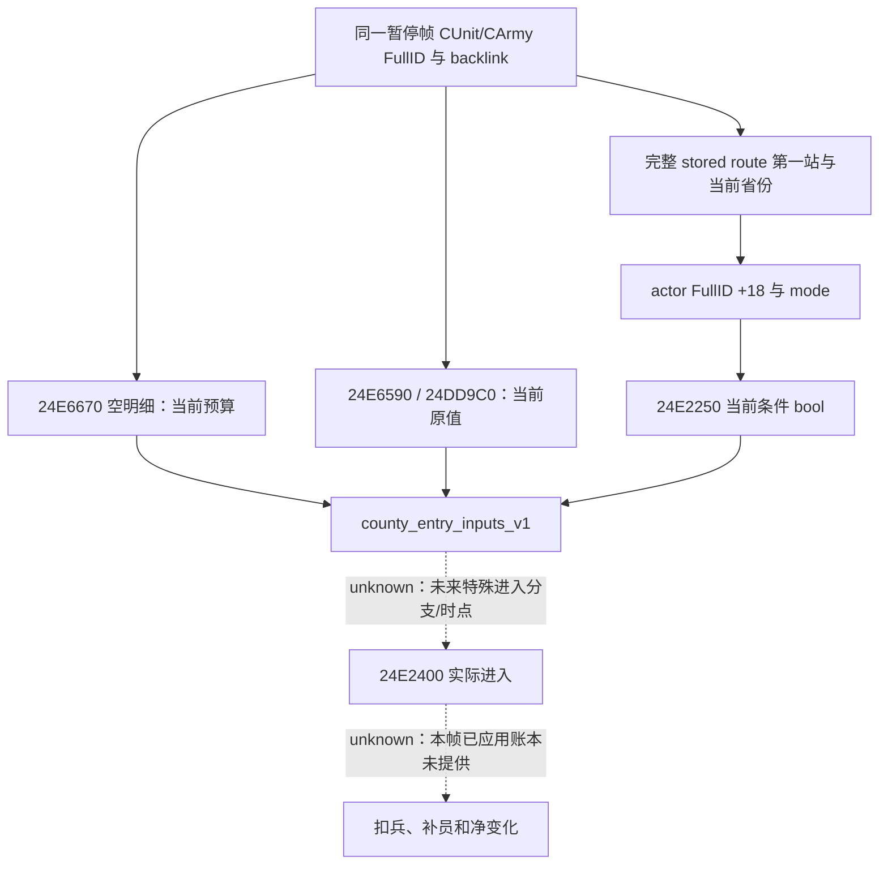

# 县界进入损耗：当前原生输入，只读合同（1.20.0.3）

本包给现有 `query-army-strengths-v1` 行增加可选 `county_entry_inputs_v1`，用于读**当前输入下的原生预算**，以及当前所在省份到完整已存路线第一站的原生条件。它不调用进入执行器，不提供已应用扣兵/补员/死亡账本，不证明下一站一定执行损耗。

版本固定为原版 CK3 `1.20.0.3`，EXE SHA-256 `94b55397abb687a3dcd436805a5d885e6be90fa6c693feb44a9e3bbeeade02a6`。`.2` 及其他构建不绑定这些新增函数。既有 [R0168 当前损耗观测](army-episode04-current-loss-readiness-r0168.md)、[R0162 周期与到达损失](army-episode04-periodic-and-county-arrival-loss-r0162.md) 与 [人数写回链](army-attrition-soldier-writeback-12003.md) 的实机/静态层次继续独立。

## 原生边界和 ABI

| RVA | 只读调用合同 | 输出/作用 |
|---|---|---|
| `24E6670` | `int32(CArmy*, nullptr)` | 当前进入损耗整数预算，整体当前兵数比例、最低值、总人数上限的原生运算 |
| `24E6590` | `int64*(CArmy*, int64* out)` | 有效比例 Q100000；必须返回该 out 指针 |
| `24DD9C0` | `int64*(int64* out, CArmy*)` | 当前最低值倍率 Q100000；必须返回该 out 指针 |
| `5C68B64` | 当前已加载 `int32` | 最低损耗人数输入，不硬编码历史 define 的 100 |
| `24E2250` | `bool(CCharacter*, source CProvince*, target CProvince*, int32 mode)` | 当前原生条件；`mode = CArmy+1D4 == 0 ? 1 : 0` |
| `5C67568` | CCharacter storage slot | 与进入调用方相同的 actor FullID 解析；对象身份位于 `+18` |

`24E6670` 从合法实际 ArRg 的 `+38` 求整体当前人数，原生截断 `人数 × 有效比例 / 100000` 与 `加载最低人数 × 倍率 / 100000`，取较大值，再以整体人数截断。本合同保留原生预算，不用公开人数或 GUI 的当前损耗率重算。有效比例和倍率仍是 signed int64 原值；没有把负值转换为无符号或把异常预算钳成合法零。

`24E2400` 的进入调用方使用 `AEAA20(CArmy+124)` 得到 CUnit，再取 `CUnit+174` 的 actor FullID，经 `5C67568` storage 和 `CCharacter+18` 校验后调用条件函数。`AEAA20` 是无调用/写入的 FullID resolver，不改变 R9。新 reader 已校验同一个 CUnit→CArmy 完整代际及 CArmy→public CUnit backlink，复用该 CUnit，经同一 storage 的 mask24 索引与 `+18` 完整位比较，不借用玩家身份或指挥官身份。当前 reader 仅接受非负 signed actor FullID；原生调用方允许 signbit 高代际 ID，该有限 reader 对其返回 condition unknown，不返回 false，当前 William33388 不受影响。无法解析 actor 时条件未知，不使用原生 fallback character 假造身份。

条件函数读取两省 land 标记、县对象、actor 上下文、县归属/字节分支及目标县邻接对象。这里直接读原生布尔结果，不把未闭合的每个内部子分支翻译成自创的“敌对”规则。原生进入执行器的额外 R9b 特殊调用分支、实际进入时点、未来状态和逐团分配没有被这个当前条件涵盖。

## DTO 和未知值

顶层固定 `source=native_current_county_entry_inputs`，`fraction_scale=100000`、`soldier_scale=1`。`status=available` 表示五个当前数字已读到：`whole_soldiers`、`current_loss_budget`、`effective_fraction_raw`、`minimum_multiplier_raw`、`loaded_minimum_soldiers`。整体人数必须与同一 Strength 行一致，预算必须在 `0..whole_soldiers` 内。缺少预算绑定、out 返回指针错误或预算越界时，仅该子块 unavailable，五个数字为 null，普通 Strength 不因该校验失败丢失。

嵌套 `condition.source=current_stored_route_first_province`；available 时发布 actor FullID、source/target 原生省份 ID、`mode` 和原生 `passes`。它严格选完整路线的 `.front()`，不使用最终目的地 `.back()`。空路线、完整路线任何条目无效、当前省份不能与原生索引指针相互核对、actor generation 不符或条件绑定缺失时，该 condition unavailable 且观察字段为 null，当前预算仍可 available。合法 false 和合法零保持实读值。

旧 producer 没有这个块时，Python 保持缺字段，不补零或追认历史 packet。未解析 CArmy 的 ghost 行不发布该块。Python 严格拒绝 bool 冒充整数、未知/缺失键、错误 scale/source、越界、错误同帧人数及不可用状态带数字。

普通输出指针/整数校验失败可保留 Strength；实际原生 getter 内存异常仍走既有外层 query SEH 整体错误处理，不宣称本包增加了独立异常隔离。部署前静态 ABI 与 owning-thread 约束仍须满足。

## 证据与验证层次

外置独立目录 `C:/ck3-war-episode04-research-20261004-a01/loss-cause/county-loss-inputs-a01/` 保留方案、named-leaf reader、精确切片、syntax 编译、合同测试、候选 diff 与收据。没有 SDK、游戏推进、屏幕、执行器、系统设置或实际兵数观测。

| 精确静态证据 | SHA-256 |
|---|---|
| 复用 `loss-cause/movement-loss-count.txt`，`24E6670..24E693C` | `59b67b238ccf164bc0f04ca1005f210759a39bdfe2efd862f748db005873cb6d` |
| 复用 `loss-cause/movement-attrition-predicate.txt`，`24E2250..24E23F4` | `ba4b07dba84b89698be58082274bbe483eea6ad2a3c92510c17e9998b4a19ee6` |
| 复用 `loss-cause/movement-loss-executor.txt`，`24E2400..24E2A8F` | `0e35e613669abca88441eeea611d25e7ce60282afc3e1259e92a5870a72ed1eb` |
| 新 `movement-loss-proportion.txt`，`24E6590..24E6666` | `a7d3c2ae96f1016fd9f779ceae477989aa4cf666b8acbb2315da8744544fb7dc` |
| 新 `movement-minimum-modifier.txt`，`24DD9C0..24DDA87` | `1ec809fa542a3f66630dbdfbfd1dd72942d93f4e0770319ae379847bbc13aadb` |
| 新 `cunit-reference-resolution.txt`，`AEAA20..AEAA59` | `a4d211b84e478b408eeb0dbfdd014ee826afa518f03bb38d1b25ed4279c02d96` |

新 reader 仅读取三个命名函数（合计 470 字节）及有界 PE header/exception 索引，逐字节核对已冻结的预算函数窗口，没有全 `.text` 搜索、全 PE dump 或执行游戏。EXE 全文件 hash 复用已保留的 exact .3 来源 pin，不声称重新全文件计算。`open_kaishek` 不适用：当前问题是编译原生 getter 的 ABI 与输出，不存在可由该运行时替代的有限脚本路径。

meaningful fake 覆盖真实生产 reader/serializer：空明细参数、两个不同 out 参数顺序、character 的 `+18` FullID、当前省份指针、完整路线第一站、mode0/1、零/false、无路线、后续路线条目失败、stale actor、非法输出、军队代际/backlink、`.2` 缺绑定及原生输入字节不被写入。Python 生产 normalizer 的 10 项合同测试通过；三个改动 translation units 的 MSVC `/Zs` syntax 检查通过。新增原生 fake 实际执行的结果只按对应运行收据记录，不把 syntax 通过写成 fake 执行通过。

## 下一轮实机所需与剩余缺口

Root 从新提交创建新的冻结源/构建 DLL、host、injector，再以现有 `query-army-strengths-v1` 获取新暂停基线。旧 Cf2/a07 DLL 不具备这个新增块；当前实现和静态证据不能升级旧 William packet。

县界短窗口需同一 public/native Army FullID、owner/commander、实际逐团 FullID/current/max、完整 DATA 补员记录、clock、路线/当前省份、原生条件/预算和前后实际日期。只推进到已安排的第一站，发生 combat/event/编成/身份改变或跨常规补员日历边界即保留窗口并降因果强度。当前条件和预算与终点逐团整数净变化相符，只支持限定的源+端点归因；不排除看不见的中间事件，不直接称死亡。

William 真实供给严格 `<10` 的跨阈值和对应实际整数净损失仍 pending；每团供给过滤资格、已经应用的 loss/refill ledger、进入执行器特殊 flag 和逐团原生分配的独立观测仍未提供。本包只闭合当前县界输入观测口，不增加饥饿、实际扣兵或成片完成信用。
