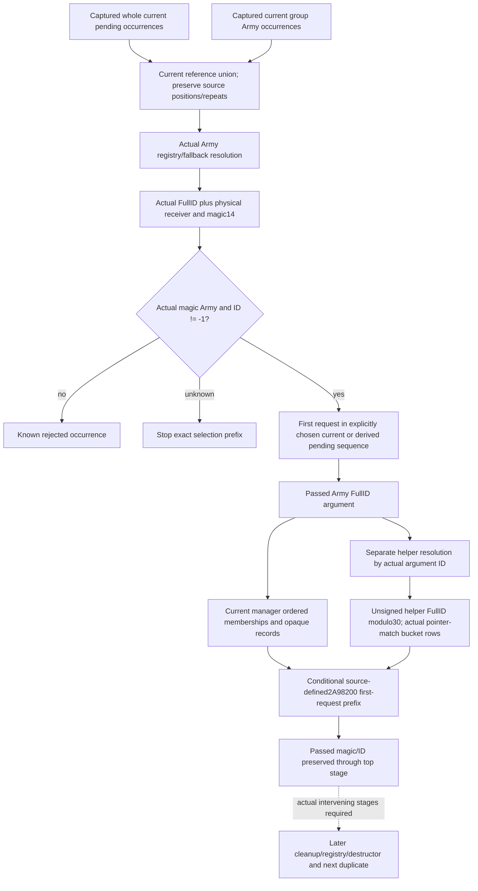

# Current assault Army references and first removal context — 1.20.0.3

2026-10-06 / W41. This source-first scope starts from published `7e621c2497697f018525aad3e5a3c261d71686f3` in an independent C sparse worktree. Exact `.3` / Steam25652598 / held EXE SHA `94b55397abb687a3dcd436805a5d885e6be90fa6c693feb44a9e3bbeeade02a6` is reused. No new EXE read/hash, closed function-body recapture, test, native build or local game operation is needed to define this input seam.

## Concrete missing value

The qualified standalone current-table model now yields original raw Army-ID append requests and a separately conditional normal-return pending sequence. Its group Army resolution has an actual selected FullID and physical identity but no Army `+14` magic. Existing `monthly_daily_queue_inputs_v1` publishes this predicate for the captured current queue only. Existing `monthly_first_removal_cleanup_inputs_v1` selects context only for that queue's first valid candidate. With an empty current queue and a nonempty derived append prefix, neither old family supplies the newly selected receiver's identity predicate or bucket context. Null cannot finish this independently useful first-request decision.

The new input must cover the ordered union of **actual captured current pending occurrences** and **actual captured group Army occurrences**. Original reference bits, occurrence positions, group physical slot and passed physical receiver stay distinct. The currently captured identity/context can support an explicitly conditional first-request prefix. It does not establish the Army registry or manager frame at a later real drain after intervening callbacks.

## Reused source ledger and actual stage order

The held first-removal packet is `Z:/ck3_mod_rewrite_process_assets/g2-background-round4-20261005/monthly-caller-effects/queue-consumer-source/first-removal-stage-ledger/`. Its `SOURCE-STAGES.md`, later-stage/domain/point-store source summaries and existing qualified producers are reused; no cached machine-code body is reopened.

1. Earlier daily drain `2A9A590` resolves each raw queue occurrence through Army registry `5D1DE48`, low24 indexed slot with FullID generation equality, and fallback `5D1DE50`. It calls `2A978A0` only when the actual receiver `+14 == 0x41726D79` and actual `+10 != -1`. A valid fallback can pass; raw requested ID is not the argument.
2. `2A978A0(primaryManager, passedArmy*)` reads passed `+10` and calls `2A98200` before rechecking passed magic/ID. That top helper's finite manager writes preserve the passed identity and registry entries.
3. `2A98200` first removes the first supplied FullID from primary `+50`, stably. It independently resolves that supplied FullID again; this second receiver need not equal the first fallback receiver. Its bucket is unsigned32 second-receiver FullID modulo30. It stably removes every bucket pointer equal to the second physical receiver, without substituting FullID equality.
4. Primary `+68/+80/+98/+C8/+158` remove the first argument-ID match by swap-last. Primary `+B0` opaque16-byte records remove every first-DWORD argument-ID match by repeatedly swapping the last whole record into the matching index.
5. When modeling the earlier standalone queue-transfer/first-request prefix, primary `+68` at cleanup entry is the derived empty source after transfer. The captured original pending list is preserved as provenance and temporary occurrence order. When evaluating only the direct top helper against current manager state, use the captured current `+68` instead and name that separate basis. Neither branch claims a future tick.
6. Later attached-object/regiment effects, direct Army `+44=0`, Fleet clearing, `2A98590`, late registry gate and destruction are separate stages. Existing current-domain/point-store observers are not late-stage frames after those intervening calls. Full removal/lifecycle and subsequent duplicate resolution remain incomplete.

The source-closed top helper extent is `[2A98200,2A98581)`,897B, held SHA `6f0439c6b78249c923533f891aea4aa72b3b5dfd511ec567580e4d88aa7f6b39`; the enclosing removal extent `[2A978A0,2A97EC1)`,1569B, held SHA `b324251def171eaf33abbef8e4e5eea70c359611a9619787dcb76bf4063f8aef` is receipt reuse, not a new hash. Platform overlap move and zero-length tail-erasure semantics are already recorded; there is no reason to expand them or destructor/allocator internals for this prefix.

## Minimum same-query producer and capture reuse

The entry owner is implementing `current_daily_assault_roster_admission_v1.removal_queue`: whole primary `+68/+74` stored raw references, signed count, pointer provenance and occurrences, with no Army resolution/magic because its membership consumer does not need them. That owner retains its roster/table collector and projection. This lane will consume the captured queue and the existing captured current table, rather than read either vector again.

Existing first-removal context already captures six ordered logical manager lists and all opaque `+B0` records regardless of current candidate selection. Reuse/copy these global components from the available subject snapshot; do not reread them per new candidate. Existing current-pending resolution values may be reused where the same actual reference is covered, but actual physical identities and a previously uncovered group receiver require explicit native resolution/observation. A new dedicated leaf must publish actual magic and selected full ID, not infer them from requested reference bits or a positive soldier count.

For each independently needed valid argument, publish the **second helper resolution** and selected bucket occurrences with physical identity/pointer equality. Preserve the first passed receiver separately. Reuse a captured physical target's scalar/bucket context where identical; retain every reference occurrence in its original list order. Empty, unread and known-invalid states remain distinct. An invalid or known absent first-request branch does not need unused bucket/DATA/late lifecycle inputs.

Proposed optional family: `current_assault_removal_reference_inputs_v1`, with captured manager identity; ordered pending/group reference occurrences carrying provenance, rawu32 reference, source resolution, actual receiver identity/fullID/magic and native validity; copied global manager lists/opaque records; target-specific second-resolution/bucket context. The public readonly reader will use existing exact `.3` GameState/Army registry/fallback bindings and the source-closed offsets, plus the roster owner's captured DTO. No full7/prepared-cache/denominator fields are required for this manager prefix.

The independent pure output will expose current-pending selection and, separately, selection over an already known conditional release-pending prefix using **captured current identity/context**. It may select a first valid candidate from a known prefix without demanding an unused unknown tail. Numerical group/queue/release gates keep their existing meanings. The finite top-helper projection derives ordered membership/bucket/opaque-record deltas and its preserved passed identity; it labels whether the cleanup-entry pending list is current or independently derived post-transfer empty. It never rewrites captured DTOs or calls a removal action.

## Implementation/qualification boundary

Before code, seal the exact roster-owner DTO/API and shared-hook order, including how one same-query leaf copies existing global context and publishes its independent reference union. Root approves that interface before this lane touches minimal shared hooks. New files are dedicated DTO/reader/serializer/strict contract/numeric helper, one new complete-service nonempty compound and one new native fixture; CMake/CI/formal builds/CTest/compiled-wire FIRST remain Root-owned. Root merges shared reports and pushes. The existing current-table/roster fields retain their meanings.

The meaningful compound must include empty observed pending but nonempty derived append prefix, wrong-generation raw ID selecting a valid fallback, a distinct second-resolution receiver with same ID, duplicate-preserving list removal and physical bucket pointer matches, missing actually used bucket versus known-invalid/empty selection, and input immutability. The native fixture must exercise actual `+14`, fullID/receiver roles, borrowed queue/table capture and bucket rows. No old tests/samples are rerun.

This source plan is research-ready only; it has no new observation or numerical qualification. Actual removal, actual registry/destruction, actual post-stage, full ordered removal/lifecycle/daily/monthly/calendar and live remain false/null. The immediate missing input is concrete and collectible; the later removal branches are separate necessary future entries, not a reason to expand the present prefix.
