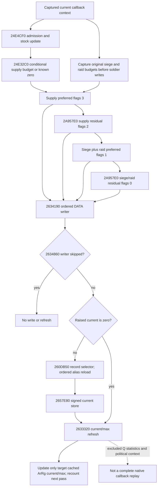

# Current supply callback soldier effects — CK3 1.20.0.4

This package connects one current-context `24E3410` supply callback budget to
its conditional associated-DATA soldier stores and raised current/max refresh.
It uses the existing same-query ArmyStrength observations. It adds no observer,
action, future date, bucket replay or actual lost-men claim.

## Frozen source and finite read receipt

- Build: CK3 `1.20.0.4`, Steam build `25734779`.
- Inherited EXE SHA-256: `98702f88a547cde2eaf29a85f93b85f68ee4cf8148336a4f7afaeb75319dd518`.
- Frozen file: `Z:/ck3_mod_rewrite/artifacts/migrations/2026-10-07/installed-build/binaries/ck3.exe`.
- Packet: `Z:/ck3_mod_rewrite_process_assets/g2-parallel-20261008/attrition-next-stage/`.
- Source plan preceded reads: `SCOPE-FIRST.json`,
  `WRITER-EXACT-CAPTURE-PLAN.json`, `REACHED-EXACT-CAPTURE-PLAN.json`.
- Cached PE/pdata selected actual extents; no new PE/pdata scan or EXE hash.

| Actual entry / extent | New bytes / seeks | Source role |
| --- | ---: | --- |
| `2634190..263448F` / 767 B | 762 / 2 | Ordered DATA debit writer; 5 B call reused |
| `260DB50` / 98 reachable B | 98 / 98 | DATA record to selected physical chunk |
| `2657E80` / 110 reachable B | 110 / 110 | Signed current store and conditional pair clear |
| `2633320..2633AC0` / 1952 B | 1952 / 1 | Raised current/max refresh |
| `2A957E0..2A95941` / 353 B | 353 / 1 | Remaining-budget allocation, flags 2 or 0 |
| **Total** | **3275 / 212** | First reads of these actual4 source bytes |

The old writer's three held JSON files contain only 759 B of its logical 767 B
extent. They are not three pdata fragments: old and actual4 each have seven.
The actual4 759 B prefix has normalized instruction equivalence to that held
prefix. The missing old eight bytes remain unheld. Actual4 independently closes
its final `add rsp,38h; pop r15; pop rbx; ret` at `2634487..263448F`.
There is no claim of complete old/new 767 B byte equality.

`REACHED-SELECTION-ATTEMPT01-RED.json` preserves a metadata tooling failure:
the first script incorrectly expected the old 360 B residual window. Actual
pdata selects 353 B; the old window included seven alignment bytes. This failed
before any source capture. Corrected metadata and actual receipts remain separate.

## Actual native tree and order

The already held 1580 B `24E3410..24E3A3C` caller is reused, not captured again.
Its supply updater admission determines a conditional supply budget. Siege and
raid budgets are taken before the first soldier writer and remain those original
signed32 inputs even after supply changes current strength.

`260DB50` resolves DATA `+8` persistent Regi with generation/tag/fullID checks;
signed DATA `+C` selects `Regi+18h+ordinal*24h`. DATA ordinal and the physical
chunk's own `+C` are distinct. It is a read-only leaf with no calls.

`2634190` preserves stored record order and physical aliases. State 3 with raw
current zero contributes maximum to effective current, while debit starts from
raw zero. It preserves signed fixed-point/truncation and integer overflow paths.
The second pass runs for remaining raw budget **zero as well as positive** and
reloads changed aliases. Caller allocation decrements its denominator by the old
cached current and its budget by the requested amount, independent of writer skip.

`2657E80` unconditionally stores signed EDX at physical chunk `+4`. Below maximum
it returns immediately. Its exceptional maximum/current pair clear additionally
requires association `+10 == -1`, byte `+14 == 0`, and resolved owner guards.
Available associated DATA already requires a valid non-minus-one ArRg backlink;
that clear is unreachable in this consumer's source domain. No clamp is added.

`2633320` sums associated effective current/max and writes target `+38/+3C` at
`26338A0/26338A3`. A writer admission skip returns without this refresh. Only
current/max effects are included. Q-statistics writes and their helper trees,
invalid-record removal, lifecycle, and changed political predicates are excluded.
The existing numerical core's captured predicate/context premise stays explicit.

## Same-query consumer seam

All required raw families already exist: `monthly_loss_budget_inputs_v1`,
`army_update_clock_v1`, `loss_application_inputs_v1`, ordered `regiment_strengths`,
and complete associated `regiment_replenishment_records_v1`. No added native
field, binder, CMake target or query is required.

The additive `current_callback_soldier_effects_v1` consumes the existing callback
risk projection's independently ready supply budget. It deep-copies the same row,
replaces only copied `current_supply_loss_budget`, retains captured siege/raid,
then calls the existing four-pass arithmetic core. Physical aliases and evolving
cached ArRg counts remain separate; the original row and original observed-budget
loss output are unchanged. A known rejected/suppressed zero budget does not require
unused stock/rate operands before this independent subsystem can run.

The wrapper's actual4 source proof covers the entries above and the associated
current/max domain. Reused nested kernels keep their historical actual3 source
labels. This does not upgrade every old loss projection or certify excluded stats.

## Authored FIRST and readiness

One new registered-Service compound covers crossed stock (750000 to 650000),
derived supply budget 2, original siege/raid budgets 2+2, and currents `[1,4,3]`
through all four positive passes to `[0,2,0]`. It also checks aliases, skipped
writers, independent known zero and genuine missing DATA. The current observed
supply-budget-zero sequence remains final 4. Expectations are frozen before code.

The sole method is
`CurrentCallbackSoldierEffectsService12004Tests.test_registered_current_callback_budget_interleaves_conditional_soldier_stages`
in `tests/unit/test_current_callback_soldier_effects_service_12004.py`. Five new
source-shaped whole envelopes traverse `NativeHeadlessGameplayDriver`, the strict
normalizer, actual registered `ck3_query_army_strengths`, and `GameplayBridgeService`.
They are Python fixtures; this package claims no newly compiled native producer.
`FIRST-EXPECTATIONS.json` was sealed before the test source. Root's launcher is
`run_current_callback_soldier_effects_first.py` in the external packet and records
the actual result at `XAR_CURRENT_CALLBACK_SOLDIER_EFFECTS_FIRST_OUTPUT`.

The child does not execute this FIRST. Root owns its unique first execution.
Until that receipt, the new model is `SOURCE_NOTRUN`; earlier qualified source,
observers and tests are reused without replay. `actual_loss=false`, actual
post-stage current is null, and future/full daily/full monthly/live remain false.
Work began October 8 and finite source closure continued October 9, ISO W41.
