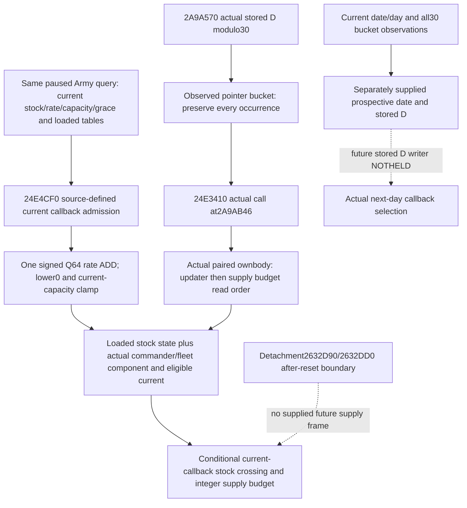
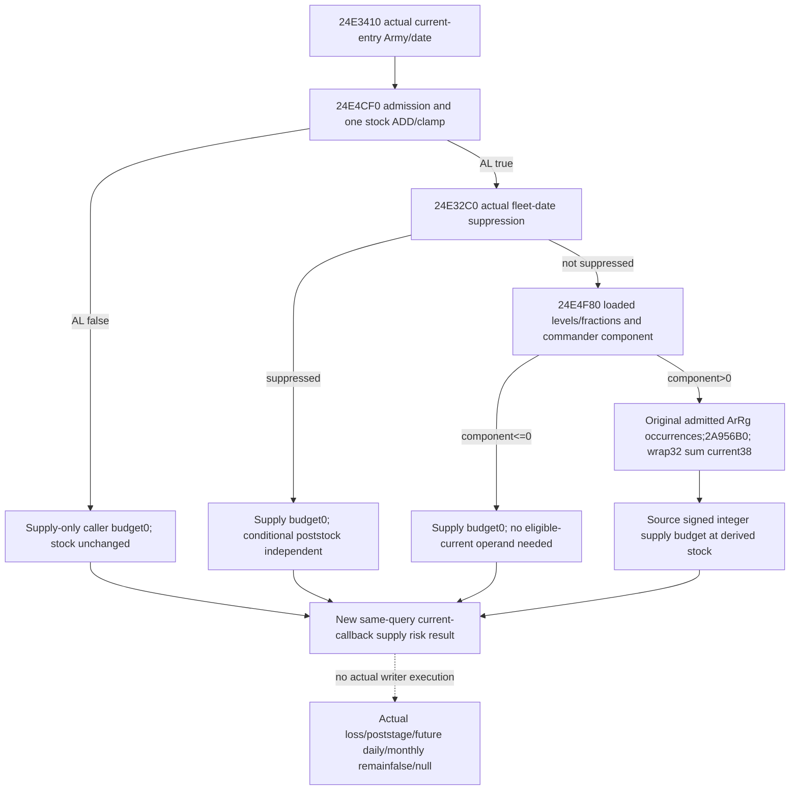

# Current callback supply risk — 1.20.0.4 source and query seam

Source plan sealed on 2026-10-07 at 15:51:49 Asia/Shanghai. This package uses CK3
1.20.0.4 / Steam25734779 / frozen EXE
`98702f88a547cde2eaf29a85f93b85f68ee4cf8148336a4f7afaeb75319dd518`.
It reuses cached source and existing Army query inputs. No EXE bytes, game, SDK,
build, test or prior fixture wire are read or executed by this package.

The immediate decision value is whether a successful supply callback would move
the captured Army into a positive supply-loss state. A standing zero attrition
value cannot answer that question. Calendar prediction and actual casualty
attribution remain separate; the known normal one-day action is unaffected.

## Actual current build source

The support migration ledger closes these whole local bodies and their direct
operands. Its complete normalized-span equality and local control-topology
equality are reused, rather than assuming a fixed RVA shift.

| Actual entrance | Held source | Relevant production behavior |
| --- | --- | --- |
| `2A9A570` | `support_2A9A590-DETAIL.json`, 1539 B | Selects `uint32(GameState+9C)%30`; walks the actual pointer bucket in stored order, including repeats. `2A9AB46` calls **24E3410** with the actual Army pointer and address of GameState+8. |
| `24E4CF0` | `support_24E4D10-DETAIL.json`, 463 B | Sets Army byte22=1 before admission. Rejects Unit170==3, combat, gathering, Army5C!=0, or signed wrapped `(passedDate.low32-Army190)/24 <= loadedGrace`. On success stores the full passed date at188, obtains actual current-Province rate24E5180, adds it once to stock180, and clamps the signed result to0/current capacity2C53BF0. There is no division of the rate by30. |
| `24E2E30` / `24E32C0` | Adopted support getter closures | Current final attrition fraction and current supply-only integer budget are observations at the captured stock. They do not by themselves provide a post-updater stock budget. |
| `24E3410` | Root retry02 complete1580 B paired local body | Success of24E4CF0 is required before24E32C0; rejected admission supplies integer budget0. Full correspondence was acquired after the initial source plan below. |

The first two cache files are under
`Z:/ck3_mod_rewrite_process_assets/g2-background-20261007/upstream-build-migration/army-family-12004/commander-supply/support-first01/`.
The authoritative closure is
`ck3_autonomous_player/native_bridge/research/ck3_1_20_0_4_army_support.json`.
The dates owner independently confirms24E3410 is not in its held source package.

## Reuse and the smallest required closure

`future_daily_supply_schedule_inputs_v1` already observes all30 phases and subject
pointer occurrence positions. Its owner retains that producer, calendar/date
work, current detachment callback/store and Character families. AfterReset refers
to the2632D90→2632DD0 detachment normal-return semantic; it is not a supply reset
action, stored-day writer or supply callback witness. No new reset is authorized
or proposed. No repeat of the203 B Character mapping is needed here.

The old complete logical caller is24E3430..24E3A5C, 1580 B. Its exact cached
prologue9 B, middle1412 B and tail159 B are already sealed. The actual4 direct
caller is24E3410, proven by the migrated dispatcher. Only this named caller needed
a Root-central source selection: actual retained pdata fragments first, then the
selected body if its exact extent agrees with the held logical role. No sibling,
allocator, date-helper or Character capture is requested. The machine-readable
central request records the exact target and all cached locators.

## Existing query operands and intended independent leaf

| Required value | Existing current query landing point | Consumer role |
| --- | --- | --- |
| Stock, actual capacity, actual rate | `current_supply_raw`, `current_supply_capacity_raw`, `current_supply_change_monthly_raw` | One current-entry conditional ADD/clamp; current Province and captured context premise retained. |
| Raw Unit170, combat, gathering, Army5C | `monthly_loss_budget_inputs_v1` | Source updater admission, including known rejection without requiring unused rate. |
| Actual date and grace anchor/loaded grace | `army_update_clock_v1` | Signed low32 elapsed/24 strict-greater admission. Full passed date already exists for any conditional188 output. |
| Runtime state thresholds/fractions and commander component | `monthly_loss_budget_inputs_v1` | Select actual loaded stock state; do not substitute the historical hardcoded60/10/0 scenario. |
| Fleet date suppression/current numeric context | `monthly_loss_budget_inputs_v1`, `current_fleet_supply_tick_inputs_v1` | Retain captured-current fleet result. A separately supplied future date needs actual recomputation, not copying its old boolean. |
| Supply-eligible current soldiers and current supply budget | `loss_application_inputs_v1` | Independent integer budget at derived stock and current budget comparison; no final physical casualty claim. |
| Actual phase membership/count | Existing current dispatch and all30 schedule families | Current selected bucket occurrence count is observed. No fabricated future D+1. |
| Byte22 and last actual supply-update date | Existing monthly caller and clock families | Raw current witness only; a byte value is not an execution count or proof of causal loss. |

After the named caller source is mapped, the smallest implementation is one owned
pure Army-row leaf `current_callback_supply_risk_v1`, appended by Root to the
existing query. It consumes the operands above and exposes captured stock/state,
source-defined conditional admission, post-one-callback stock/state, the resulting
supply-only integer budget and independent missing inputs. This avoids a second
native census. It can reuse the existing budget arithmetic once the actual4
ordering/component proof is attached. It must keep its current-entry premise
explicit and must not relabel the existing `.3`-lineage full sequence as a newly
qualified actual4 execution.

Stock and a known rejected callback remain independently useful. Unavailable
prospective stored D or detachment after-reset state must not erase the current
observations. Future callback selection, later context changes, actual loss,
actual post-stage strength, full daily/monthly transitions and live qualification
remain false/null until their own source and real paused evidence exist.

## Status and next handoff

This package closes the independent current-callback source dependency and
provides a `static-ready` Python/service result after the sole new eight-scene
compound passed once. Root owns shared integration and the live query. Child
direct EXE reads, native tests/builds, SDK/game/process/UI operations and new
game-day credit are all0.

Root G2 reference is H9638 / Robert29829 / raw date53288448 / saved day6005.
It is provenance supplied by the coordinator, not a new child capture. SideR68
contributes0 G2 credit. External packet:
`Z:/ck3_mod_rewrite_process_assets/g2-parallel-20261007/attrition-supply/`.

## Root first source-tooling attempt and necessary correction

Root's first wrapper selected the actual retained three-fragment geometry at
24E3410:9+1412+159=1580 B. This metadata result establishes selected extent,
not instruction correspondence. The wrapper then stopped with exit2 **before
the mapper** because its authored cached-text parser required8-digit address
tokens. The actual source uses9-digit tokens (`0024E3439`..`0024E39B7`), so the
parser selected0 bytes. This is source-tooling RED, not a supply capability RED;
new EXE bytes and body mapper executions were0.

The minimal8/9-digit rule correction reconstructs exactly1412 contiguous cached
bytes through24E39BD. No old hash, new EXE or production test was needed.
`ROOT-PARSER-RED-AND-RETRY02.json` and
`CACHED-PARSER-CORRECTION-RECEIPT.json` preserve the actual fault and correction.
Original selection/wrapper/argv/manifest remain in `current-callback-root-first01`.
The corrected Root-only command uses distinct `current-callback-root-retry02`
output and is still NOTRUN by this child. Actual whole instruction/operand
correspondence and this package's new numerical query value remain unqualified.

## Actual caller closure and independent numerical implementation plan

Root's necessary retry02 completed at2026-10-07T08:37:45.530080Z. The central
mapper captured **1580 actual4 bytes in one range read**; old source was rebuilt
from held caches. Both complete instruction streams, retained member/immediate
operands, ordered edge shapes and full local control topology match. The actual
logical extent is24E3410..24E3A3C across the selected three fragments. This is
actual paired evidence, not an inferred end/constant shift. First source-tooling
RED and its zero-byte/no-mapper boundary remain preserved.

The exact actual prefix calls24E4CF0 at24E3430, testsAL, and calls24E32C0 at
24E343E only on success;24E3448 sets supply budget0 on rejection. Independent
siege/raid budget branches follow. The closed325 B24E32C0 first applies actual
fleet-date suppression; otherwise it obtains503 B24E4F80's runtime stock-state
and commander component. Only a positive component consumes the original ArRg
occurrences, valid generation/tag/ID and2A956B0 eligibility, signed wrapped
current38 sum, then low64 product/trunc0/low32/min count. No whole-Army UI
fraction multiplication is introduced.

The implementation uses one new owned Python leaf and one additive existing
Army-service field, `current_callback_supply_risk_v1`. It exposes observed raw
stock/capacity/rate/current attrition/current integer budget separately from the
conditional one-entry admission/poststock/runtime-state/integer budget. State
selection uses runtime-loaded thresholds.
Known rejection, fleet suppression and zero component retain their independent
source-defined zero without unused rate/table/count requirements.

Current selected-bucket positions/count can accompany this value, but repeats do
not multiply the one-entry budget: earlier physical writes change the next frame.
Observed empty current membership is distinct from hypothetical one-entry risk.
No prospective stored D/date, earlier manager/refill/assault output, after-reset
context, final casualty or actual post-stage frame is synthesized.

Source-first plan and frozen eight scene expectations:
`CURRENT-CALLBACK-NUMERIC-IMPLEMENTATION-PLAN.json`. One new compound exercises
the real Army service/normalizer path; FIRST is authored NOTRUN pending Root's
coherent source instruction. Existing monthly/four-pass/old tests are not run.

## FIRST actual combined-Service qualification

Root adopted the three source commits and froze the complete Service at
**0212161948cc584f6e45caa72c8a03dad9494799**, immutable
`C:/codex-ck3-background/migration4-entry-live-fix/g110-r19`. Explicitly authorized
FIRST ran only
`CurrentCallbackSupplyRiskService12004Tests.test_current_stock_crossing_and_branch_specific_supply_budget`
using the full project venv, `-B -X utf8`, assertions enabled. It completed
**GREEN / exit0** at2026-10-07T09:28:46.980501Z: process4.1519185 s,
unittest's single method0.026 s, eight new genuine Army-Service/normalizer query
outputs. No old test, native target, producer replay or game operation ran.

| New scene | Conditional stock / supply budget | Independent result |
| --- | --- | --- |
| Runtime threshold crossing | 650000 / 2 | Observed750000 stock, base0/current budget0; loaded7 threshold produces positive base2500 after one ADD. Original repeated bucket positions1,3 remain observations; budget stays2. |
| Exact threshold | 700000 / 0 | Zero component is ready with eligible-current family absent. |
| Combat rejection | 750000 / 0 | Known rejection remains ready with rate/table/count operands absent. |
| Fleet suppression | 650000 / 0 | Suppression remains ready with component tables/count absent. |
| Missing eligible current | 650000 / null | Poststock remains available; only positive-budget count is missing. |
| Negative sum | 0 / 2 | Source lower0 result remains ready with capacity absent. |
| Missing rate | null / null | Observed current stock-state remains available; missing rate is explicit. |
| Empty observed bucket | 650000 / 2 | Actual current selection is false; the independently named one-entry hypothetical value remains available. |

The source candidate is884cec01ec209690b0223d2ff66b1c0ef012e8a5; all numerical
qualification uses the actual combined Root Service freeze above. First wrapper
parser RED and actual Root source capture remain separate historical evidence.
No new native schema/reader was needed, so this test does not claim a newly
compiled binary or actual paused callback execution. Actual callback/loss,
poststage, earlier-stage reconstruction, future-date/D selection and full
daily/monthly transition remainfalse/null; live/day credit remains0.

Actual argv, times and complete query values are preserved under
`Z:/ck3_mod_rewrite_process_assets/g2-parallel-20261007/attrition-supply/current-callback-service-first-r19/`.
`CURRENT-CALLBACK-FIRST-QUALIFICATION.json` records source/output pins and the
source-defined independent readiness. `CURRENT-CALLBACK-QUALIFIED-OCT7-W41-FIELDS.json`
is the coordinator's report-field handoff; shared reports remain Root-owned.
