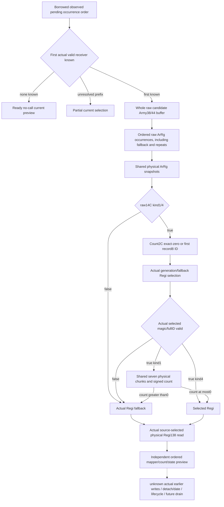

# Current first-candidate detachment mapper preview (1.20.0.3)

This adds an independently useful **initial current** ordered receiver/count preview for the first valid pending Army. It does not run or replay `2A978A0`, `2633FF0`, earlier cleanup writes or later queue iterations. Actual detachment/post-stage, lifecycle, calendar, full monthly and live remain false/null.

Source is [the closed later-removal mapper tree](army-later-removal-drain-stage-inputs-12003.md): exact `2A977A0..2A97897` (247 B), held CK3 1.20.0.3 / Steam 25652598 / EXE SHA `94b55397abb687a3dcd436805a5d885e6be90fa6c693feb44a9e3bbeeade02a6`. The source-only packet at `g2-background-round20-20261006/later-removal-drain-stage-plan/mapper-2a977a0` closes its sole `262BBC0` dependency from existing qualified arithmetic. No new native source read was needed during this implementation.

The raw family is `current_candidate_detachment_mapper_inputs_v1`; the additive production service output is `same_input_current_candidate_detachment_mapper_v1`. Its native collector reuses the already-captured `current_assault_removal_reference_inputs_v1` current pending IDs and actual receiver identities. It scans those copied occurrences in order, preserving an unresolved initial prefix instead of skipping it. The first actual valid Army receiver is the sole current candidate; a known empty/all-invalid sequence is an independently ready no-call result. Derived later appends and post-release pending selection are separate families.

For that candidate the collector observes the **whole raw Army `+38/+44` occurrence buffer**, rather than validated legacy `regiment_strengths`. It keeps high-bit u32 IDs, wrong-generation/fallback selection and ordered duplicates. A physical identity map shares one sampled ArRg mapper/count row while each occurrence remains in the output. The initial forward stored-index preview preserves zero/negative raw roster counts; it does not claim to replay the evolving native outer cursor/end behavior.

## Source branches and useful values

| Branch | Necessary observed operands | Preview |
| --- | --- | --- |
| ArRg raw `+14C` neither 1 nor 4 | Actual Regi fallback pointer and its caller `+138` state | Ready fallback receiver/state with no DATA or count demand. |
| Kind 1/4, DATA `+2C==0` | Use Regi raw ID `FFFFFFFF`; actual registry/fallback resolution | No first DATA pointer read; even invalid fallback retains caller `+138`. |
| Kind 1/4, nonzero DATA count | First record pointer `+20`, record DWORD `+8` | Negative count remains nonzero and demands that first record. |
| Selected Regi invalid magic/full ID | Actual fallback pointer/state | Fallback rather than a guessed first associated persistent record. |
| Valid selected Regi, kind 4 | Selected physical receiver and caller state | No unused seven-chunk/base read. |
| Valid selected Regi, kind 1 | Regi signed `+128` plus seven physical max/current/state triples | Signed wrapped count `<=0` keeps selected receiver; `>0` chooses fallback. Negative counts are retained. |

The count starts at Regi `+128` and adds `current-maximum` with i32 wrap per physical chunk. Maximum zero contributes zero without current/state demand. State 3/current zero also contributes zero; when current is nonzero, the difference is independent of an unavailable state field. Caller state readiness is separate from return-selection readiness. Returned ID/magic are provenance and do not introduce a tag gate which the native caller lacks. Registry-selected Regi and finally returned fallback remain separate physical roles.

The reader determines a receiver using the source formula from copied current operands, then reads that actual physical receiver's `+138`. Its explicit basis is `source2A977A0_from_same_capture_raw_operands`. It does not execute a game mutation or label a derived return decision as an observed post-stage. The Python reducer independently recomputes the signed count and branch choice, retaining ready rows when a different kind-1 count or returned state is missing.

## Frozen candidate and first validation plan

Exactly nine owned new files provide DTO, serializer, header-only collector, native fixture, strict contract, pure reducer, builder, one complete-service compound, and this topic. Root owns shared include/member/binding/reader/serializer/normalizer/service hooks, CMake/CI, coherent source freeze and all native compilation. The API is `ReadCurrentCandidateDetachmentMapper12003(CurrentCandidateDetachmentMapperBindings12003,const ArmyCurrentAssaultRemovalReferenceInputsV1*)`.

The new native target is `xar_ck3_12003_current_candidate_detachment_mapper`. Its fixture uses the actual whole `ReadArmyStrengthsForScope` and `AppendArmyStrengthV1` path. The queried subject has a separate valid 20/40 legacy roster; the pending candidate has the high-u32/invalid/fallback/duplicate raw roster. Thus additive IDs do not cross old nonnegative legacy ID fields. Runtime `Check` assertions survive Release. It prepares **eight new wires** under `current-candidate-detachment-mapper-wire`, covering zero/positive/negative/wrapped counts, alias reuse, negative DATA count, exact-zero skip, unrelated kind, count/state partials, unavailable pending and observed empty pending.

The sole new Python method is `test_current_candidate_detachment_mapper_service.CurrentCandidateDetachmentMapperServiceTests.test_current_candidate_whole_roster_shared_counts_and_branch_partials`. It calls the complete registered production service using the existing wire driver harness, with presealed expected nonzero source counts, ordered occurrences and independent partial rows. It does not replace a kernel or service method. Source candidate, eight native scenes and this Python compound are **NOTRUN until Root authorizes a coherent freeze**. No older case/wire is rerun to qualify this family.

The external packet is `Z:/ck3_mod_rewrite_process_assets/g2-background-round21-20261006/current-candidate-detachment-mapper/`; `FINAL-RAW-SCHEMA.json`, `ROOT-HOOK-AND-NATIVE-RECIPE.json` and `python-candidate/PRESEALED-EXPECTATIONS.json` specify the exact integration and first execution boundary. At candidate delivery the source contract is closed and implementation is written, but no test/build/live qualification is claimed. The next genuine detach dependency remains the actually selected DATA/date/pending helpers; the earlier current preview is not a full future drain.

## First service attempt and precise new input correction

Root authorized the sole new method against immutable `C:/codex-ck3-background/refresh-prefix-mapper-batch/g100`, exact source `b044e12d443ac187f63275306cee8a7c268e35a7`. Fullvenv execution without `-O` ran October 6 **18:05:14–18:05:17 CST**, wall **3.521535 s** / unittest **0.177 s**. It produced and passed the assertions for **ten new full-service subscenes**, including the nonzero count/alias baseline and independent partial branches. The next raw-DWORD-unavailable fixture construction raised `TypeError`: new code passed `None` into the existing `unknown_resolution` helper, whose input arithmetic requires an integer. This is a **new harness/input RED**, not a production mapper failure; no eleventh service query ran.

The minimal correction is confined to the new fixture: construct the normal nullable resolution shape with `unknown_resolution(0)` and set its `requested_full_id_u32` to `None`. Production collector, contract, kernel, native source and original immutable g100 tree remain unchanged. `first-source-service01/FIRST-SOURCE-SERVICE-RECEIPT.json`, stdout/stderr and ten actual full-service outputs remain preserved. No retry or previously passed subscene replay is performed by this correction commit; remaining new subscenes require Root's explicit coherent-source execution plan. Native qualification and eight compiled-wire consumption are still NOTRUN at this correction.

## Authorized remaining-only source-service qualification

Root adopted the fixture correction and supplied the separate immutable full-service tree `C:/codex-ck3-background/refresh-prefix-mapper-service/mapper-continuation01`, exact source `551f1a008afdb746a67f63f3cd51d6ce24558c32`. On October 6 **18:12:01–18:12:08 CST**, the explicitly authorized continuation passed all **seven previously unexecuted service subscenes**: missing raw roster DWORD, zero and negative roster counts, known no-call, unresolved initial candidate, legacy absent and optional null. Fullvenv used `-B -X utf8` with assertions active; one selected method took **0.156 s**, wrapper wall **6.722027 s**.

The external runner retained the authored output initialization and complete registered-service query closure, then compiled only the unchanged authored method statements beginning at `missing_raw = candidate_mapper_packet()` (line 255). It replaced no production function or kernel and replayed **zero** of the ten completed FIRST01 subscenes. `remaining-source-service02/CONTINUATION-AUTHORED-TAIL.json`, `REMAINING-SOURCE-SERVICE-RECEIPT.json`, full service outputs and stdout/stderr record the exact seven labels and source view. The original constructor RED and ten completed outputs remain separate evidence.

All **17 authored service subscenes** have now passed their active assertions across the preserved first attempt and necessary continuation. This qualifies the **bounded Python current-seed preview**, including nonzero signed wrap/count values, occurrence/physical alias separation and independent branch partials. It does not claim a single successful replay of the whole method. Native collector qualification, native CTest and eight actual compiled wires remain pending Root's separate formal build and first-consumer authorization. Actual detachment, post-stage, later drain, lifecycle, calendar, full monthly and live remain false/null; no native or game operation was performed by this source-service qualification.

## First actual compiled whole-query qualification

Root's initial g100 full build at `b044e12d443ac187f63275306cee8a7c268e35a7` was RED after **130.251976 s**: its shared serializer include was outside `xar::game`. Root corrected that integration placement without changing the mapper producer, kernel or native fixture. The separate formal corrected build at **`551f1a008afdb746a67f63f3cd51d6ce24558c32`**, immutable `C:/codex-ck3-background/refresh-prefix-mapper-batch/g100-source-repair01`, was GREEN in **126.056244 s** for all four runtime targets and only the three new fixture targets. Its 597 TUs / 594 unique sources / 1347 inputs were compiled fresh; the first three new CTests passed, process wall **0.670978 s**. The original build RED remains separate history.

With Root's explicit authorization, **eight previously unconsumed actual whole ArmyStrength wires** passed the complete immutable registered service on October 6 **18:17:07–18:17:08 CST**, wall **1.817362 s**: **8/8 cases, eight projections and 183 checks GREEN**. `first-native-whole-wire01/FIRST-CONSUMPTION-RECEIPT.json` pins the exact native build/CTest receipts, every untouched wire, loaded production module, full service output and projected output. No source compound, prior wire or native test was replayed by this consumer.

The nonempty native baseline selected raw pending ID `0xAB00000C` through the actual fallback receiver with full ID `0x22000002`. It retained **nine raw ArRg occurrences**, **seven physical mapper snapshots** and four demanded physical counts **`[0, 7, -3, -2147483647]`**. The selected and final fallback roles remained distinct; invalid/fallback receivers still supplied the caller's actual `+138` state and admitted the state-4 branch. Other actual wires verified negative nonzero DATA count, exact-zero skip, unrelated-kind unused operands, independently missing kind-1 count or returned state, unresolved current pending and observed empty pending.

The corrected native manifest is **327102 B**, SHA `dbe66fe7123c79d2dd82578a3029f1f8e3797a8074044801602c6218874f6a80`. Its recorded DLL is **11404288 B**, SHA `6121b9dda336c03bb0834ada42125e9d3d66bbddc2a401029f9ae662a462d953`; the mapper fixture is **771072 B**, SHA `bcd782cb2b41690afed808beab67a00990893f927193ee865832d610ba85578a`. These existing central binary pins were reused rather than rehashing the executables. The family is now **exact-build bounded current-input static-ready**, with actual readonly producer/serializer/strict consumer/value evidence. It still performs zero game writes and does not establish actual detach, a later evolving cursor, future drain, lifecycle, calendar, full monthly or live qualification. The external final qualification and October 6 / W41 report fields remain in the owned Round21 packet; shared reports are Root's responsibility.
