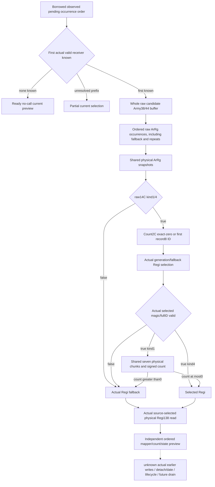

# Current first-candidate detachment mapper preview (1.20.0.3)

This adds an independently useful **initial current** ordered receiver/count preview for the first valid pending Army. It does not run or replay `2A978A0`, `2633FF0`, earlier cleanup writes or later queue iterations. Actual detachment/post-stage, lifecycle, calendar, full monthly and live remain false/null.

Source is [the closed later-removal mapper tree](army-later-removal-drain-stage-inputs-12003.md): exact `2A977A0..2A97897` (247 B), held CK3 1.20.0.3 / Steam 25652598 / EXE SHA `94b55397abb687a3dcd436805a5d885e6be90fa6c693feb44a9e3bbeeade02a6`. The source-only packet at `g2-background-round20-20261006/later-removal-drain-stage-plan/mapper-2a977a0` closes its sole `262BBC0` dependency from existing qualified arithmetic. No new native source read was needed during this implementation.

The raw family is `current_candidate_detachment_mapper_inputs_v1`; the additive production service output is `same_input_current_candidate_detachment_mapper_v1`. Its native collector reuses the already-captured `current_assault_removal_reference_inputs_v1` current pending IDs and actual receiver identities. It scans those copied occurrences in order, preserving an unresolved initial prefix instead of skipping it. The first actual valid Army receiver is the sole current candidate; a known empty/all-invalid sequence is an independently ready no-call result. Derived later appends and post-release pending selection are separate families.

For that candidate the collector observes the **whole raw Army `+38/+44` occurrence buffer**, rather than validated legacy `regiment_strengths`. It keeps high-bit u32 IDs, wrong-generation/fallback selection and ordered duplicates. A physical identity map shares one sampled ArRg mapper/count row while each occurrence remains in the output. The initial forward stored-index preview preserves zero/negative raw roster counts; it does not claim to replay the evolving native outer cursor/end behavior.

## Source branches and useful values

| Branch | Necessary observed operands | Preview |
| --- | --- | --- |
| ArRg raw `+14C` neither 1 nor 4 | Actual Regi fallback pointer and its caller `+138` state | Ready fallback receiver/state with no DATA or count demand. |
| Kind 1/4, DATA `+2C==0` | Use Regi raw ID `FFFFFFFF`; actual registry/fallback resolution | No first DATA pointer read; even invalid fallback retains caller `+138`. |
| Kind 1/4, nonzero DATA count | First record pointer `+20`, record DWORD `+8` | Negative count remains nonzero and demands that first record. |
| Selected Regi invalid magic/full ID | Actual fallback pointer/state | Fallback rather than a guessed first associated persistent record. |
| Valid selected Regi, kind 4 | Selected physical receiver and caller state | No unused seven-chunk/base read. |
| Valid selected Regi, kind 1 | Regi signed `+128` plus seven physical max/current/state triples | Signed wrapped count `<=0` keeps selected receiver; `>0` chooses fallback. Negative counts are retained. |

The count starts at Regi `+128` and adds `current-maximum` with i32 wrap per physical chunk. Maximum zero contributes zero without current/state demand. State 3/current zero also contributes zero; when current is nonzero, the difference is independent of an unavailable state field. Caller state readiness is separate from return-selection readiness. Returned ID/magic are provenance and do not introduce a tag gate which the native caller lacks. Registry-selected Regi and finally returned fallback remain separate physical roles.

The reader determines a receiver using the source formula from copied current operands, then reads that actual physical receiver's `+138`. Its explicit basis is `source2A977A0_from_same_capture_raw_operands`. It does not execute a game mutation or label a derived return decision as an observed post-stage. The Python reducer independently recomputes the signed count and branch choice, retaining ready rows when a different kind-1 count or returned state is missing.

## Frozen candidate and first validation plan

Exactly nine owned new files provide DTO, serializer, header-only collector, native fixture, strict contract, pure reducer, builder, one complete-service compound, and this topic. Root owns shared include/member/binding/reader/serializer/normalizer/service hooks, CMake/CI, coherent source freeze and all native compilation. The API is `ReadCurrentCandidateDetachmentMapper12003(CurrentCandidateDetachmentMapperBindings12003,const ArmyCurrentAssaultRemovalReferenceInputsV1*)`.

The new native target is `xar_ck3_12003_current_candidate_detachment_mapper`. Its fixture uses the actual whole `ReadArmyStrengthsForScope` and `AppendArmyStrengthV1` path. The queried subject has a separate valid 20/40 legacy roster; the pending candidate has the high-u32/invalid/fallback/duplicate raw roster. Thus additive IDs do not cross old nonnegative legacy ID fields. Runtime `Check` assertions survive Release. It prepares **eight new wires** under `current-candidate-detachment-mapper-wire`, covering zero/positive/negative/wrapped counts, alias reuse, negative DATA count, exact-zero skip, unrelated kind, count/state partials, unavailable pending and observed empty pending.

The sole new Python method is `test_current_candidate_detachment_mapper_service.CurrentCandidateDetachmentMapperServiceTests.test_current_candidate_whole_roster_shared_counts_and_branch_partials`. It calls the complete registered production service using the existing wire driver harness, with presealed expected nonzero source counts, ordered occurrences and independent partial rows. It does not replace a kernel or service method. Source candidate, eight native scenes and this Python compound are **NOTRUN until Root authorizes a coherent freeze**. No older case/wire is rerun to qualify this family.

The external packet is `Z:/ck3_mod_rewrite_process_assets/g2-background-round21-20261006/current-candidate-detachment-mapper/`; `FINAL-RAW-SCHEMA.json`, `ROOT-HOOK-AND-NATIVE-RECIPE.json` and `python-candidate/PRESEALED-EXPECTATIONS.json` specify the exact integration and first execution boundary. At candidate delivery the source contract is closed and implementation is written, but no test/build/live qualification is claimed. The next genuine detach dependency remains the actually selected DATA/date/pending helpers; the earlier current preview is not a full future drain.
