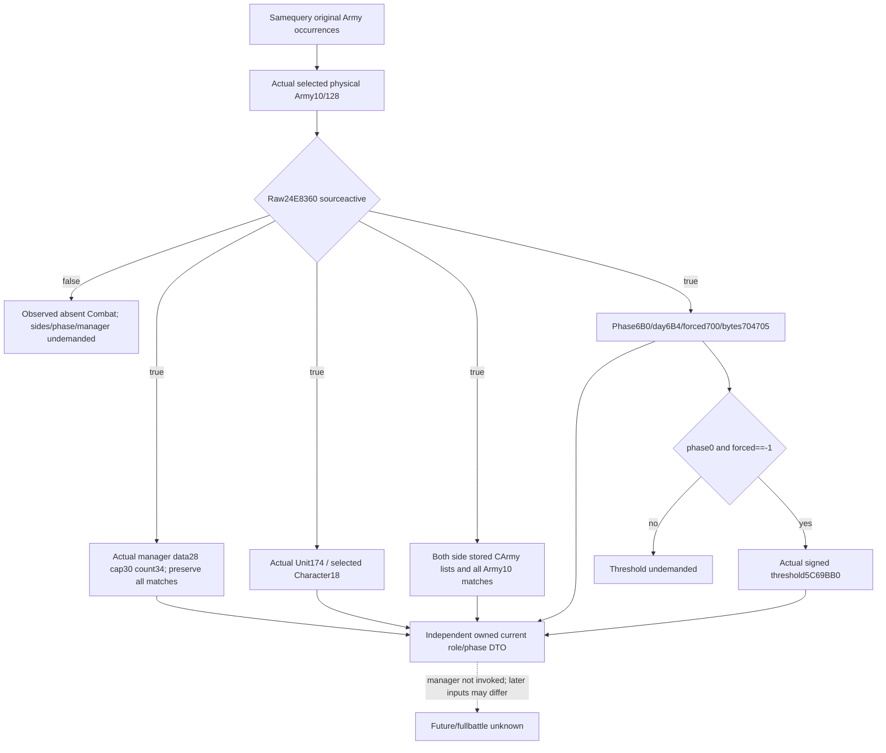

# Current Army Combat roles and phase observer —1.20.0.3

October6 source closure and October7 implementation are separate milestones. Source is frozen g10471b729f0cc4894331f1dadb89155920fccd42a00; held CK31.20.0.3 Crozier / Steam25652598 / EXE SHA94B55397ABB687A3DCD436805A5D885E6BE90FA6C693FEB44A9E3BBEEADE02A6. The source tree precedes this observer. This candidate performs no build, import/test, game/SDK operation or old fixture replay. FIRST is NOTRUN for Root's next joint batch.

Raw24E8360 loads Combat registry5D1DE70 or real fallback5D1DE18; it resolves Army128 fullDWORD by low24/capacity2C/rows20/stride16/object8/wholeID8 and validates Comb tagC followed by nonsentinel ID8. FullID0 is allowed. This native active predicate never reads phase/finalized/manager/side. Current31 demands it only for1D4nonzero, so the new observer captures it independently for every samequery selected physical Army.

Actual roles come from both stored side CArmy arrays, not Unitowner, Warattacker or the permission caller's attacker-miss→defender default. The observer preserves actual selected Army10 even if fallback differs from the requested rosterID. For active Combat it captures owner Army124→fullgenUnit→raw174→fullgenCharacter→actual18, keeping raw174 and selected18 separate. It reads inline sides20/368, parentB8, actual data10/capacity18/count1C and every ordered fullDWORD reference/matching nativeindex, primary70 and commander74.

The manager is GameState slot5C68C50→A0→domain+2E9D0, secondaryvptr manager+8 expected module+477F178. Its raw roster is data28/**capacity30/count34**, preserving duplicates and all Combat matching indices. These offsets are corrected by pre-code FINAL-FREEZE-ADDENDUM01: the parent initial labels were reversed; held2AD8000 and the existing finalizer manager reader supplied the correction. No native callback/find/getter is guessed or invoked.

Current phase fields are signed32 phase6B0/day6B4/forced700 and rawbytes finalized704/processing705. Threshold5C69BB0 is loaded signed32, demanded only for phase0 with forced==-1. A pure conditional selector can describe the branch of these captured operands: forced phase0 runs main immediately; ordinary nextday<=threshold staysmaneuver; expired maneuver only writesmain/day0 and does not runmain in the same call; phase1 mainworker,phase2 pursuitworker. Current observations are pre-invocation operands, so this is not an observed manager invocation or future forecast.

The optional existing ArmyStrength member is current_army_combat_roles_phase_inputs_v1. BindCurrentArmyCombatRolesPhaseInputs12003 exact-binds raw slots; ReadCurrentArmyCombatRolesPhaseInputs12003 borrows the genuine samequery postadmissionrefresh capture, collects once and distributes the same owned DTO across scopes. Strict normalization and complete GameplayBridgeService.query_army_strengths publish the pure current projection. Each demanded missing operand remains partial with a field reason; actualempty/false/zero/sentinel is preserved. Membership is attacker/defender/both/neither only when both stored lists were actually captured.

Fourteen new complete wholequery scenes qualify this leaf together with the demanded Rule24 source-pin extension. The target is xar_bridge_ck3_12003_army_combat_roles_phase_rule24_pins_test; producer --wire-dir writes ck3_12003_army_combat_roles_phase_rule24_pins_wire.json. Sole consumer ArmyCurrentCombatRule24Service12003Tests.test_first_compiled_current_combat_roles_phase_and_rule24_pins_through_service takes XAR_ARMY_COMBAT_RULE24_WIRE. World,callbacks,read-memory and Serviceframe are synthetic in this fixture. Native/consumer FIRST counts remain0; broad/currentfuture manager/fullcallback/fullbattle fields stayfalse.

Held source and13branch ledger: [Oct6 source delivery](Z:/ck3_mod_rewrite_process_assets/g2-parallel-20261006/army-current31/next-current-status/combat-roles-phase/ROOT-DELIVERY.json). [Before-code DTO/scenes](Z:/ck3_mod_rewrite_process_assets/g2-parallel-20261007/current-combat-rule24-implementation/FINAL-DTO-SCENES-SIGNATURES.json) and [offset addendum](Z:/ck3_mod_rewrite_process_assets/g2-parallel-20261007/current-combat-rule24-implementation/FINAL-FREEZE-ADDENDUM01.json) freeze the candidate. New EXEbytes0 in this observer implementation. Readiness: research/integrated source candidate until Root joint qualification and genuine player paused observation.
