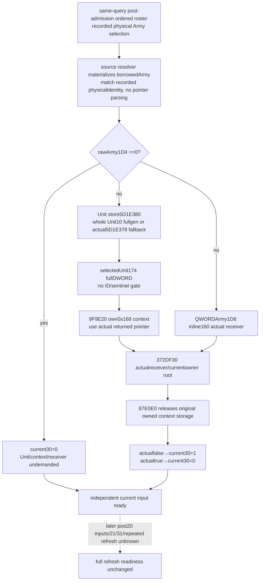

# Current Army30 actual condition observer — CK3 1.20.0.3

The source-first [two wrappers](army-refresh-two-byte-flags-12003.md) and [actual tail/current condition handoff](army-refresh-tail-and-condition-verdict-inputs-12003.md) were reviewed by Root before this implementation. Exact build is CK3 **1.20.0.3 Crozier / Steam25652598**, reused EXE SHA `94B55397ABB687A3DCD436805A5D885E6BE90FA6C693FEB44A9E3BBEEADE02A6`. This independent query-global family adds the **current Army30 condition operand**, covering zero1D4 and demanded actual receiver/root branches. Old qualified numeric refresh DTO/schema stays unchanged. Status is **implementation candidate awaiting Root coherent integration/native qualification**; no live or full refresh credit.

The source lane starts at `164bbe0c98d5796cc2c8b940dcb41738ac2946ff`. Plan was sealed first at `C:/codex-ck3-background/packets/army-current-condition30-implementation-20261006/SOURCE-AND-API-FIRST-IMPLEMENTATION-PLAN.json`. This package makes no EXE reads: it reuses the held2C4AB70 wrapper,9F9E20 ordinary Character root,87E0E0 existing exact.3 scope destructor,372DF30 ordinary evaluator and source-qualified Unit DB routes. The separate actual20/shared21 `28B2820` source frontier is not expanded here.

## Native tree and current value

`2C4AB70` returns0 on rawArmy1D4zero. Otherwise it resolves Army124 Unit by complete generation or actual fallback, reads selectedUnit174 full ownerDWORD, constructs kind4/subtype0/zero-extended payload8 and evaluates the actual inline condition at **`QWORD[Army+1D8]+160`**. Normal return is1 for actual predicatefalse,0 for actual predicatetrue. Root validation/applicability rejection is a valid nativefalse; this consumer adds no owner-positive-ID gate and uses no Rule43 receiver/verdict.

Every original raw Army occurrence, duplicate, full reference and selected physical identity is retained. The same-query post-admission DTO is borrowed as the roster/selection source; the reader materializes objects via the existing source resolver and compares recorded identity strings as identity tokens. It never reconstructs a pointer from text. No numeric gate is imposed: a missing ArRg40/numeric result does not block an independently readable current condition.

## Independent API and schema

Public bindings **`CurrentArmyCondition30Bindings12003`**, binder **`BindCurrentArmyCondition30Inputs12003(base,sha)`**, collector **`ReadCurrentArmyCondition30Inputs12003(bindings,const ArmyCurrentPostAdmissionRefreshInputsV1&)`**. Existing same-query native hook should call it after post-admission capture and copy the resulting owned DTO into optional field **`current_army_condition30_inputs_v1`**. Root owns those shared hooks/registration/CMake changes; this lane changes only nine new exclusive files.

`ArmyCurrentCondition30InputsV1` contains the original roster, per-occurrence `ArmyCondition30OccurrenceV1` and independent current-condition readiness. Each occurrence keeps original Army resolution, `same_query_army_selection_matched`, observed cacheArmy30, raw1D4, demanded raw124/owner174, Unit resolution, actual condition-owner/inline identities, source kind4/subtype0/payload/provenance, nullable actual native bool and its current0/1 inverse.

The custom Unit resolution records requested fullID, raw unsigned capacity/low24 index, indexed pointer/full generation, native fallback classification and selected physical identity. A null Unit store directly uses fallback and does not demand Army124. It does not add an unnecessary fallbackUnit10 read/metadata gate. Raw Unit fullID0 and ownerDWORD0/high-bit/FFFFFFFF retain all bits. Only actually missing reads/receiver/bindings/construction/evaluation produce nullable unavailable values with reasons; nativefalse is available. Zero1D4 returns independently with later fields undemanded. Observed cacheArmy30 remains separate and can differ from derived current0/1.

The actual9F9E20 returned context is passed to372DF30. Original0x168 owned storage is destroyed by87E0E0, including a constructor's normal null return. No saved scopes, broad activity provider, tooltip evaluator, refresh executor, persistent writes or gameplay action are needed. Existing owning-callback/lifetime convention is reused, with no new gate or allocator audit.

The strict Python normalizer **`normalize_current_army_condition30_inputs_v1`** retains raw fields and validates this narrow branch/identity contract. Pure **`project_current_army_condition30_inputs_12003`** computes only zero or actual bool inverse. Root's ordinary Service hook publishes per-request-row projections with the query snapshot/revision/date provenance. Current-strength and full-monthly readiness remain independent.

## Whole-query qualification revision prepared, not executed

Initial nine-file standalone candidate **`fe172901086f4dad5ca70486f7143192e13b6739`** remains preserved **NOT RUN**. Before FIRST formal qualification, Root requested whole-query coverage instead of transplanting a standalone leaf into a synthetic Army row. Only this new fixture/consumer/topic and the external recipe were revised; production collector/DTO/normalizer/pure code and the old numeric schema are unchanged.

Native producer **`src/ck3_12003_army_condition30_inputs_test.cpp`**, suggested target/CTest **`xar_bridge_ck3_12003_army_condition30_inputs_test`**, now links **PRIVATE actual `xar_ck3_12002_runtime`**. It calls genuine **`ReadArmyStrengthsForScope`** with two subject scopes, verifies shared captured condition DTOs, and emits the first genuine complete row through **`AppendArmyStrengthV1`**. One JSON **`ck3_12003_army_condition30_inputs_wire.json`** contains nine actual whole-row wires, two repeated original global-roster condition occurrences each:

| Sample | Value/qualification |
| --- | --- |
| zero1D4 | 0 with Unit/receiver reads denied and context/evaluator unbound |
| actual true | 0; actual returned context differs from owned storage; two callbacks/destructions |
| actual false | 1 even ownerFFFFFFFF; no consumer-invented root gate |
| high-bit owner | complete zero-extended payloadFE000022 |
| UnitID0 and owner0 | native full-generation0 is preserved |
| wrong Unit generation | actual fallback owner424242; fallbackUnit10 read denied |
| null Unit store | actual fallback; Army124/fallbackUnit10 reads denied |
| missing receiver | nullable unknown with no evaluation; distinct from nativefalse |
| null context return | paired owned destruction, no evaluation, nullable unknown |

The fixture supplies GameState/GameData primary roster and old post-admission bindings so the new family borrows **the genuine same-query post-admission capture**, not a constructed DTO or transplanted field. The independent subject's genuine strength route yields current20/maximum40 and raw AI base power4000000; separate injected subject Unit storage keeps that baseline reachable while the global condition scene exercises null Unit storage. These fake world/binding dependencies, constructor/predicate callbacks and scoped ownership buffers remain **synthetic fixture data**, not a live game-state claim. No standalone captured leaf is added to a fabricated whole Army row.

A byte snapshot checks the actual whole query leaves Army/Unit/source data unchanged. Branch-demand denials apply only to this new collector's injected memory callback; other genuine query families can legitimately read those old fields. The actual query also produces existing fields, which are not credited as new qualification and do not rerun their old test cases. Fixture includes no old numeric/Core/Boolean test or old wire rerun.

Exactly one new Service compound is prepared in `test_army_current_condition30_service_12003.py`. It requires Root's genuinely compiled whole-row JSON via `XAR_ARMY_CONDITION30_WIRE`, with no synthetic leaf fallback. Each complete native row is copied unchanged into the real Service transport response and passes Service→whole-row normalizer→new strict leaf→pure inverse. No baseline row is constructed and no field is transplanted. The builder is used only to load the nine compiled samples; its original standalone construction helper is unused. The surrounding Service snapshot/revisions/transport are explicitly synthetic. It checks genuine current20/maximum40, two raw condition duplicates per sample, actualfalse/unknown distinction, high-bit/zero/fallback inputs, cache separation, same revision and unchanged broad readiness. `XAR_ARMY_CONDITION30_CASE_OUTPUT` records outputs. Root alone configures/builds/Ctests and authorizes this first consumer after coherent source freeze. Both original candidate and this revision have **tests/builds/consumer executions=0**.

`actual_refresh_execution_ready`, `actual_next_occurrence_ready`, full callback/daily/monthly, actual post-stage and future-tick readiness stayfalse. This is current-state evaluation, not proof of unchanged transitive condition operands after hypothetical Army20/numeric stores. Actual20 tail/28B2820,21/31, next occurrence and full ordered refresh remain separate dependencies. No local CK3/Steam/process/SDK/pipe/UI/live access, new EXE reads/hashes, builds or push occurred.

## First formal compile RED and minimal type correction

Root's first coherent g101 full native attempt at source `281159fe4cf6a4c0170b96819dd8503318d072b6` failed after **41.80983 seconds**. The actual production collector's zero1D4 branch assigned an `int` literal to `optional<uint8_t>`, producing MSVC **C4244** under `/WX`; multiple runtime targets reported the same source diagnostic. The initial g101 source/log are retained. This is a compile RED, with no CTest or Service consumer credited.

The correction changes only that zero assignment to **`std::uint8_t{0}`**. Native branch values and all readiness boundaries remain unchanged. Root owns the required rebuilt coherent attempt and FIRST native/consumer qualification. This lane ran no build, test, old sample or runtime operation for the correction; the separate 28B2820 source-only capture is recorded in its own packet and is not part of this production fix.

## FIRST genuine whole-query qualification — 2026-10-06 / W41

Root's repaired immutable source **`333bb98fd5ea4ef6481f89eabe9916e8914a955b`** at `C:/codex-ck3-background/pending-condition-batch/g101-production-byte-repair01` completed the required fresh full native compile **GREEN in156.551973seconds**,596 actual TUs/593 unique/1350 compiled inputs,65 ON/50 OFF. The first **two new** centralized CTests passed2/2, process1.3169391seconds; only the new condition30 target supplies this leaf's qualification. The initial production C4244 compile RED41.80983seconds is preserved and has no CTest/consumer credit. No old native case or wire was rerun by this lane.

Root's new `army-condition30-inputs-wire/ck3_12003_army_condition30_inputs_wire.json` is **one JSON file/nine complete ArmyStrength row samples**,203377 bytes, SHA256 **`533ddeec8a05d5a01f7d0e56a8f8404f1b140de260dc06547a5199d97fa34062`**. It was emitted by genuine `ReadArmyStrengthsForScope` and `AppendArmyStrengthV1` with the coherent new hooks. Fake native world/bindings, context buffers and predicate callbacks remain synthetic; this is native fixture qualification, not execution against CK3.

At **`2026-10-06T10:48:09.648318+00:00`**, the authorized sole new Service compound passed **1/1 GREEN once**, unittest0.028seconds /processwall1.8697133seconds /exit0. Dependency-complete `Z:/ck3_mod_rewrite/tools/.venv/Scripts/python.exe`, `-B -X utf8`, no`-O`, consumed immutable production source and **9 actual new native samples/18 duplicate roster occurrences**. Every whole native row entered the actual Service unchanged; no baseline row or leaf transplant was used. The real whole-row normalizer, strict independent condition leaf and pure inverse preserve currentstrength20/max40/power4000000, fullID0/highbit owners, registry generation/fallback branches, actualfalse→1, actualtrue→0, nullable receiver/context failure, and observed cache30=187 separately from derived current0/1.

The Service snapshot/revisions/transport are synthetic; the native getter callback's returned context and paired owned destruction are fixture evidence. No real query, game process, live predicate execution or actual refresh occurred. This consumer does not requalify old numeric/Core/Boolean fields merely because the genuine complete row contains them.

Evidence is retained under `C:/codex-ck3-background/packets/army-current-condition30-implementation-20261006/first-whole-service-consumer/attempt01/`: `FIRST-WHOLE-SERVICE-CONSUMER-RECEIPT.json` pins exact source, new headers/fixture/normalizer/Service/test and wire; `service-outputs.json`, stdout/stderr preserve the actual single compound result. Initial fe172 standalone candidate remains NOTRUN. Root owns central native receipts, shared Oct6/W41 reports and publication.

The independent **current Army30 condition operand is static-ready**. Full refresh execution, next occurrence, whole callback, daily/monthly, actual post-stage, future tick and live readiness remain false in every projected sample. The separate [Army20 owner-chain source](army-refresh-owner-character-chain-12003.md) is now source-closed research, with no published Army20 observer. Its source closure does not promote this current-frame value to a future ordered callback or grant Army21/31 completion.
