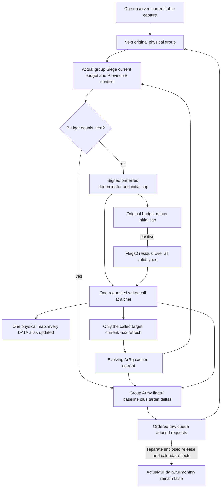

# Current daily assault loss inputs and sequential conditional groups — 1.20.0.3

2026-10-06 / W41. The reviewed [source-first plan](army-current-daily-assault-loss-projection-plan-12003.md) is implemented through an independent same-query input family and pure numerical subsystem. Exact `.3` / Steam25652598 / EXE SHA `94b55397abb687a3dcd436805a5d885e6be90fa6c693feb44a9e3bbeeade02a6` is reused. This package reads zero EXE bytes or already closed function bodies and executes no CK3, Steam, SDK, pipe, desktop or process operation. The current table observer retains its original meaning and its separate qualification.

## Actual current producer

`ReadArmyStrengthsForScope` obtains the existing current occupied table once, then passes that captured DTO to `ReadCurrentDailyAssaultLossInputs12003`. The independent `current_daily_assault_loss_inputs_v1` is shared across all returned Strength rows. The exact `.3` adapter supplies its additive enable field; the `.2` binding leaves it absent. Base Strength availability and existing observation values do not depend on this family.

The producer reuses the table's generation-bound resolver for each original Siege, Army and ArRg reference. Each actual group Siege supplies readonly native `25205C0`, its `+200` Province, Province `+85C` magic, the qualified Province-B contribution roster, and actual Siege `+3D8` breach plus loaded count/table. The daily table's Siege may differ from Province `+788`. The new family overrides the copied B budget context with the **actual group Siege context**, retaining that Province's real B occurrences and native current scalar. Source-valid Province uses magic `0x50726F76`; another known magic is an independent source-zero branch. Province ID `-1` metadata is not substituted for this source predicate.

Every valid group ArRg type has separately captured `+38/+3C` current/max, including positive types that the original preferred-denominator observer intentionally does not read. The target context union uses actual resolved object identity; original group references, order, raw full IDs and repetitions remain in the current-table leaf. Native `2634880` character admission is independent of DATA. A true skip captures no unused DATA. Otherwise the existing associated DATA reader preserves every real record, physical identity, ordinal, state, current/max and association. Unsupported/unavailable records remain a concrete partial input rather than a fabricated complete cleanup path.

Each original group Army occurrence supplies its actual generation/fallback resolution, native `2A95740(flags0)` baseline and actual ordered Army `+38/+44` ArRg roster. Raw requested IDs remain separate from actual resolved identities. These fields permit only actual target refresh deltas to change the tail count. They do not insert an extra `24E8120` refresh into `2A97ED0`.

## Numerical subsystem

The independent service `same_input_current_daily_assault_loss_v1` computes a fixed observed-current-table conditional prefix. It maintains separate cached ArRg and physical chunk maps. Each successful writer updates every physical DATA alias but refreshes only its actual target ArRg through the qualified `2633340` current/max model. Character skip changes neither map. No refill ADD or calendar preparation is executed.

At each group turn, preferred denominator and requests use latest cached currents, signed32 wrapping, low32 IMUL and signed truncation. The outer source test is budget equal to zero; the inner allocator stops at nonpositive remaining request or denominator. Positive residual is **original budget minus the initial signed cap**, then the flags0 pass uses all valid types and the evolved caches. Request budget/denominator subtract requested whole quantity and pre-call current, independently of physical writer results.

Later group budgets use captured B baselines plus actual refreshed-target current deltas over original B and ArRg occurrences. DATA sharing alone does not change a non-target cache. A native scalar independently serves the first current group, or an unchanged relevant B scope; an old scalar is never labeled as a newly observed stage value. The actual group Province magic and breach/table zero branches precede numerical percentage use. Existing fixed-point quotient/remainder arithmetic is reused, preserving signed operands and low32 whole output without a new positivity clamp.

After each group, actual refreshed-target deltas change its group Army flags0 baseline through every original roster occurrence. A resulting count at or below zero emits the original raw group Army ID in order, including repetitions. Queue execution, `9D11F0` record release, calendar placement, regular-refill preparation and monthly caller completion remain separate source/stage boundaries.

## Qualification and exact limits

Candidate producer/serializer/fixture and strict normalizer/pure helper are supplied as production code, with one new compound service case. Root alone performs formal native builds, the new CTest and authorization of first compiled-wire consumption. The new native target/CTest is `xar_ck3_12003_current_daily_assault_loss`; six new production JSONs go to `current-daily-assault-loss-wire`. Explicit fixture checks survive Release and the coordinator recipe uses `/WX` plus `/UNDEBUG`. The child changes no CMake or CI file and reruns no old test or wire.

Current scalar, sequential prefix, final modeled physical/current maps and ordered queue requests retain separate readiness. Empty table and unused zero/character branches may be independently ready despite other unavailable operands. Real missing consumed inputs stop the prefix at their concrete group/request, while prior computed values remain available. The conditional result never sets actual loss/effects, actual post-stage state, full daily, full regular-refill or fullmonthly ready. Fixed captured B admission and other nonphysical context are explicit premises, not transitive proof of a complete native future frame. Native compile/wire qualification is pending the coordinator's new batch; no live evidence exists for this package.

### New production compound qualification

Candidate implementation commit `dc8bcb5085d659eb9d1f0b996f69bf31a3fe5eaa` is based on Root `8d91683f9a931bfd736f003cb557138a3e4049cd`. One newly authored service compound was executed first, with source-shaped expectations sealed before execution. Attempt01 was RED2.6243829s because the residual expectation omitted legitimate zero-current requests. Attempt02 was RED1.8406534s because a nullable DWORD fixture replaced the required typed unavailable-resolution object with null. Both failures and fixture-only expectation corrections remain in the external packet. Neither production module changed after FIRST.

Necessary attempt03 was GREEN on 2026-10-06 **14:04:50.413329–14:04:52.250519 Asia/Shanghai**, exit0, process1.8371426s, `Ran1 test in0.132s`. The single compound confirms current native budgets116/58 versus sequential conditional116/25, requests58/24 then17/8, second-group B252, final actual-target-only cached current20 and physical current10; original-overflow flags0 requests0/0/50; signed wrapping/negative requests; zero-parent-current refresh; repeated and fallback raw queue IDs; legitimate zero and missing-input partial boundaries; nullable source DWORDs and older absent schema. It executes no prior test method or native wire.

Evidence is `Z:/ck3_mod_rewrite_process_assets/g2-background-round16-20261006/current-daily-assault-loss-numeric-plan/implementation/python/`, including `PRESEALED-EXPECTATIONS.json`, both preserved RED attempt receipts, correction receipts, final `python-first-03/PYTHON-FIRST-TEST-RECEIPT.json` and `PYTHON-ROOT-DELIVERY.json`. The latter is9907B SHA `420ee956419232761e6a84884dedaa50e4aab82b10008e9dd9f2f7c2873d5324`.

Readiness change is **bounded pure consumer static-ready**, with production native collector/serializer/new fixture supplied but native qualification pending. Root's independent table observer qualification is not reused as qualification of this new numerical family. The prepared six-wire consumer is not executed until Root supplies new GREEN native/CTest evidence and immutable source. Actual loss/effects/post-stage, complete daily suffix, regular-refill/calendar and fullmonthly remain false/null.

### Fixture-only legacy-ID correction before native FIRST

Root observed a real zero-case RED in the separate current-table compiled-wire consumer: its valid high ArRg IDs passed through the existing `regiment_strengths.army_regiment_id` field, whose production contract requires nonnegative signed32. Before this daily-loss fixture's FIRST native compilation, only its valid RA/RB/RP constants change from `0xAB000001/2/3` to `0x2B000001/2/3`. Invalid RI remains `0xAB000004`; the high Siege/persistent IDs remain unchanged because those do not traverse that legacy nonnegative field. The prepared, unexecuted six-wire consumer's exposed RA expectation is updated accordingly.

No production contract is widened, no numerical source/module changes, and no old Python compound/native test/wire is rerun. The earlier pure compound uses the independent unsigned resolution fields and remains its actual recorded qualification; it is not relabeled as qualification of the newly corrected native fixture. Native/compiled-wire qualification still awaits Root's FIRST batch.

### Actual native FIRST RED and end-marker fixture correction

Root's full native batch was GREEN128.750114s at exact source `1f45a362f7cd2f4a65b3120e730bb2bd1391122f`. The first new daily-loss CTest was RED, exit8, wall0.1684628s at 2026-10-06 14:18:41 Asia/Shanghai, on `whole groups and valid/invalid context union incomplete`. No wire was emitted or consumed. The original `strict01/FIRST-ONE-READONLY-CTESTS.json`, log and XML under `C:/codex-ck3-background/current-daily-loss-batch/` are retained unchanged.

The fixture set mask3 and tail0, so the existing current-table reader selected end slot4. Its zero-initialized five-record allocation never assigned that slot's control byte. The production reader therefore recorded `daily_assault_end_marker_control_zero` and `physical_scan_ready=false`, which correctly kept the new loss leaf unready. The fixture-only correction writes nonzero control `0xA5` at `entries + 4*0x40 + 4`; this marker lies outside the scanned group slots. No production collector, contract or numerical code changes. Diagnosis uses the actual assertion, fixture and production source, with zero EXE/body reads, builds, tests or runtime operations by this child. Necessary corrected native CTest and first six-wire qualification remain Root-owned and pending.
