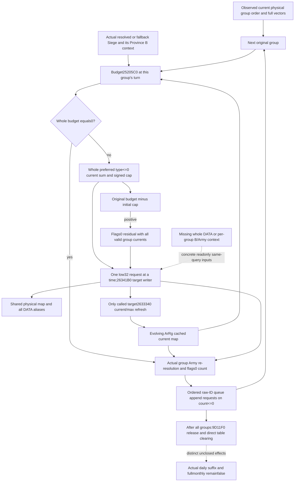

# Current daily assault groups: sequential conditional loss plan — 1.20.0.3

2026-10-06 / W41. This is a source-first input and numerical plan, with zero new EXE bytes, closed-body rereads, implementation, tests, native builds or runtime operations. Exact `.3` / Steam25652598 / EXE SHA `94b55397abb687a3dcd436805a5d885e6be90fa6c693feb44a9e3bbeeade02a6` and existing qualifications are reused. The scope is sealed at `Z:/ck3_mod_rewrite_process_assets/g2-background-round16-20261006/current-daily-assault-loss-numeric-plan/SOURCE-FIRST-PLAN.json`. Root reviews this source plan before implementation. The entry-stage owner independently implements the actual occupied-table observer; this package changes none of that owner's files.

## Source entry and useful output

The [actual manager stage](army-monthly-manager-prepared-stage-inputs-12003.md) calls `2A97ED0(primary)` daily after optional regular refill. For an observed-current standalone conditional invocation, consume the **current occupied physical groups**, in native physical order. This does not claim that the captured table is next pre-date output, that monthly refill has run, or that the actual caller reached this frame. The independently useful next result is current group budget/request plus conditional associated chunk/current changes and group-Army count/queue requests, preserving actual/full daily/full monthly false and actual post-stage null.

Held `2A97ED0..2A981F1` is801B SHA `7faece64bf87f007bc24237d0f2fcb2a10cbce78fe1155dc6da14b868d1c8de8`; its original round13 packet and canonical source tree are reused without another body read. It traverses occupied primary170 entries, resolves each entry's Siege through native generation/fallback, and calls `25205C0` **at that group's turn**. Whole budget0 skips allocation. A nonzero budget counts all valid group+28 ArRg occurrences whose signed definition+2A0≤0, caps the preferred request by signed minimum, then allocates in stored order using low32 IMUL, signed truncation and `26341B0`. Original budget minus the initial cap, when positive, calls the same descriptor through `2A95800(flags0)`. It is not the preferred loop's unused requested remainder.

The group+10 Army occurrences are resolved again for the flags0 count≤0 raw-ID queue append. This count reads ArRg current; physical changes alone do not refresh every shared ArRg. The held direct group consumer's numeric tail is a re-resolution/count, **not an added `24E8120` refresh of every group Army**. Real per-Army suffix refresh branches occur later and remain separate. After all groups, `9D11F0` releases occupied records before the known control/count clearing. Release's unclosed effects do not prevent the earlier group numerical subsystem; they do prevent claiming a complete actual daily suffix or monthly frame.

## Existing current-table contract and actual missing operands

The entry owner's `current_daily_assault_table_v1` / `ArmyCurrentDailyAssaultTableV1` captures header/physical controls and ordered groups with native index/physical slot, hash/control, raw Siege key and actual generation/fallback resolution. Group Army/ArRg vectors retain signed count, data presence and every rawDWORD occurrence. Each ArRg captures resolved object identity, magic, identity validity, definition+2A0 and **demanded preferred current**. Its service `current_daily_assault_group_inputs_v1` computes the independently useful initial signed32 preferred denominator, preserving repetitions.

Exact schema is `Z:/ck3_mod_rewrite_process_assets/g2-background-20261006/daily-assault-active-table-2aa2030/implementation/native/FINAL-RAW-SCHEMA.json`. It uses raw unsigned32 full IDs and actual object identity/selected full ID, which must remain distinct from the signed32 IDs used by existing writer adapters. Bit-preserving conversion is sufficient; do not replace an unresolved requested ID with a guessed receiver. Source registry paths are Siege5D1EC88/5D1EC60/+8, Army5D1DE48/5D1DE50/+10 and ArRg5D1F340/5D1F338/+10.

| Required value at the observed entry | Existing real value versus missing | Smallest same-query producer / consumer |
| --- | --- | --- |
| Current physical group order and full raw vectors | Entry observer candidate provides these and independent initial denominator | Reuse its complete physical census/native occurrence positions; never sort/dedup by Siege or Army ID |
| Preferred valid ArRg current/type | Source-demanded type≤0 current is present; invalid/type>0 can intentionally have null current | Reuse valid fields for preferred sum, preserving signed32 wrap; null type>0 current is **not zero** |
| Flags0 residual current and maximum for every valid group ArRg | Maximum and valid type>0 current are absent from current-table minimum | Extend a separate loss-input family with actual ArRg+38/+3C for the whole valid group union, including positive types when residual needs them; query-Army associated subset cannot stand for this vector |
| Initial native group budget | Current table publishes actual Siege resolution, but no25205C0 return | Reuse readonly native25205C0 on the actual resolved/fallback group Siege receiver, with independent signed32 current value; do not require unused physical inputs for a zero budget |
| Per-group current Province/breach/loaded percentage and B membership | [Qualified B family](army-province-besieging-current-12003.md) belongs to the queried Army's actual Province, not automatically each group Siege's Province | Reuse that B collector/math on **each actual Siege+200 Province**, source breach+3D8, table count5452384/pointer54524C8; publish source-valid/invalid Province basis and actual B contribution roster. A matching same-query Province family may be reused; unrelated current Province may not |
| Whole valid writer-target DATA and admission | Full DATA/2634880 query/kernel exist for selected ArRg; new table captures noDATA/admission | Call the existing readonly DATA reader for the actual resolved valid group ArRg union, including full ordered DATA records and native_loss_writer_skipped. Character skip is independently a no-write/no-refresh branch |
| Physical state for writer records | Existing associated DATA contains current/max/state/raw ordinal/association for each demanded physical chunk | Merge one physical map across every group target, keyed persistent FullID/physical chunk index. Retain DATA repetitions and raw ordinals. Writer26341B0 consumes its DATA records; unrelated seven chunks and prepared148 are **not additional required inputs** for this standalone daily loss. Complete7 context is reused only when a real consumed record/unsupported raw branch requires it |
| ArRg refresh after a writer | Qualified2633340 current/max projection exists | Refresh only the actual writer target when26341B0 reaches refresh. Character skip leaves counts unchanged. Propagate physical aliases to later DATA reads without automatically refreshing other ArRg current caches |
| Group Army tail flags0 count | Group Army resolution is present, but its Army38/44 roster/current baseline is absent | Capture actual resolved/fallback Army flags0 whole count plus ordered ArRg identity/current occurrences for target intersections; derive count from baseline plus actual refreshed ArRg deltas, preserving unrelated cached currents |
| Queue append and release | Raw appended IDs/count test and direct table clear source are known; release9D11F0 is unclosed | Return ordered raw-ID queue append requests, without dedup. Queue execution/removal and release/transitive effects are separate outputs/boundaries, not prerequisites for current group numeric results |

Existing source-domain associated DATA reader/kernel is sufficient for available records whose observed association matches the valid target ArRg. Its unavailable/unsupported raw-record branch remains explicitly partial; it must not be relabeled as complete native record cleanup. No new seven-chunk requirement is added just to suppress that boundary. Add needed raw operands only where a captured consumed branch requires them.

## Smallest sequential computation

Maintain two separate evolving maps: physical chunk current/max and actual ArRg cached current/max. Initialize them from the whole source-required capture, including unchanged cached counts outside the writer target set. Physical writes update every matching DATA alias. ArRg counts change only after an actual modeled target refresh. Multiple DATA, ArRg, group or Province occurrences retain their native numerical multiplicity, while one physical identity has one evolving stored value.

At each group's turn, evaluate its source25205C0 budget using its current fixed-captured Province/Siege/breach/admission/percentage premises and the evolving **ArRg cache map**. For the first group, the actual native current25205C0 scalar is an independently sufficient budget. For later groups, an old scalar is not a new stage input if preceding writers changed relevant B contributor current. Reuse B baseline plus actual target ArRg deltas; each repeated B ArRg/Province occurrence repeats its delta, but repeated refresh events do not multiply the same object's final change. Untouched counts remain observed, even when their physical DATA changed.

Count the complete current group preferred denominator at that turn. Allocate and call the existing writer model **one request at a time**, reading the next occurrence's latest cached current. After each call, update physical aliases and only the target's successful current/max refresh. The denominator loses the row's pre-call current, and remaining whole request budget loses the requested integer quantity, independent of writer skip, physical clamp or unused Q remainder. Recount flags0 residual at its actual entry from all valid group ArRg occurrences, including positive types, using only original-budget overflow. Do not precompute all requests from unchanged initial rows.

Reuse `army_loss_allocation_projection` signed arithmetic, `army_chunk_loss_writeback_projection.project_observed_writer_chunk_changes`, `army_regiment_refresh_projection` and the source-bound per-writer evolution pattern in `army_loss_sequence_replay`; the existing four-pass **outer** wrapper is not this group caller. Its budget≤0 shortcuts must not replace the group's source budget==0 branch or signed minimum/overflow arithmetic. Preserve source legitimate zeros/negative wrapped operands instead of adding positivity clamps. A newly requested amount remains a request, not observed applied loss.

After a group, derive each original resolved/fallback group Army flags0 count from its captured baseline plus actual refreshed-target deltas over its complete Army38/44 roster. Return the **original raw group ArmyID** for every source count≤0 queue request, including repetitions. Do not substitute resolved fallback IDs, run queue transfer/removal, or refresh every Army's entire DATA. The next group then receives the evolving chunk and cached-current maps.

## Proposed independent additive interface and readiness

Add a separate same-query `current_daily_assault_loss_inputs_v1`, aligned by physical group/occurrence/object identity with the existing table leaf. It owns actual per-group native budget and Province/B context, whole valid group ArRg current/max/DATA/admission union, and group-Army count/target-intersection context. It does not modify the entry owner's existing initial-denominator meaning or the base Strength availability. Collector entry is the same actual manager/table/Siege/ArRg references already resolved in that Strength capture; readonly helper reuse avoids a second scope or fake observation.

After source review, an independent pure `project_conditional_current_daily_assault_groups_v1` can expose native current group budgets/initial denominator, isolated current-group request results, a sequential conditional prefix with per-group preferred/residual requests and writer/refresh outputs, final modeled physical/current maps, and ordered conditional queue append requests. An empty observed current table is a real ready empty numeric result without unused budgets/DATA. A source-zero budget or character writer skip must not demand unused physical fields. Missing consumed operands produce a precise partial prefix; isolated current-group values may still be independently available but are not later-stage observations.

Readiness is separate for current scalar, current isolated group, sequential numeric prefix, modeled physical state and queue requests. The planned model remains fixed observed entry/nonphysical context, with `actual_loss=false`, `actual_effects=false`, actual post-stage null, and full daily/full regular/full monthly false. Existing current-table schema/denominator candidate does not yet make the proposed writer projection ready. Neither current native25205C0 values nor field names alone qualify postwriter stages. No actions, strategy gates, deployment, growth audit or runtime operation are proposed here.

No new source or execution credit is claimed. The prior associated writer/current-max and five compiled B-wire qualifications remain frozen and are not rerun. Entry owner supplies its separate native/schema/initial-denominator qualification. Root owns shared reports, implementation approval, native builds and subsequent first new consumer qualification.
