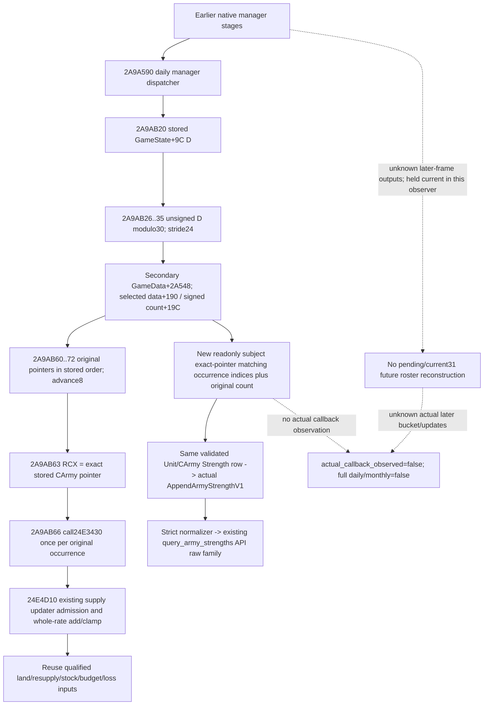

# Current daily supply bucket subject occurrences — CK3 1.20.0.3

2026-10-06 / 2026-W41. Native source research is closed for the selected-bucket
pointer loop. Observer, serializer, API and fresh whole-fixture candidates are
`SOURCE_PREPARED`; every build/import/test/live method is `NOTRUN`.

Frozen identity reused from Root: CK3 1.20.0.3, Steam build25652598, EXE SHA-256
`94B55397ABB687A3DCD436805A5D885E6BE90FA6C693FEB44A9E3BBEEADE02A6`.
Frozen g104 source pin `71b729f0cc4894331f1dadb89155920fccd42a00` is supplied
metadata, with no new Git/hash/EXE audit.



## Native entrance and actual gap

The cached exact-build body
`Z:/ck3_mod_rewrite_process_assets/g2-resume-20261004/army-monthly-update-order-v61/source-clock-new-spans/neighbor-manager-daily-entry.asm.txt`
closes the daily dispatch loop. At `2A9AB20`, the dispatcher reads the stored
DWORD at GameState+9C. At `2A9AB26..35`, it selects unsigned D modulo30 and
multiplies by24. Its secondary manager receiver is GameData+2A548; the selected
bucket data field is secondary+190+24phase and signed count is secondary+19C+24phase.
These equal primary manager GameData+2A540 offsets198/1A4.

At `2A9AB60..72`, the original loop loads RCX from each stored CArmy pointer,
calls `24E3430`, advances8 and repeats to data+count*8. This loop has no pointer
deduplication or FullID filter. Capacity is not read by this loop. The new reader
preserves it as independent raw context and never gates readiness on count<=capacity.

g104 `ReadArmySupplyTiming` already publishes current date, stored D, selected
phase, dates/grace and the **first** bucket phase that contains the exact resolved
CArmy pointer. It returns on that first match. It does not publish the original
selected bucket count or all original positions where the subject pointer occurs.
A first phase alone cannot distinguish zero, one and multiple selected-bucket
dispatch opportunities. This direct-call input is the one new gap addressed here.

Existing `24E4D10` source in
`Z:/ck3_mod_rewrite_process_assets/g2-resume-20261003/army-supply-attrition/native-tree/supply-change-next/caller-24e4d10.txt`
already closes admission, signed whole-rate addition and capacity clamp. Its
last-success date188 write is not a duplicate-call suppression gate in that body.
This work does not rewrite or retest that arithmetic. Multiple current matching
positions are opportunities in the stored dispatcher input; their later successful
stock effects remain conditional on intervening native stages and updater admission.

## Field and input accounting

The raw family is `current_daily_supply_dispatch_inputs_v1` in each whole Strength
row. It publishes10 nullable raw/context fields plus5 schema/readiness fields and
4 explicit false boundary flags. Every scalar width is signed32; an observed0
remains0 and complete observed absence remains `[]` with occurrence count0.

| Field | Source / role | Readiness and preservation |
|---|---|---|
| `subject_army_id`, `subject_carmy_id` | Already resolved same-row Unit/CArmy full IDs | Exact same-query context join; subject matching uses CArmy pointer equality |
| `current_date_raw`, `native_day_index` | Present same-row clock fields, otherwise established GameState+8/+9C | Optional presence includes legitimate0; stored D is not reconstructed from date |
| `selected_bucket_phase` | unsigned32(D)%30 | Actual current dispatcher selector |
| `selected_bucket_capacity_raw` | Selected header+8 | Independent raw context; no readiness condition or policy gate |
| `selected_bucket_count_raw` | Selected header+C, actual dispatcher input | Original total count, including all nonmatching positions |
| `selected_bucket_data_present` | Selected header data pointer presence | Null data with count0 is complete empty; positive count with unavailable pointer data is partial |
| `subject_occurrence_indices` | Compare every original selected pointer against exact resolved subject pointer | Original traversal positions, strictly increasing; duplicates of subject pointer appear at distinct positions; other armies are not dereferenced |
| `subject_dispatch_occurrence_count` | Number of original matching positions | No pointer deduplication; not actual executed callbacks or successful updates |
| `source`, `capture_boundary` | Fixed native source/current paused Strength labels | No future-frame claim |
| `status`, `ready`, `unavailable_reason` | Independent selected-bucket observation | Optional-family failure preserves the original row and observed partial fields |
| `actual_callback_observed`, `earlier_stage_outputs_reconstructed`, `full_daily_supply_transition_ready`, `full_monthly_ready` | Allfalse | Current raw operands cannot promote actual daily/monthly readiness |

Nonmatching pointer occurrences are represented by original index gaps and original
total count. No complete roster, other-army projection, callback execution trace,
pending/detachment/current31 result, or future bucket roster is constructed.
Earlier stages are held at current captured inputs, without predicting their changes.

## Source observer and existing API

`ArmyBindings` gains tail member `current_daily_supply_dispatch_bindings` whose
independent DTO-header binding type contains only `enabled`. The exact .3 adapter
binds it using the frozen EXE identity; the .2 path stays disabled. The new reader
is attached immediately after existing timing capture inside the same validated
Unit/CArmy backlink branch. It reuses present clock operands and otherwise reads
the established slots directly. The collector invokes no native callback and
performs no store to game state.

`ArmyStrengthSnapshot` gains optional `current_daily_supply_dispatch_inputs_v1`.
The actual whole-row `AppendArmyStrengthV1` calls the new family serializer. Strict
normalization checks source/width/current selector/original index order and same-row
IDs; it retains independent capacity without making it a policy gate. The existing
`GameplayBridgeService.query_army_strengths` API retains the raw family in its
selected original rows. There is no new counter-policy or derived future family.

Prepared public signatures:

```cpp
CurrentDailySupplyDispatchBindings12003 BindCurrentDailySupplyDispatch12003(
    std::uintptr_t image_base, std::string_view executable_sha256) noexcept;
game::ArmyCurrentDailySupplyDispatchInputsV1 ReadCurrentDailySupplyDispatchInputs12003(
    const CurrentDailySupplyDispatchBindings12003&,
    const ck3_12002::ArmyBindings&, const void* army, const void* unit,
    const game::ArmySupplyTimingSnapshot* same_capture_clock = nullptr);
```

```python
normalize_current_daily_supply_dispatch_inputs_v1(
    value: object, *, expected_army_id: int | None = None,
    expected_carmy_id: int | None = None,
) -> dict[str, object] | None
```

## Fresh whole fixture and remaining work

Four new synthetic byte scenes enter actual `ReadArmyStrengthsForScope`, then actual
`AppendArmyStrengthV1`: original duplicates/gaps with independent capacity context;
unsigned stored D=-1 with date0 and empty bucket; target found only in another
bucket while reusing present same-capture clock; and positive count with unavailable
pointer data. The planned emitted files are whole row objects, with no substituted
handwritten leaf or reconstructed row. One new service consumer method transports
these unchanged rows through the real strict parser and service and checks every
original scalar/null/flag. No old test module is imported or executed.

These sources have not been compiled, imported or run; no wire output or GREEN
exists. Parent owns shared-hook integration and English commit. Remaining work is
one fresh native build/execution, one new whole-service compound, then a real paused
Robert29829 existing-query capture. Such evidence may qualify the current dispatcher
input observer; it still does not establish actual later callback execution, a full
daily stock transition, monthly readiness or a continue-versus-leave policy.
