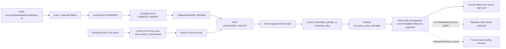

# 当前登陆惩罚天数（1.20.0.3）

The selected missing input is now source-closed: **`int32_t __fastcall Army.GetDisembarkPenaltyDays(const void* actualCArmy)`**, core RVA **0x24AA240**. It returns the actual Army receiver's stored signed 32-bit value at **+0x1D0**. The named stock GUI renders this getter in days. It is a current observation, independent of route contents and gathering state.

Build binding is CK3 1.20.0.3 / Steam25652598, reused frozen SHA `94B55397ABB687A3DCD436805A5D885E6BE90FA6C693FEB44A9E3BBEEADE02A6`. 本包已在独占 worktree 基线 `71b729f0cc4894331f1dadb89155920fccd42a00` 接入现有 Army 查询、strict 与 full Service/MCP 路径，并新增唯一 whole native producer/consumer 夹具。状态为 **research / source implemented**；build、native fixture、consumer FIRST 与 live 均 **NOTRUN**，不存在静态或实机资格。Root 负责下一 joint FIRST 与共享采用。

## Exact native chain

The first numeric `.rdata` locator closed literal **0x4736B10**. The one separately authorized target-only RIP matcher over the frozen mapped `.text` section returned exactly one instruction match: **0x4EB4E3**, `0F100526B62404`, `MOVUPS xmm0,[RIP+...] -> 0x4736B10`. A LEA-only matcher would miss this actual copy form. The matched full initializer, not adjacent-string order, establishes the callback.

| Source | Complete extent | Closed meaning |
| --- | --- | --- |
| Target name initializer | [0x4EB470,0x4EB5FE),398B; pdata row0x5DF1F68 | Copies the full target name (head4736B10, tails4736B20/24/26); LEA4EB573 selects callback24EA630; CALL4EB57E registers through0xCFCB00 |
| Registered callback | [0x24EA630,0x24EA668),56B; pdata row0x5F3CB2C | Null RCX returns AL=false; non-null RCX is passed unchanged at CALL24EA642 to24AA240; EAX is copied as32-bit integer and packed by0x879A50; AL=true is callback success |
| Actual native core | [0x24AA240,0x24AA247),7B | `8B81D0010000 C3`: MOV EAX,[RCX+1D0],RET; nineINT3 follow and next entry is24AA250. No branches/calls/stores/calendar/rules/clamp/sentinel |

Exact bytes/instructions and boundaries are in `Z:/ck3_mod_rewrite_process_assets/g2-parallel-20261006/battle-crossing/exact-locator/disembark-days-actual-name-registration.json`, `disembark-days-actual-callback.json`, and `disembark-days-actual-core-sealed.json`. The128B exploratory core probe is retained, but only its first7B are the selected getter. Its following functions do not participate in this contract.

The receiver proof uses the complete typed registration helper `[0xCFCB00,0xCFCFC8)`,1224B, extracted from retained `.text` bytes. Both target and the independently proven gathering getter invoke this exact helper. It fixes the type-ID pair through globals0x5C5FD8C and0x5D1DF94: the former is copied to the descriptor at `[rbp-2C]`; the latter is loaded atCFCC47 and copied into the descriptor atCFCEDE `[rbp+30]` before the complete descriptor is registered throughE21800/E1CB40. Initializer arguments supply name, callback and optional function data; they do not select a different receiver type ID. Both actual callbacks pass non-null RCX unchanged into their leaf.

Existing gathering's independent formatter resolves input CUnit+178 through CArmy store0x5D1DE48, validates full ID at+10, and invokes its CArmy core. This actual provider source identifies the common fixed typed receiver as CArmy. The target's +1D0 must not be relabeled as CUnit data merely because the core address is near functions that accept CUnit.

During receiver review, the initial argument from the shared0x54DE218 address was rejected: its position and vtable calls establish a temporary-vector allocator, not a type registry. The final proof relies on the complete helper's fixed type-ID construction and the existing actual CArmy provider, with the allocator excluded. The helper cache is `Z:/ck3_mod_rewrite_process_assets/g2-parallel-20261006/battle-crossing/exact-locator/actual-named-int-registrar-helper.json`. Selector child independently confirmed receiver type ID5D1DF94 at descriptor+80 and return int type ID5C5FD8C at descriptor+24; caller arguments do not replace those fixed IDs. No further receiver source operation remains.

No failure sentinel or value clamp exists in the seven-byte getter. Publish the signed int32 value losslessly, including observed0, negative integers and values beyond stock30. The GUI name and days text supply the unit; stock `DISEMBARK_PENALTY_DAYS=30` is not a publication cap. The getter does **not** return an expiry raw date and needs no calendar conversion.

The native active predicate is separate. This candidate intentionally publishes `remaining_days` only. It does not create an `active` boolean, infer native activity from `days>0`, derive an effective battle advantage, or forecast future landing expiry. No additional active predicate reverse engineering is required to deliver this independent current timer observation.

## Same Army API seam

Append optional `current_disembark_penalty_v1` to the existing Army strength row and existing `ck3_query_army_strengths` MCP response. The exact `.3` binder binds core24AA240 as `int32_t (__fastcall *)(const void*)`. The current Strength() query calls it only in the existing genuine CArmy join with CArmy+124/publicCUnit full-ID backlink equality. Older producer omission stays omitted; exact `.3` read failure stays unavailable; a genuine0 stays0. Do not add a gathering-state or route-present guard.

The strict consumer retains int32 value and source/status, then exposes an immutable current-days observation through the existing fullService query result. `current_disembark_days_ready` means this current field is available; it does not mean projected landing input or a native active predicate is observed. Existing retained geography and attack role continue using their current contracts.

The field makes the current war movement/entry comparison concrete: a resolved Army can reveal the native number of landing-penalty days still shown, allowing the policy to compare attacking now with waiting for that current timer. Route-empty Armies can have valid current timer observations. No opponent historical entry province or attacker role is synthesized from this value.

## Read accounting and FIRST boundary

The original failed adjacent locator sequence is retained:10 excluded initializers3903B,22 metadata rows264B,one literal window1024B =5191B. The approved single `.text` matcher then read **71141888B** once. Initial regex syntax failure occurred after the section cache write; correction used only that cache, preserved as harness RED. The completed matcher searched only literal4736B10. It did not read the entire executable, recompute its hash or reread headers. Final ledger summation corrected an earlier manual100B overcount; the byte-bearing records remain authoritative.

The actual named chain used **13 additional metadata rows /156B**. Full matched initializer398B, callback56B, core probe128B and complete typed registration helper1224B were extracted from the already retained `.text` cache: **1806B selected source,0 additional executable body bytes**. Total actual new executable bytes across all attempts are **71147235B**. The primitive remains source-bound candidate status until Root runs the one compound FIRST and performs genuine paused Robert29829 query acceptance. No live/day/action credit is claimed.

The sole new FIRST covers actual native Strength()/serializer -> strict normalizer -> typed fullService -> registered MCP once, with five new cases: nonstock positive34, genuine0, signed negative-1, invalidArmy and typed getter unavailable. Old packet omission is a derivative compatibility check within the same consumer, not a sixth native case. These source-derived fixtures are not live observations; Root owns all execution and qualification.

## 生产接线与唯一 FIRST

`ck3_query_army_strengths` 仍为唯一工具入口；现有 `query-army-strengths-v1` native observer 在暂停 owning-thread 队列内执行。`Strength()` 在既有 CUnit -> CArmy full-ID 与 `CArmy+124 == publicCUnit` backlink 通过后，调用实际 core24AA240。exact `.3` binder已启用；`.2`与旧 packet保留可选 leaf缺席。真实整数0、-1与34会进入生产 serializer、strict、纯 current-days projection；不存在 native active、future landing日期或战斗优势推算。

唯一新增 native producer目标为 `xar_bridge_ck3_12003_current_disembark_penalty_whole_test`，argv为 `--emit-wire <absolute JSON path>`，夹具通过实际 `ReadArmyStrengthsForScope` 和 `AppendArmyStrengthV1` 生成完整 wire。五个新 source case为0/-1/34/invalidArmy/typeUnavailable；不是旧结果重放。invalidArmy使用相同index但不同generation的CArmy fullID，getter不得被调用，整体partial/该row unavailable/leaf缺席；typeUnavailable为domain enabled但typed getter为空，parent仍available而leaf unavailable/daysnull。consumer只在这同一 compound内消费 native输出，调用真实 strict、typed `GameplayBridgeService` 与实际注册的 MCP查询。旧 packet缺 leaf兼容检查属于这同一 consumer派生检查，不增加 native source case信用。所有执行结果仍为NOTRUN。

新增 CMake 叶 `ck3_autonomous_player/native_bridge/cmake/current_disembark_penalty_days_12003.cmake` 链接现有生产 `xar_ck3_12002_runtime`，限 `BUILD_TESTING AND WIN32`，使用 C++20 与 MSVC `/W4 /WX /permissive- /EHsc /Gy /O2 /UNDEBUG`，链接 `/OPT:REF`。Root 在 fresh x64 MSVC build 树只构建此新目标，不重放旧 source case。producer 输出文件顶层为 `{"schema_version":1,"samples":{...}}`；五个 sample key 恰为 `zero/negative/nonstock/invalidArmy/typeUnavailable`，每个值都是实际 serializer 生成的整行，stdout不是 wire。

producer成功退出0，stdout单行为 `GREEN current_disembark_penalty_days_12003 whole producer fixture: 5 cases`，stderr为空；断言或导出失败退出1并向stderr写 `RED current_disembark_penalty_days_12003 whole producer fixture: <exception>`；argv错误退出2并写 usage。真实 CUnit+1D0置为777，与三个 CArmy值不同；夹具验证 fullID、backlink、getter receiver、调用数与读取前后源内存相等。

唯一 consumer为 `ck3_autonomous_player/tests/test_current_disembark_penalty_mcp_compound.py`，只有一个 async testmethod。Root先生成上述 native文件，再设置 `XAR_CURRENT_DISEMBARK_NATIVE_WIRE=<absolute JSON path>`、可选 `XAR_CURRENT_DISEMBARK_CASE_OUTPUT=<absolute receipt path>`，使用既有含实际 `mcp==2.0.0` SDK的Python执行 `-B -X utf8 <testfile> -v`。consumer通过实际 `create_server/list_tools/call_tool`构造真实 typed Service；只有 snapshot、capabilities与execute_step backend envelope为 synthetic。它用五个未修改的 native行调用已注册 `ck3_query_army_strengths`，第六次调用仅从本次 zero行删除可选leaf检查旧包兼容，不增加native sample。全部断言通过后才写GREEN sidecar；native原始字节、行、signeddays与source provenance保持不变。

Current-days ready只说明本帧getter观测可用；invalidArmy保持真实不可用，typeUnavailable保持typed binding不可用。现有 river/strait retained `actual_geography_v1`、actual present Province、projected entry Province与attacker/defender角色继续使用各自已资格合同，不借本计时器授未来状态或真实接战信用。
