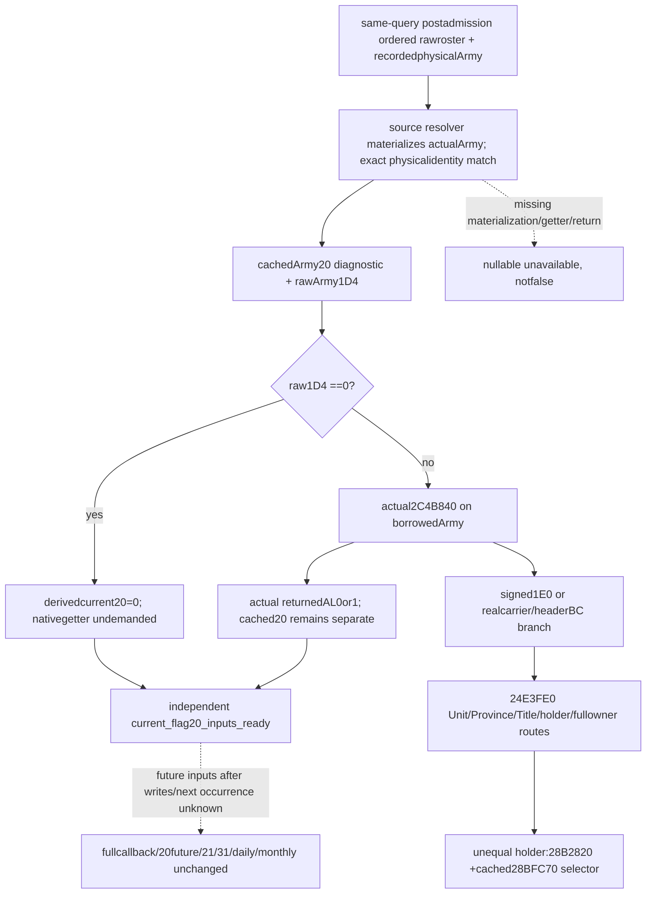

# Current Army20 actual getter observer — CK3 1.20.0.3

2026-10-06 / ISO2026-W41. **Implementation candidate; not compiled or tested.** Root reviewed the source [Army20 wrapper](army-refresh-two-byte-flags-12003.md), [shared tail](army-refresh-tail-and-condition-verdict-inputs-12003.md), and [owner Character chain](army-refresh-owner-character-chain-12003.md) before approving this minimal family. Frozen CK3 **1.20.0.3 Crozier / Steam25652598**, reused EXE SHA `94B55397ABB687A3DCD436805A5D885E6BE90FA6C693FEB44A9E3BBEEADE02A6`. This package reads **0 new EXE bytes** and adds no new hash, native build, test, game/SDK/pipe/UI operation or gameplay action.

## Actual source and independent current value

The exact `2C4B840` entrance returns0 on `Army1D4==0`. Otherwise its signedArmy1E0 or carrier-headerBC branch either returns0 or tails `24E3FE0` with the actual Army receiver. The tail resolves Unit/Province/Title/holder Character with their real full-generation and fallback routes, returns1 on direct holder/whole-owner equality, and otherwise uses `28B2820` strict selected Character chain. The latter's sole `28BFC70` selector is already fully cached. The complete source chain is readonly: source has no persistent store or unclosed child call on this value entrance.

The new **`current_army_flag20_inputs_v1`** family observes cachedArmy20 and rawArmy1D4 independently. With zero1D4 it derives **`std::uint8_t{0}`** without invoking the getter or demanding later Unit/owner/tree fields. With nonzero1D4 it calls the actual exact-build **`2C4B840`** getter on the same borrowed physical Army and publishes the returned **AL0or1**. There is no inverse, Rule43 proxy, positive-ID gate, reinterpretation of high-bit bits or replacement fallback. Missing binding/materialization/normal return produces nullable unknown with a reason; actualfalse/raw0 is available. Cached20 is a separate observation and may differ from the current derived value.

## Frozen API and same-query source

Plan was sealed **before code** at `C:/codex-ck3-background/packets/army-current-flag20-implementation-20261006/SOURCE-API-AND-NINE-OWNED-FILES-PLAN.json`, source base **`333bb98fd5ea4ef6481f89eabe9916e8914a955b`**. Nine exclusive new files implement DTO, inline serializer, header-only collector, strict Python contract, pure current projection, compiled-wire loader, sole Service compound, genuine whole-query native fixture and this topic. Root alone edits shared hooks/CMake/CI, freezes g102 and performs formal qualification.

Public API uses **`xar::game::ArmyCurrentFlag20InputsV1`**, **`xar::ck3_12003::CurrentArmyFlag20Bindings12003`**, binder **`BindCurrentArmyFlag20Inputs12003(base,sha)`**, collector **`ReadCurrentArmyFlag20Inputs12003(bindings,const ArmyCurrentPostAdmissionRefreshInputsV1&)`**, and serializer **`xar::game::AppendArmyCurrentFlag20InputsV1`**. Exact-build binding reuses the existing `.3` binder and binds a `std::uint8_t (*)(const void*)` at RVA2C4B840. Root's proposed `ArmyBindings.current_army_flag20_bindings` and optional ArmyStrength field have the same family name.

The collector borrows the already-recorded postadmission ordered roster. The existing source resolver materializes each raw fullDWORD reference and compares its physical selection to the captured source using `SameSelected`. Identity strings are only compared as tokens; they are never parsed into pointers. Duplicate references, native order, real full-generation0/high-bit routes and actual fallback physical selections remain intact. No old numeric/global readiness gate controls this independent current value.

Each occurrence retains original source resolution, `same_query_army_selection_matched`, cached20, raw1D4, `native_getter_returned`, nullable actual `native_getter_20_raw_u8`, nullable `derived_current_20_raw_u8`, status/reason and independent current readiness. Sourcezero is distinguished from an actual returned native0. The strict contract and pure projector only consume the recorded current native result/sourcezero and preserve query provenance; pure code executes no native call or persistent write. Actual getter inputs are proven by the source tree, but this minimal family does **not** claim to publish the complete raw chain trace needed for hypothetical changed-stage replay.

## Genuine whole-query FIRST plan, not executed

Native target/CTest recipe **`xar_bridge_ck3_12003_army_flag20_inputs_test`**, PRIVATE link **`xar_ck3_12002_runtime`**, new source `src/ck3_12003_army_flag20_inputs_test.cpp`. CLI **`--wire-dir <directory>`** emits **one JSON/six complete ArmyStrength samples**, filename **`ck3_12003_army_flag20_inputs_wire.json`**. It calls genuine `ReadArmyStrengthsForScope` and `AppendArmyStrengthV1` with Root's new hooks, actual oldpostadmission capture, two duplicate raw global Army occurrences and two subject scopes. No captured leaf is transplanted into a fabricated baseline row.

| New sample | Current-value fixture coverage |
|---|---|
| zero1D4 | Source-derived0, later fields denied/getterunbound, no callback |
| nativefalse/fullgen0 | Actual callback0 available, fullDWORD0 preserved |
| nativetrue/highbit fullgen | Actual callback1, requestedAB000001/nonzero raw1D4=255 retained |
| requested generation mismatch | RequestedCD000001 selects actual fallback ArmyAB000001, actual callback1 |
| missing callable | Independently unknown, no call; whole current strength remains available |
| unread materialization | Captured postadmission source remains real, new selection cannot materialize; unknown with no pointer parsing/call |

Each complete native row keeps independent current20 soldiers/max40/rawpower4000000. Fake world/read callbacks, actual-getter replacement callback values and Service snapshot/transport are **synthetic**. The fixture proves production collector/whole-query/serializer wiring and sourcezero/nativefalse/unknown distinction; it does **not** execute the EXE's nested branch tree. A memory byte snapshot verifies the whole fixture query does not write source data. Denials target only this new family's reader, since old same-query families may legitimately read those fields.

Exactly **one compiled-dependent Service compound** is prepared: `ArmyCurrentFlag20Service12003Tests.test_first_compiled_current_flag20_through_service_normalizer_and_current_projection`. It requires `XAR_ARMY_FLAG20_WIRE`, takes each complete native row unchanged through real Service→whole-row normalizer→strict leaf→pure projection, and optionally writes outputs via `XAR_ARMY_FLAG20_CASE_OUTPUT`. Its builder only loads the six compiled rows; no source-shaped case or synthetic native leaf fallback exists. Tests/builds/consumer executions remain **0** pending Root's coherent g102 freeze and explicit FIRST authorization. Oldcondition30/numeric/Core/Boolean cases and wires are not rerun.

## Readiness and next work

This candidate supplies the missing **actual current Army20 getter input** once formally qualified. It does not grant future20/21/31, next occurrence, ordered refresh execution, fullcallback/daily/monthly, actual post-stage, futuretick or live credit; those boundaries remainfalse. The shared tail can support21 only after its own actual entrance is independently source-closed. Root manages any minimized local gameplay restoration and shared Oct6/W41 reports/publication; this lane performs only owned source and separately authorized new consumer work.

## First g102 compile RED and typed fixture comparison repair

Root's first g102 full native attempt completed RED at **2026-10-06T11:30:26UTC**, after **131.140795 seconds**. Production595+ translation units compiled without this family's header error. Only the NEW fixture's line222 compared `optional<uint32_t>` to an `int` zero literal, triggering MSVC **C4389/C2220** under `/WX`; the direct template instantiation is retained in `C:/codex-ck3-background/current-flag20-batch/strict01/cache-observers/msvc-build.log` line603 (GBK). No CTest or Service consumer is credited from that failed compile.

The repair changes that comparison to **`std::uint32_t{0}`**; the other full-DWORD comparisons already use typed variables/constants. It changes no production header/hook, source algorithm or flag. Root reuses the original compiled runtime/includes and recompiles only the repaired CPP target, preserving the first full RED. This lane runs no compile/test/old case or runtime operation for the repair. The separate current21 exact API/source plan remains parked, with no implementation.
