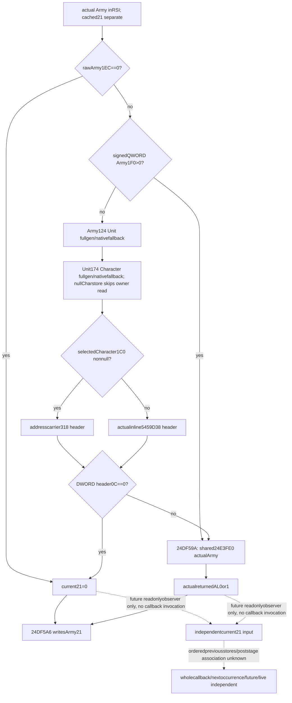

# Current Army21 inline producer inputs — CK3 1.20.0.3

2026-10-06 / ISO2026-W41. **Research; cache-only source plan.** This separate package follows the current20 implementation candidate and does not modify its nine files. It reuses the complete [24DF3C0 callback source](army-pre-date-character-prefix-and-post-admission-callback-12003.md) and the now-closed [shared tail](army-refresh-tail-and-condition-verdict-inputs-12003.md) / [owner Character chain](army-refresh-owner-character-chain-12003.md). Frozen CK3 **1.20.0.3 Crozier / Steam25652598**, EXE SHA `94B55397ABB687A3DCD436805A5D885E6BE90FA6C693FEB44A9E3BBEEADE02A6` reused. New EXE code/metadata/hash, build, test, native invocation, SDK/pipe/UI/game operation are **0**.

## Actual entrance is inline in the mutating callback

There is no demonstrated separate Army21 getter entrance in this cache. The actual producer is **inline** inside complete `[24DF3C0,24DF65D)`669B, retained pin `942f9e6dea3a26a7015d75bc8b350b3aa85e0905cc278424a4915a1102766c3a`. Cached instructions show **`24DF59A →24E3FE0`**, RCX=actual Army held inRSI, followed by **`24DF5A6: Army+21←AL`**. The full `24DF3C0` writes six Army caches; it must not be invoked as a readonly getter. The existing source of the shared tail is sufficient for the demanded branch, with no new locator or binary request.

The exact prefix is source-closed:

1. Raw `Army+1EC` byte0 produces current21=0.
2. Otherwise **signed QWORD `Army+1F0`** greater than0 demands shared-tail `24E3FE0(actualArmy)`; this is64 bits, not a DWORD. `24DF4F8` contains `cmp qword ptr [rsi+1F0],0` followed by signedJG.
3. Nonpositive1F0 resolves Army124 Unit through the actual prefetched store/fallback. Store present uses low24/cap2C/rows20/stride16/+8/non-null/fullUnit10 equality; failure uses5D1E378. Null store skips Army124. Actual Unit store is5D1E380.
4. It resolves selectedUnit174 owner Character through prefetched Character store5C67568/fallback5C67570, full requested owner DWORD comparison atCharacter18. Null Character store skips the Unit174 read and directly selects fallback. No positive/highbit/sentinel gate is added.
5. Nonnull selectedCharacter1C0 chooses **address carrier+318**; null chooses actual **inline static5459D38**. Native reads **DWORD header+0C**, not+0xC0. Equal0 produces0; every nonzero value, including negative signed count, demands the shared tail. The canonical callback's compact “countC0” wording is read as countC equal0; the exact cached operand here fixes the offset explicitly.
6. The shared tail's returnedAL0or1 is written toArmy21 at24DF5A6. Its actualUnit/Province/Title/holder/owner strict-chain branches and selector are already source-closed; do not replace it with current20, condition30 or another ownership predicate.

The callback prefetches Unit and Character store pointers before the1EC branch. This source ledger records those literal reads, while the future independent current-value observer can keep deeper operands undemanded on a sourcezero result. An independently sampled current21 value is not proof that the full callback executed or that its previous stores occurred.

## Minimum next observer, not implemented

Borrow the existing same-query postadmission ordered raw roster and materialized physical Army with exact captured selection match. Keep cachedArmy21, raw1EC, nullable signed64raw1F0, demanded Unit/Character resolver classifications and complete DWORDs, selected header source (`carrier_inline`/`native_static`), nullable signed32header0C, actual shared-tail return and derived current21 separate. Preserve original occurrence order/duplicates/fullgeneration0/highbits/nativefallback; no identity token is parsed as a pointer.

Zero1EC and zeroheader count return source0 independently with later fields undemanded. Other demanded branches invoke only source-closed **`std::uint8_t (*)(const void*)` at24E3FE0** on actualArmy in the owning query callback. Actual0 is available, whereas unavailable materialization/read/binding/return remains nullable with a reason. This is an implementable inline prefix plus real shared getter, rather than searching for an invented separate wrapper or calling the mutating complete callback.

A future `current_army_flag21_inputs_v1` family would remain independent of current20/condition30/oldnumeric readiness and overallcallback. Root must review its exact DTO/API/branch coverage before code. No native fixture, collector, Python schema, strategy or shared hook is added here. Its current observed input cannot grant future21, next repeated Army, actual orderedrefresh/poststage, fullcallback/daily/monthly/futuretick/live readiness.

## Evidence and scope

Cache-only receipt, exact selected inline prefix assembly and machine input ledger are in `C:/codex-ck3-background/packets/army-current-flag20-implementation-20261006/separate-actual21-cache-only-plan/`. The original sealed source JSON is `Z:/ck3_mod_rewrite_process_assets/g2-background-20261006/pre-date-character-prefix-post-admission-source/phase-two-24df3c0-body/SOURCE-024DF3C0.json`. Its669B/160metadata cost stays with the original owner; no old byte is counted as a new capture. Root owns report merge, current20g102 formal qualification and minimized game restoration. This package only closes the concrete next source/input entrance.

## Exact independent current21 API/DTO plan — source-only

Root requested the next exact plan after adopting this source tree as7c837de3 and current20 candidate as40d6928b. The frozen plan is `C:/codex-ck3-background/packets/army-current-flag21-api-plan-20261006/EXACT-API-DTO-NINE-FILE-PLAN.json`. **No implementation or test is performed.**

Proposed family is **`current_army_flag21_inputs_v1`**, DTO **`xar::game::ArmyCurrentFlag21InputsV1`** with per-occurrence `ArmyFlag21OccurrenceV1` and narrow Unit/Character selection `ArmyFlag21SelectionV1`. Bindings **`xar::ck3_12003::CurrentArmyFlag21Bindings12003`**, binder **`BindCurrentArmyFlag21Inputs12003(base,sha)`**, collector **`ReadCurrentArmyFlag21Inputs12003(bindings,const ArmyCurrentPostAdmissionRefreshInputsV1&)`**, serializer **`xar::game::AppendArmyCurrentFlag21InputsV1`**, normalizer **`normalize_current_army_flag21_inputs_v1`** and pure **`project_current_army_flag21_inputs_12003`** remain separate from current20/condition30/oldnumeric DTOs. The sole callable is `std::uint8_t (*)(const void*actualArmy)` at24E3FE0; direct header address is5459D38. No caller of the mutating whole callback is proposed.

The occurrence keeps original raw/full-generation physical Army selection, cached21, raw1ECbyte, nullable **signed64Army1F0**, demanded Unit/Character resolver routes/complete DWORDs, nullable carrier presence/header selection/physical identity/**signed32header0C**, independent header readiness, actual shared-tail return flag/nullable rawAL, and derived current21. Zero1EC requires no1F0/owner/header/tail. Positive1F0 requires the actual shared-tail result without inline-header fields. Nonpositive1F0 plus zeroheader gives source0; every nonzero count, including negative, requires actual sharedtail. NullCharacterstore skipsUnit174; actual fallback selection does not demand extra fallback-ID metadata. Unknown demanded input remains nullable/reasoned rather than nativefalse0. Exact typed fields and branch/readiness rules are frozen in the JSON.

At most **nine NEW exclusive files** are planned: DTOinc, inline serializer, header-only collector, whole-query native fixture, strict Python normalizer, pure current projection, compiled-wire loader, sole Service compound, and dedicated implementation topic. Root alone would add the seven shared hooks/CMake/CI after approving construction. Existing source topic remains separate; no code/schema/shared file is edited now.

The later FIRST plan is one genuine complete `ReadArmyStrengthsForScope`/`AppendArmyStrengthV1` JSON with **nine new scenes /18 duplicate roster occurrences**, PRIVATE actualruntime. Scenes cover zero1EC; signedQWORD1<<40 positive actualfalse/true; native-static zeroheader with fullgen0; carrier negativecount with negativeQWORD prefix; actual Unit/Character null-store fallbacks with undemanded Army124/Unit174/fallbackID reads; missing actualtail; unread demanded header; missing Army materialization. Exactly one compiled-dependent Service compound consumes unchanged whole rows through the production normalizer/current pure projection. No baseline transplant/source-shaped duplicate test/oldwire is planned. Fake world/native callbacks and Service envelope stay explicitly synthetic. Current21 readiness remains independent of all overall/current20/condition30 gates and never grants future20/21/31/fullcallback/nextoccurrence/poststage/daily/monthly/futuretick/live.
