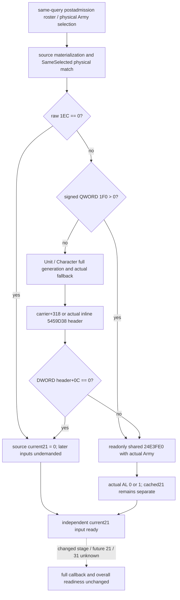

# Current Army21 inline-prefix and shared-tail observer — CK3 1.20.0.3

2026-10-06 / ISO 2026-W41. **Independent current21 input reader and Service projection are static-ready after the FIRST qualification below.** Root reviewed the [inline source tree](army-current-flag21-inline-source-12003.md), exact DTO/API and nine-file plan before implementation. Candidate base is `495d215b6e04bf5f91769f003e53eac391ccb5c3`; frozen game is 1.20.0.3 Crozier / Steam 25652598 with reused EXE SHA `94B55397ABB687A3DCD436805A5D885E6BE90FA6C693FEB44A9E3BBEEADE02A6`. The candidate performed zero tests/builds or new EXE/game operations. Its later qualification consists of Root's first native/new CTest plus the explicitly authorized single Service case.

The readonly construction evaluates the inline Army21 prefix and calls the closed shared `24E3FE0(actualArmy)` only when demanded. It never calls the mutating whole callback `24DF3C0`. Raw 1EC zero derives 0 without later inputs; nonzero demands signed 64-bit QWORD 1F0. Positive 1F0 demands the actual tail's AL, 0 or 1. Nonpositive 1F0 resolves the actual Unit, owner Character and header; DWORD header+0C zero derives 0, and every nonzero value, including negative values, demands the actual tail. Carrier+318 and the actual inline static header at 5459D38 remain distinct; the static header's count is read rather than assumed empty.

Exact source/API/raw schema and the authorized maximum nine NEW files were sealed before code at `C:/codex-ck3-background/packets/army-current-flag21-implementation-20261006/SOURCE-AND-EXACT-API-IMPLEMENTATION-PLAN.json`. The previous source package remains intact. Root owns seven shared hooks, CMake/CI, formal native/CTest, authorization of the sole compiled-dependent Service compound, shared reports and publication. This lane owns only the nine exclusive files and does not operate the managed game.

The family is `current_army_flag21_inputs_v1`. `ReadCurrentArmyFlag21Inputs12003(bindings, same_query_refresh)` borrows the recorded postadmission raw roster and selections, materializes them through the closed resolver and matches physical identity. It does not parse an identity string into a pointer. It preserves full DWORDs, generation zero, high bits, actual fallback classification, duplicate occurrences and native order. Each occurrence independently records cached Army+21, raw Army+1EC, demanded signed Army+1F0, demanded owner/header operands and the actual returned tail AL. Cached 21 is a diagnostic value rather than the derived current result.

| Interface | Exact name |
|---|---|
| DTO / occurrence / selection | `xar::game::ArmyCurrentFlag21InputsV1` / `ArmyFlag21OccurrenceV1` / `ArmyFlag21SelectionV1` |
| Binding / exact-build binder | `xar::ck3_12003::CurrentArmyFlag21Bindings12003` / `BindCurrentArmyFlag21Inputs12003(base, sha)` |
| Readonly callable | `std::uint8_t (*)(const void *actualArmy)` at base+24E3FE0 |
| Static header | Direct address base+5459D38, not a pointer slot |
| Serializer | `xar::game::AppendArmyCurrentFlag21InputsV1` |
| Strict normalizer | `normalize_current_army_flag21_inputs_v1` |
| Pure projection | `project_current_army_flag21_inputs_12003` |

In the nonpositive QWORD branch, a nonnull Unit store demands Army+124 and the indexed Unit+10 full generation. A null Unit store selects the actual fallback without demanding Army+124. A nonnull Character store demands the selected Unit+174 owner DWORD and indexed Character+18 full generation. A null Character store directly selects its actual fallback without requiring Unit+174 or additional fallback full-ID metadata. The header read demands selected Character+1C0 and signed header+0C only. An independently unavailable demanded read or callable remains nullable with its own reason; an actual 0 remains available.

The native candidate is `ck3_12003_army_flag21_inputs_test.cpp`, target and CTest name `xar_bridge_ck3_12003_army_flag21_inputs_test`, linked PRIVATE to the actual `xar_ck3_12002_runtime`. With `--wire-dir <directory>`, it emits one `ck3_12003_army_flag21_inputs_wire.json` containing nine complete rows. Each scene invokes genuine `ReadArmyStrengthsForScope` for two subject scopes; the global family is captured once and has two repeated roster occurrences. `AppendArmyStrengthV1` serializes the unchanged first whole row. The independent current/max strength (20/40) and AI power remain available even for the three partial current21 scenes.

| New whole-query scene | Expected current21 | Demanded tail calls for two occurrences |
|---|---:|---:|
| `source-zero-1ec-undemanded` | 0 | 0 |
| `positive-qword-native-false` (`1F0 = 1 << 40`) | 0 | 2 |
| `positive-qword-native-true` (whole high-bit Army ID) | 1 | 2 |
| `native-static-header-zero-fullgen0` | 0 | 0 |
| `carrier-negative-header-native-true` (`1F0 = -(1 << 40)`, header = -1) | 1 | 2 |
| `null-stores-fallback-header-native-false` (header = 5) | 0 | 2 |
| `missing-shared-tail-callable` | unknown | 0 |
| `missing-demanded-header-count` | unknown | 0 |
| `missing-army-materialization` | unknown | 0 |

Read denials apply only to the new collector. The old postadmission capture remains a genuine query result. The fixture verifies unchanged world bytes, exact actual Army callback receiver, once-per-query global capture and source demand. Fake world memory and replacement tail callbacks are explicitly **synthetic**: the future compiled fixture will qualify the new reader and production plumbing, not execution of the EXE shared-tail branches.

The sole compiled-dependent Python case is `ArmyCurrentFlag21Service12003Tests.test_first_compiled_current_flag21_through_service_normalizer_and_current_projection`. `XAR_ARMY_FLAG21_WIRE` selects that newly compiled JSON, and `XAR_ARMY_FLAG21_CASE_OUTPUT` selects an external output path. It consumes the nine whole rows through the real Service, whole-row normalizer, strict family contract and pure current projection, with a synthetic Service frame. It retains all 18 original occurrences and source provenance. There is no separate source-shaped case or fabricated baseline row. At candidate delivery, this case and the native fixture were **NOT RUN**; the FIRST qualification below records their actual executions.

The current21 readiness is independent of current20, condition30 and numeric refresh readiness. It grants no changed-stage/current-to-future substitution, future 20/21/31, next occurrence, full callback, daily/monthly refresh or live credit. Root completed the seven integration hooks and the first formal native/current21 CTest, then authorized the one compiled Service consumer. The external `ROOT-INTEGRATION-RECIPE.json` names the hooks and three direct new headers for both projectors; the collector and serializer are header-only and introduce no new runtime producer TU.

FIRST qualification, 2026-10-06 / W41: candidate `7d4647e1f1d133f2efb053b88a104769b689dcfd` was integrated into coherent immutable source `df87fd8562120b901413793ded4680b7b4dabd8e` at `C:/codex-ck3-background/current21-result-write-batch/g103`. Root's fresh four-runtime plus two-new-fixture build was GREEN in **125.543008 s**, with **597 actual TUs / 593 unique sources / 1361 compiled inputs**. These are joint batch counts, not an isolated current21 build count. The current21 CTest was FIRST GREEN in **0.37 s**. The other new result-write diagnostic CTest failed in its third scene; the joint run was **1/2 GREEN, exit 8**, and remains RED. Its independent failure is retained in `strict01/FIRST-TWO-CTESTS-RECEIPT.json` and `.txt`; current21 success does not qualify that diagnostic.

The actual native whole wire is `C:/codex-ck3-background/current21-result-write-batch/strict01/cache-observers/army-flag21-inputs-wire/ck3_12003_army_flag21_inputs_wire.json`, **210374 bytes**, SHA-256 `e42ff428df97466c0f9a6879082971fdd10b1ad621fb131a691f6dc96bf00bfc`. It contains **one JSON / nine new whole samples / 18 original occurrences**. Root's `strict01/REPORT-FIELDS.json` records the formal compile evidence; its pre-CTest `NOT_RUN` fields are historical and are superseded by the explicit FIRST CTest receipt rather than rewritten.

After Root's explicit authorization, the sole Service method ran **once** with dependency-complete Python, `-B -X utf8` and no `-O`, against that same immutable Service/native source. It was **GREEN: one compound case / nine completed and qualified new samples / 18 original occurrences**, unittest **0.032 s**, process **3.5590385000105016 s**, exit 0. Six scenes independently resolve current21 to 0 or 1; three demanded-input failures remain unknown while genuine current strength 20/40 stays available. Native rows pass unchanged through Service and normalization; the pure projection executes no native call or write. No old current20, condition30 or numeric case/wire was repeated.

The immutable FIRST receipt, stdout, stderr and detailed projection outputs are under `C:/codex-ck3-background/packets/army-current-flag21-implementation-20261006/first-compiled-whole-Service-consumer/attempt01/`. `FIRST-COMPILED-SERVICE-CONSUMER-RECEIPT.json` pins the source headers, fixture, Python path and actual wire, separates input counts from executed/completed/qualified counts, and retains the reused native receipt paths. New EXE reads/hashes, extra native builds/CTests, game/SDK/pipe/UI/process actions by this lane remain **0**. The capability is **static-ready for current21 only**; world memory, replacement tail callback and Service frame are synthetic, and no EXE-tail branch execution, paused live/current-to-future readback or full callback has been qualified. Root retains sole ownership of later runtime deployment and live validation.
